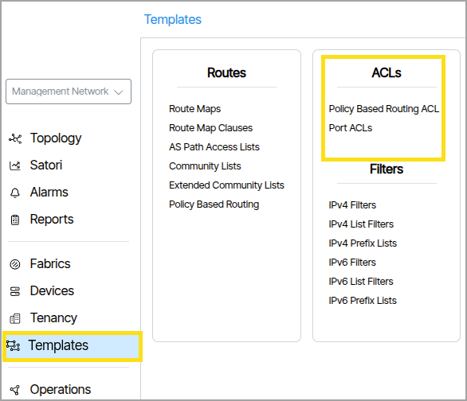
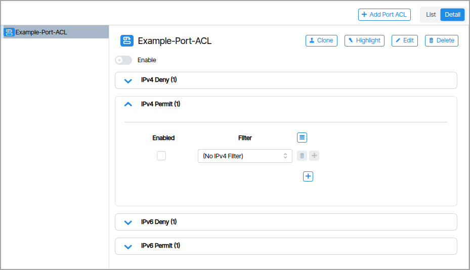
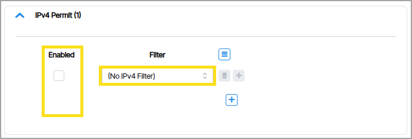
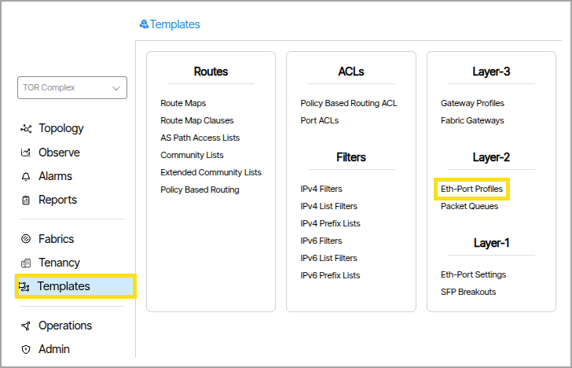
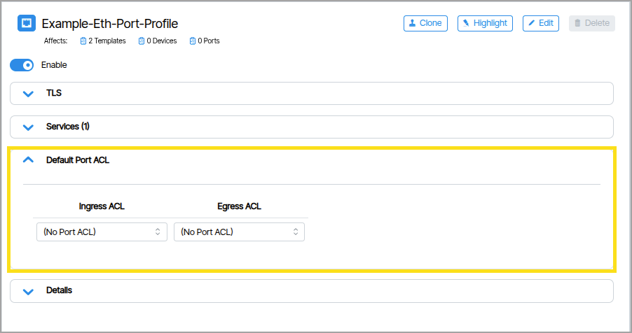
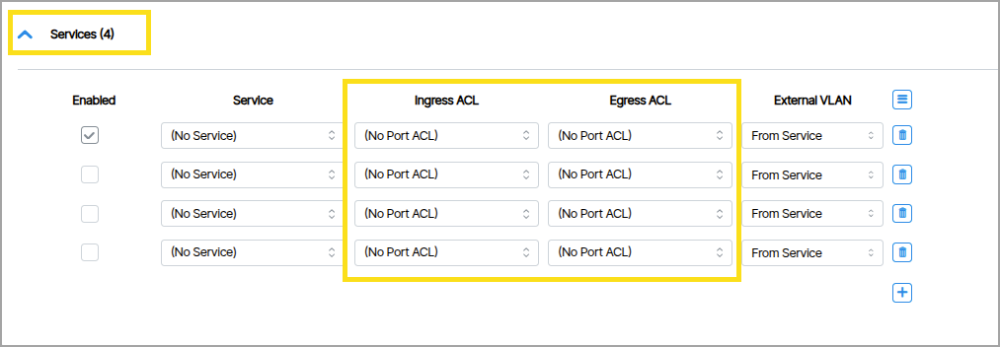

# ACLs

An **ACL (Access Control List)** is a collection of IP address filters. Verity lets administrators configure ACLs at the Service and Port level. Applying an ACL to a Service and/or Port is composed of these steps:

- Create and enable a Port ACL.
- Create and configure IPv4 and/or IPv6 filters.
- Apply filters to the Port ACL.
- From within a chosen Eth-Port profile, assign the ACL to a Port and/or Service(s).

## Policy Based Routing ACL

## Port ACLs

### Create Port ACLs
1. Double-click **Templates** and click **Port ACLs**. 
2. Click the **Add a New Port ACL**  button. 
3. Give the Port ACL a name and click **Create Port ACL**. 

The window that appears is composed of sections titled IPv4 Deny, IPv4 Permit, IPv6 Deny, and IPv6 Permit. These sections contain filters that determine whether selected network data is forwarded to a destination device or blocked.

## Create and Configure Filters

Before applying filters to an ACL you must first create and configure the filters. [How to Create IPV4 and IPV6 Filters](filters.md/#filters)

## Apply Filters to the Port ACL

In the Port ACL you apply the filters by setting them under the field named **Filter**. You activate the Filter by checking the **Enabled** box.

## How to Assign a Port ACL to a Port or Service

After assigning filters to Port ACL(s), you apply the Port ACL to the Service and/or Port within a selected Eth-Port Profile. 

To do this, navigate to **Templates &rarr; Eth-Port Profiles**.{:class = "pop"}

### Assigning ACL to a Port

Assigning ACL to the Port is performed in the **Port ACLs Ingress ACL** and **Egress ACL** settings.

### Assigning ACL to a Service

Each service in the **Eth-Port Profile** has Ingress and Egress ACL fields. These fields are where you set the ACL Port.

**Common processing order**

1.  **Port ACL** is applied first (affects all VLANs on the port)
2.  **Service ACL** is applied second (affects only the specific VLAN)
3.  Traffic must satisfy both ACLs to be permitted
