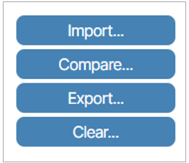
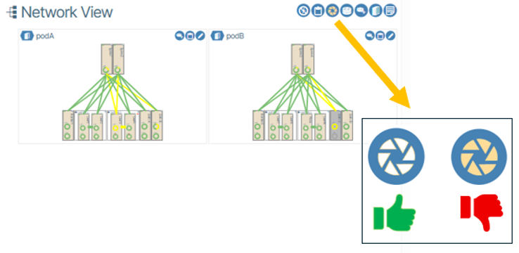
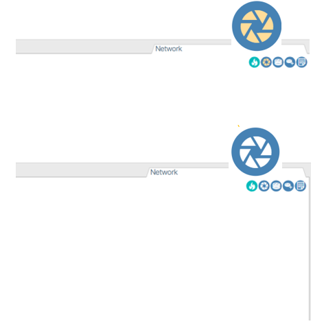
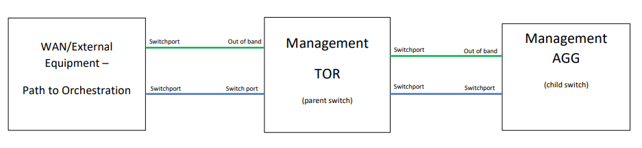
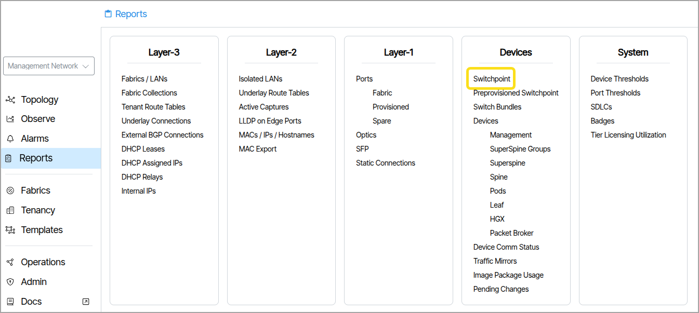
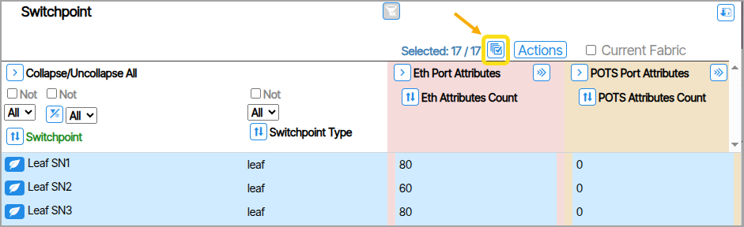
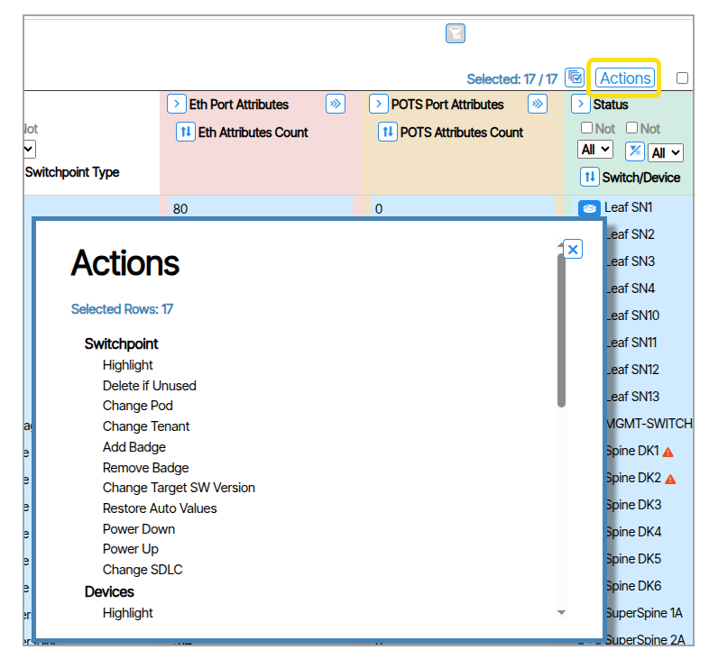
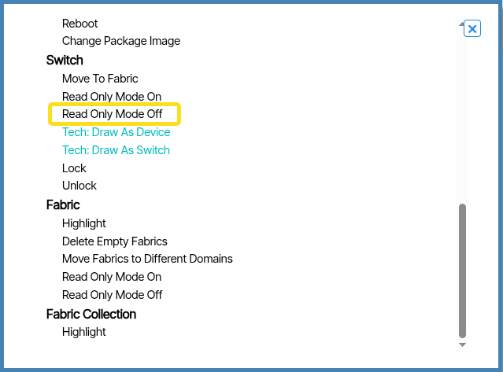
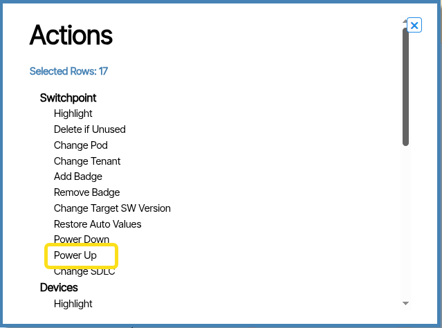
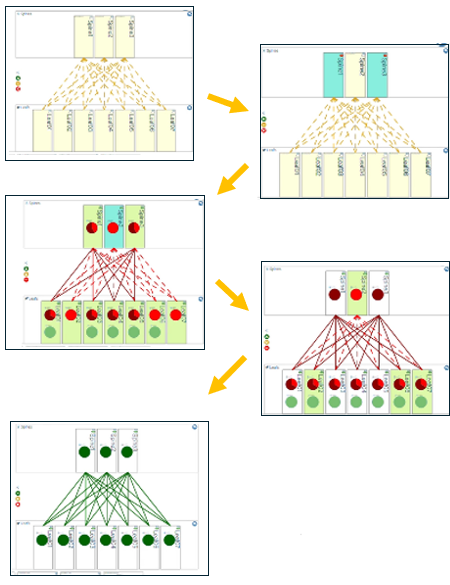

---
hide:
- toc
---
# Onboarding Devices
The most efficient method for onboarding devices is through bulk configuration using a system initialization file, referred to as an "FDC" file, as outlined in this document. Alternatively, devices can be individually onboarded through the Verity UI, though this method is best used when adding a few devices to a running system or replacing devices.

!!! warning "New Devices Starting Point"

    It is required that all SONiC devices being onboarded into Verity start in ONIE mode with no OS installed. This ensures that the device receives its load from the Partner Firmware Package installed on Verity and runs through the ZTP process.

!!!Note

    This section describes how to onboard devices in bulk using a system initialization file. This process creates Device Controller and Switchpoint objects and updates the Site object within Verity from the single import. To onboard individual devices see the section  [Device Management](device-management-fabric.md)

## System Initialization File
Device onboarding as well as the ZTP process, relies on an FDC file that defines the network devices and the management network, in a CSV file format. During installation, the user should prepare the file in Excel (or any CSV editor) and enter information into the designated fields. This is a list of the needed information to gather:, 

-   Service tag , serial number and chassis id of all switches (at least two of these values will be required, depending on the system's configuration and requirements).
-   The hostname of the SDLC created during the VM installation process
-   If using a Verity managed OOB management network, the designation of a management switch to function as your management Top of Rack (TOR) switch and the chosen uplink port you plan to use
-   Leaf Pair Names if Multichassis LAG is being used
-   Management network parameters

Example FDC files can be found in the  [Downloads](downloads.md) section of the documentation.

1. Choose the CSV file built for the system. (Note: the file name must start with the string “FDC” and cannot have hyphen or slash characters in the name)
    
    Notes about the FDC File - The FDC file contains parameters used to build the data objects related to managed devices. Refer to the file to see examples of the entries related to the following column headers:
      

| Column Name | Value |
| - | - |
| **SWITCH NAME** | This will become with switchpoint name in the user interface. Optionally is used to set the managed switch hostname.|
| **ROLE** | How the switch will be used.|
| **SWITCH IP/MASK** | Static IP installed in the switch by the ZTP process.|
| **SWITCH GATEWAY** | Static IP gateway.|
| **USERNAME** | Switch username (should remain as "admin" for SONiC switches).|
| **PASSWORD** | Switch password.|
| **POD** | POD location of the switch.|
| **RACK** | Used for reporting and info, no action is taken on this parameter.|
| **PAIRS** | Name for each leaf pair paired when using MCLAG. Same name can only be  used on two rows..|
| **LLDP CHASSIS ID** | Used as the basid for hardware detection using LLDP. Can be serial number, service tag or chassis ID. Using chassis ID is preferred, so that the "SWITCH NAME" will be programmed as the hostname in the device.|
| **SDLC HOSTNAME** | Controllers are containers inside the SDLC. A system may have multiple SDLCs.|
| **IP SOURCE** | optionally, device controllers can be set to static address. This entry specifies dhcp or static.|
| **IP AND MASK** | If using static addressing for controllers, this is the controller's address.|
| **GATEWAY** | If using static Device Controllers, this is the gateway for the controllers.|
| **ZTP IDENTIFICATION** | The device identifier (serial number or service tag). Used by the system to create ZTP scripts for the individual device.|
| **MGT TOR UPLINK PORT** | Only needed to identify uplink port of the management switch at the top of the network.|
    
After the file is updated with the required information, import it by performing the following steps.

1. Click the **Operations** icon and then choose the **Import/Export** option. 
1. Click **Import**. {: class="pop"}
1. After importing the file, the system automatically creates the required provisioning objects for the system bring up.
1. Make sure that that the system read only mode is disabled (i.e., icon with white background vs. beige background). {: class="pop"}
1. Click the **Operations** icon and then choose the **Import/Export** option. 
1. Select **Import**. {: class="pop"}
1. Choose the CSV file built for the system. (Note: the file name must start with the string “FDC" and cannot have hyphen or slash characters in the name.)
1. After importing the file, the system automatically creates the required provisioning objects for the system bringup. 
1. Make sure that that the system read only mode is disabled (i.e., icon with white background vs. beige background). {: class="pop"}

!!! note "Device Management Protocol"

    The default protocol used for the device management in the automatically created Device Controller is "gnmi." Some switch models only support SNMP, CLI or other protocols. Please confirm with the hardware vendor's documentation to ensure that gnmi is supported for the models you are using.

## Physical Connections

### Connect Management Switch(es)

The ZTP process sets the new switch up based on the contents of the Device Controller object that was created by the FDC file import. As a default, the first 32 ports are configured to be possible uplinks.

ZTP requires two connections simultaneously from the switch. One of the first 32 switch ports is designated to be the uplink connection to the WAN/Orchestration platform. The “out of band port” or “Management Port” of the switch is used to manage ONIE download and the ZTP process. Accommodations must be provided to allow the first switch (TOR) to go through the ZTP process. Once the TOR is up and running, connections for subsequent switches are made through the TOR. The management connections in the switching fabric are all untagged.

As shown in the diagram above, the management switches require two connections towards the installed applications to successfully complete the ZTP process. One connection is for the Management Switch “out of band management port” and the other connection is on a switched port. This switched port should be designated in the imported FDC CSV file only for the Management TOR switch. After connecting the device, the ZTP process will begin.

The next step is to “power up” the Device Controllers and set them to “Read write” mode. This is done through Reports. Open the Reports section of the main navigation UI and select the “Switchpoint” report.

1. Select all switchpoints. {: class="pop"}
1. Click the **Actions** button. {: class="pop"}
1. Under **Switch** select **Read Only Mode Off**.{: class="pop"}
1. Under **Switchpoint** select **Power Up** . {: class="pop"}
1. Power up the physical switch. 

The ONIE boot load and ZTP process can take 10 to 20 minutes to complete. Upon successful completion and established communications with the controller, the management switch status transitions to green in the system UI. This means the device is now provisioned and the management switch is operational. To view the management switch go to **Topology/Management Network**
### Remaining Management switches
On the management TOR switch, physically remove the cable from the out of band management port. The same process with two cables is required for all management switches cascaded from the Management TOR

### Connect Spine and Leaf Switches
For spine and leaf switches, only the out of band management port is used.

1. Connect all other switches (super spine, spine, leaf) to their respective management switches. These switches remain connected to the management switch moving forward.
1. Connect the pairs of leaf switches together using any two switch ports you choose.
1. Connect the leaf switches to the spines and the spines to the super spines using any switchport.
1. Power up the switches.

The UI **Network View** within the Verity dashboard gradually updates as you complete each step and Verity identifies each switch and automatically configures the network underlay. As you perform the process the devices change color depending on their state.

| Color | Meaning |
| - | - |
| **Yellow** | Switchpoint is Preprovisioned|
| **Teal** | Device is physically recognized, associated to the Switchpoint, and being registered|
| **Green** | Device is in provisioning process|
| **White** |  Device provisioning is complete and is ready for use|

!!! success "Congratulations"

    You have now successfully installed Verity and activated the underlay network.