# Admin
The **Admin** section provides high-level system configuration, user management, security, operational management tools, and settings.

## VNFs
The **VNFs** section manages virtual machine installations of the vNetC and SDLC, including the ACS, GuiA, and SensAI.

### vNetC Commander
This section is composed of important processes working within the vNetC virtual machine. 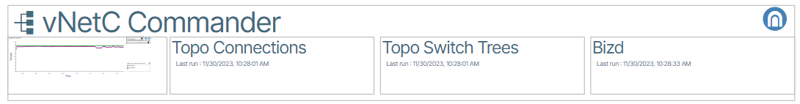{: class="pop"}

#### System Applications
System Applications are:

- ACS
- DHCP Server
- GuiA
- SensAI

#### Installing System Applications

1. Go to **Admin**.
1. Select **VNFs**. 
1. Click **Add a System Application** button ({: class="btn"}) 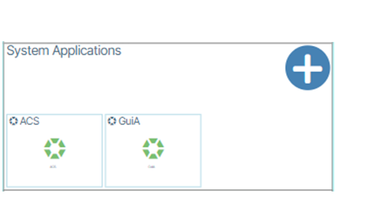{: class="pop"}
1. In the window that appears, click the desired System Application 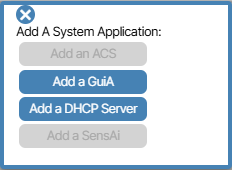{: class="pop"}. 

The example below demonstrates how to install GuiA; the steps are applicable to the other System Applications.

#### How to Install or Update GuiA
**GuiA** stands for Graphic UI Acceleration and is a System Application that increases UI performance. To add **GuiA** to your application do the following:

1. Go to **Admin/VNFs** (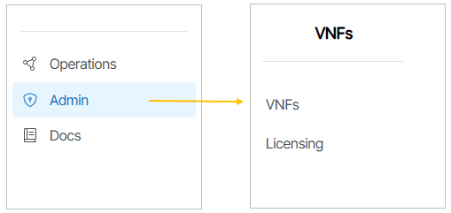{: class="pop"}) and navigate to the section of the window titled **System Applications**   . 
1. Click the create button ({: class="btn"}) 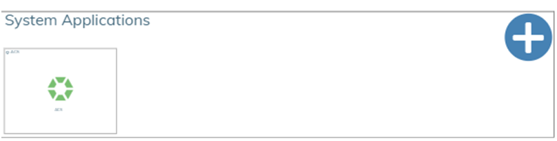{: class="pop"}.
1. Choose **GuiA** from the prompt {: class="pop"}.
1. In the window that appears, enable the application by clicking the enable button ({: class="btn"})and fill out the fields with the relevant IP information. 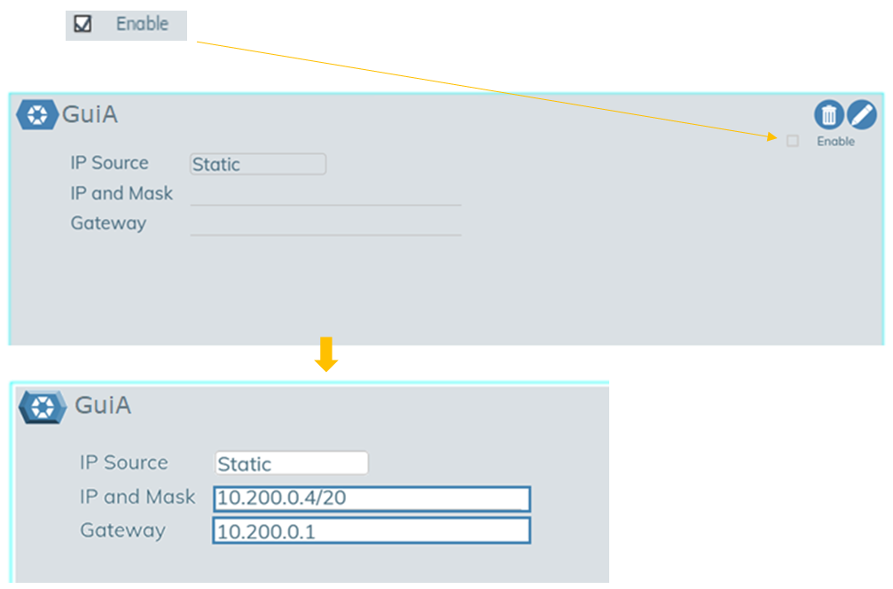{: class="pop"}
1. Save your work by clicking the checkbox icon({: class="btn"}).
1. The yellow **Status** box text will read **Awaiting Status**. When it changes to **Connected**, the process is complete. 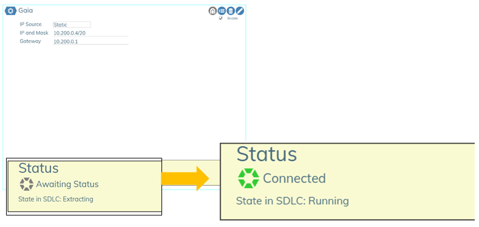{: class="pop"}

#### How to Install or Update SensAI
**SensAI **is Verity's AI-powered messaging assistant. To add **SensAI** to your application do the following:

1. Go to **Administration/VNFs**  ({: class="pop"}) and navigate to the section of the window titled **System Applications** ({: class="pop"}). 
1. Click the create button ({: class="btn"}) {: class="pop"}.
1. Choose **SensAI** from the prompt 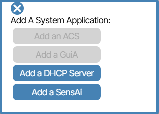{: class="pop"}.
1.  In the window that appears, enable the application by clicking the enable checkbox ({: class="btn"})and fill out the fields with the relevant IP information. 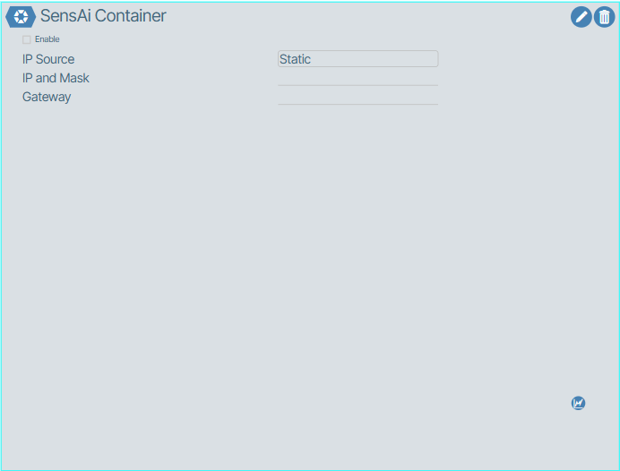{: class="pop"}
1. Save your work by clicking the check icon({: class="btn"}).
1. The yellow **Status** box text will read **Awaiting Status**. When it changes to **Connected**, the process is complete. 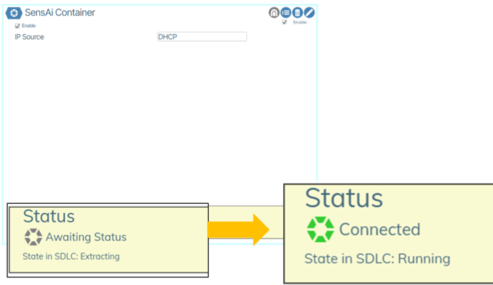{: class="pop"}


!!! note "Together API Key integration for SensAI"

    SensAI requires a valid TogetherAI API key via [https://api.together.ai/](https://api.together.ai/)  to run properly. The user will be asked to create an API-Key from their account at: [https://api.together.ai/settings/api-keys](https://api.together.ai/settings/api-keys).

#### Adding the Together AI API key

!!! note

    SensAI requires the Together.AI `"meta-llama/Llama-3.3-70B-Instruct-Turbo"` LLM Model.

1. Open the VMware application that contains the Satori VM. Select the Satori VM and under the Virtual Machine column click **Console/Open browser console**.
2. Login to Satori with your username and password.
3. Run the setup application from the shell by typing `sudo ./satori_admin.sh` and pressing `Enter`. You will see the following interface:

```
  ****************************************
    Welcome to the Satori Admin Menu 
    ****************************************

    Please choose an option:
    1) setup
    2) troubleshooting
    #? 

```

4. When prompted with #?, choose: **1** for `setup`.
5. Press Enter to confirm your selection
6. Press `Enter` to skip through each menu item *until prompted* for your **Together AI API key**.
7. Type or copy your **TogetherAI API key** and press `Enter`.
8. After submitting your Together AI API key type **sudo reboot** to reboot the VM. After the reboot, it takes about 3 minutes for the Docker containers to start up and to announce itself to the vNetC.

---

## Licensing
**Licensing** displays the license expiration date, support contact information, and reports on license and physical port usage.

<!-- 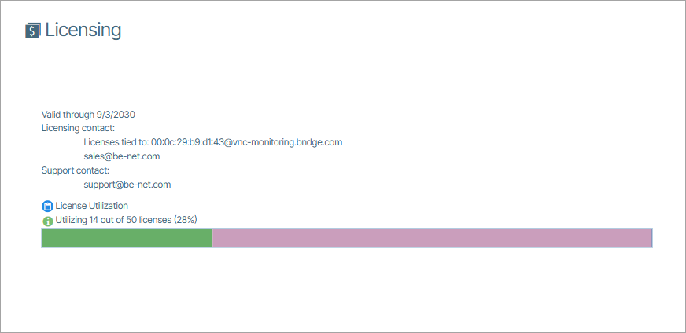{: style="width: 400px"} -->

---

## Users
**Users** provides tools for authentication, user settings, and role assignment.

### Roles

The **Roles** settings can be accessed via **Admin/User Roles**. This lets users assign feature access to roles. To access this feature you must first enable [**Granular Permissions** in feature flags.](#feature-flag). 

The **Roles** window contains a collection of checkboxes with each user role listed as a column item and each feature listed as a row item. You enable and disable checkboxes to determine what features are accessible to each role.

Verity supports role based access (RBAC) permissions scheme to partition the various workflows to operational personnel.

|**Permission**|**Parameters**|**Role**|
|-|-|-|
| [DEV] Device Management | Add device controller, Edit device controller, Delete device controller, Swap switchpoints,  Set read only mode,  Capture device snapshot,  Trigger a full device rescan by ACS, Open a remote access tunnel, Reboot switch,  Mark device out of service. | Device Operations |
| [NW] Network | Edit POD name,  Add a new preprovisioned switch  Designate LAN TORs (Management Network),  Lock switch Edit site, Create switch pairs,  Create a static connection, Site Settings (DHCP snooping, Aggressive Reporting, CRC Failure Threshold) , Underlay Fabric Configuration  |  Network Operations  |
| [SEP] Switch Endpoint | Edit Switch Name and type (spine/leaf)  Delete Switch Edit switch Note, Port Provisioning |  Day-Day Service Management |
| [BP] Base Provisioning | Manage Tenants, Gateways, LAGS, Route map assignments  |  Infrastructure |
| [GBL] Globals | Manage badges, RADIUS servers for 802.1x  | Security |
| [IE] Import | Import snapshots, Clear system | Global Provisioning |
| [ADM] Admin |      The Admin Role grants access to edit all features in the GUI     |  User Administration |
| [SVC] Services | Manage services, Change assigned tenant |  Service Creator |
| [SET] Sets  | Manage Firmware Update Sets | Software Manager |
| [VIEW] Views |Manage Views  | Monitoring |


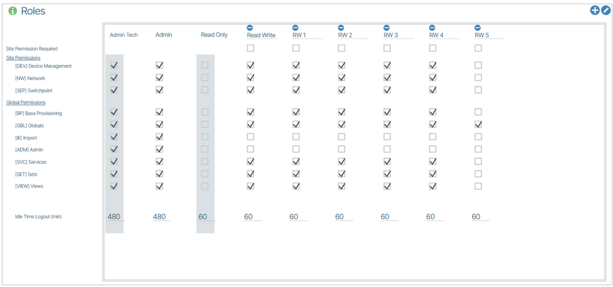

### Assigning Users to Roles
In **Admin/User Accounts**, each user is assigned a role.

1. From the **Admin** window select the **Users Accounts** item box. 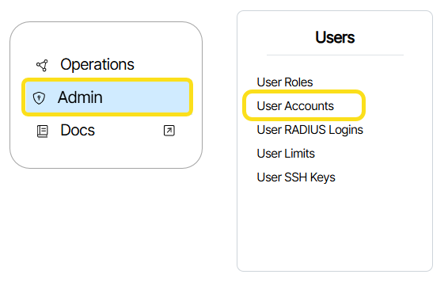{: class="pop"}
1. In the window that appears, click the Access Level menu item twice for the chosen user. 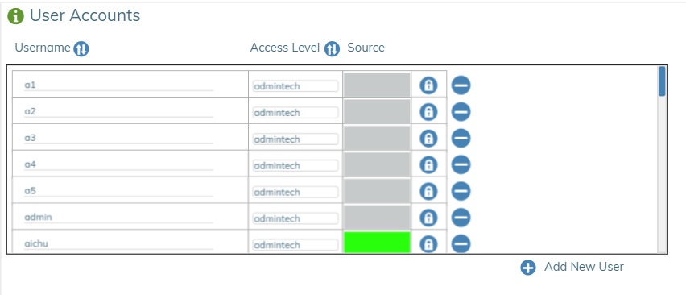{: class="pop"}  You can also select the edit icon ({: class="btn"}) in the upper right corner of the **User Accounts** window to edit the page.
1. Choose the Username you want to change and set the **Access Level** to the desired role. 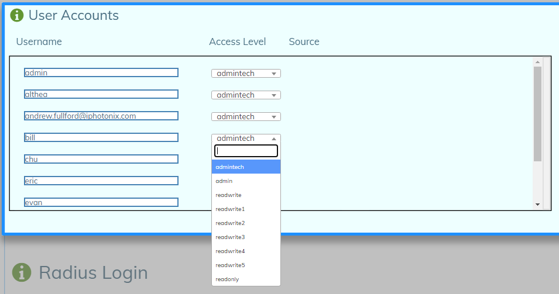{: class="pop"} 
1. To complete the process, click the checkmark ({: class="btn"}) in the upper right corner of the **User Accounts** window to save your work.

### User RADIUS Logins

Remote Authentication Dial-In User Service (**RADIUS**) is a networking protocol that provides centralized Authentication, Authorization, and Accounting (AAA or Triple A) management for users who connect and use a network service. RADIUS is a client/server protocol that runs in the application layer and can use either TCP or UDP as transport. The devices associated with Endpoints control access to a network as they contain a RADIUS client component that communicates with the RADIUS server. RADIUS is often the back end of choice for 802.1X authentication as well.

To access the RADIUS Logins settings:

1. Navigate to **Admin**.
1. In the Users column select **User RADIUS Logins**. 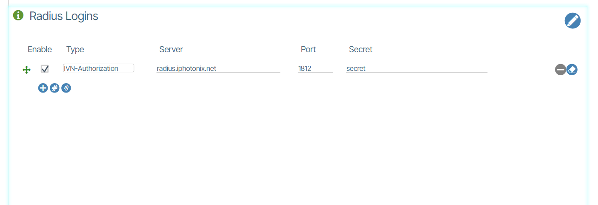{:class="pop"}

### RADIUS Login Secure Deployments 

The Verity platform provides the option for RADIUS integration iVN-Authorization/Server IP/Port/Shared secret are required inputs. User permission level will be passed down according to the following levels:
 
*Vendor IDs are assigned by IANA*

| **VENDOR** | **iPhotonix** | **49683** |

RADIUS dictionary for Verity remote authentication provides the initial authorization level.  Once authenticated, accounts are automatically created and updated with the iVN-Auth level. The "superuser" user does not actually exist within Verity, it is mapped to (same as) the "admin" user. The "authenticated" value indicates that the user is authenticated but that the authorization is based on internal records as managed by the Verity Admin page. The initial level is readonly.
An authentication returned with no iVN-Auth entry will be ignored. Only the first iVN-Auth will be honored.
  
| ATTRIBUTE | iVN-Auth | String|
|----------|:-------------:|------:|
| VALUE | iVN-Auth   | superuser|
| VALUE | iVN-Auth   | admin |
| VALUE | iVN-Auth   | readwrite |
| VALUE | iVN-Auth   | readonly |
| VALUE | iVN-Auth   | authenticated |

**Optional authorization modifier**
This instructs the Verity Web UI to modify the operations and results  available to the user.  For example, the value "tech" modifies the web behavior for "admin" and "superusers" to include more technically-oriented features.
 
| ATTRIBUTE    |      iVN-Auth-Modifier      |  string  |
|----------|:-------------:|------:|
|VALUE  |  iVN-Auth-Modifier | tech |

---

## Certificates

**Certificates** manages the import and revocation of application certificates. This is where you work with SSL certificates, certificate chains and certificate revocations.

### Importing Certificates

To import a Certificate:

1. Navigate to the **Admin** section and select **Certificates** (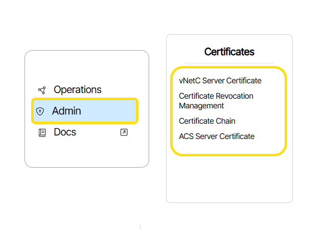{:class="pop"}).
1. Double-click the tile that describes the certificate you want to upload. 
1. Either drag the certificate to the drag and drop section or click the browse button and select your certificate file to upload it.  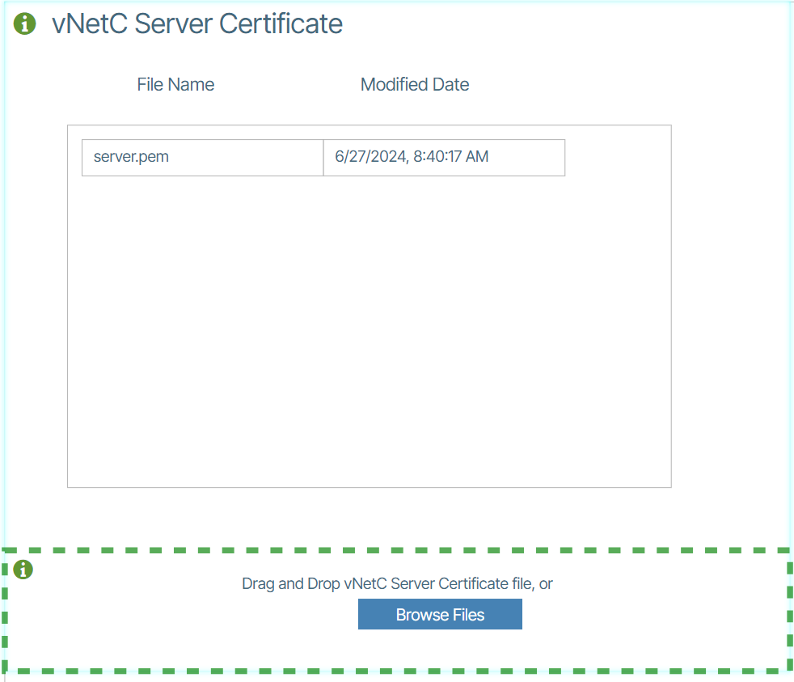{:class="pop"}

### vNetC Server Certificate

For the **vNetC Server Certificate** panel, certificate files must be in PEM format.  The **vNetC Server Certificate** should include

  *  Private Key File
  *  Certificate File
  *  Optional CA Intermediate Certificate

These should all be in PEM format, concatenated in that order.  The CA Root Certificate should not be included.

Once uploaded, the **vNetC Server Certificate** is automatically added to the backend web path.  Although this does reconfigure the backend process, this is done so that new connections will be handled using the new certificate but old connections will continue the operate as before, so there is no outage of the web service during a certificate update.

!!! Information

    Verity can be configured to support client certificate authentication. [This operates in a "lockdown" mode that meets US DoD requirements.](lockdown-mode.md)  It does impose strict access requirements on all transports in the systems and demands client certificates for all users, devices, and external application access.

---

## Software
The **Software** section controls software lifecycle management including vNetC platform packages, hardware-specific firmware images, bundled image packages, configuration file management, and application package deployment.

---

## External

**External** integrates with external monitoring and management systems and automates database backup configurations.

---

### DB Backups

####  How to Automate DB Backups
1. Select **Admin/DB Backup** from the Navigation Bar. 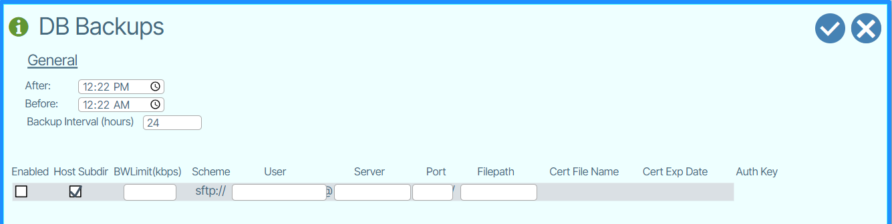{: class="pop"}
1. Enter the required information:

    - **BWLimit(kbps)**: Bandwidth Limit 
    - **User**:  Username on the remove server
    - **Server**: Remote server name (can be IP address or hostname)
    - **Port**:  IP port of the remote server
    - **Filepath**:  Path on the remote server

5.  Enable the **Enabled** and **Host Subdir** boxes.
6.  Once Enabled, click the **Auth Key** button to copy the authorization key. {: class="pop"} 
5.	In the **backup server**, add the authorization key to the system's authorized keys store, eg:  **.ssh/authorized_keys**.
6.	Save.

---

## Branding
**Branding** customizes the user interface with white-label options, including the login banner, top navigation logo, browser favicon, splash screen, and general application settings.

---

## Network
**Network** configures system-wide network behavior, management connectivity, WAN routing, and optional feature toggles.

---


### Admin Settings
**Admin Settings** is accessed from Admin/Admin Settings and lets you configure the following:

- vNetc Address on Management VLAN
- Permissible IP Address Ranges on Managed Devices
- Customized Download Address/FQDN


---

### Feature Flag
 **Feature flags** are used to enable or disable visibility of options in the UI and other system wide behaviors. Please consult with BE Networks regarding the usage of these settings beyond the defaults that are set upon installation. 


 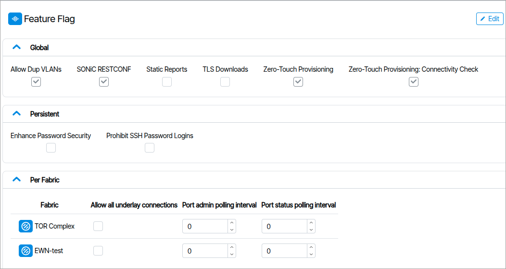

---

#### Global

**Allow Dup VLANs**

Services to allow duplicate VLNs

**SONiC RESTCONF**

Enable or disable SONiC RESTCONF support

**Static Reports**

Used for extremely large fabrics.Stops reports from dynamically updating unless requesting.

**TLS Downloads**
external
Use HTTPS instead of HTTP for firmware downloads.This causes extra vNetC load.

**Zero-Touch Provisioning**

Generates ZTP files.

**Zero-Touch Provisioning: Connectivity Check**

When unchecked, skips the post-provisioning connectivity check for in-band managed switches, where the management path may not be immediately reachable after ZTP completes.


#### Persistent 

**Enhanced Password Security**
Enable or disable password constraints and expiration. Existing users are not affected until a password change takes place.

<!-- - Passwords must be at least 16 characters.
- Passwords must contain at least one number.
- Passwords must contain both Upper-case and Lower-case characters.
- Passwords must contain at least one special character ~`!@#$%^&*()_-+=[{]}|\:;<,>.?/
- Usernames will be in all Lower case (if Upper-case is entered it will be changed to Lower)
- Special characters allowed in Usernames are -._~@%*
- Passwords will Expire in 60 days.
- Existing passwords will not expire or have Enhanced Security restraints and expiration enforced until first password change.
- When changing the password, it must be different than the last ten (10) passwords used. -->


**Prohibit SSH Password Logins**

* Disables password-based logins to the vNetC, Satori, and controller command-line prompts.

* SSH access to the vNetC remains enabled, but only via keys registered under **Admin → User SSH Keys**.

* SSH access to Satori and the controllers is permitted from the vNetC using `ns_cli`.

* Restrictions may take up to an hour to apply to the Satori and controller targets.

* If the change is required immediately, restart the target.

#### Per Fabric

This section contains three fields per Fabric.

- **Allow all underlay connections**

Allows underlay connection between PODS

- **Port admin polling interval**

Polling intervals values in seconds, set if aggressive reporting is not enabled.

- **Port status polling interval**

Polling intervals values in seconds, set if aggressive reporting is not enabled.


### Routing
**Routing** includes the following WAN IP information. 

- Hostname (FQDN)
- RAT Port Range
- WAN IP Source (DHCP or Static)
- WAN Default Route
- WAN IP Address
- DNS Server


## Plugins

### Dell OME Integration
System connects to Dell OME servers to collect hardware statistics from Dell servers and display them in dashboards.
