# Alarms

**Alarms** notify the administrator about problems within the system. The administrator accesses alarm information from the Alarms navigation panel.

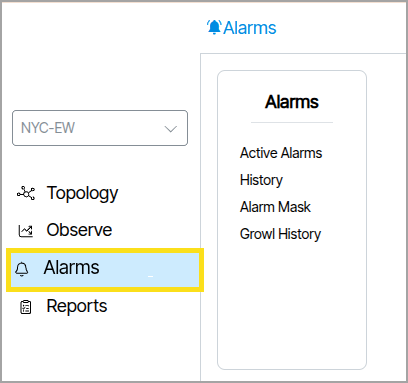

The following settings—Thresholds, Threshold Groups, and Grouping Rules—are available in **Templates → Alarms**.

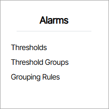

The **Thresholds** feature consists of three sections that work together: **Thresholds**, **Threshold Groups**, and **Grouping Rules**. Together, these create automated notifications that alert administrators when specific metrics exceed, fall below, or meet certain conditions in your network infrastructure.

## Thresholds
**Thresholds** allows administrators to create multiple threshold rules, each monitoring a specific metric with configurable conditions (greater than, less than, equals, etc.) and severity levels.

## Grouping Rules

**Grouping Rules** are collections of logical rules that determine which ports and hardware devices to select. 

## Threshold Groups

**Threshold Groups**  is where metric watching is applied to devices and ports. This section is composed of two lists: Targets and Thresholds.

- **Targets** is where you assign the rules created in the Grouping Rules section.

- **Thresholds** is where you assign the rules created in the Thresholds section.

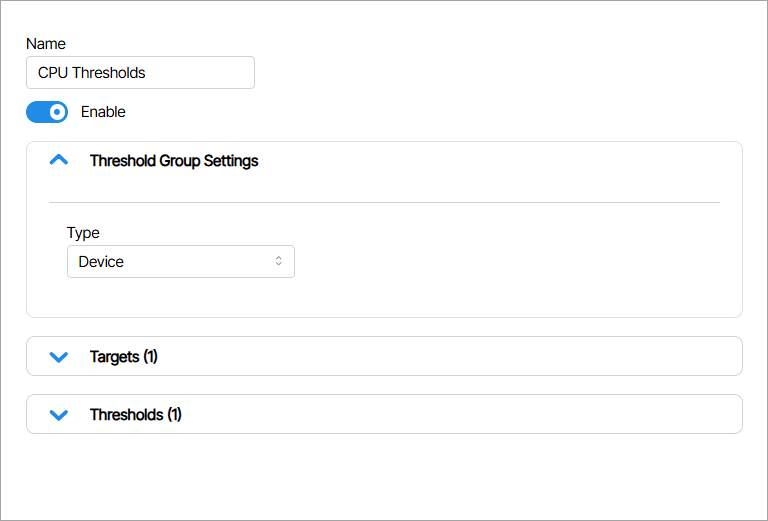

<!-- In the example image below, a Threshold is created for CPU usage.

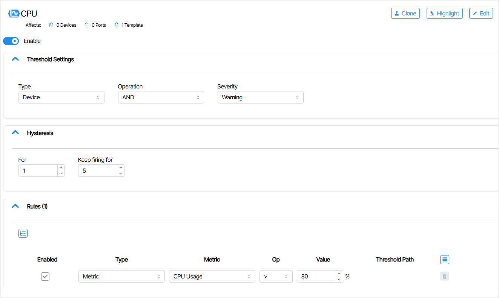

 -->

**Active Alarms** convey immediate problems occurring in the network right now. The Active Alarms window displays these alarms. A red background highlights the number of active alarms next to the Alarms Main Navigation tab. 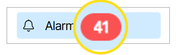{:class="pop"}

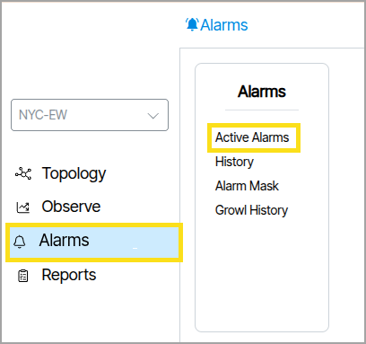

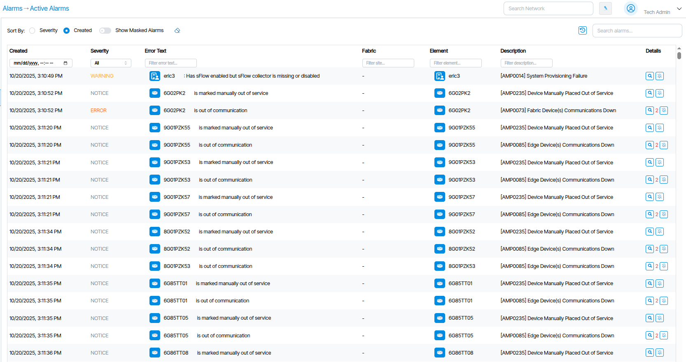

Active Alarms are searchable by name and object type using the search field.

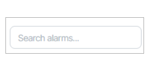

The **Sort By** feature is used to sort alarms. Alarms are sorted by **Severity** or by their creation time by enabling the **Created** option.

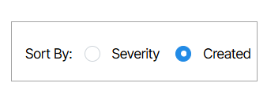

The **Show Masked Alarms** option shows **Masked Alarms** from within the Active Alarms window.

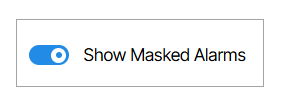

# Alarm Mask

**Alarm Mask** lists Masked Alarms.

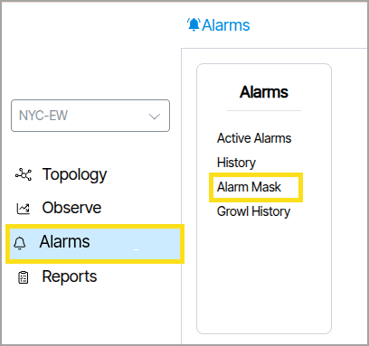

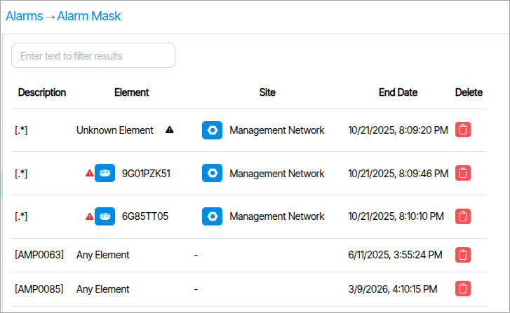

## Masked Alarms

**Masked Alarms** hide from the Active Alarms list. To mask an alarm, click its Mask Alarm button under the **Details** column in the Active Alarms window.

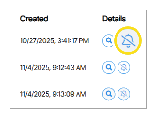

When you mask an alarm, a pop-up box appears with additional options, including **Mask Duration**, which lets you set a time duration for the alarm mask.

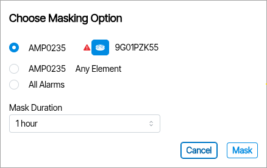

# Alarm History

While **Active Alarms** notify administrators of immediate problems, **History** records previously resolved issues and tracks less pressing notifications such as user logins.

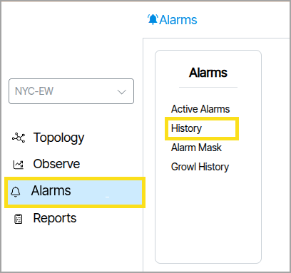

## Columns

Each column showcases data pertinent to individual alarm events, with a corresponding description positioned at the top.

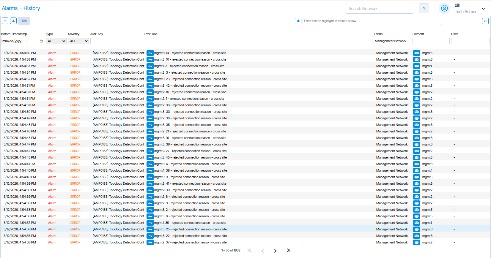

## Filtering

Each column features a form field positioned above it. These form fields enable the filtering of alarm data based on the content of the column. To use the filters, you choose a field(s), input a query, and press **Enter** on your keyboard to apply the filter. In addition to conventional search text, filters also accept Regex and glob patterns.

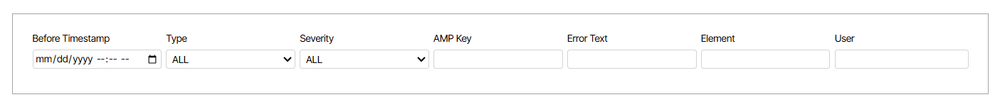

## Before Timestamp

**Before Timestamp** excludes events that happened after a set date. After the fields are set, only events that happened before the selected time value are displayed.

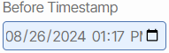

## Type

**Type** filters alarms by their type, which can be **Alarm**, **Event** or **Clear**. Setting the value to **All** shows all items and invalidates the filter.

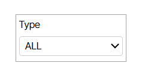

Messages under Type and Severity are color-coded by **Type**.

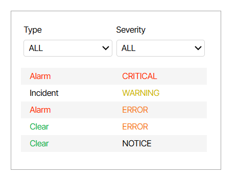

## Severity

**Severity** filters alarms by their severity, such as **Critical**, **Error**, **Warning**, or **Notice**. Setting the value to **All** displays all items and disables the filter.

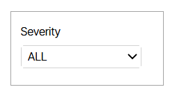

 

## AMP Key

The **AMP Key** filters alarms by key. The key is placed in brackets at the beginning of the alarm description.

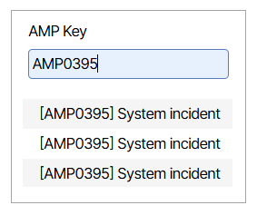

## Error Text

The **Error Text** field filters alarms based on the content of **Error Text** column.

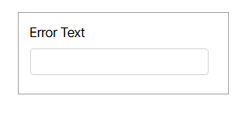

## Element

**Element** filters alarms by device name.

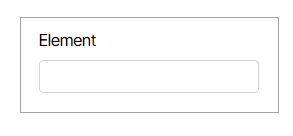

## User

The **User** column indicates who triggered an alarm. This field filters alarms by the **User** responsible for them.

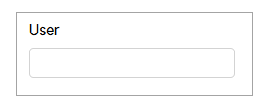

## Site 

!!! Multisite Only 

    This column is only available on *multisite* systems.

The **Site** column indicates the site of the device.

## Search

The search feature at the top of the page allows you to search for any text displayed in the current list of alarms. Any matching text is highlighted in yellow.

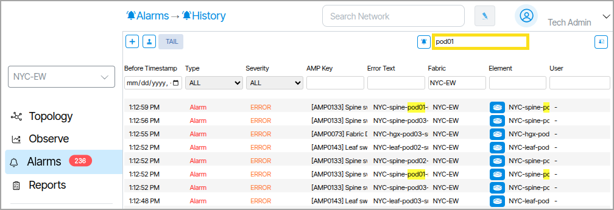

## Custom Search Filters

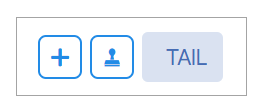

The **TAIL** tab lets you set the initial state of all filter field values. This is useful because it enables you to create a collection of default filter settings before creating custom search filters.

**Add a Custom Search Filter**

The {:class="btn"} button allows you to create a custom search filter. This is a user-defined collection of all filter settings. Multiple custom search filters can be created and toggled between when querying Alarm data.

When custom search filters are created, they are represented as numbered tabs with the word *Search* displayed on them. Clicking these tabs anywhere other than on the displayed “x” selects them and populates the fields with the assigned values. Clicking the “x“ deletes the search template and removes it from the list. Clicking **Tail** after creating or selecting a custom search will revert the filter values to the state saved via the **Tail** tab.

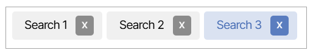

**Copy a Custom Search Filter**

The {:class="btn"}  button allows you to clone all filters from the currently active view window. The clone is presented as a newly created active tab.

#  Growl History

**Growl History** lists all system Growls. Growls are errors that occur between the client browser and the Verity orchestration platform. Hovering the mouse over a growl displays more detail about the error.

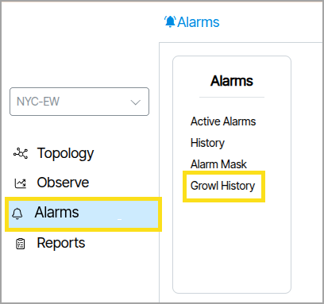

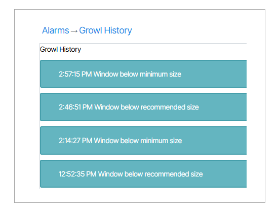