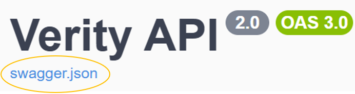
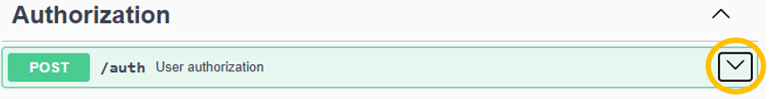
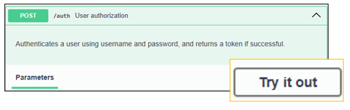
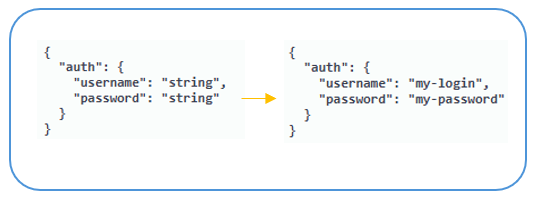
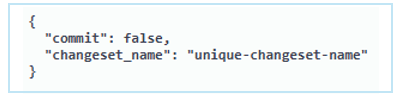
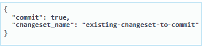
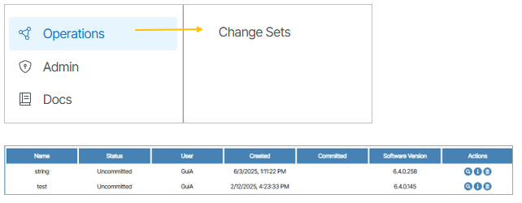
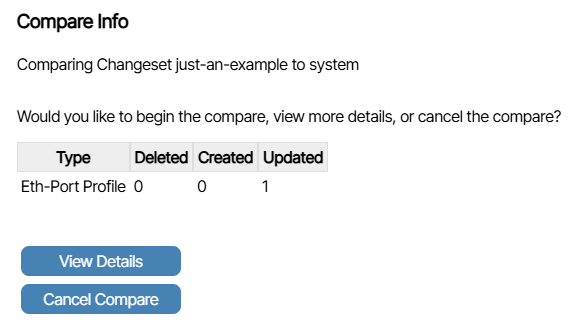

# Verity API
**Verity API** is a REST API conforming to the OpenAPI 3.0 specification used for operating a Verity instance.

The Verity API provides developers with access to essential functionality for interacting with data and services within the Verity system. Users can leverage this API to authenticate users, retrieve user information, and manage overlay resources efficiently. With the Verity API, developers can seamlessly integrate Verity's robust features into their applications, enhancing user experiences and streamlining workflows.

!!! note "API Documentation Versioning"

    The following documentation provides a high level explanation of how the Verity API functions.  For detailed examples and API reference for your exact version of Verity, refer to the Swagger documentation page on your Verity server.

## API Documentation

1. Navigate to <code>/swagger</code> on your Verity server IP. **Example**: <code> https://vnc-datacenter.company.net/swagger</code>
1. On this page, in the top left corner, is a link to the schema file if you wish to download it. To download a JSON copy of the API specification right-click  on **swagger.json** and choose Save-As. {:class="pop"}

## Quickstart
There are **two endpoints** you need to understand before using the API in production:

### 1. Authorization Endpoint
The **Authorization** section of the Verity API allows users to send their user/password combination to Verity for the creation of a time-limited access token.  Once this token is retrieved, all further API access needs to use the token.

#### Create an Auth Token
1. Go to **Authorization** and click the drop down menu. {class="pop"}
1. Click **Try it out**. {class="pop"}
1. In the request body, type the **username** and **password** credentials replacing the default string text.   {class="pop"}
1. Click the **Execute** button to invoke the HTTP request. {class="pop"}
1. If successful, the action returns a 200 status code with a description of **Successful authorization**. The token is required for requests and expires in 30 minutes. The **Authorization** drop down menu does not need to remain open and can be closed.

### 2. Changesets Endpoint

#### Create a Changeset
To use a changeset, users must first create the changeset via <code> POST/changesets </code>.

1. Go to <code> POST/changesets </code>.
1. Unfold the field and click **Try it out**.
1. To *create a new changeset*, the **commit** must be set to **false**, and the **changeset_name** must be set to a unique name. {class="pop"}

!!! note "Changeset Naming"

    Creating a changeset with the same name as a pre-existing changeset will return an error.

#### Commit a Changeset
1. To commit a changeset to the system, the  **commit** field must be set to **true**, and the **changeset_name** must be set to the changeset the user wants to commit.  {class="pop"}
1. Click the **Execute** button.

#### Verity Changesets (UI)
Changesets are listed within the UI at **Operations -> Change Sets**. {class="pop"}

#### Changeset Actions (UI)

- **Compare to Current**: Compares the changes in the changeset to the current system state in the form of a tabular summary.{:class="pop"}  Clicking **View Details** provides more detailed information in the form of a **Report**.

- **Download**: Downloads a JSON file of the affected object(s) to the user's machine.

## External Integrations

Customers are free to develop their own integrations and plugins that make use of the Verity API.  A number of prebuilt options are available from BE Networks:

### Verity Terraform Provider
This TF provider enables the use of IaC workflows including state validation using Hashicorp's Terraform system.  The Verity provider can be included in any TF project through standard provider declaration in main.tf.

- [Terraform Provider Documentation](https://registry.terraform.io/providers/BE-Network/verity/latest/docs)

### Verity Ansible Collection
This native Ansible collection provides various plays and actions to control a Verity managed network via Ansible.  The Ansible integration communicates directly with the Verity REST API:

- [Ansible Collection](https://galaxy.ansible.com/ui/repo/published/be_networks/verity/)

### Verity Netbox Plugin
This plugin integrates Netbox with Verity by automatically pushing Verity objects into the Netbox database at a specific time interval.  Multiple Verity instances are supported.  This plugin is currently read-only, meaning Netbox is not able to update Verity configuration.

- [Verity Netbox Plugin](https://github.com/BE-Network/verity-netbox-plugin)
