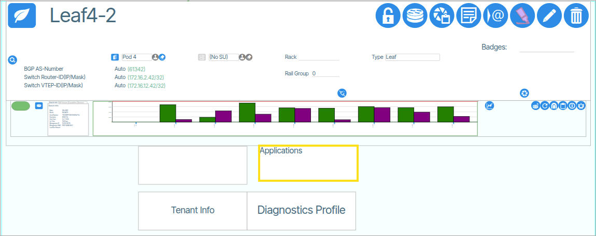
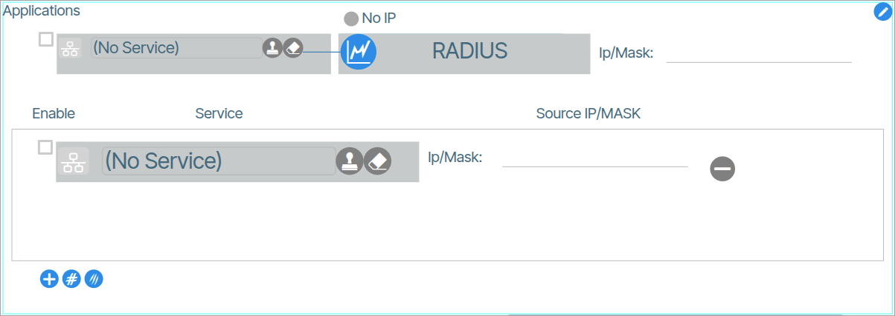
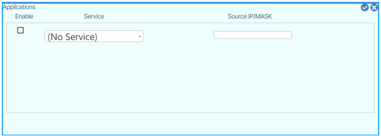
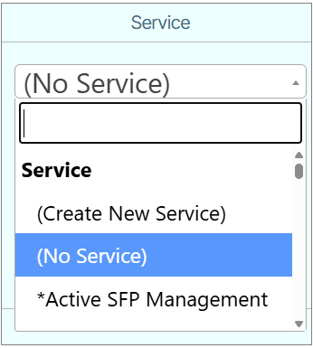
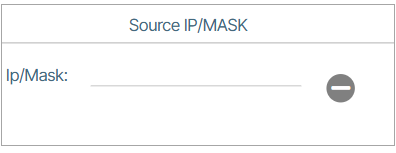
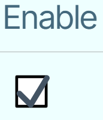

# Applications

**Applications** enable users to select VLAN interfaces and configure IP address assignments for those interfaces on the switch.
This feature enables network segmentation and service configuration by allowing users to associate IP addresses with defined Services. 

Each Service represents a logical grouping of VLAN configuration parameters, providing a streamlined approach to network resource allocation and traffic management. 

## Create IP-to-VLAN Mapping
1. To perform the IP-to-VLAN mapping you need to edit-enable ({: class="btn"}) in the Applications tile. {: class="pop"}
1. Select the desired Service from the **Service** drop-down menu. {: class="pop"}
1. Under the field titled **Source IP/MASK**, type the desired IP/MASK. {: class="pop"}
1. Enable the change {: class="pop"} and save the edit ({: class="btn"}).