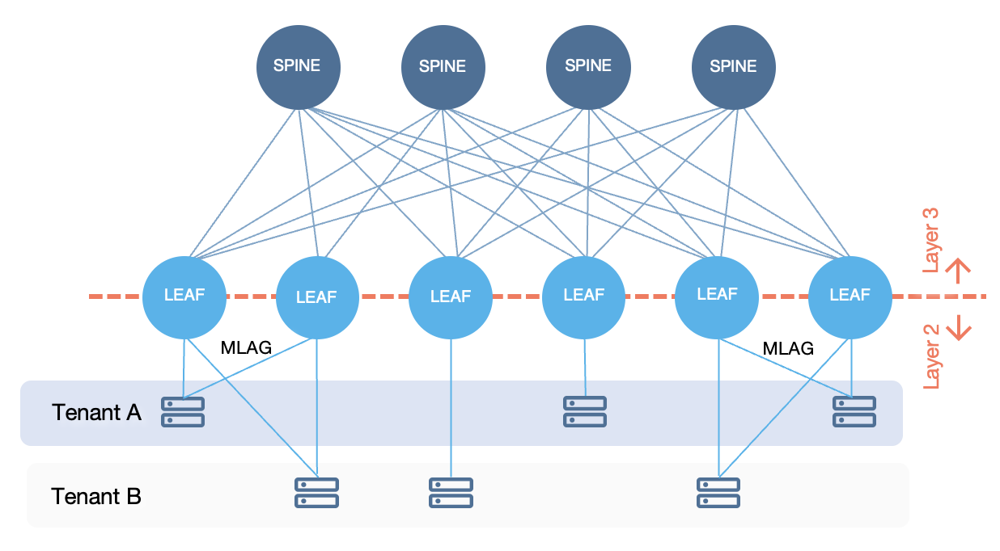
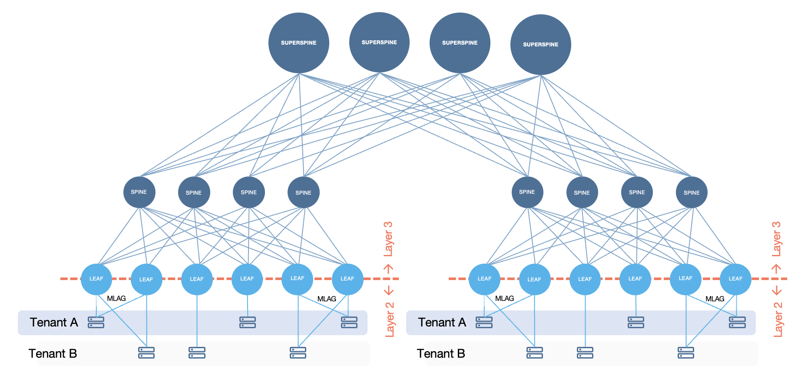
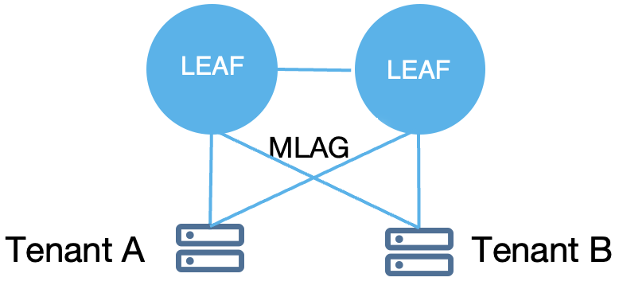
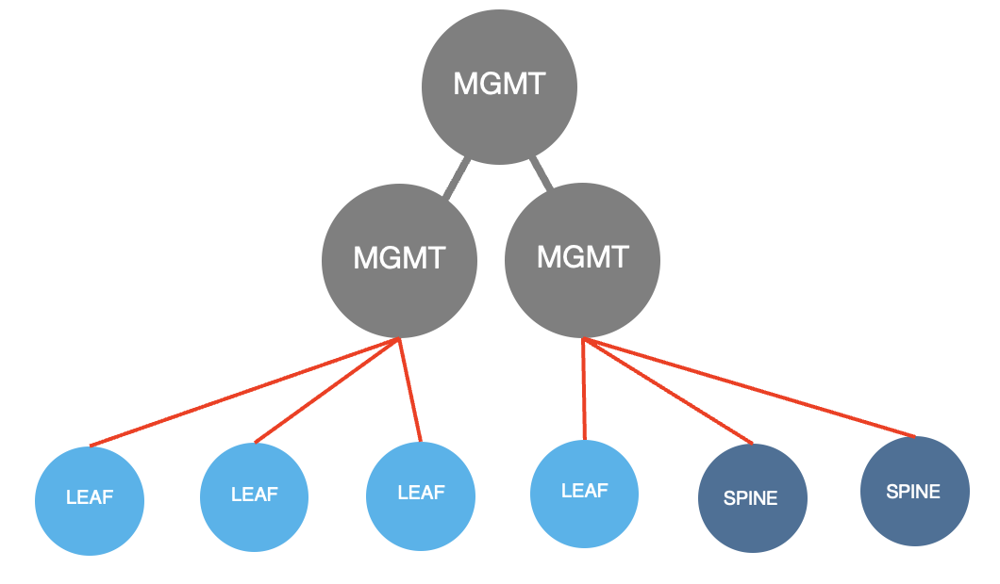

---
hide:
- toc
---

# Supported Data Center Topologies
Verity supports a number of different data center topologies, with designs optimized for edge compute all the way up to hyperscale sizes.  The core of these designs is a highly redundant load balanced architecture that is widely used in all modern enterprise networks.  These designs can be scaled nearly indefinitely, supporting growing network capacity on demand and with low capital expenditures.

---

## 3 Stage Clos Fabric
{: class="clean"style="width:400px"align="right"}
A 3 Stage Clos Fabric is composed of two layers of switches, generally Leaf and Spine.  The leaf switches are typically Top-of-Rack and the spines are either scattered throughout the racks to minimize cable lengths, or positioned at the end of the row (EOR) for simplicity.  The 3 stages refers to the path of data from one compute node to another, including the ingress switch, the crossbar switch (spines) and the egress switch.  A packet between two compute nodes connected to different leafs will pass through 3 different devices (stages).  This topology is commonly referred to as **Leaf-Spine**.

---

## 5 Stage Clos Fabric
{: class="clean"style="width:400px;padding-bottom:100px;"align="right"}
A 5 Stage Clos Fabric is identical to a 3 Stage, except that there are multiple groups of leafs and spines.  Each group is commonly referred to as a **Pod** and multiple pods are connected through an additional layer of switches known as a Superspine.  5 Stage fabrics typically use BGP route reflectors or route servers to minimize the size of the routing table and simplify device configurations.  Only build a 5 stage fabric if you know that your network will be of a size that requires it as the added complexity is typically unnecessary except in ther case of extremely large networks.

---

## Collapsed Core
{: class="clean"style="width:300px"align="right"}
A collapsed core design has no spine layers, it is composed of a small number of leaf switches that are all interconnected with one another via MLAG peer connections or a simple Layer-2 trunk between switches.  Since there is only one layer, both Layer-2 and Layer-3 functions run on the switches.

---

## Management Network
{: class="clean"style="width:300px"align="right"}
Verity supports the management network used to connect to each fabric device for programming and gathering telemetry.  Each managed switch is connected typically at 1 Gigabit to a single Layer-2 VLAN extended across a small number of switches.

