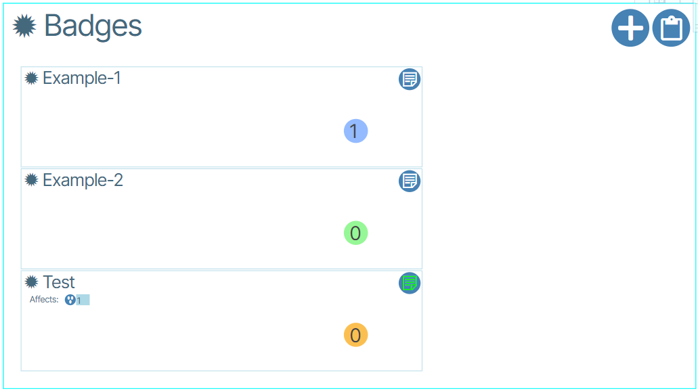
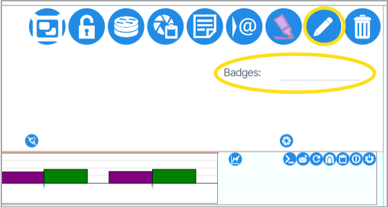
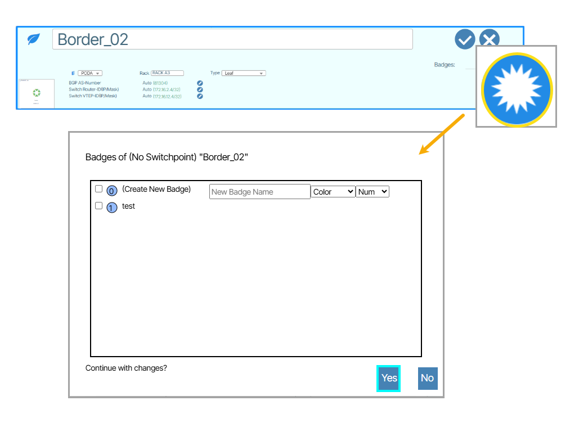

# Badges
**Badges** group devices visually. Administrators assign each badge a name, a color, and a number.

## Creating and Assigning Badges

1. Double-click **Topology** and click **Network View**. Enable focus of a selected device.
1. Click the **Open for Edit** button (or double-click the Badges field).    {:class="pop"}
1. Click set badges icon. {:class="pop"}
1. Enable the check-box next to the phrase Create New Badge.
1. Set a Name, Color and Num for the badge.
1. Click Yes to create the badge.