# ZTP and SONiC EDGE Installation

**Document Purpose**

The purpose of this document is to describe the concepts and detailed instructions for deploying SONiC in Edge/Campus environments where switch management interfaces are connected using in-band connections. The process is designed to be as automated as possible while allowing for efficient and reliable installation. This document does not cover all aspects of the provisioning for the network. Please refer to the UI User Manual for the appropriate software release for this information.

**Introduction**

Verity for Edge is a Local Area Network (LAN) management and orchestration overlay solution that extends the power and value of Intent-Based Networking (IBN) to legacy LAN switching estates. The solution enables IT staff to focus on the high-level tasks of delivering services to endpoints – the intent – eliminating the need to focus on the time-consuming, error-prone tasks of implementation.

One of the important tasks is in installation and turn-up of new SONiC based switching devices. These devices are delivered to sites containing only the boot loader (ONIE) and require the installation of the operating system and configuration of the device to begin communications with the Verity orchestration platform. Unlike in the datacenter architecture, where management of switches is done via out of band (OOB) connections, the Edge architecture requires that switches are managed “in-band” over the same infrastructure carrying user traffic.

## ZTP For In-Band Managed Switches in the EDGE

To successfully use the ZTP process network design decisions must be determined ahead of time. The decisions center around the connectivity expected in the fabric (single port or LAG) and the use of Multi-chassis LAG. These decisions ensure that once the switch starts the ZTP process, consistent connectivity back to the orchestration platform can be safeguarded.

!!! warning "Copper Ports Only"

    Please note - the fully automated process is limited to copper ports only. Switches with only SFP ports will not work in this case since setting speeds or breakout is required. For SFP only based switches used in the campus environment, ZTP must be completed with the switch set to “Managed In-band” in the Switch Endpoint and then final preparation of SFP ports and moving the connection to the in-band management VLAN must be done manually. Refer to the manufacturer’s documentation to complete the setting of in-band management on SFP ports.

Other network considerations include the management VLAN selection and tagging rules for management. In this environment, it is recommended that the management traffic is untagged on the fabric connections.

The ZTP process requires two physical connections for a switch to run the process. The first connection is on the switch’s out of band management port and the second connection is on any of the first 32 switched ports.

The ZTP process requires a DHCP server to provide addresses and DHCP options to the switches. The Verity system has an integrated DHCP server that may be used, or a DHCP in the customer network may also be used.

The ZTP process is summarized as follows. Details are shown in the subsequent sections:

1.  Switch powers up and ONIE boot loader and receives **Option 114** in the DHCP response on the out of band port which points the switch to the server folder containing the appropriate code load.
2.  After loading the SONiC OS, the switch reboots and again sends a DHCP request and receives **Option 67** in the DHCP response on the out of band port which points to the server folder containing the ZTP files.
3.  The ZTP process populates the switch configuration based on information contained in the Device Controller managed object.
4.  The ZTP process performs a connectivity test to the SDLC VM where the Device Controller is located over the connected switch port.
5.  The ZTP process continues indefinitely until the connectivity test is completed successfully.
6.  The Device Controller polls the network and starts communicating with the switch and then after successful discovery, the “Device Object” is created in the system.

## Device Onboarding Process

The steps for the process are summarized as follow:

1.  Load SONIC Firmware Packages via the SD-ADMIN page
2.  Set up the DHCP Server
3.  Create the Device Controllers and Switchpoints
4.  Bring up the switches in a serial fashion as the topology is built out.

## Configuring DHCP
There are two options available for configuring DHCP: either use your own DHCP server or install the internal **DHCP Server Application** by running the **Add a DHCP Server** process. To use your own DHCP server, skip to the section titled **Using Your Own DHCP Server**.

The address space for the management subnet is used for the vNETC (if in same subnet), SDLC and other internal system components used to manage the devices in the system as well as the devices themselves. This subnet, that was defined during the initial VM installation process, needs a section of addresses reserved for the static assignments of the system components as well as the management interfaces of the devices in the system. The dynamically allocated range is used to support the switches through the ZTP process as well as the Device Controllers that are created to communicate with the switches.

### Using the Internal DHCP Server

Double click the VNFs box 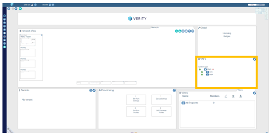{:class="pop"} .

To setup an internal DHCP server, access the section titled **System Applications** located within the VNFs section of the Verity dashboard and click the create button {:class="btn"}.

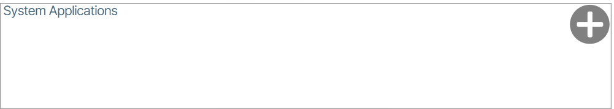

You are now going to install the DHCP Server. Click the **Add a DHCP Server** button {:class="pop"}.

For the **DHCP Server**, setting the lease duration is required. The excluded address ranges are designated to reserve space for the static addresses assigned as described above. The addresses allocated for the Device Controllers and the switches during ZTP will come from within area between the excluded addresses. The subnet and this range should be sized accordingly based on how many devices are planned for the data center network. In this example, the first 100 addresses and the last 5 addresses of the management subnet have been excluded from the DHCP pool of addresses that can be allocated 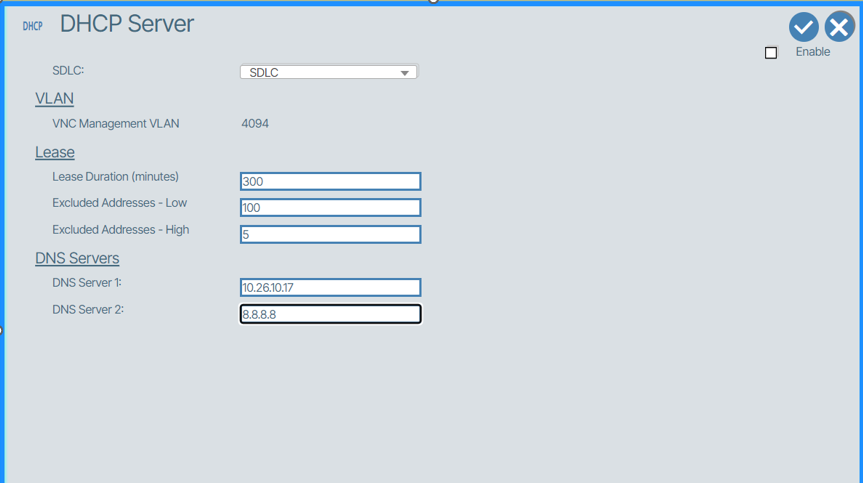{:class="pop"} .

Check the box titled **Enable** and click the checkmark to save and start the internal DHCP service 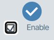{:class="pop"}.

### Using Your Own DHCP Server

To use your own DHCP server you do not need to run the **Add a DHCP Server** installer as explained in the previous section, but you need to understand the requirements described above for allocating the address space.

To use your own DHCP Server the following DHCP options are required to be configured which direct the switches to the necessary files required for ZTP.

-   **Option 67**: "http://\<vnetc-address or fqdn\>/download/ztp/file/ztp.json"
-   **Option 114**: "http://\<vnetc-address or fqdn\>/download/onie/file/onie-installer"

#### Define Reserved Ranges

In the Admin page navigate to the “Provisioning Reserved Ranges” section and set up Paired Link VLAN and Paired Switch subnet (VLANs 3967-4094 are reserved in SONiC and should be avoided)

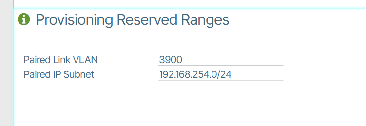

##Load SONiC Firmware

You are now going to load SONiC Firmware to VNetC. Before performing this action, you must obtain a firmware package from BeyondEdge containing the desired switch loads.

Go to the **Admin** page button located at the upper right side of the Verity dashboard UI and click **Software Packages and Licensing.** Then select **Partner Firmware Packages**. In the window that appears use the Browse Files/Drag-Drop interface to upload the BeyondEdge pre-packaged OEM firmware file 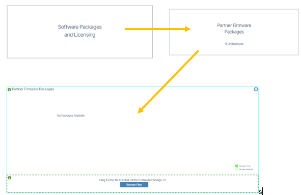{class="pop"}.

After upload is complete, click the Deploy button {:class="btn"}.
## Building a Network without Redundancy

Edge/Campus networks are very dynamic with many topologies. For the purposes of this section, the instructions describe bringing up the TOR switch and one aggregation switch. Other aggregation switches can be connected to the TOR or to other aggregation switches, but their process is the same, if only single switches are used. Multi-chassis architectures using switch pairs is described in the next section.

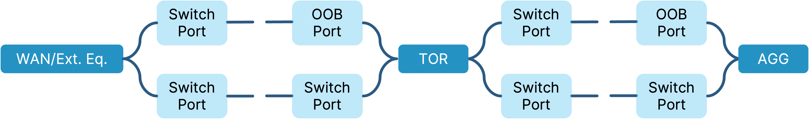

The ZTP process sets the new switch up based on the contents of the Device Controller object. As a default, the first 32 ports are configured to be possible uplinks based on the management VLAN and tagging rules in the Device Controller.

ZTP requires two connections simultaneously from the switch. One of the first 32 switch ports is designated to be the uplink connection to the WAN/Orchestration platform. The “out of band port” or “Management Port” of the switch is used to handle ONIE download and the ZTP process. Accommodations must be provided to allow the first switch (TOR) to go through the ZTP process. Once the TOR is up and running, connections for subsequent switches are made through the TOR. It is recommended that the management connections in the switching fabric are all untagged.

### TOR

####Build the Device Controller:

1.  Enter LLDP string representing the Service Tag/Serial Number of the switch.
2.  Enter the remaining fields as shown in this example:  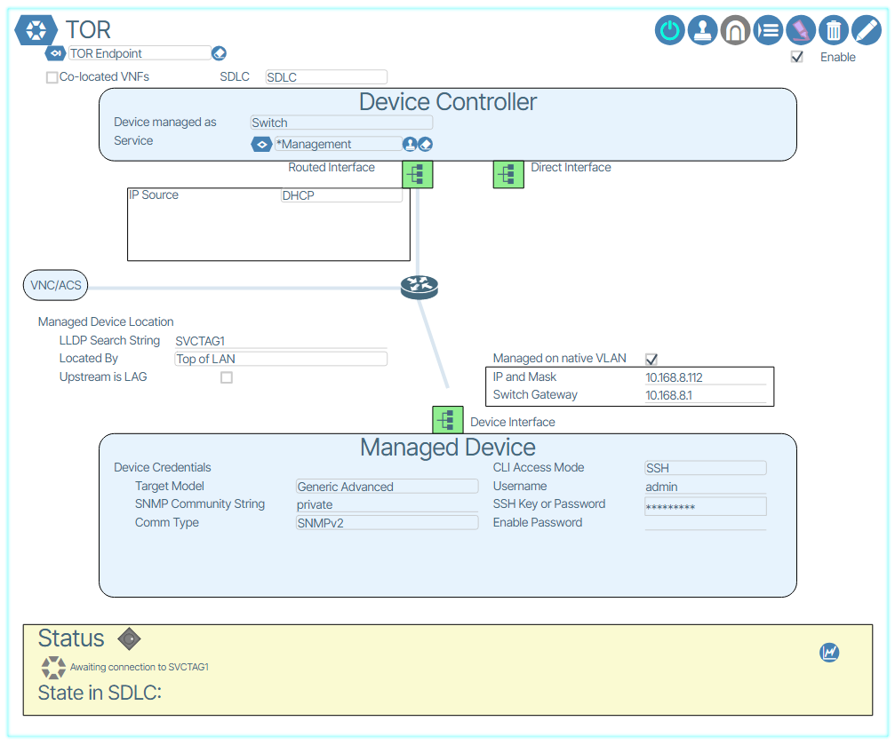{:class="pop"} .

3.  Turn the device controller on (Power switch ICON)
4.  Connect one of the first 32 switch ports to an untagged upstream port with a path/route to the orchestration platform.
5.  Connect “out of band” port of the switch to an untagged upstream port with a path/route to the orchestration platform.
6.  Upon completion of the ONIE boot load and ZTP process, the Device controller will locate the switch and it will draw on the system UI.
7.  Remove the wire connected on the out of band management port of the switch.

### AGG

####Build the Device Controller:

1.  Enter LLDP string representing the Service Tag/Serial Number of the switch.
2.  Enter the remaining fields as shown in this example: 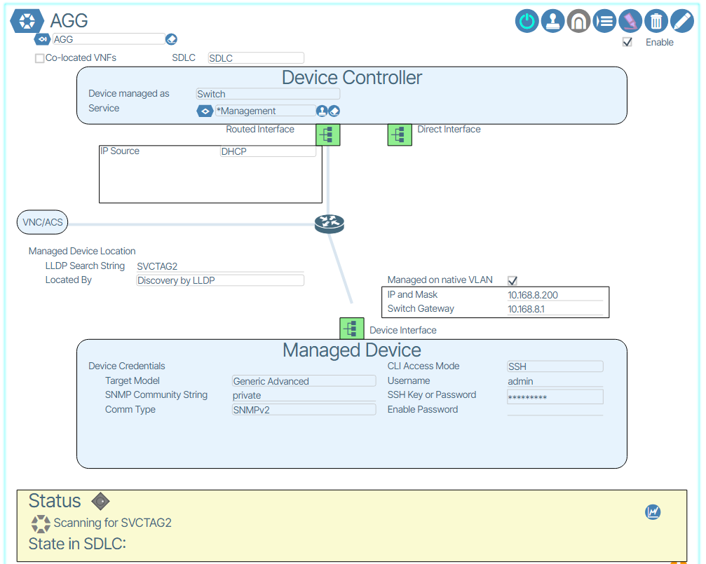{:class="pop"}.
3.  Create an Ethernet Port Profile with the site’s management VLAN in it and place it on a selected switch port on the TOR.
4.  Turn the device controller on (Power switch ICON)
5.  Connect one of the first 32 switch ports of the AGG to the TOR port with the management Ethernet Port Profile from step 3).
6.  Connect “out of band” port of the switch to an untagged upstream port with a path/route to the orchestration platform.
7.  Upon completion of the ONIE boot load and ZTP process, the Device controller will locate the switch and it will draw on the system UI.
8.  Remove the wire connected on the out of band management port of the switch.

*Repeat the AGG steps for other switches connected to the TOR, AGG and any other switches in the site topology. The management profile can be placed on any ports in the switches already discovered as the network infrastructure is built up.*

## Building a Multi-Tier Multi-chassis-LAG network

Building a multi-chassis LAG network has inherent complexities to maintain connectivity to all devices as the network build out progresses. Decisions regarding the switch pairs must be pre-planned so that the Port Channel assignments created during ZTP can be maintained throughout the build out. Additionally, careful attention **MUST** be given to the order of the pairing of switches and creation of uplinks to both maintain connectivity as well as prevent traffic loops. There are two steps where the A side of the pair must be placed in read only mode to ensure that the configuration gets to the B side first.

For the purposes of this discussion, paired switches will have an “A” side identifying the first of the switch pair to be brought into the infrastructure, and the “B” side identifying its partner switch.

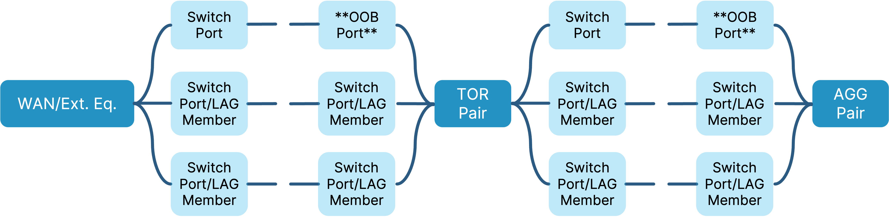

The general process is similar to the non-redundant switch bring-up with respect to ZTP. The following issues highlight the process for the redundant fabric.

1.  The ZTP process creates Port Channel groups including the first 32 switch ports so that any of those ports can be used to initiate the network build out.
2.  A sides are brought up first.
3.  B sides are brought up as “child” switches to their respective A side.
4.  After B is brought up, A and B are paired.
5.  After pairing is complete, uplinks from the B side to the parent’s pair are added.
6.  LAG objects are created when the Device Controllers are created.
7.  LAG objects for connections between Parent and Child switches are manually provisioned on the parent side and automatically assigned by the Verity software on the Child side.
8.  Intra pair connections are initially Parent-Child and then become manually provisioned on both sides during the pairing process.
9.  Four physical connections are expected between switch pairs (A-A, A-B, B-A and B-B)
10. Intra switch LAG should have two physical links at a minimum.

**Detailed Process Steps:**

###TOR-A

####Build the Device Controller:

1.  Enter LLDP string representing the Service Tag/Serial Number of the switch.
2.  Enter the remaining fields as shown in this example: 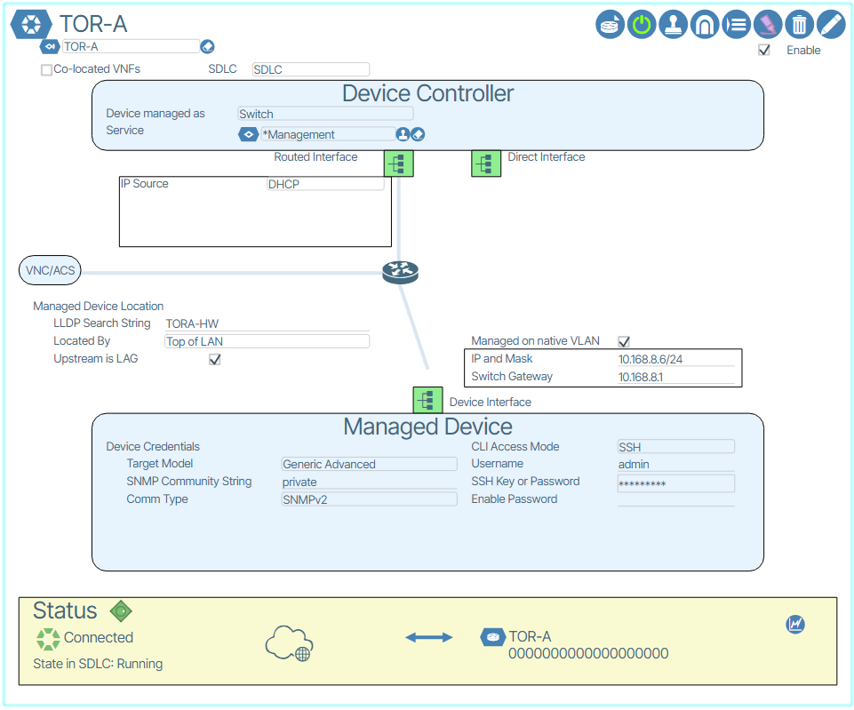{:class="pop"} . Take note that the TOR-A is designated as connected via LAG by checking the option.

1.  TOR-A create a new uplink LAG, with and uplink service port profile, and assign to one of the first 32 ports of the pre-provisioned TOR-A Switchpoint. Please note that the LAG indication is a checkbox along with the “Located By” setting.
2.  Connect the port assigned in the Switchpoint TOR-A to upstream device with Port Channel already configured with the Management VLAN with connectivity to the Verity orchestration platform.
3.  Connect TOR-A out of band management port to an untagged upstream port for ONIE/ZTP processing on the same Management VLAN.
4.  Power on the Device Controller and wait for the completion of the ZTP process and the switch to be discovered by the system. The default behavior for new switches is Read Only mode. Once the switch is discovered, disable read only mode.

###TOR-B

####Build the Device Controller:

1.  Enter LLDP string representing the Service Tag/Serial Number of the switch.
2.  Enter the remaining fields as shown in this example: 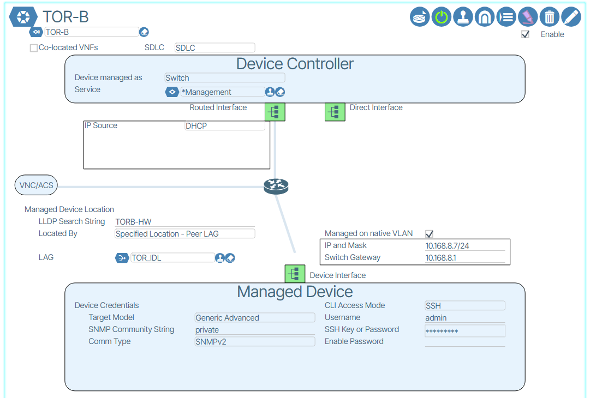{:class="pop"}.
3.  Note that the switch is located by “Peer LAG.” The type of LAG is referred to as an “IDL” LAG
4.  Assign the LAG created in the TOR-B Device Controller to a port on TOR-A
5.  Connect the link where the LAG was created on TOR-A to any one of the first 32 ports of TOR-B. (Note: This connection will eventually become the intra chassis connection between A and B sides once the switches are paired.
6.  Create an Ethernet Port Profile with the site’s management VLAN in it, untagged, and place it on a selected switch port on the TOR-A.
7.  Connect the out of band management port of TOR-B to the port for ONIE/ZTP processes.
8.  Power up the switch and the Device controller and wait for the ZTP process to complete and the switch to be discovered by the system. Disable read only mode for the TOR-B switch.

###PAIR TOR-A and TOR-B

1.  Remove out of band connection link from TOR-B
1.  **IMPORTANT: Place TOR-A in READ ONLY mode.**
1.  Pair TOR-A/B using the dialogue box in Network View {:class="pop"} .
1.  Assign 2nd IDL port on TOR-A to the IDL LAG created in the TOR-B controller and assign two links on TOR-B. The first is the link that was used for the first connection, and the second can be any other port on TOR-B.
1.  Wait for TOR-B to complete provisioning (light green back to white) to ensure that the configuration is on the B side.
1.  **Place TOR-A back into read/write mode and wait for it to complete provisioning**
1.  Wait for TORs to get into synchronization with each other as identified by the green “i” dots drawn next to the connections between them.

Add the remaining Uplinks to the TOR pair

1.  **IMPORTANT: Place TOR-A in READ ONLY mode.**
1.  Assign TOR_MLAG uplink to any available port on TOR-B and wait for provisioning to complete.
1.  Connect uplink from TOR-B to upstream device with the same Port Channel connected to TOR-A
1.  Wait for the system to provision the LAG connection into the B side. It is possible that A or B may lose communications with the system once the LAGs are converted to multi-chassis LAGs.
1.  **Clear the READ ONLY mode on TOR-A. Wait for the system to stabilize and all communications are up for both switches.**
1.  LAG status should show all links up and channel group up within a minute and IDL LAG should show up and paired switches sync.

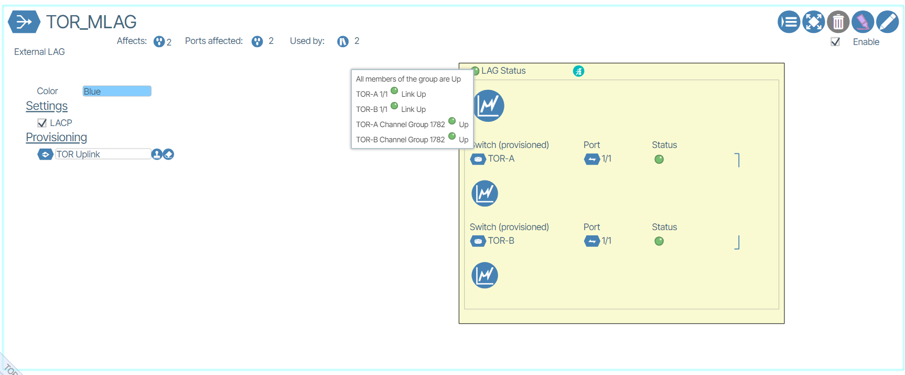

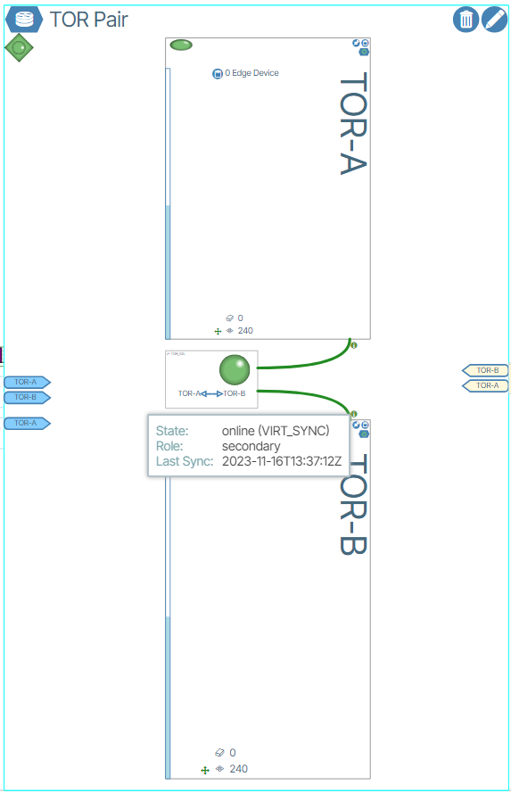

1.  More links can be added to TOR-A and TOR-B to make cross connections to the device above the TOR pair for full switch and link redundancy.

##Multi-Chassis Aggregation Switches -A/B pair

###AGG-A

####Build the Device Controller:
1.  Enter LLDP string representing the Service Tag/Serial Number of the switch.
2.  Enter the remaining fields as shown below in this example: 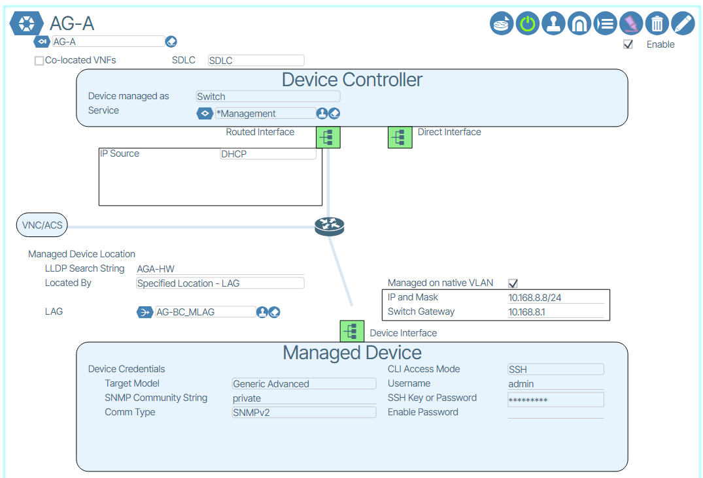{:class="pop"}.

3.  Add the LAG created in the device controller to a port on TOR-A.
4.  Connect uplink from AG-A on any of the first 32 ports to TOR-A port where the LAG is provisioned.
5.  Connect out of band management port of AG-A to an untagged upstream port for ZTP using the Ethernet Port Profile created in the previous section.
6.  Power up Device Controller
7.  Wait for successful ZTP indicated by the device getting discovered by the system.

###AG-B  

####Build the Device Controller:

1.  Enter LLDP string representing the Service Tag/Serial Number of the switch.
2.  Enter the remaining fields as shown below in the following example: 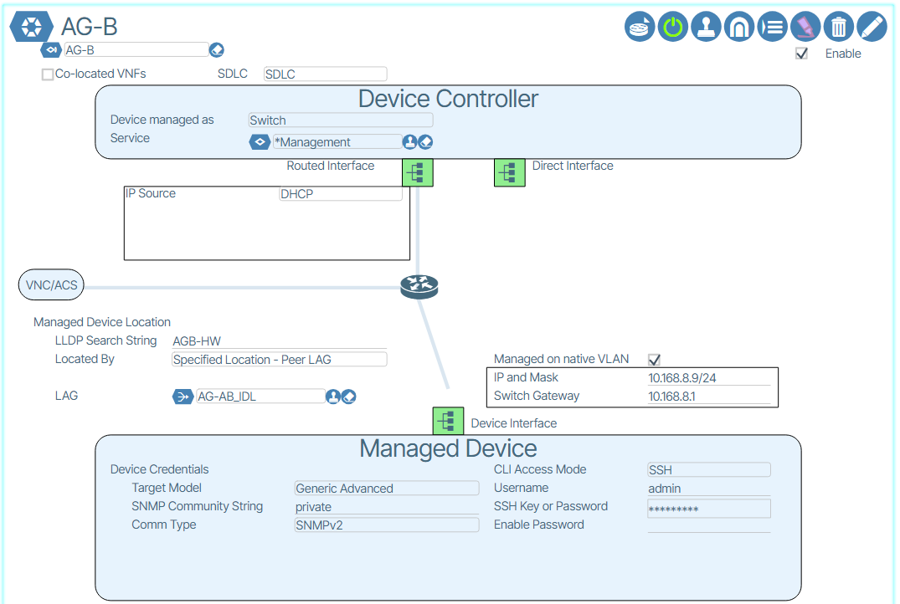{:class="pop"}.

3.  Note that the switch is located by “Peer LAG.” The type of LAG is referred to as an “IDL” LAG
4.  Assign the LAG created in the AG-B Device Controller to a port on AG-A
5.  Connect the link where the LAG was created on AG-A to any one of the first 32 ports of AG-B. (Note: This connection will eventually become the intra chassis connection between A and B sides once the switches are paired.
6.  Create an Ethernet Port Profile with the site’s management VLAN in it, untagged, and place it on a selected switch port on any in service switch that can be reached.
7.  Connect the out of band management port of AG-B to the port for ONIE/ZTP processes.
8.  Power up the switch and the Device controller and wait for the ZTP process to complete and the switch to be discovered by the system.

##PAIR AG-A and AG-B

1.  Remove out of band connection link from AG-B
1.  **IMPORTANT: Place AGG-A in READ ONLY mode.**
1.  Pair Agg-A/B using the dialogue box in Network View {class="pop"} .
1.  Assign 2nd IDL port on AG-A to the IDL LAG created in the AG-B controller and assign two links on AG-B. The first is the link that was used for the first connection, and the second can be any other port on AG-B.
1.  Wait for AG-B to complete provisioning (light green back to white) to ensure that the configuration is on the B side.
1.  **Place AG-A back into read/write mode and wait for it to complete provisioning**
1.  Wait for AGs to get into synchronization with each other as identified by the green “i” dots drawn next to the connections between them.

1.  **IMPORTANT: Place AG-A in READ ONLY mode!**
1.  Assign the LAG created in the AG-A Device Controller to any available port on TOR-B and wait for provisioning to be completed.
1.  Connect uplink from AG-B to TOR-B’s provisioned port
1.  Wait until provisioning to be completed on AG-B. There may be cases where AG-B temporarily loses communications with orchestration platform. If this occurs, wait one minute.
1.  Clear the READ ONLY mode on AG-A.
1.  Additional uplinks should be added between AG-B and TOR-A and AG-A and TOR-B. Add the LAG manually on the TOR side, connect the wires, and the system automatically adds the new links to the LAG on the AG side.
1.  LAG status should show all links up and channel group up within a minute and IDL LAG should show up and paired switches sync.

**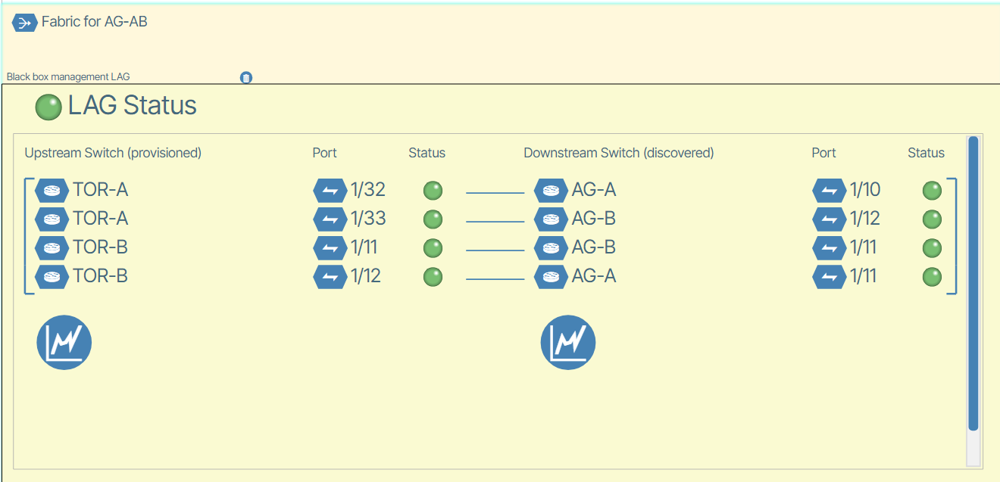**

More tiers may be added below AGG AB pair and other AGG pairs may be added to the same tier. Follow the same procedure as described.
