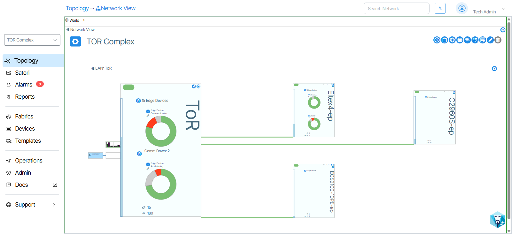
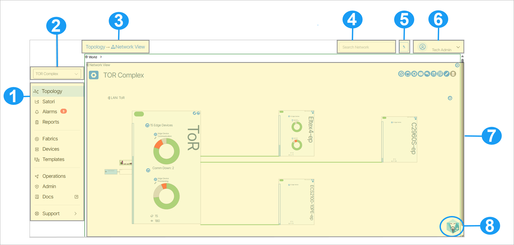

# UI Navigation

## Verity L2 Edge Workspace

The Verity L2 Edge Workspace is your single pane of glass for setting up services, profiles, and service bundle templates, and applying them to the network's service endpoints. From here, you can drill into each section to add, edit, or delete LAN elements.

1. Main Menu
1. Site Selection (Multi-site only)
1. Navigation Depth Tracker
1. Search 
1. Highlight
1. User Info & Sign Out
1. Workspace
1. SensAI launcher