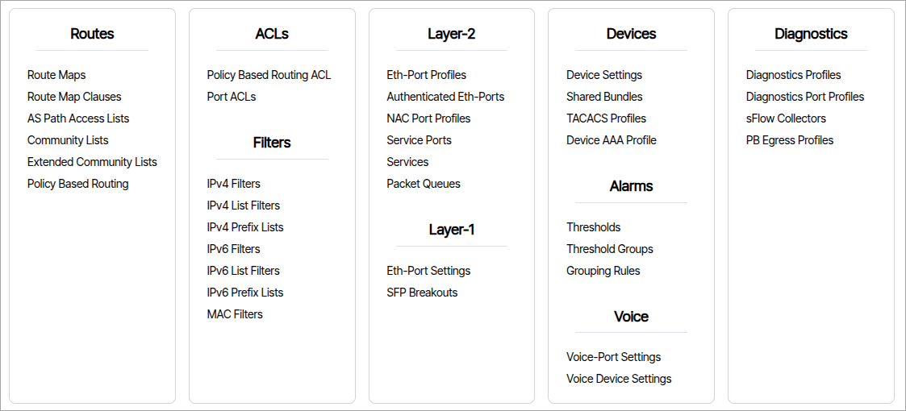
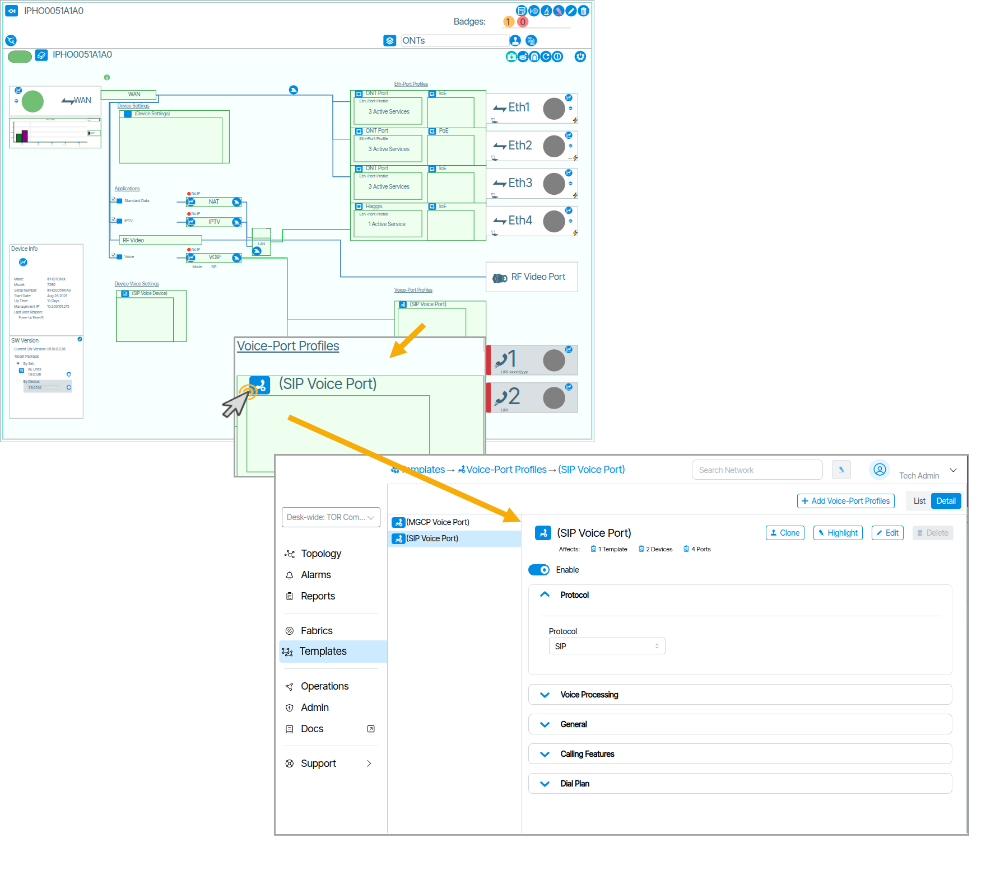
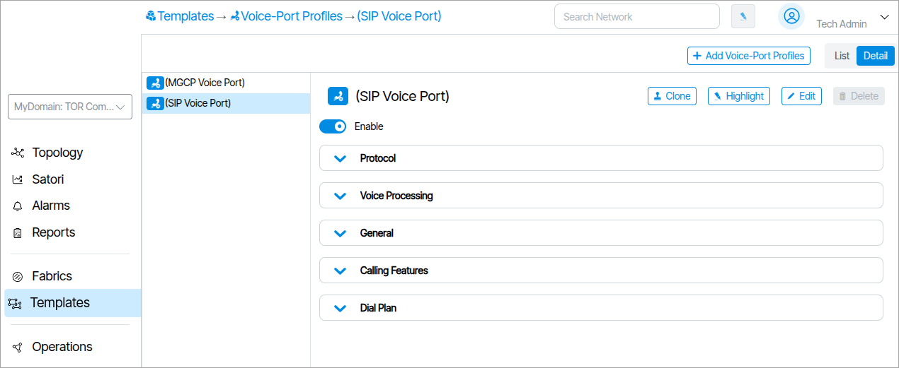
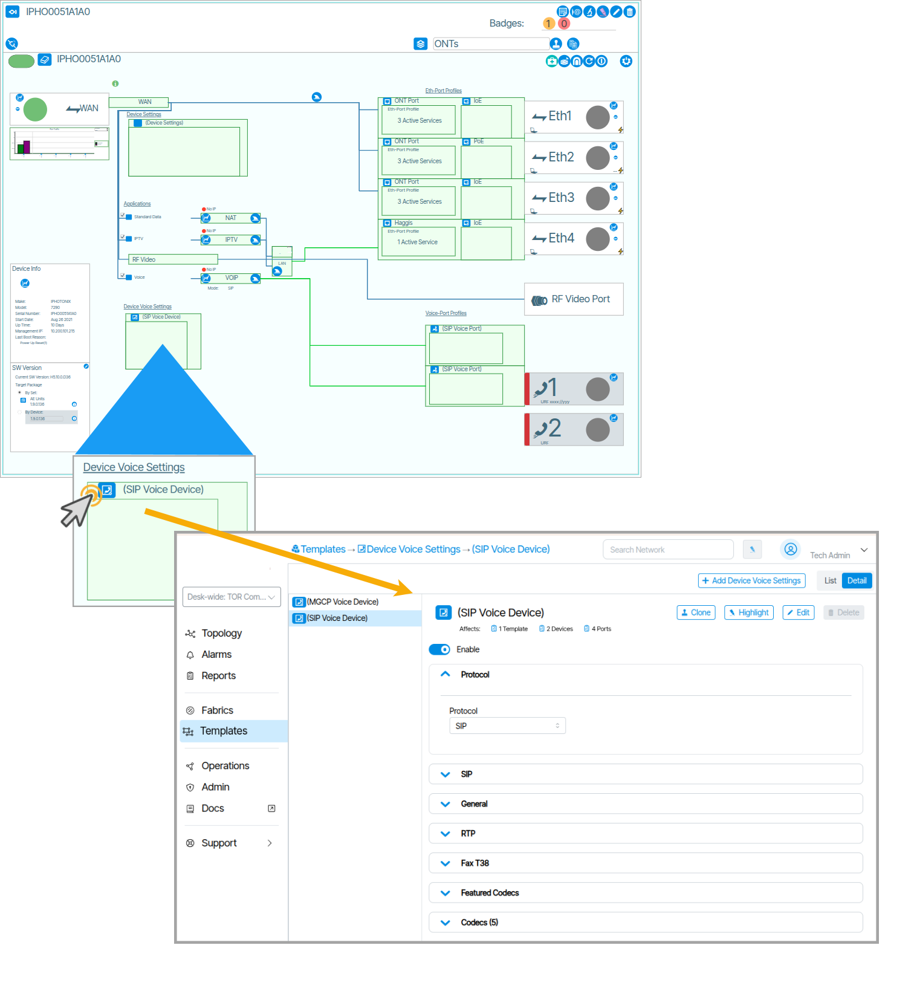
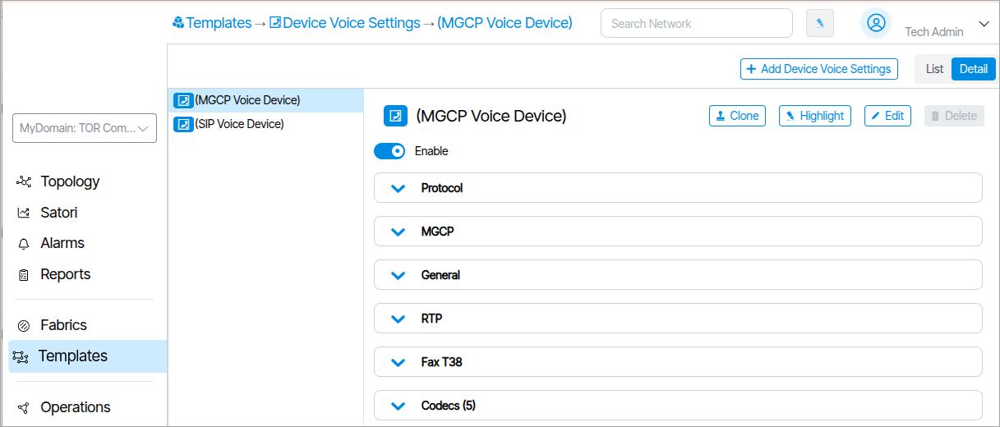

The **Templates** section is composed of tools used to configure and create reusable network device settings and policies. 

More Information: [Templates](/templates-overview)

## Authenticated Eth-Ports

An Authenticated Ethernet Port profile is comprised of a list of Ethernet Port Profiles. This feature is used on networks that employ user detection and authentication via 801.1x protocols. The Managed End Device communicates to connected user devices as they connect to the assigned port, and relay control messages to a Radius server, to validate the user and select and enable the appropriate Ethernet Port Profile on the port.

The “Settings” section allows a change in the connection mode the user device contains, ranging from 3 different modes. Port Mode, which is the standard mode, Single Client Mode which disables traffic from a second client, only allowing the authenticated client’s traffic to pass. Lastly, Multiple Client Mode which allows multiple clients’ traffic to pass.

## Service Ports 

Service Port are normally assigned to links or LAGs connected to the TOR switch of the network. The user can edit the maximum downstream rate allowed on a per service basis. Other parameters such as spanning tree and port monitoring are set on the physical link.

## Voice Port Settings
Voice Port Settings contain parameters related to VoIP protocols, interfaces and related features.
An example of a Voice Port Setting is shown below. It covers various voice settings and features that are port specific.

Voice Port Settings can be accessed from within the rendered ONT in Topology ({class="pop"}).

## Voice Device Settings

Voice Device Settings are the settings used for configuring the VOIP stack on the ONT. There are two formats for the protocol field based on whether SIP or MGCP is used. Voice Device Settings can be accessed from within the rendered ONT in Topology ({class="pop"}).

