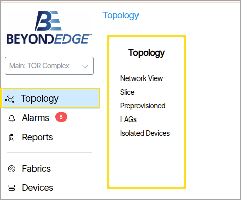
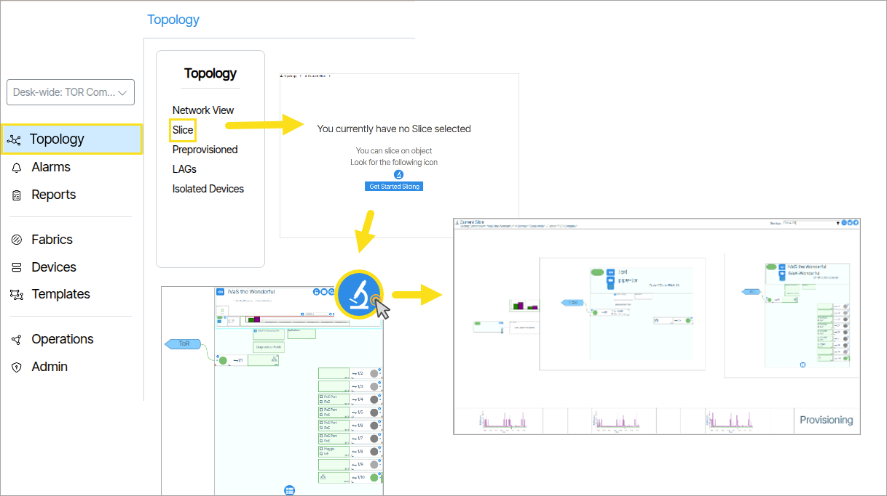
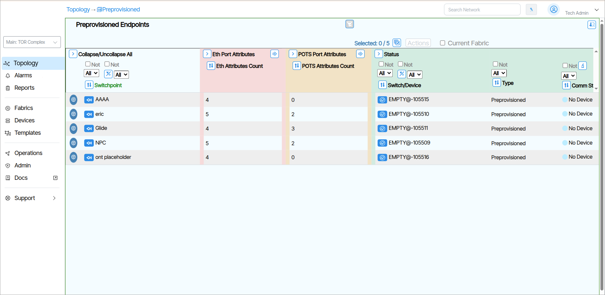

# [Topology](/topology-overview)

On L2 Edge systems **Topology** contains links to: 

- [Network View](/network-view)
- [Slice](/campus/campus-topology/#slice)
- [Preprovisioned](/campus/campus-topology/#preprovisioned)
- [LAGs](/campus/campus-topology/#lags)
- Isolated Devices

## Slice

Slice view is a troubleshooting tool that displays the end-to-end view of services being delivered to the
ports on the service Endpoint device. It shows the connectivity between all the network components used as well
as the relevant provisioning objects to deliver the service. Zooming into the various components gives you more
detail about that component. Optical levels are displayed for the optical connections between devices.
Essentially, if there is a problem delivering a service to an end user port, the information leading to the disruption
is in this single pane. MAC workbench and system logs can be interrogated directly from the slice view focusing
on activity relevant to the devices in the slice.

## Preprovisioned

Opens a report that lists preprovisioned ONTs.

## LAGS

LAG is an acronym for Link Aggregation Group. Link aggregation is a popular method for grouping multiple ethernet connections into a single logical link.  

More information: [LAGS](/link-aggregation)

## Isolated Devices
This report list devices not connected to the fabric. These are ONTs that are managed but are not connected to any TOR through present or past connections.

More information: [Topology](/topology-overview)
