---
hide:
- toc
---

ONT stands for Optical Network Terminal. It is a device used in fiber-to-the-home (FTTH) or fiber-to-the-premises (FTTP) broadband setups. The ONT is located on premises and serves as the endpoint device for the optical fiber connection provided by an Internet Service Provider (ISP).

## How to Preprovision an ONT Endpoint

To preprovision an ONT endpoint follow these steps. 

### From Fabrics
1. Go to Fabrics and select the desired Fabric. 
2. Select **Isolated ONTS**. 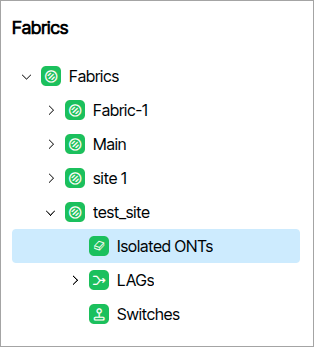{:class="pop"} Click the **Add Preprovisioned ONT**.{:class="pop"}
3. Complete the form that appears.
4. **Isolated ONTs** displays the preprovisioned ONT as a child. 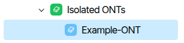{:class="pop"}

### From Views

1. Go to the pre provisioned section from **Operations/Views**.
2. Click the **Add Preprovisioned ONT**.
3. Complete the form that appears.
4. Double click the tile titled **All Preprovisioned**. The device now appears in a list.

## How to Create a Bundle
A **Bundle** is a group of settings used to configure, program and set the state of a switch or ONT. A GUI instance can have many bundles (hundreds) each for a different switch. Ideally, you will have one bundle for many ONT's. Bundle assignment is part of the provisioning process and all devices require an assigned Bundle. The following bullet points describes the relationship between settings and a **Bundle**.

* A collection of VLAN settings compose a Service.
* A collection of Services compose an Eth-Port Profile.
* A collection of Eth-Port Profiles compose a Bundle.
* A Bundle is a collection of settings transmitted to different Endpoints.

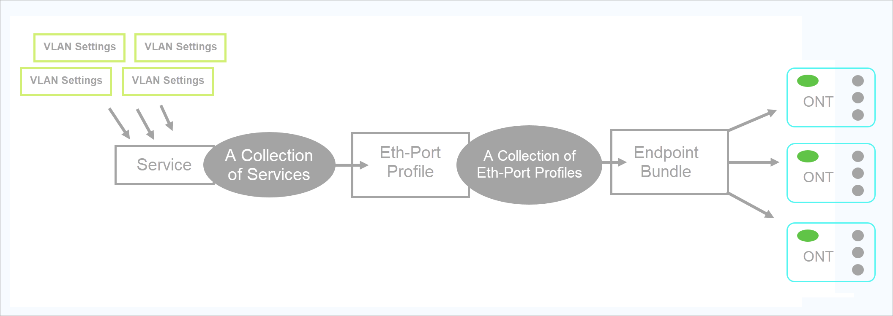

1. Go to **Templates/Shared Bundles** and click **Add Endpoint Bundle**.  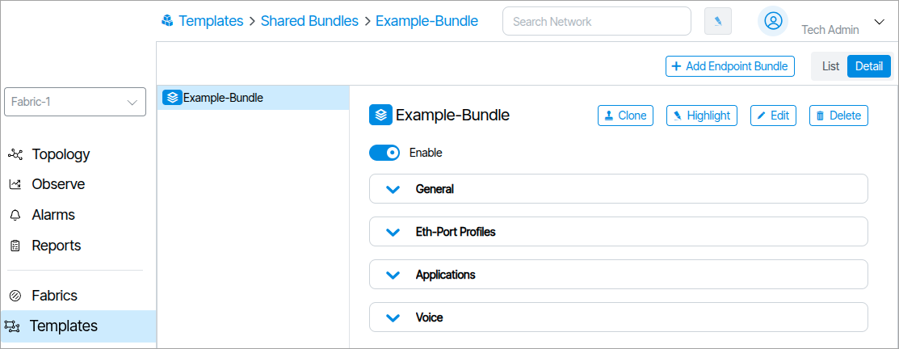{:class="pop"}
2. Type a name in the form field and click **Add Endpoint Bundle**.
3. Configure the desired settings.
4. Toggle the **Enable** switch to the "On" setting.

 

## How to Assign a Bundle to an ONT

To assign a Bundle to an ONT select it from the **Connected Bundle** form as shown in the following image:

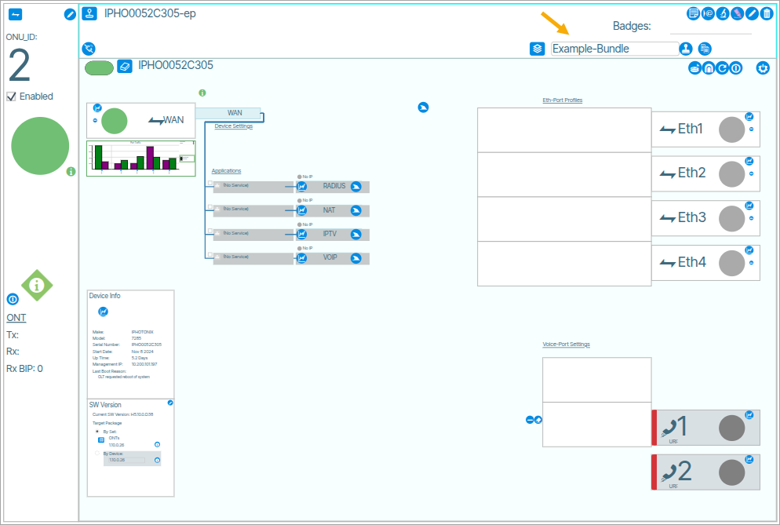

## Drawing of Video Applications

This feature displays the provisioning of the video application on a device port.

Under **Applications** there is an option for **RF Video**. A line connects that box to the **RF Video Port**. The **RF Video** field is static and cannot be edited.

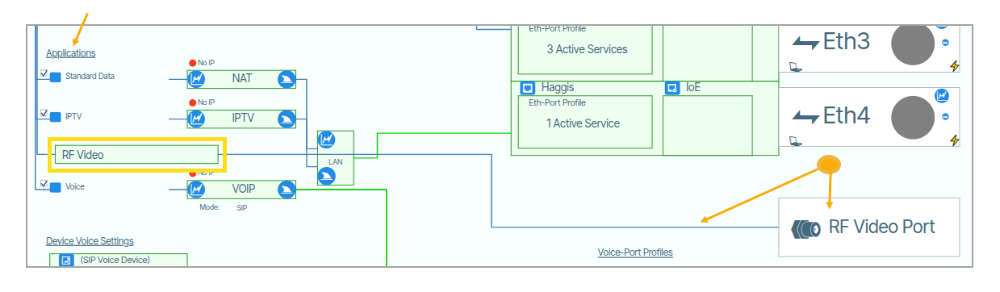

If the **MOCA Eth-Port** or **RF Video** is present, there will be an additional line connecting the device.

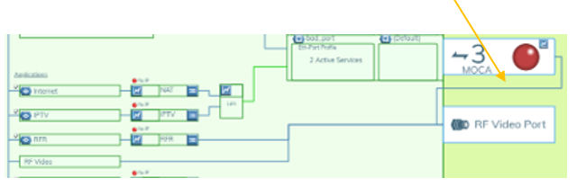

In pre-provisioned endpoints, you check the boxes shown below to display the **Application** or the **MOCA Eth-Port**.

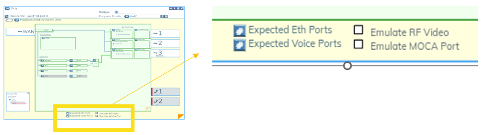

## How to Packet Capture ONT VLAN Data

From **Topology/Network View**, zoom in on an ONT port and click the shark fin icon.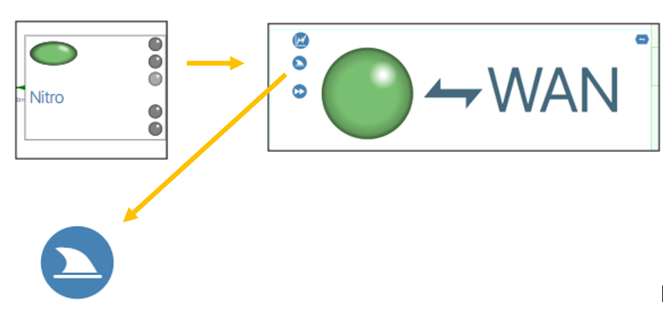{: class="pop"}. A form field will appear. To begin the packet capture fill out the field and press the **Start** button.

### Form Fields

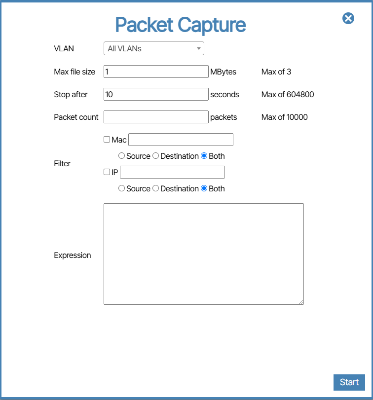

#### VLAN

#### Max File Size, Stop after and Packet Count
When initiating a Packet Capture, the packet capture process will conclude based on the first completion among these three settings.

#### Max File Size
If the file size exceeds this value before the Stop After time limit completes, or the Packet Count is reached then the packet capture stops.

#### Stop after
If the Max file size is not reached and the Packet Count is not reached then the packet capture will stop after the number of seconds set in this field.

#### Packet count
This is the number of Packets recorded. This is viewable in Wireshark. In the packet capture image below, the Packet Count is set to 10. The result is 10 packets captured.

#### Filter

##### Mac
This field lets you capture packets of a select device based on its Mac Address. The settings Source, Destination and Either determine the packets to capture based on incoming or outgoing packets.

##### IP
This field lets you capture the packets of a select device based on its IP address. The settings Source, Destination and Either determine the packets to capture based on incoming or outgoing packets.

##### Expression
Regular Expression syntax is used here to filter select data.

## Voice-Port Profiles

Voice-Port Profiles are *port specific* voice features and settings.

## Device Voice Settings

Device Voice Settings are the settings used for configuring the VOIP stack on the ONT.

## Aggregation Switch to Endpoints

Note that three stripes in an Aggregation Switch port box indicate that the port is a “point to multi-point” connection (eg. PON).

### Endpoint on Aggregation Switch support point-multipoint connections

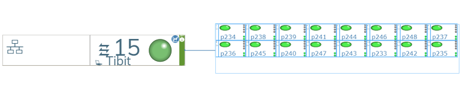

## Preprovisioned Endpoints

Preprovisioned Endpoints is a Report that lists endpoints whose corresponding devices have not yet been identified.

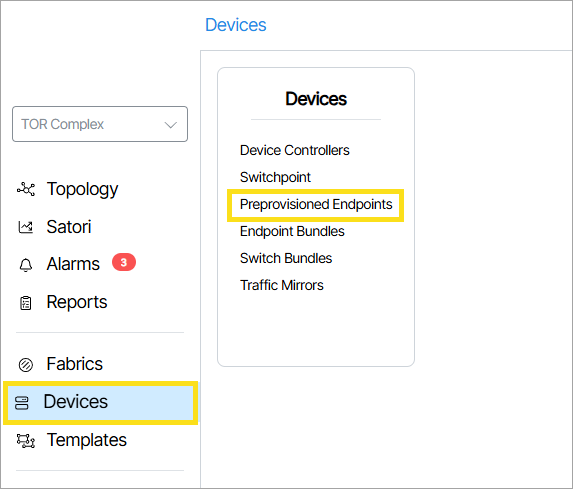

## Create Redundant Path to ONTs 

OLAG stands for ONT-LAG and is the naming convention used for this type of redundant configuration.

To reliably initiate the OLAG feature a custom ONT vendor config file is required. Please contact Beyond Edge. 

To configure a redundant path to an ONT you must first enable the Provisioning of OLAG Ports feature flag. To do so, go to the following window and enable the checkbox.  

**Admin/Network/Feature Flags/Provisioning of OLAG Ports**

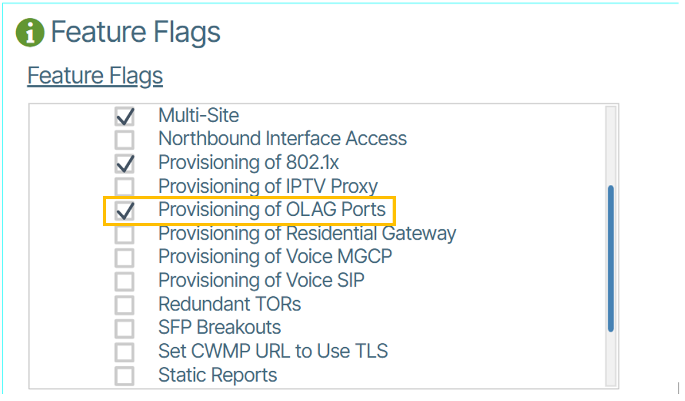

### Setup Physical Hardware
To complete this part of the configuration you need: 

* A pair of redundantly configured switches. 
* ONT 
* Joiner

### Verify Connection
In the software, make sure the linked port is marked OLAG Ready otherwise the ONT will lose communication.

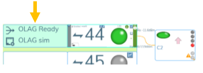

