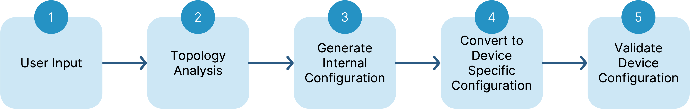

# Debug Information

## Snapshot files

For most problems, BE Networks can diagnose and provide corrects to software from snapshot files provided by the system user when issues occur. Snapshot files exist for the vNETc, UI and all VNFs (Virtual Network Functions). For all problems reported to BE, it is recommended that the vNETC snapshot and the snapshot from the affected component are included in the ticket. The vNETC snapshot contains sections for both the internal processes as well as a UI snapshot. The system gives you the option of various size files. The default is recommended unless you are trying to capture an event that may have occurred several days in the past.

### VNFs and scope of the information from their snapshots

1. Device Controllers - the Device controller snapshots are retrievable from the top section of the switches in the Topology View of the UI, or within the Device Controller object within the VNF section. For most provisioning or device related issues, it is recommended that the ticket includes the vNETC snapshot as well as the snapshot of the affected device controller(s).
1. GAIA - provides a memory resident UI client for caching status and reporting information. In the event that the UI is displaying erroneous status, GAIA snapshot should be provided along with the vNETC.
1. SDLC - the SDLC is responsible for creation and monitoring of the VNFs inside of Verify. The snapshot contains information regarding the provisioning of the VNFs from the VNETC and the processes that create and monitor the VNFs. 
1. ACS - the ACS is the primary communications interface between the vNETC and all devices controllers. Any simultaneous communications issues between the vNETC and devices controllers and other VNFs would necessitate including an ACS snapshot. 

## Provisioning Problems

The main function of Verity orchestration is to translate the user's intent into switch configurations. This is done through several stages of datamodel and protocol translations. In the event that the intended configuration does not end up properly on the physical device or if the device shows a provisioning failure (entire switch is red) there are various tools available to debug the issue through the Verity components. 

To summarize the process, Verity software consumes the users's intent from the managed objects exposed to the user in the UI and on the Northbound Interface APIs. It combines this information with network topology retrieved from the managed devices in order to generate device configurations that are passed between the vNETC and the Device Controllers. The Device Controllers, in turn, translate Verity's internal data model to the protocol supported by the switch. Examples of these protocols include SNMP, gNMI, NETCONF as well as simple CLI commands in some cases.

## Provisioning Flow

1. User Input -->
1. Topology Analysis -->
1. Generate Internal Configuration -->
1. Convert to Device Specific Configuration -->
1. Validate Device Configuration -->

Verity automatically detects events related to user input and topology changes and all actions in the flow should be automatic. Events are passed between processes to make this automation seamless. There are cases during heavy management traffic floods, or in the case of software bugs that the automatic update events are lost. The user can view the current configuration state of the various steps in the flow as well as interrogate the managed switch directly.

### The current configuration of the system is viewable at the various stages of the provisioning flow

1. UI displays managed objects as provisioned by the user in the various sections of provisioning templates
1. The switch has a drop down menu on the map that you can click to see the various configurations
    1. "Running Config" shows the internal Verity Model as built by Bizd and sent to the switch controller
    1. "Target running" shows the last uploaded config from the physical device to the device controller
    1. "Target Pending" shows what changes are planned when the switch is removed from read only mode
1. The physical switch is accessed directly and shows its running configuration

## Manual Resynchronization

### There are five manual resynchronization points available for the provisioning flow in the event that the configurations at the various stages appear to be out of synchronization. 
1. Two related to topology calculations (step 2 above) referred to as "Topo Connections" and "Topo Switch Trees" in the vNETC Commander section of the VNF Pane
1. Internal configuration calculation referred to as "Bizd" in the same VNF section
1. Force vNETC to Device Controller Resync (circular arrow on the Switch in the UI network view)
1. Force the Device Controller to resynch with the physical switch (from the current switch configuration button on the switch, there is a circular arrow as well)
 
Generally speaking, if any of the manual resynchronization attempts cause an update or correction to the subsequent steps in the flow, an issue should be raised to BE Networks. Snapshots for the vNetC and the affected switch/device controller should be provided.