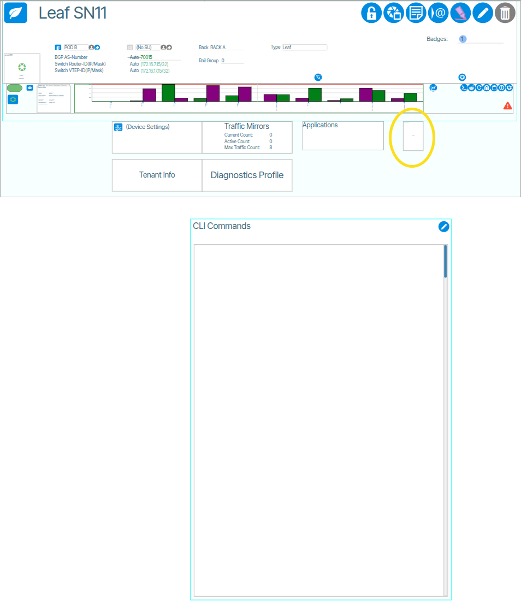
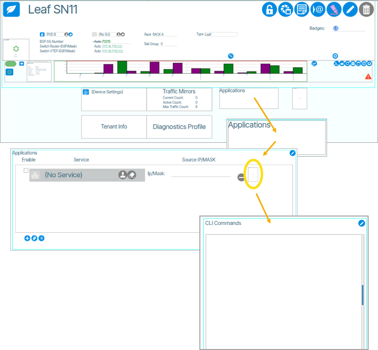
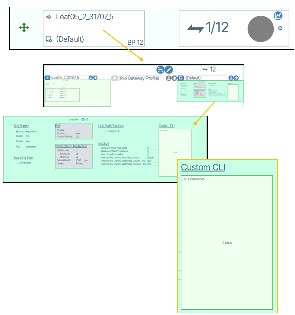
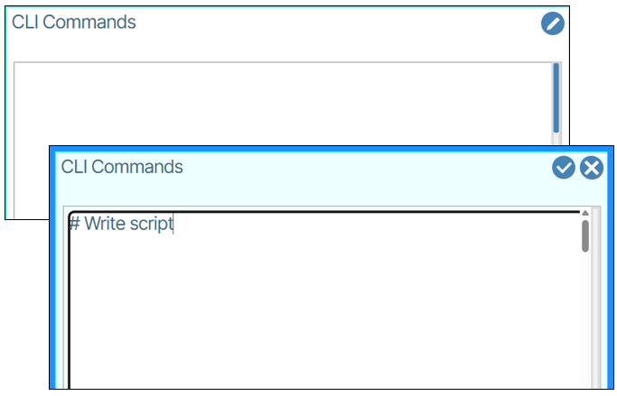

---
hide:
- toc
---
# Device CLI

There are three CLI command interfaces, each designed for inputting commands into the switch. Each interface impacts the device in a distinct manner.

- **Global/Switch Wide**: Commands are applied once at the global configuration level of the switch ({: class="pop"}).
- **Service/Application**: Commands are applied against the corresponding vlan at the vlan interface level ({: class="pop"}).
- **Port Settings**: Commands are applied at the interface level ({: class="pop"}).

To write commands, click the edit ({:class="btn"}) button and type your commands. Clicking the save button ({:class="btn"}) transmits the commands.

!!! Warning 

      **When Submitting CLI Commands:**

    - Commands are not checked for syntax and are submitted exactly as entered.

    - Commands are reapplied whenever the text is changed or when the controller reconnects to the switch.

    - The commands are not compared to the running configuration, so they will appear in pending changes until they are first applied by the controller.

    - Changing of any parameters controlled by Verity may be immediately reverted by the controller.

## Target Specific CLI Information:

- **Dell/Broadcom SONiC**: Uses sonic-cli and starts at the global configuration mode.
- **Edgecore SONiC**: Commands are executed at the Linux shell level. Please note that only the Global CLI text is supported.
- **Cisco**: Commands are at the global configuration level.