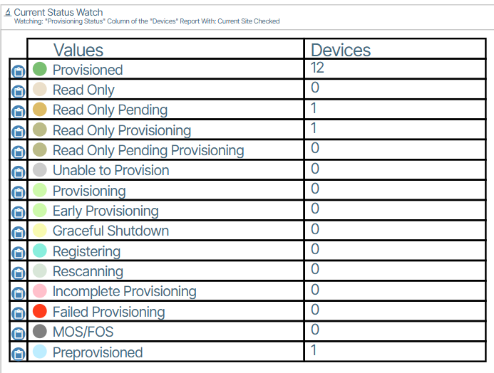

---
hide:
- toc
---

# Device Status Colors

Various colors are used to represent different provisioning states of network switches. Each state is paired with a specific color code (hex value).

!!! Message

      **Device Status** is displayed in **Reports/Report Slice**  {: class="pop"} 

| Status | Color |
|-|-|
|**Provisioned**|(Green / #79bf71) {: class="btn pop" style="border-width:1px; border-color:grey;"}|
|**Read Only**| (Beige / #ebdfca) {: class="btn pop" style="border-width:1px; border-color:grey;"}|
|**Read Only Pending**|(Brown-Orange / #ddbb66) {: class="btn pop" style="border-width:1px; border-color:grey;"}|
|**Read Only Provisioning**|(Light Brown / #bbbb88) {: class="btn pop" style="border-width:1px; border-color:grey;"}|
|**Unable to Provision**|(Grey / #cccccc ) {: class="btn pop" style="border-width:1px; border-color:grey;"}|
|**Provisioning**|(Green / #cdf9aa  ) {: class="btn pop" style="border-width:1px; border-color:grey;"}|
|**Graceful Shutdown**|(Yellow /  #f8fab1   ) {: class="btn pop" style="border-width:1px; border-color:grey;"}|
|**Registering**|(Teal / #8edddd    ) {: class="btn pop" style="border-width:1px; border-color:grey;"}|
|**Rescanning**|(Gray/#d8e6d8)  {: class="btn pop" style="border-width:1px; border-color:grey;"}|
|**Incomplete Provisioning**|(Pink / #ffc0cb) {: class="btn pop" style="border-width:1px; border-color:grey;"}|
|**Failed Provisioning**|(Red / #ff3d1d) {: class="btn pop" style="border-width:1px; border-color:grey;"}|
|**Maintenance Out of Service (MOS) / Forced out of Service (FOS)**|(Gray /#808080) {: class="btn pop" style="border-width:1px; border-color:grey;"}|
|**Preprovisioned**|(Teal / #bdedff) {: class="btn pop" style="border-width:1px; border-color:grey;"}|