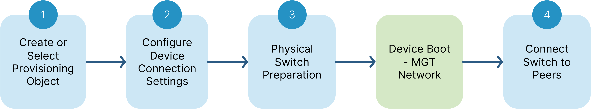
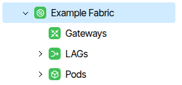
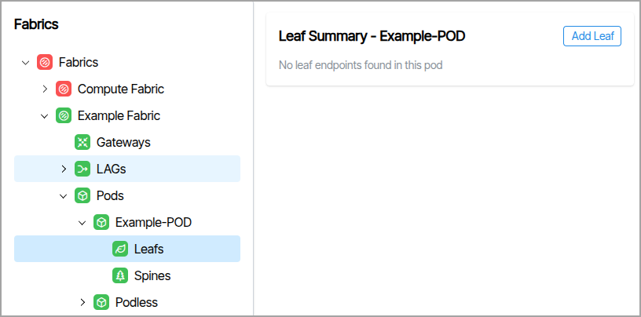
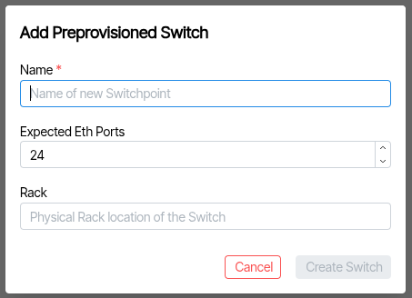
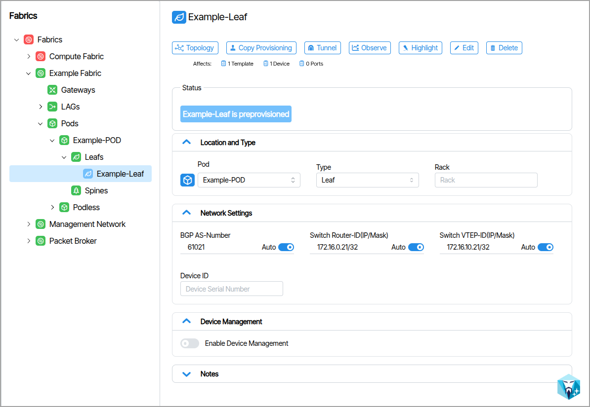
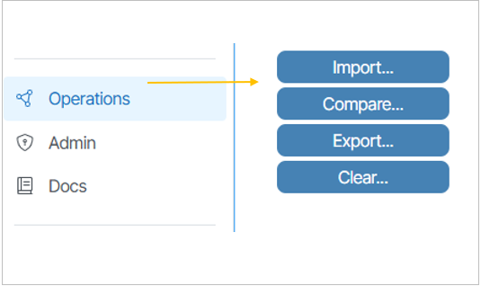
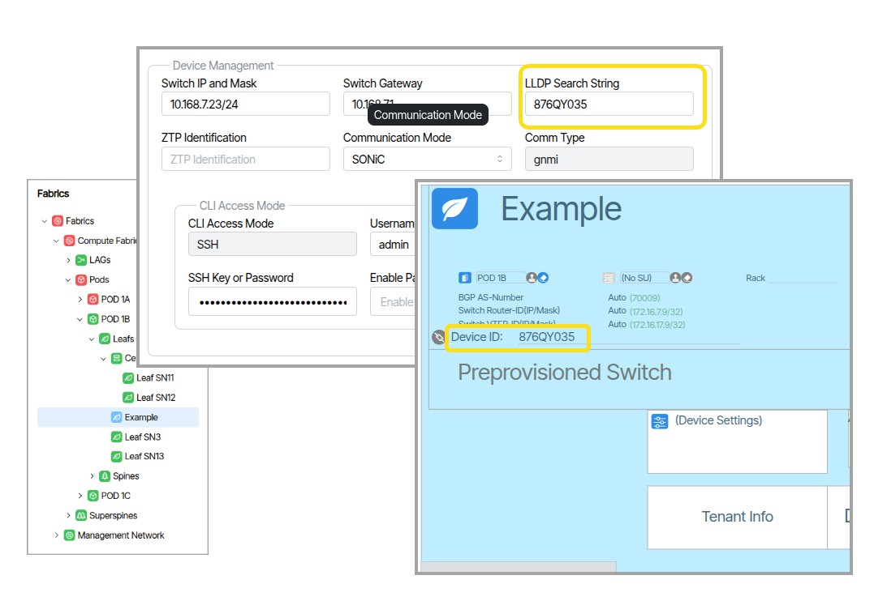
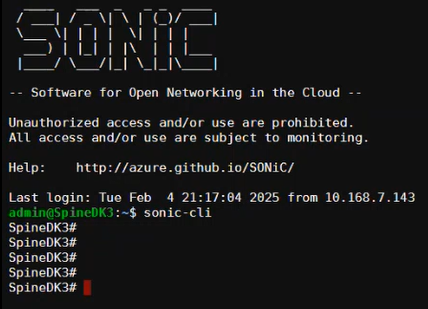

# Device Management 
This section explains how to onboard devices to a Verity system. The most efficient approach for creating the system initially is to use the bulk configuration method via a system initialization file. However, devices can also be onboarded individually through the Verity UI.

## Adding Individual Devices

!!! Note

    This section describes how to manually add devices to the system. To add devices in bulk  please see the section titled [Onboarding Devices in Bulk](adding-devices.md)

Adding a new spine or leaf device is a multi-step process described by the following steps:

1. Create or select the provisioning object.
1. Configure the **Device Management Connection** settings.
1. Prepare the physical switch.
1. Boot the device.
1. Connect the switch to the peers.

## Device Object Creation
Preprovisioning the device object enables setup of the device before the hardware arrives. 

1. From the main menu go to **Fabrics** and select the fabric where you wish to add a device. If no fabric exists, [*you must first create it*](fabrics.md/#how-to-create-a-fabric).
1. The type of Fabric you select determines which object types appear in the tree. In the image below, the **Example Fabric** uses the **Data Center 3 Stage Clos** type. This Fabric exposes three objects — **Gateways**, **LAGs**, and **Pods** — each represented by a collapsible tree node.

1. The Pod object can contain Leaf and Spine devices. To create a Pod, select the **Pods** tree node, click **Add Pod**, and enter a name.

### Adding Leaf or Spine Devices

* After creating a POD, select either **Leafs** or **Spines** (depending on the device you want to create) and click the Add Leaf/Add Spine button in the upper right corner of the screen. 

The prompt will include additional parameters to the name including the number of expected eth ports.

The object appears blue to indicate pre-provisioned status; selecting it displays the device parameters.

  

## Device Management
Device Management is used to create the interface between the Verity application and the switch. Based on the LLDP capabilities of the switch, it can be automatically discovered in the network topology, or it can be statically located. For systems containing many devices, the configuration settings in Device Management can be imported/exported from the Import/Export tool bench available from **Operations / Import/Export** {: class="pop"}

### Configure Device Management Settings
1. Go to **Fabrics** and select the device. Navigate to the section titled **Device Management**.
1. Enter the **LLDP Search String**. This value must be either the chassis ID or the serial number of the managed device. This value serves as a hardware identifier and is used to detect connections between managed devices. Later, this value will auto-populate in the pre-provisioned Device ID when the entries to the Device Management settings are saved.
1. Enter the Switch IP, Mask and Gateway.
1. **Enable** the Device Management settings and save the changes.
1. **Verify the Hardware Identifier**. The Device Management LLDP Search String should appear on the provisioning object in the **Device ID** field. ({: class="pop"})

!!! note "How Switch Hostnames are provisioned"

    

    The Device Management settings for each switch includes both an LLDP Search String and a ZTP Identifier field. How these fields are populated determines how the hostname is assigned to the device. The hostname can be the set to the switchpoint name or to a hardware identifier (serial number or chassis ID).

    * If only the LLDP Search String is entered and the ZTP Identifier is left blank, Verity uses the LLDP Search String to create ZTP files, set the hostname and identify the device during network topology discovery.
    * If both fields are filled with different values, the ZTP Identifier is used to create ZTP files, the LLDP chassis ID is used to identify the device during network topology discovery, and the hostname is set to the switchpoint name.

## Switch Preparation

!!! warning "New Devices Starting Point"

    It is required that all SONiC devices being onboarded into Verity start in ONIE mode with no OS installed. This ensures that the device receives its load from the Partner Firmware Package installed on Verity and runs through the ZTP process. (If the current switch is running OS10 with DHCP enabled, OS10 is automatically removed when using DHCP options set up according to this documentation.)

!!! warning "Reusing Devices"

    If devices have previously been used by other network management systems, it is essential that you completely "zero" the switch with the following commands:

    sudo ZTP erase -y
    sudo ZTP enable
    sudo ZTP run -y

## Device ZTP
Verity’s ZTP feature is a way to remotely set up switches without having to manually configure them on a hop-by-hop basis. The process consists of two steps: ONIE Boot process and ZTP Provisioning portion.

The ONIE process starts when a switch boots up from the factory without a SONiC image and it connects to a remote server to download the necessary software image. The actual ZTP process starts with a switch that has SONiC loaded and a default configuration. The verity system creates a series of files that are used to prepare the SONiC switch with a minimal configuration to communicate with the Device controllers within Verity. DHCP options on the Verity SDLC server tells the switches the location of the remote server (vNetC) where the required files are stored. The system supports ZTP for both the management and spine/leaf switches.

1. When ready, connect the management port of the new device to the **Out-of-Band Management** network.

## Connect Neighbors

1. To complete the addition of the new device, connect the cabling to the other relevant spine/leaf switches.
1. Go to the **Topology** view and ensure that the neighbor links become operational.
