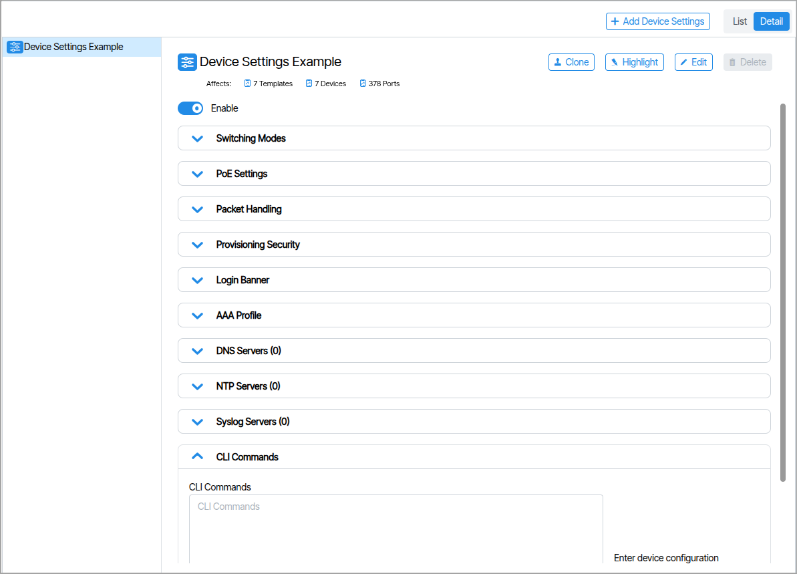
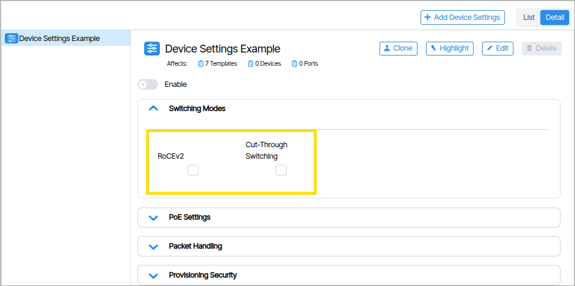

---
hide:
- toc
---

# Systems

## Device Settings

**Device Settings** are a set of parameters associated with a physical device.

### RoCEv2 and Cut-Through Switching

**Device Settings** includes settings under the **Network Configuration** field: **RoCEv2** and **Cut-Through Switching**. These options can be enabled or disabled via checkbox selection. Only one of the two selections can be enabled at a time; attempting to enable both items will result in a validation error. Both options can be disabled without triggering a validation error.

#### Power over Ethernet Settings 

| Setting Name | Function |
| - | - |
| **Mode** | Automatic or Manual |
| **External Battery Power Available (watts)** | When the device is connected to an external battery backup, this is the maximum amount of power that the device should use to power PoE devices.  This can be used to force low priority ports off when power is lost to preserve battery for higher priority ports. |
| **External Power Available** | Enter the power capability of the power supply powering the device. |
| **Usage Threshold** | Percent for comparing the currently consumed power to the allocated power. If the percentage of consumed power over allocated power is over the usage threshold, a fault condition is reported and logged. |

#### Provisioning Security Settings
This functionality encompasses security audit interval configurations that are individually applied to each switch.

| Setting Name | Function |
| - | - |
| **Security Audit Interval** | Frequency, in minutes, of rereading the switch running configuration and comparing it to expected values. If the value is blank, the audit will use the default switch settings. If the value is 0, the audit will be turned off. |
| **Commit to Flash Interval** | Frequency, in minutes, to write the switch configuration to flash. If the value is blank, the commit will use the default switch settings. If the value is 0, the commit will be turned off.|

### AAA Profile 
**The AAA Profile** field accepts a **Device AAA Profile**. Assign a Device AAA Profile to configure AAA settings for this device.

## TACACS Profiles

A **TACACS Profile** defines the connection parameters for a TACACS+ authentication server, including the server address, shared secret, port, and timeout values. Device AAA Profiles reference it to authenticate and authorize administrative access to network devices.

## LDAP Profile

Configure reusable LDAP and authentication and directory profiles.

## Device AAA Profile

A **Device AAA Profile** defines the authentication, authorization, and accounting policy applied to a network device. It references a TACACS Profile to determine which TACACS+ server handles credential verification, and assigns that policy to one or more devices.