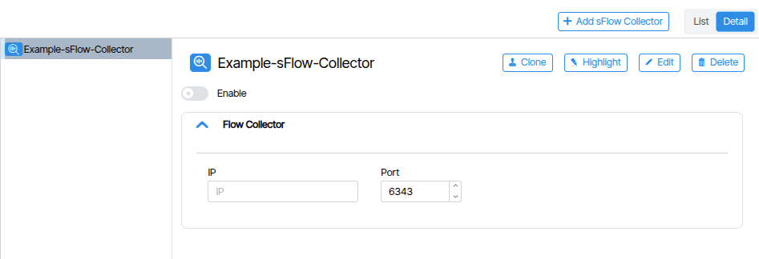
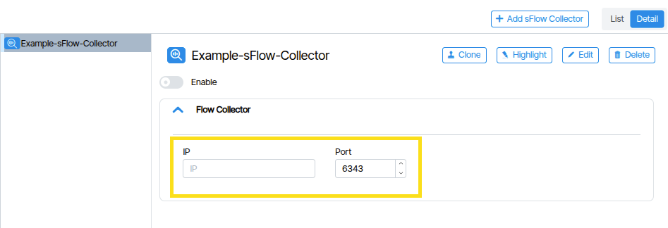
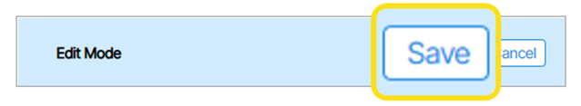
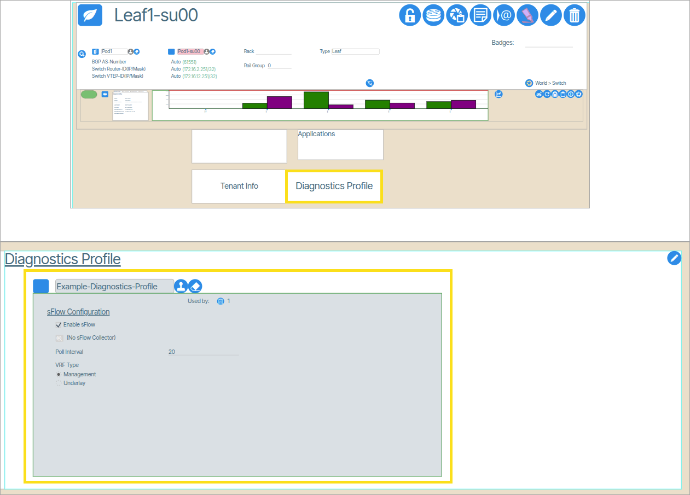
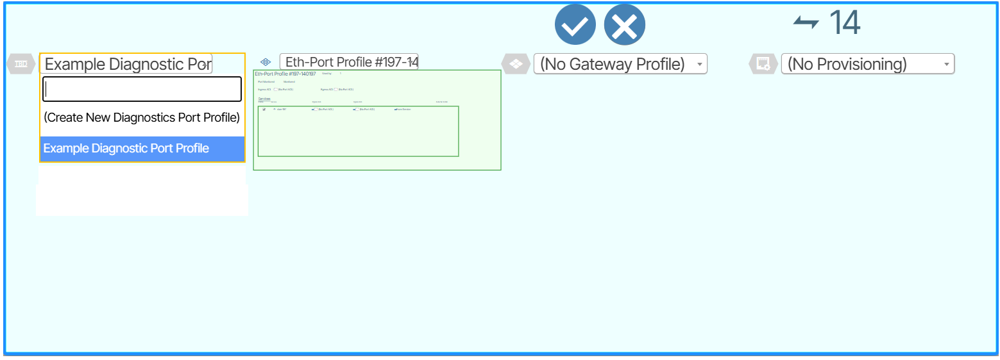

# Diagnostics

## Diagnostics Profiles

**Diagnostics Profiles** are device level templates that enable and configure sFlow monitoring on network switches, including settings for collectors, polling intervals, and VRF types.

## Diagnostics Port Profiles

 **Diagnostics Port Profiles** are port level templates that control which individual switch ports send sFlow traffic data to the configured collectors.

## sFlow 

**sFlow** is a configurable feature in Dell Enterprise SONiC that enables administrators to monitor network traffic using flow based sampling. 

!!! Feature Availability

    This feature is only available for systems devices running [Dell Enterprise SONiC OS](https://www.dell.com/support/kbdoc/en-us/000218295/dell-networking-sonic-sflow-configuration).

### Enable sFlow Exports

**Step 1: Configure sFlow Collector(s)**

1. Double-click **Templates**.
1. Click **sFlow Collectors**. 
1. Click the **Add sFlow Collector** button to create a new sFlow Collector.
1. Enter the collector **name**, then click **Create SFlow Collector**.   ({: class="pop"})
1. Set:
    1. **Flow Collector IP Address**
    1. **Port Number** (Default: UDP 6343)
        
1. Toggle the **Enable** switch to enable the object.
2. Click **Save** ({: class="pop"}) in the **Edit Mode** prompt.

**Step 2: Assign Collector to a Diagnostic Profile**

1.  Double-click **Templates** and click **Diagnostic Profiles**.  
1.  Click the **Add Diagnostics Profile** button to create a new Diagnostic Profile. 
1.  In the pop-up window type a name and click **Add Diagnostics Profile**.
1.  In the parameters window, configure the following parameters:
    1. **Enable**: Toggles the Diagnostic Profile on/off (set it to *enabled*).
    1. **Enable sFlow**: Enables sFlow for this profile (set it to *enabled*).
    1. **Collector**: Select the desired sFlow Collector (set it to the Collector you created in the previous steps)
    1. **Poll Interval**: Interval (in seconds) for traffic sampling or counters. Range: 5–300 (default: 20).
    1. **VRF Type**: Choose **Management** or **Underlay**, depending on your network architecture. 

**Step 3: Assign the Diagnostic Profile to Device(s)**

1.  In **Topology** from **Network View**, select the switch you want to monitor. 
1.  Double-click the switch to zoom in.
1.  At the top of the device double-click the **Diagnostic Profile** window, assign the appropriate Diagnostic Profile (the one linked to your sFlow Collector). {: class="pop"} 

**Step 4: Configure Ports to Send Data to Collector(s)**

1.  Double-click **Templates** and click **Diagnostic Port Profiles**   
1.  Enable the **Diagnostic Port Profile** and Enable **sFlow** .
1.  Navigate to the switch port(s) connected to your monitored device or collection path and double-click (or zoom in) on it.
1.  Double-click the port's endpoint to open configuration options.
1.  In the **Diagnostic Port Profile** menu assign the appropriate **Diagnostic Profile** to the port. {: class="pop"} 

## PB Egress Profiles

**PB Egress Profiles** are groups of filters applied to Packet Broker egress connections.

