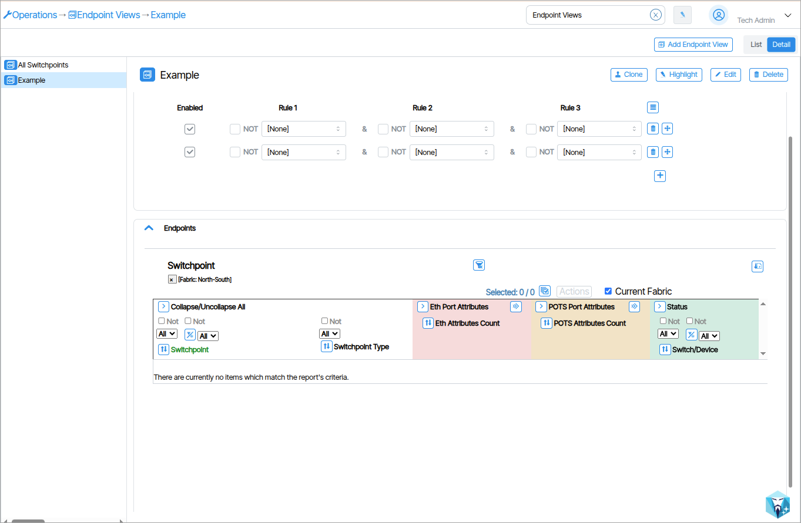

# Endpoint Views 

**Endpoint Views** provide graph and table presentations of all Switchpoint data. The information includes comm and provisioning status. All Switchpoints appear by default. Administrators can also create custom Views that group together selected Switchpoints.

