**Fabrics** are isolated, self-contained arrangements of network interconnections that form a topology, including the switches, links, and logical structure.

The **Fabrics** window gives administrators an overview of each Fabric that the Verity instance references. Verity displays the objects in a collapsible tree view.

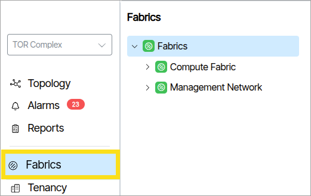

## Colors

- The default color for a *disabled* fabric object is grey.  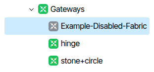{:class="pop"}
- The default color for an enabled working fabric object is green.  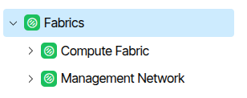{:class="pop"}

### Alarm Colors

When an object triggers an alarm, its icon changes to the alarm's color 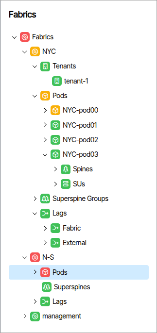{:class="pop"}. The color change cascades up the hierarchy, always reflecting the most severe active alarm at each level. In the image below, the Fabric named Example-Fabric has Leafs triggering a Severe (red) alarm. This notification cascades through the entire hierarchy to the Fabric's parent. In the image below, the Fabric named Super Store is a completely independent Fabric and remains unaffected by the other Fabrics' alarm events.

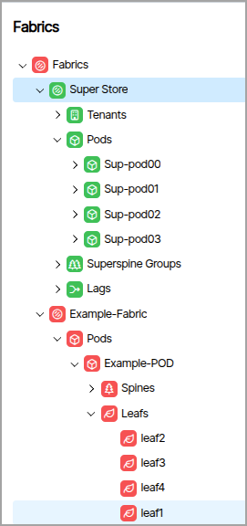

## How to Create a Fabric
To create a Fabric, select the parent Fabric tree object and click the **Add Fabric** button. A form appears requiring a name for the Fabric and a Fabric type. Fill in the fields and click **Add Fabric** (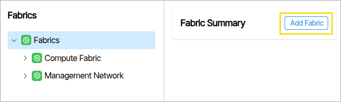{:class="pop"}).

  

The hierarchical object components display differently depending on the fabric type. The tree contains nodes that represent fabrics, categories for switch devices (LAGs, Pods, SuperSpines, Leafs, etc.), and the switch devices themselves.

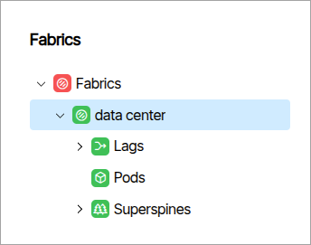

## Fabric Types

**Management**

A switch network providing connectivity to the out-of-band management ports of switches across the other fabrics.

- **Fabrics** 
    - **Management-Example**
        - Switches
_______________________________
**Data Center 3 Stage Clos**

Spine-Leaf network configuration where traffic traverses three switch hops — leaf → spine → leaf — within a single POD.

- **Fabrics** 
    - **Data-Center-3-Example**
        - Lags
        - PODs
        - Super Spines

_______________________________
 **Multiplane**

- **Fabrics** 
    - **Multiplane-Example**
        - Lags
        - PODs
        - Spine Planes

_______________________________
**Packet Broker**

A Packet Broker is a network device placed between network traffic sources and monitoring tools (or other destinations).

- **Fabrics** 
    - **Packet-Broker-Example**
        - Egress
        - Ingress

_______________________________
**Spectrum-X 2 Tier**

NVIDIA Spectrum-X Ethernet networking platform

- **Fabrics** 
    - **Spectrum-X-2-Tier-Example**
        - Spines
        - SUs
_______________________________

**Spectrum-X 3 Tier**

NVIDIA Spectrum-X Ethernet networking platform

- **Fabrics** 
    - **Data-Center-3-Example**
        - PODs
        - Superspine Groups
_______________________________

**Data Center 5 Stage Clos**

Spine-Leaf network configuration traversing five hops — leaf → spine → superspine → spine → leaf — across multiple PODs. Superspines interconnect PODs for non-blocking any-to-any connectivity.

- **Fabrics** 
    - **Data-Center-3-Example**
        - Lags
        - PODs
        - Superspines

## Inspector Window Object Details

The inspector window to the right reveals information and parameters of the selected tree object. 

### Fabric Details

Fabric objects have customizable fields that appear when you click them.

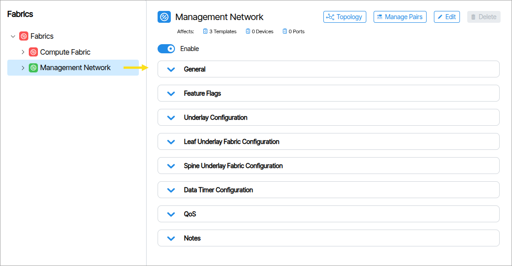

#### Managed Pairs

The **Managed Pairs**  button ({class="pop"}) opens a window that lets you manage and create Switch Pairs, also called Redundancy Pairs 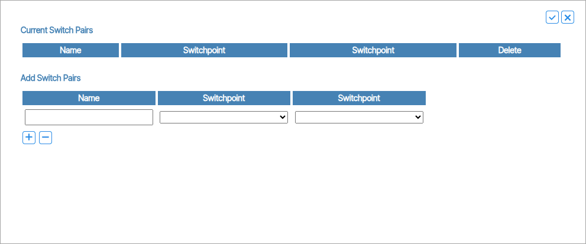{class="pop"}. 

#### General

Fabric Type and other settings including DHCP Snooping.

#### Reserved Ranges
Provisioning reserved ranges specific to the fabric are listed here.
Other Reserved Ranges are available in **Admin** → **System** → **Reserved Ranges**

#### Feature Flags

This section lists additional configuration options including settings to allow underlay connections between Pods, port admin and port status interval values.

#### Underlay Configuration 

Manages fundamental network infrastructure settings, including a shared Anycast MAC address for redundancy and load balancing. It controls how network devices handle address aging and connection restoration, ensuring stable and efficient baseline network communication.

#### Leaf Underlay Fabric Configuration

These settings control how leaf devices establish and maintain BGP connections, including timing for connection checks, routing updates, and connection establishment, ensuring stable and responsive network edge communications.

#### Spine Underlay Fabric Configuration

Defines how spine devices maintain and establish BGP (Border Gateway Protocol) connections. These settings manage network behaviors such as connection keepalive intervals, connection timeout periods, and routing information exchange.

#### Data Timer Configuration

Provides advanced timing controls that optimize connection stability and performance. These settings allow network administrators to fine-tune how devices handle interface state changes, link detection, and MAC address management. By adjusting Link State Timeout, Startup Delay, and MAC Holdtime, users can customize network resilience and reduce unnecessary connection disruptions.

#### QoS

##### DSCP to TC Map

DSCP to TC Map is a translation table that converts quality-of-service markings between two different systems. This feature maps incoming DSCP priority markings (0-63) to internal Traffic Class queues (0-7) to ensure high-priority traffic like voice and video receives proper handling.

Click the Priority numbers below the DSCP numbers (image needed) to choose the range of numbers to set (image needed).

#### Notes

A persistent note writing section for administrators.

## Container Details

Some tree view items exist only to group their children. Clicking these nodes reveals aggregate details about the child objects. The following image shows that the node named **External** contains 2 LAGs and no alarms.

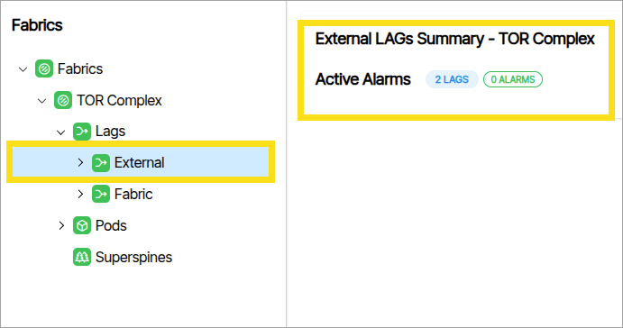

## LAGs (Fabric/External)

You view and manage [LAG parameters](link-aggregation.md) from the Fabrics navigation window. 

### Fabric LAG Parameters

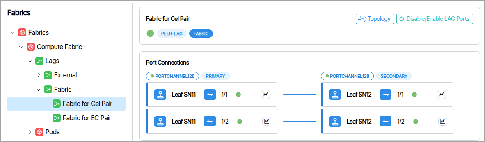

### External LAG Parameters 

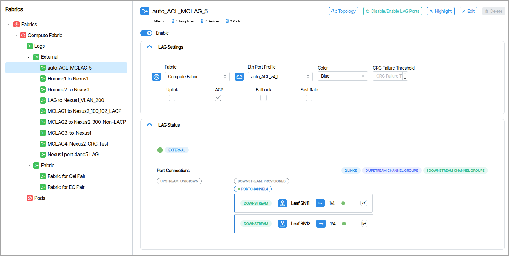

## Switches (Spine,Leafs)

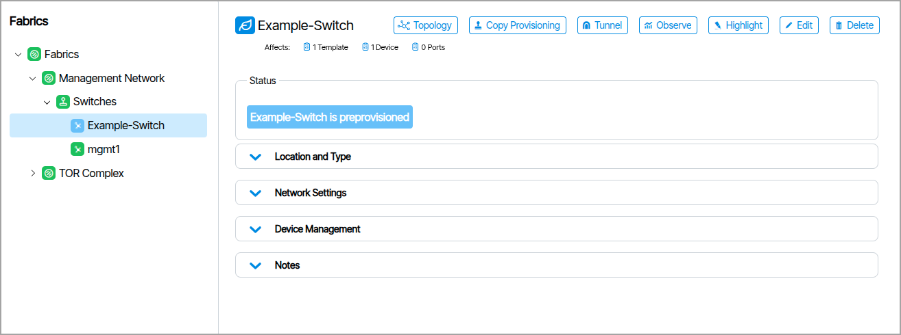

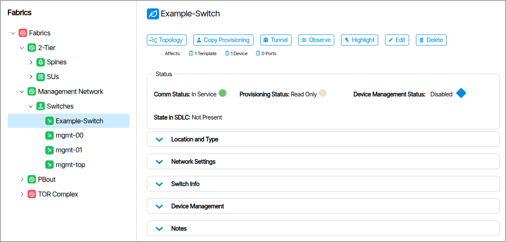

### Status
These indicators provide information about the device state. 

* **Comm Status**: Indicates the overall communication health and connectivity state of the device within the Beyond Edge management system.

* **Provisioning Status**: Indicates the current provisioning state.

* **Device Management Status**: When you enable Device Management parameters, this indicates the connection status.

* **State in SDLC**: Indicates SDLC behavior.

### Location and Type
Type of device (Spine, Leaf, Superspine, Management) , POD and Rack information is listed here.

### Network Settings

Network Settings vary depending on the device type.

### Switch Info
Switch Info displays device hardware details, such as make and model, and basic configuration information, including the current management IP address. This information is also viewable from Topology at the top of Switch (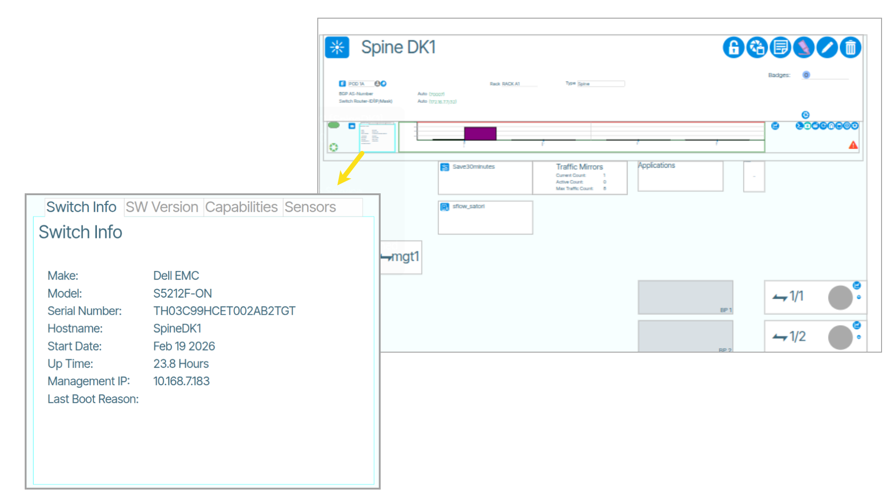{class="pop"}).

### Device Management
Device Management settings are editable and fall under Switchpoint settings. In addition to the parameters in Device Management, Switchpoint settings include all port provisioning of the switch. You can copy these values between devices using the **Copy Provisioning** feature.

## How to Create a Switch Pair From Fabrics

* Determine the target devices. If the target devices do not yet exist, create them before creating a switch pair.
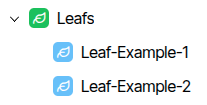

* Select the containing network Fabric.
* In the upper right of the page, click **Manage Pairs**.

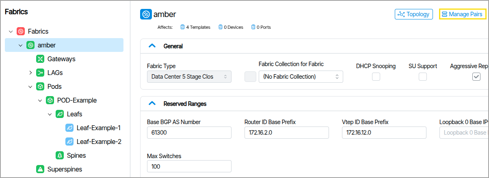

* Enter a name in the **Name** field, then select your devices under the **Switchpoint** fields.

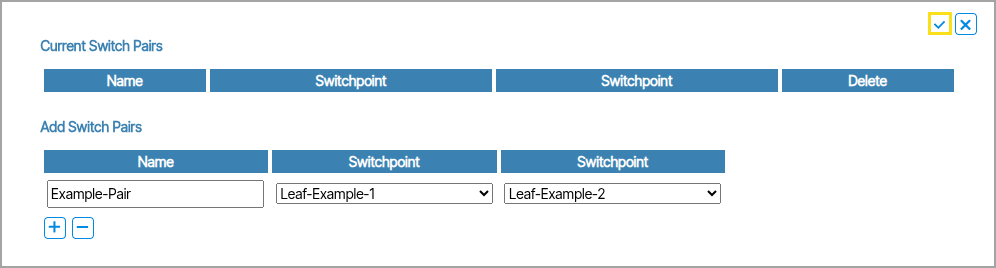

* Make physical connection. The ports must be configured identically and operate at the same speed.

When complete, the Fabrics tree displays the devices as a related pair with the Switch Pair icon.

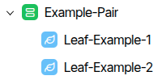

## How to Create a Fabric Gateway

A **Fabric Gateway** represents each end of a planned BGP session between sites. For high availability, four site gateways are needed — one for each end of each session.

1. From **Fabrics**, select the **Fabric**.
2. Select **Gateways**.
3. In the upper right corner, click **Add Gateway**.

Configure each Gateway object with the following:

- The Neighbor AS number of the remote Leaf switch
- The IP address assigned to the Gateway Port Profile on that neighbor's switch
- The **Fabric Interconnect** option enabled

### Gateway Modes🔗
Gateways can be one of several different modes. The Gateway Mode field defines how the software handles and routes traffic within the network. It determines whether routing decisions are based on a statically defined default gateway, static routes, traditional BGP routing, or new enhancements to BGP to support dynamic neighbors.

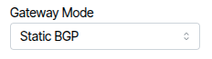

- **Default**: A single static default route.
- **Static**: Uses manually configured static routes, no dynamic routing.
- **Static BGP**: Establishes BGP sessions with manually configured BGP neighbors. The BGP neighbors are explicitly defined by their IP addresses, and no dynamic peer discovery occurs within the subnet.
- **Dynamic BGP**: BGP neighbors are dynamically discovered within a subnet, leading to the creation of multiple BGP sessions from a single tenant gateway object.

