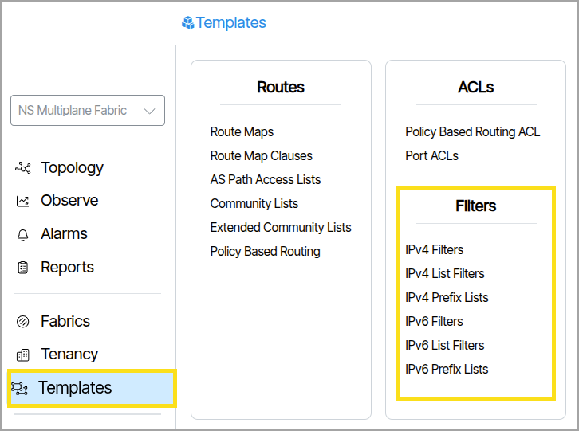
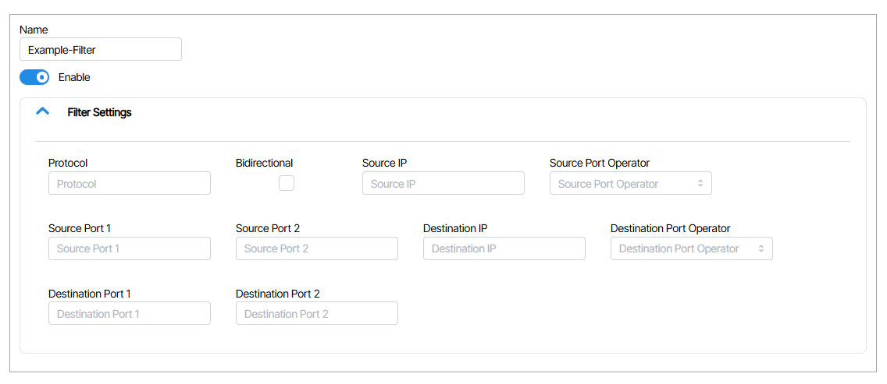
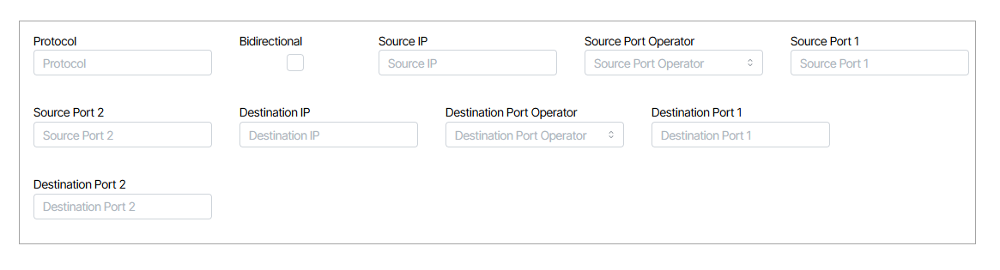
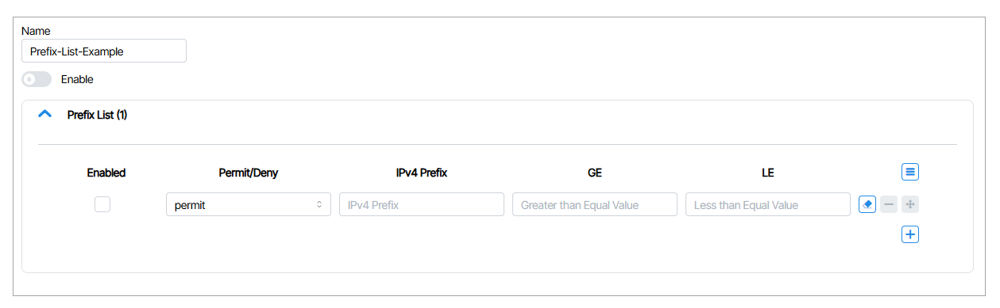
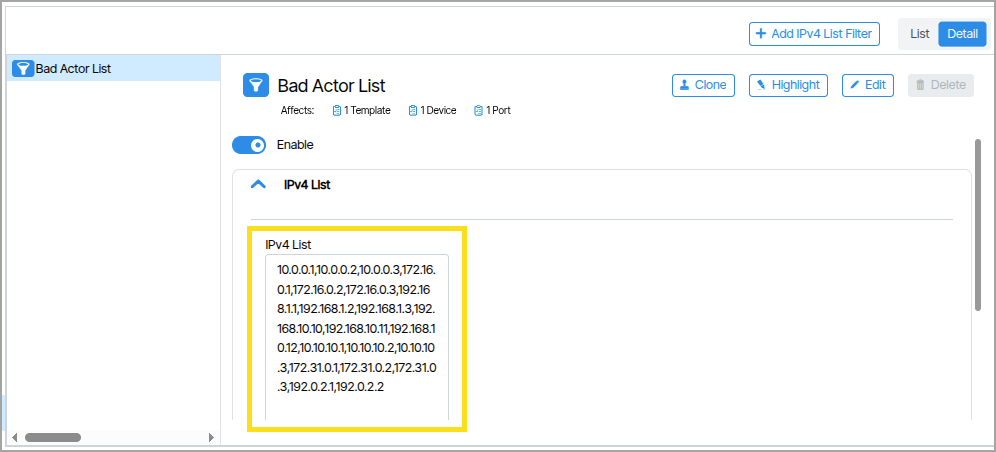

# Filters

This section provides tools that enable administrators to create IP filters controlling network traffic and routing information based on IP address matching. Administrators configure these filters to permit, deny, or process traffic as required, then apply them to other objects throughout the application.

**Filter Types**

- IPv4 Prefix Lists
- IPv6 Prefix Lists
- IPv4 List Filters
- IPv4 Filters
- IPv6 List Filters
- IPv6 Filters

### Create Filters
To create any filter type in the Filters list you follow this process:

1.  Double-click **Templates** and click the desired filter type ({:class="pop"}). 
1.  Click the **Add** button .
1.  Name the filter and click the **Create** button  .     
1.  In the filter settings, edit the rules and click the **Enabled** box to enable the filter ({:class="pop"}).

## IPv4/IPv6 Filters

**Filter Rules**

|Filter|Function|
|-|-|
|**Protocol**|IP protocol by name (ip, tcp, udp, or icmp, only) or IP Protocol by IANI number (0-255).|
|**Bidirectional**|Bidirectional packets if selected, else unidirectional.|
|**Source IP**|IPv4 or IPv6 packet source address.  Use IP mask for range of IPs.|
|**Source Port Operator**|This field determines which match operation will be applied to TCP/UDP port(s). The choices are equal, greater-than, less-than or range.|
|**Source Port 1**|This field is used for equal, greater-than or less-than TCP/UDP port value in match operation. This field is also used for the lower value in the range port match operation.|
|**Source Port 2**|This field will only be used in the range TCP/UDP port value operation to define the top value in the range
|**Destination IP**|IPv4 or IPv6 packet source address. Use IP mask for range of IPs.|
|**Destination Port Operator**|This field determines which match operation will be applied to TCP/UDP ports. The choices are equal, greater-than, less-than or range.|
|**Destination Port 1**|This field is used for equal, greater-than or less-than TCP/UDP port value in match operation. This field is also used for the lower value in the range port match operation.|
|**Destination Port 2**|his field will only be used in the range TCP/UDP port value match operation to define the top value in the range.|

## IPv4/IPv6 Prefix Lists 

A Prefix List is a structured list of IPv4 or IPv6 network prefixes that is used to filter or match the IPv4 or IPv6 addresses. 

## IPv4/IPv6 List Filters
To filter individual IP addresses or lists of individual IP addresses, use an **IPv4 List Filter** or **IPv6 List Filter** and enter the addresses in the provided field. A comma must be used between each IP address. There are no spaces used in the lists.

<!-- Note

Create a linked list to various filter uses in the Documentation such as applying to a service, packet broker etc -->