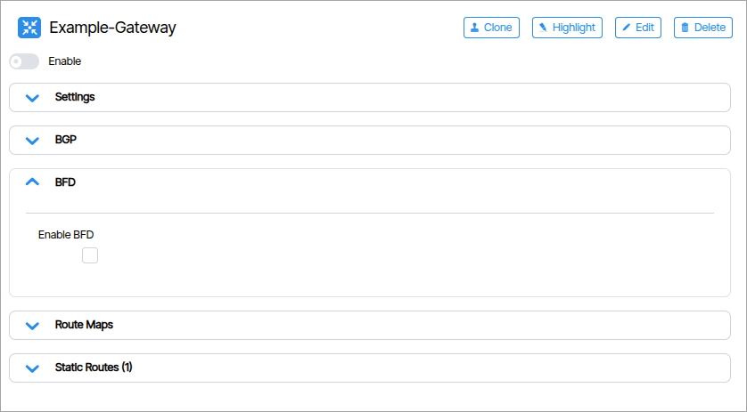
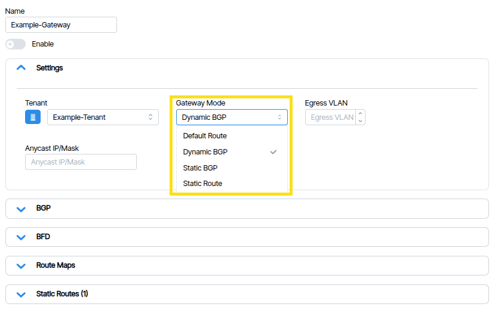
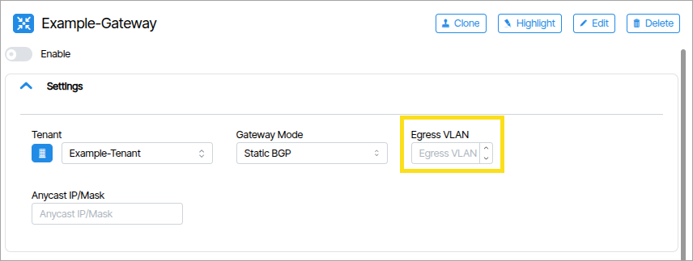
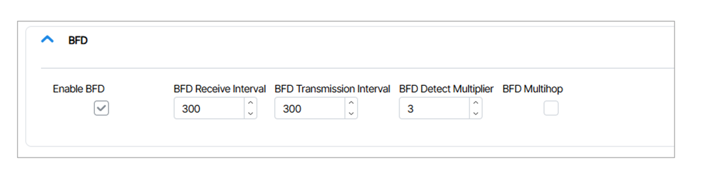
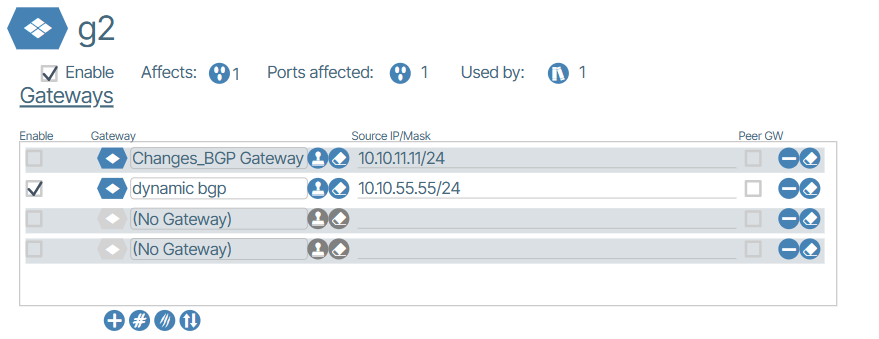

---

title: "Gateways"
description: "Gateway Creation"
tags: [Gateways, Gateway, Gateway Modes, BFD]
search:
boost: 2
parent: Tenancy

hide:
- toc
---
# Gateways
**Gateways** enable traffic flow in and out of a network or tenant to a device external to the Verity managed network. 

## Gateway Modes

Gateways can be one of several different modes. The **Gateway Mode** ({: class="pop"}) field defines how the software handles and routes traffic within the network. It determines whether routing decisions are based on a statically defined default gateway, static routes, traditional BGP routing, or new enhancements to BGP to support dynamic neighbors .

- **Default Route**: A single static default route.
- **Static Route**: Uses manually configured static routes, no dynamic routing.  
- **Static BGP**: Establishes BGP sessions with manually configured BGP neighbors. The BGP neighbors are explicitly defined by their IP addresses, and no dynamic peer discovery occurs within the subnet. The user must specify BGP Neighbor IP address and AS numbers at a minimum. Multi-hop peering is supported. 
- **Dynamic BGP**: BGP neighbors are dynamically discovered within a subnet, leading to the creation of multiple BGP sessions from a single tenant gateway object.
- **IPV6 Unnumbered**: Establish BGP peering over a link without assigning unique IPv6 addresses to the physical interface, using the interface's automatically generated link-local IPv6 address (FE80::/10) as the BGP neighbor address.

## Creating a Gateway

1. From the Main Navigation select Tenancy. Under the Tenants collapsible tree select the desired Tenant and unfold it to reveal the Gateways option beneath it.
1. Select Gateways.
1. Click the **Add Gateway** button.
1. Type a name in the field that appears and click **Add Gateway**.
1. If the Tenant is going to egress from the network on an 802.1q tagged interface, the VLAN should be specified in the **Egress VLAN** field ({: class="pop"}).
1. The Gateway Enable switch defaults to off. Click it to enable the gateway.
1. Click the **Save** button.

### Using Anycast Gateway Interface for Peering

When **Anycast Gateway Mode** is enabled in the Gateway Profile, the **Source IP Address** field in the BGP configuration must be populated. This address is used as the local BGP peering address presented to neighboring routers.

The Anycast Gateway address serves as the default gateway for hosts within the associated subnet. The Source IP Address must be assigned from a different subnet than the Anycast Gateway subnet.

The system automatically creates a loopback interface and assigns the Source IP Address to that loopback. Neighboring routers should use this Source IP Address as the BGP neighbor address when establishing the BGP session.

There should be no IP address assigned to this type of gateway when referenced in a Gateway Profile.

### BFD Configuration (Optional)
**BFD** (Bidirectional Forwarding Detection) is a network protocol used to detect faults in the forwarding path between two routers or network devices. It uses heartbeat-timed messages that are exchanged between devices at regular intervals to monitor the status of the link. {: class="pop"}

- **BFD Receive Interval**: Configure the minimum interval during which the system can receive BFD control packets.
- **BFD Transmission Interval**: Configure the minimum interval during which the system can send BFD control packets.
- **BFD Detect Multiplier**: Configure detection multiplier to determine packet loss.
- **BFD Multihop**:  Enable BFD Multi-Hop for Neighbor. This feature is used to detect failures in the forwarding path between BGP peers.

    In a multi-hop BGP session, there are intermediate switches between the two devices where the session is configured. Instead of the BFD packets traveling directly from switch "A" (where the BGP session originates) to switch "B" (where it terminates), they pass through several intermediate switches along the route.

    Enabling multi-hop BFD is optional, as it depends on the specific requirements of the BGP session. The operator must assess whether sub-second BGP session failure detection is necessary. If such detection is not critical, or if enabling it might result in false positives, it may be better to leave this feature disabled.

## Related Information

[**Gateway Profiles**](layer-3-templates.md#gateway-profiles)

<!-- 
MOVED TO TEMPLATES

### BGP Gateway Profiles
A **BGP Gateway Profile** is a packaging of one or more **BGP Tenant Gateways** that are served by this port.

 -->
