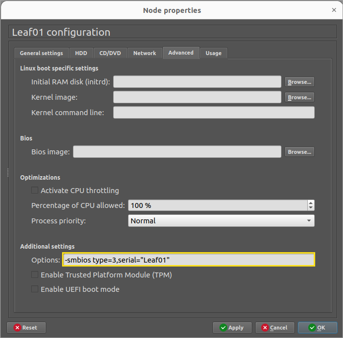
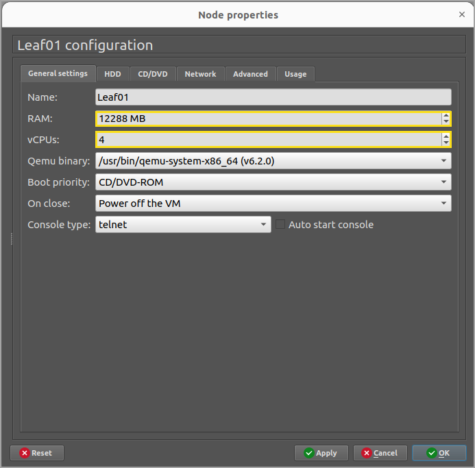
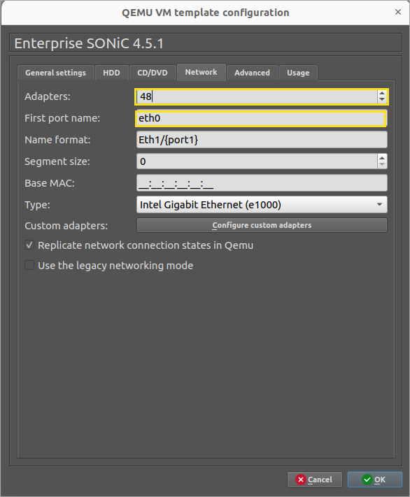

# GNS3

We recommend running GNS3 on metal as opposed to a virtual environment.
We have seen much better results.

**GNS3 Options to work with Verity**

* Server Sizing to Support GNS3 with ~10 switches
* 88 cores, 200 GB Memory, 1 TB Disk

**Each core**

* Intel(R) Xeon(R) CPU E5-2699 v4 @ 2.20GHz

In lieu of real hardware service tags/serial numbers, the string example below shows how we identify
hardware in GNS3. This is critical for our device controllers and topology operations to work.




Also, we have had the most reliable experience with the following RAM and CPU resources for Sonic
simulated switches.




Set Default adapter count to 48




## GNS3 Recommended Linux changes to work with Verity

Set the MTU for all the interface being used to 9100. You can set that in ubuntu netplan.

vi /etc/netplan/01-network-manager-all.yaml and add mtu: 9100 to each interface. 

Below is an example of what it should look like:

```
#Let NetworkManager manage all devices on this system
network:
 version: 2
 renderer: networkd
 ethernets:
   eno1:
    dhcp4: yes
    mtu: 9100
 ethernets:
   eno2:
    dhcp4: no
    mtu: 9100
 vlans:
      eno2.70:
        id: 70
        link: eno2
        dhcp4: no
  ethernets:
  eno3:
    dhcp4: no
    mtu: 9100
 ethernets:
   eno4:
     dhcp4: no
     mtu: 9100

```
