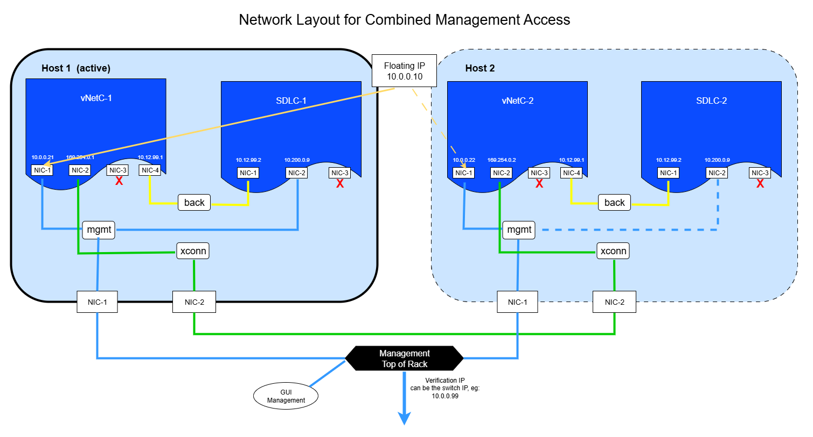
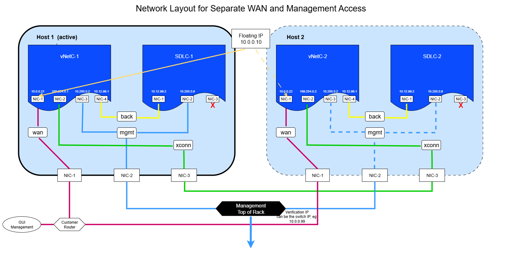
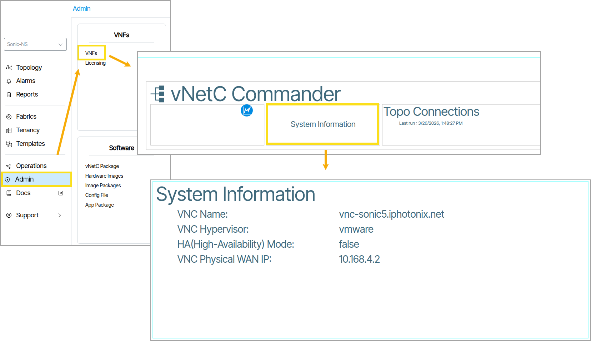

# High Availability (vNetC & SDLC)

Verity supports an automatic failover solution which provides support for high availability (HA) in the orchestration platform.
 
The solution requires two host systems. As these are operated in active/standby mode, each system must be sized to handle the full system load according to the resource calculator referenced in the installation instructions.

 The feature is supported for the KVM hypervisor or VMware.

 The optional Satori (Observability) VM is also involved in HA however switchovers do not occur based on failures of the Satori VM. Satori VM is installed in both server instances and are both active. Both instances receive statistics from the active vNETC. In the case where one Satori VM is offline for a long time (i.e. where significant statistics are lost) a mechanism is provided to copy the statistics database from backup or from the other Satori instance.

 This section includes installation information as well as considerations for Verity upgrades while systems are in HA mode.


## Installation Overview
Each system is installed per the standard instructions in the Quickstart section of this documentation. This section contains a configuration worksheet that should be filled out ahead of time with the overall network plan and address assignments in the environment containing the two host machines. 

The process contains the following steps:

1. Review the contents of this complete section
1. Complete the Configuration Worksheet
1. Install each system per standard instructions. It is important that the steps of upgrading vNETC and SDLC to the latest release are done per instructions before proceeding the next step.
1. Once the full HA system is operational, and the system is planned to be using Satori, install Satori VM on side 1 first and complete the process, and then install Satori in side 2. 

!!! IMPORTANT

    The sections below titled "Creating the vNETCs" and "Creating the SDLCs" have specific information to guide the standard installation process.

!!! IMPORTANT

    Since both SDLCs are configured with the same addresses they should not be allowed to connect to the same network until the HA process is completed on both systems. You can achieve this by always making sure one SDLC is shutdown or by having the second server completely isolated until HA configuration is completed.

!!! IMPORTANT

    Both Satori instances must be installed pointing to the HA floating IP address only.

4. Configure vNetC HA mode

## System Block Diagrams

Verity supports both single external (server) NIC and two external NIC configurations for installation. Please refer to those diagrams for the installation within the Quikstart section as your base starting point for HA. 

When using HA, the two installation options become either a two external NIC or three external NIC installations, respectively. The additional external NIC is used for the cross-connect communications  between the two servers. The user may chose to use bond groups which increases the number of external NICs in their servers for any interfaces, but this is transparent to the Verity vNETC.  

In normal operating mode, the active vNETC periodically transfers important state to the inactive vNETC in addition to continuously replicating POSTGRES database updates.

The additional state includes:

1. System configuration
1. Master key vault
1. Statistics data

The management switch architecture is up to the user (e.g. single switch, MLAG etc.) and is also transparent to the vNETCs.

The HA system level diagrams for both installation options is shown below (the Satori VM is excluded from the diagram. It is simply connected to the mgmt interface in both use cases):

### Two External NIC Block Diagram

 

### Three External NIC Block Diagram



## Configuration Worksheet

| Token               | Description                                                                       | Example          | Your Value |
| ------------------- | --------------------------------------------------------------------------------- | ---------------- | ---------- |
| <span class="make-text-red"> **MGMT_NET** </span>       | The management network address                                                    | 10.0.0.0      |            |
| <span class="make-text-red">**WAN_NET** </span>        | The WAN network address (can be the same as <span class="make-text-red">**MGMT_NET** </span>)                         | 10.0.0.0      |            |
| <span class="make-text-red">**WAN_GW**    </span>      | The gateway address for the WAN network                                           | 10.0.0.1/24         |            |
| <span class="make-text-red"> **FLOATING_IP**   </span>  | The IP address that will access the Web GUI and float between redundant nodes     | 10.0.0.10     |            |
| <span class="make-text-red">**FQDN**      </span>      | The FQDN for the floating IP (Needed if GUI will be accessed using a domain name) | vnetc.domain.com |            |
| <span class="make-text-red"> **BACK_NET**   </span>     | The backdoor network used to manage the SDLC                                      | 10.12.99.0    |            |
| <span class="make-text-red"> **XCONN_NET**    </span>   | The cross-connect network address                                                 | 169.254.0.0   |            |
| <span class="make-text-red"> **VERIFICATION_IP** </span> | The IP address of a switch management port that responds to ICMP echo-request     | 10.0.0.99/24     |            |
| <span class="make-text-red"> **DNS 1** </span> | The IP address of the primary DNS server     | 8.8.8.8     |            |
| <span class="make-text-red"> **DNS 2** </span> | The IP address of the secondary DNS server     |     |            |

### Common SDLC elements 

| Token             | Description                                                         | Example  | Your Value |
| ----------------- | ------------------------------------------------------------------- | -------- | ---------- |
| <span class="make-text-red">**SDLC_IP** </span>      | SDLC IP address on management network (same for both SDLCs)         | 10.0.0.9 |            |
| <span class="make-text-red"> **SDLC_SN**   </span>    | SDLC serial number (same for both SDLCs)                            | SDLC-A   |            |
| <span class="make-text-red"> **SDLC_HOSTNAME** </span>| SDLC hostname (same for both SDLCs, can be the same as <span class="make-text-red">  **SDLC_SN** </span>) | SDLC-A   |            |
|  <span class="make-text-red"> **ACS_IP**  </span>      | ACS IP address on management network (same for both SDLCs)          | 10.0.0.3 |            |


### KVM host elements (not for VMware)

| Token        | Description                                                                              | Example      | Your Value |
| ------------ | ---------------------------------------------------------------------------------------- | ------------ | ---------- |
|  <span class="make-text-red"> **HOST1_IP** </span> | The IP address for accessing the first KVM server host on the management or WAN network  | 10.0.0.11/24 |            |
|  <span class="make-text-red"> **HOST2_IP** </span> | The IP address for accessing the second KVM server host on the management or WAN network | 10.0.0.12/24 |            |

### Node 1 specific elements

| Token               | Description                                                                                | Example           | Your Value |
| ------------------- | ------------------------------------------------------------------------------------------ | ----------------- | ---------- |
|  <span class="make-text-red"> **NAME1**      </span>     | The hostname for first vNetC                                                 | vnetc1.domain.com |            |
|  <span class="make-text-red"> **VNETC1_IP**    </span>   | The IP address of the first vNetC in the  <span class="make-text-red"> **WAN_NET** </span> or  <span class="make-text-red"> **MGMT_NET** </span> network | 10.0.0.21/24      |            |
|  <span class="make-text-red"> **VNETC1_BACK_IP** </span> | The IP address of the first vNetC in  <span class="make-text-red"> **BACK_NET**       </span>                     | 10.12.99.1/30     |            |
|  <span class="make-text-red"> **SDLC1_BACK_IP** </span>  | The IP address of the first SDLC in  <span class="make-text-red"> **BACK_NET**  </span>                           | 10.12.99.2/30     |            |
|  <span class="make-text-red"> **VNETC1_XCONN_IP** </span>| The IP address of the first vNetC in  <span class="make-text-red"> **XCONN_NET** </span>                          | 169.254.0.1/30    |            |

### Node 2 specific elements

| Token               | Description                                                                                | Example           | Your Value |
| ------------------- | ------------------------------------------------------------------------------------------ | ----------------- | ---------- |
|  <span class="make-text-red"> **NAME2**     </span>      | The hostname for second vNetC                                                              | vnetc2.domain.com |            |
|  <span class="make-text-red"> **VNETC2_IP** </span>      | The IP address of the second vNetC in the  <span class="make-text-red"> **WAN_NET** </span> or  <span class="make-text-red"> **MGMT_NET** </span>network              | 10.0.0.22/24      |            |
|  <span class="make-text-red"> **VNETC2_BACK_IP** </span> | The IP address of the second vNetC in  <span class="make-text-red"> **BACK_NET** </span>(can be the same as  <span class="make-text-red"> **VNETC1_BACK_IP** </span>) | 10.12.99.1/30     |            |
|  <span class="make-text-red"> **SDLC2_BACK_IP** </span>  | The IP address of the second SDLC in  <span class="make-text-red"> **BACK_NET** </span> (can be the same as  <span class="make-text-red"> **SDLC1_BACK_IP** </span>)   | 10.12.99.2/30     |            |
|  <span class="make-text-red">  **VNETC2_XCONN_IP** </span> | The IP address of the second vNetC in   <span class="make-text-red"> **XCONN_NET**  </span>                                | 169.254.0.2/30    |            |

## Time synchronization

The High Availability system requires that clocks on the two vNetCs are synchronized. This is set up automatically but will work only if the systems have NTP access to the internet. If not, NTP must be configured on the vNetCs to operate with an accessible NTP server on the local network.


!!! IMPORTANT
    The following sections cover VMware and KVM specific information. Use the section appropriate for your installation.


## VMware Specific Configuration

### Virtual Switch and Port Group Configuration

1. Create a virtual switch called "xconn" with the physical port assigned that is used to connect the two servers with a direct connection.
1. Create a portgroup called "xconn" and select the "xconn" virtual switch. This is used for the heartbeat test between the servers.
1. Create a virtual switch called "back" with no external physical port.
1. Create a portgroup called "back" to use between the vNetC and SDLC.

### Creating the vNetCs

Follow the Verity [quickstart instructions](https://docs.be-net.com/latest/install-vmware/) to install the vNetC under VMware

Before powering up the vNetC, add a network adapter and connect it to the "back" port group.

Skip to the section following the KVM Specific Configuration section called "Configure vNetCs for HA mode"

## KVM Specific Configuration

### Host OS installation

The host should be installed with the Ubuntu-LTS server edition, with sshd enabled.

```
apt update; apt upgrade -y; apt autoremove -y
apt install -y net-tools iputils-ping rsync curl wget traceroute htop
apt install -y qemu-kvm libvirt-daemon-system libvirt-clients bridge-utils smartmontools
```

### Addressing and bridges

The host should have at least two physical NICs which we'll call "eno1" and "eno2".

"eno1" should be connected to the WAN network, and "eno2" should be connected to the "eno2" interface on the redundant pair.

If there is a management network separate from the WAN network, then it should be connected to a third physical NIC which we'll call "eno3".

The WAN network should be accessible to administrators who will use the vNetC GUI. This will have:

- two fixed addresses, one for each vNetC VM
- one floating address, used to access the active vNetC GUI

The management network should be configured with an IP space large enough for all managed devices to have an IPv4 address, plus:

- one fixed address shared by the two SDLC VMs
- one fixed address shared by the two ACS containers

The "eno2" interface is presented to the vNetC VM via a bridge "xconn". It should have a /30 interface (or larger). As this is a point-to-point connection, we typically use a link-local address like "169.254.0.1/30".

Each vNetC needs to be able to manage the SDLC running on the local host. This is done using a bridge called "back". This should be configured with an IP space large enough for a vNetC and each SDLC, so a /30 is the minimum size, but it makes sense to use a larger block to allow for future growth. In these examples we use "10.12.99.1/24".

In these examples, the netplan format is used, but it is also possible to use KVM network configurations. The components (vNetCs and SDLCs) are all configured with static addresses, so there is no need to provide DHCP support on any of the bridges.

### Netplan configuration examples

Netplan example with management network and WAN combined. In this case, the third interface is not connected and not used but is needed to keep a consistent interface order.

<pre><code>
network:
  ethernets:
    eno1:
      dhcp4: false
      dhcp6: false
    eno2:
      dhcp4: false
      dhcp6: false
  bridges:
    wan:
      interfaces: [eno1]
      addresses:  <span class="make-text-red"> [HOST1_IP] </span>
      dhcp4: false
      dhcp6: false
      routes:
      - to: default
        via:  <span class="make-text-red"> WAN_GW </span>
    xconn:
      interfaces: [eno2]
      dhcp4: false
      dhcp6: false
    mgmt:
      interfaces: []
      dhcp4: false
      dhcp6: false
    back:
      interfaces: []
      dhcp4: false
      dhcp6: false
  version: 2
</code></pre>

Netplan example with separate management network and WAN. In this case, the third interface is connected to the management port (eno3). Differences from above are highlighted in green.

<pre><code>network:
  ethernets:
    eno1:
      dhcp4: false
      dhcp6: false
    eno2:
      dhcp4: false
      dhcp6: false <span class="make-text-green">    
    eno3:               
      dhcp4: false       
      dhcp6: false       </span> 
  bridges:
    wan:
      interfaces: [eno1]
      addresses: <span class="make-text-red"> [HOST1_IP] </span>
      dhcp4: false
      dhcp6: false
      routes:
      - to: default
        via: <span class="make-text-red"> WAN_GW </span>
    xconn:
      interfaces: [eno2]
      dhcp4: false
      dhcp6: false
    mgmt:
      interfaces:<span class="make-text-green">[eno3]   </span>
      dhcp4: false
      dhcp6: false
    back:
      interfaces: []
      dhcp4: false
      dhcp6: false
  version: 2
</code></pre>


!!! IMPORTANT
    The following sections ("Creating the vNETcs" and "Creating the SDLCs") should be used as a reference when running the standard install procedure. It is not intended to change the order of the standard install process, just to provide guidance to information used during installation.


### Creating the vNetCs

Follow the verity [quickstart instructions](https://docs.be-net.com/latest/install-kvm/#kvm-installation) to install the vNetC under KVM.

In the vNetC xml:

- change the name to 'vnetc1' or some appropriate name that indicates this is node 1

- replace the three `<interface>` definitions with these definitions (newer xml files may already be in this format):

```xml
<interface type='bridge'>
  <source bridge='wan'/>
  <model type='virtio'/>
  <link state='up'/>
</interface>
<interface type='bridge'>
  <source bridge='xconn'/>
  <model type='virtio'/>
  <link state='up'/>
</interface>
<interface type='bridge'>
  <source bridge='mgmt'/>
  <model type='virtio'/>
  <link state='up'/>
</interface>
<interface type='bridge'>
  <source bridge='back'/>
  <model type='virtio'/>
  <link state='up'/>
</interface>
```

Continue to "virsh define" the vnetc and start the vnetc per the standard instructions.

If the management and WAN networks are combined, make the Management Address field is cleared in the Admin Network Settings tile,

otherwise set:

- Management Address: <code><span class="make-text-red">MGMT_NET<span></code>

The same procedure is used to create the second vNetC, with appropriate variable changes (eg <code> <span class="make-text-red">VNETC2_IP</span> </code>instead of <code><span class="make-text-red"> VNETC1_IP</span></code>)


#### Creating the SDLCs

For all configurations:

- the first interface to type 'bridge', source bridge='back'
- the second interface bridge to source bridge='mgmt'
- the third interface is not used and should be removed

Follow the instructions to install the first SDLC for KVM

- Use admin/wizard to set <code> <span class="make-text-red">SDLC_HOSTNAME </span></code>, <code><span class="make-text-red">SDLC_IP</span></code>, <code><span class="make-text-red">ACS_IP  </span></code> , NTP address will be <code><span class="make-text-red"> VNETC1_IP </span></code>

- Use admin/redundancy/serial to set <code><span class="make-text-red"> SDLC_SN </span></code>

The same procedure is used to create the second SDLC, with appropriate variable changes (eg  <code><span class="make-text-red">VNETC2_IP </span></code> instead of  <code><span class="make-text-red"> VNETC1_IP </span></code>)

!!! IMPORTANT

    Do not proceed to the next steps until you have both systems installed and running the latest provide core and firmware loads for Verity Release 6.4. Reminder that the SDLCs need to remain isolated from each other.

### Configure vNetCs for HA mode

For both vnETCs, on the console, edit `/etc/rc.conf` with the appropriate vNETC specific IP addresses:

- Change the **vtnet1** IP to <code> <span class="make-text-red">VNETC1_XCONN_IP</span> </code>
- Add an entry: <code> ifconfig_vtnet3="<span class="make-text-red">inet VNETC1_BACK_IP </span>" </code>

Create the file "/var/ns/arg_defaults/ns_httpd.conf" and add:

<code>
append_allowed = '<span class="make-text-red">FQDN</span>'
</code>

If the GUI will be accessed via an IP address rather than an FQDN, use:
 
<code>
append_allowed = '<span class="make-text-red">FQDN,FLOATING_IP</span>'
</code>

Replicate the host keys from vNetC1 to vNetC2, eg from vNetC1:

<code>
rsync -ai /etc/ssh/ssh_host_* <span class="make-text-red">VNETC2_IP</span>:/etc/ssh/
</code>

Create an ssh key for connections between vNetCs, on each vNetc:

```
ssh-keygen -t ed25519
```
(Hit enter to bypass default location and passphrase)

on each vnetc, copy the generated publickey file ~/.ssh/id_ed25519.pub to the other vnetc:

On vNetC1:

<code>
  rsync -ai ~/.ssh/id_ed25519.pub <span class="make-text-red">VNETC2_IP</span>:/tmp/
</code>

On vNetC2:

<code>
  rsync -ai ~/.ssh/id_ed25519.pub <span class="make-text-red">VNETC1_IP</span>:/tmp/
</code>


Then, on each vnetc, authorize that key with:

```
cat ~/.ssh/id_ed25519.pub >> /tmp/id_ed25519.pub
ns_authkeys -L /tmp/id_ed25519.pub
```
This ensures both systems have both keys


On vNetC 1, create `/var/ns/ha/failover.conf` with:

<code> <pre>
:include "/usr/ns/etc/failover.conf"
enabled = 1
floating_address = <span class="make-text-red">FLOATING_IP </span>
xconnect_address = <span class="make-text-red">VNETC1_XCONN_IP</span>
peer_xconnect_address = <span class="make-text-red">VNETC2_XCONN_IP</span>
peer_mgmt_address = <span class="make-text-red">VNETC2_IP</span>
verification_address = <span class="make-text-red">VERIFICATION_IP</span>
sdlc_mgmt_address = <span class="make-text-red">SDLC1_BACK_IP</span>

</code> </pre>

On vNetC 2, create `/var/ns/ha/failover.conf` with:
<code> <pre>
:include "/usr/ns/etc/failover.conf"
enabled = 1
floating_address = <span class="make-text-red">FLOATING_IP</span>
xconnect_address = <span class="make-text-red">VNETC2_XCONN_IP</span>
peer_xconnect_address = <span class="make-text-red">VNETC1_XCONN_IP</span>
peer_mgmt_address = <span class="make-text-red">VNETC1_IP</span>
verification_address = <span class="make-text-red">VERIFICATION_IP
sdlc_mgmt_address = <span class="make-text-red">SDLC2_BACK_IP
</code> </pre>


Other variables that alter the default behavior are as follows. Where values are shown, these are already used as the defaults and the variables do not need to be included in /var/ns/ha/failover.conf.


Settle Timing

 This specifies the period in seconds before state
 change actions are taken after decisions have been reached.

 A rule-of-thumb is to make the settle period be the
 reboot time for the server hardware plus 60 seconds.

```
settle = 300
```

Probe Cycle

This is the cycle period for probing the peer. Probing is low-overhead so can be quite short, but should be more than 3 seconds

```
probe_cycle = 10
```

Replication Period

How frequently in seconds to run replication of low priority data from the active to the inactive   node.  This data include device statistics, non-database configurations like NTP and resolver  settings, and forensic application data for ns_bizd, etc.

```
replication_period = 1800
```

Replication Delay

Delay after a failover before replication will be performed.

```
replication_delay = 300
```

Manual Override

Manual_override should be empty for normal operations. If true, this system will become active, if false this system will become inactive.  If this setting is made on just one node, the other node will transition to the appropriate state, assuming communications with this node are operational. (This variable is also administered via ns_admin menu)

```
manual_override =
```

Slave Autoconversion

If slave_auto_conversion is true, a node will be automatically converted to a postgres slave once  both the run state and postgres state have been stable for slave_transition_delay seconds. 

```
slave_auto_conversion = true
```

Slave Transition Delay

Slave_transition_delay sets how long to wait after a node becomes inactive before attempts a slave conversion.

```
slave_transition_delay = 360
```


**Reboot both vNETCs**


### Configure SDLCs for HA mode

Use these steps to configure both of the SDLCs via the admin CLI:

- Use admin/network/backdoor to set <code><span class="make-text-red"> SDLC1_BACK_IP</span></code> mask 255.255.255.x

- Use admin/security/keys/get -  to set an authorized key, taken from /var/ns/ha/sdlc_ha_key.pub in the vNETC

```
 Main/ administration/ Security Base Menu# keys

 Main/ administration/ Security Base Menu/ SSH Keys Base Menu# get -

Enter file (Press enter and <CTRL-D> when done):
ssh-ed25519 AAAAC3NzaC1lZDI1NTE5AAAAIHHrFWYS5snSDRNV6mN6rZkWMn1Xp3CIXgn4x5HvSJyP root@verity.be-net.com


Authorized keys 'authorized_keys' copied to '/home/admin/.ssh/authorized_keys'

 Main/ administration/ Security Base Menu/ SSH Keys Base Menu# 
```

- Use admin/redundancy/enable to enable redundancy mode

Reboot the SDLC. When it reboots it will be in Standby mode. If this is the first SDLC, shut it down after the reboot until the second SDLC is also in HA mode.

Both SDLCs are set to standby mode waiting for the vNETC to bring online the active SDLC.

As a final check, log into both vNETs and run `ns_info` to ensure that database replication is active on both sides.


### Install Satori VMs

If the Satori VM is used, it is installed first on vNETC 1, pointing to the floating IP address, and then on vNETC2, also pointing to the floating IP address.

## Upgrading an HA site

HA sites must be upgraded in a specific sequence, which should be completely without long delays between steps.

This is because during the upgrade, schema changes to the Postgres database may be involved, and these are immediately replicated to the inactive node, which means the BE software on the inactive node may be inconsistent with the Postgres schema.

In addition, it is not possible to do an offline upgrade to the inactive node because upgrades require write-access to Postgres.

### Upgrade Steps

- Log into the vNetC console of the inactive node and run ns_admin and select "High Availability Configuration". Select "Force Node Inactive".
- Upgrade the active node via **Admin** -> **Software Packages**. 
- After the upgrade has completed, confirm the system has been left in read-only mode. The topology page should display a tan pin-wheel icon. **Leave the system in read-only mode**.
- Use ns_admin on the inactive node to reenable failover. Select "Clear Node Overide".

- Log into the vNetC console of the active node and run `ns_admin`
    - Choose "High Availability Configuration" and "Replicate Config and Statistics"
    - When that completes, choose "Force node INACTIVE". This will trigger a failover to the currently inactive node.
- Once the GUI is accessible on this node, perform the upgrade in the normal way via **Admin** -> **Software Packages**. If necessary, delete the current package, re-upload it, and re-deploy it.
- Once the upgrade has completed, back on the console of the now-inactive node, use `ns_admin` to:
    - Choose "Set Postgres to Slave Mode"
    - Select "Clear Node Override".
- After verifying any configuration changes, the system can be returned to read-write mode


## Recovering an HA site from POSTGRES backup

When recovering an HA site from a backup, there are extra considerations:

1. PostgreSQL replication must be manually restarted after the restore
1. If the backup came from the other node, the license restored will be for that node, so the correct license must be reapplied.


### Restore steps on the Active vNetC

```
 service ns_init stop
 ns_restore -b /tmp/yyyymmddThhmmss.dddZ.tbz
 ns_ha_postgres -et master
 service ns_init start
```

 Note that if the backup file was copied from another system, add "-s config" to the ns_restore command to avoid loading license and network configuration from that system, ie:

```
 ns_restore -b /tmp/yyyymmddThhmmss.dddZ.tbz -s config
```

### Restore steps on the Inactive vNetC

 To re-enable POSTGRES replication
 
 ```
 ns_ha_postgres -et slave
 ```

This re-enables PostgeSQL replication.

## How to Verify High Availability Mode of a Deployed Verity Instance
To check the High Availabillity status on a deployed instance of Verity, follow these steps: 

1. On the **Main Navigation Bar**, click **Admin**. 
1. Click **VNFs**.
1. Double-click the **vNetc Commander** section.  
1. Double-click **System Information**. 
1. View the **HA (High-Availability) Mode** value. It will be **True** or **False**. {: class="pop"}
