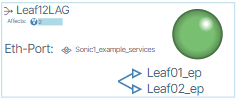

---
hide:
- toc
---

# How to Use This Documentation
When reading these pages, please note the following common references:

## Icon Links
There are many different UI icons, and when following steps in these docs you may see the icon that is being referenced in this notation:

{: class="btn pop"style="border-width:0px;"}

## Screenshot Links
When completing a step in a task it is sometimes hard to locate the area of the UI being expressed.  Example screenshots of UI locations are noted as:

{: class="pop"}

Clicking these icons results in a full size image.

## Error Reporting
If you encounter any problems with this documentation please email info@be-net.com with suggestions.