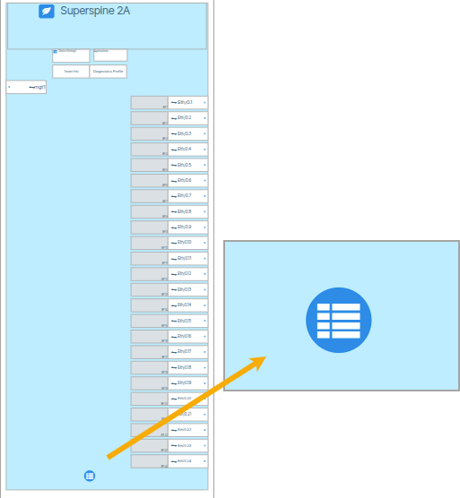
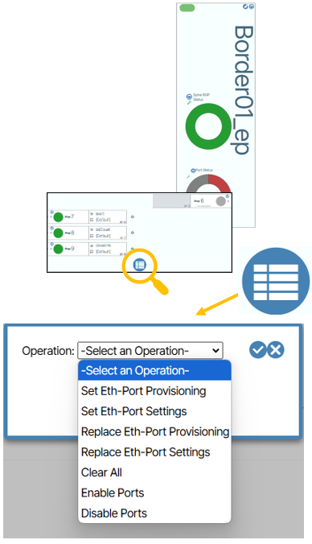
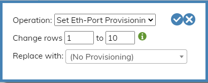
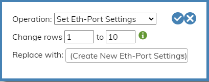
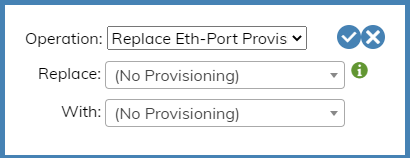
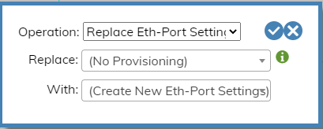
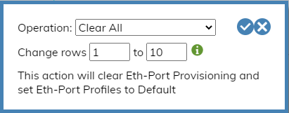
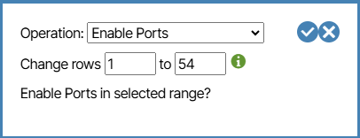
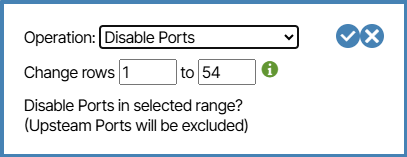

# Display Icons

This page documents all icons available in the Verity system's icon library.

| Icon | Description |
|:----:|:------------|
|  | Network Time Traveler Backup |
|  | Migrations |
|  | Badge |
|  | SFP Breakouts |
|  | Endpoint Bundle |
|  | NAC Port Profile, Authenticated Eth-Port |
|  | DHCP Server |
|  | Fabric Collection |
|  | Endpoint View, Image Update Sets |
|  | Showtech |
|  | Eth-Port Settings |
|  | SFTP, vNet Commander Network Configuration, Software Package, Service Report, SNMP, SYSLOG, User Account |
|  | Gateway Profile |
|  | Traffic Graph |
|  | Interface |
|  | Static Connections |
|  | RADIUS Login, Radius |
|  | Lag |
|  | User Type |
|  | MAC Filter |
|  | Subinterface |
|  | ONT, unregisteredObject |
|  | Packet Queue |
|  | PB Egress Profile |
|  | Preprovisioned Device |
|  | Preprovisioned Switch |
|  | System Resources |
|  | AS Path Access List, Community List, Extended Community List, IPv4 Filter, IPv4 List Filter, IPv6 Filter, IPv6 List Filter, IPv6 Prefix List, MAC Access List, IPv4 Prefix List, Route Map, Route Map Clause |
|  | Service |
|  | Service Port Profile |
|  | Static IP |
|  | Switch |
|  | ACS, SensAi |
|  | System Graph |
|  | Device Voice Settings |
|  | Voice-Port Profiles |
|  | Tenant |
|  | Vnetc |
|  | Gateway |
|  | Tenant |
|  | Eth-Port Profile |
|  | Fabric |
|  | Leaf |
|  | LAG, OLAG, Olag Channel |
|  | Service |
|  | Device AAA Profile |
|  | Device Settings |

---

*Generated from verity-frontend icon system. Custom font: `ipho-icon-test`. FontAwesome: Pro 7.*

## Object Icon Buttons
Object Icon buttons represent tangible objects such as switches or other devices and respond to both right and left click mouse button actions.  Left-clicking these buttons causes the window view to center on the button container. Right clicking the button gives you additional options that apply to the object of that button.

#### Manage Rows Button

The **Manage Rows** button ({: class="btn"}) provides a convenient way to apply the same settings to multiple ports on a single switch. The settings include switch provisioning as well as the mass enabling/disabling of Edge ports. {: class="pop"}

##### Set Eth-Port Provisioning
This option lets you choose an **Eth-Port Profile** and apply it to a port or to a consecutive list of ports. {: class="pop"}

##### Set Eth-Port Setting
This option lets you choose an **Eth-Port Setting** and apply it to a port or to a consecutive list of ports. {: class="pop"}

##### Replace Eth-Port Provisioning
This option lets you choose all ports by their assigned **Eth-Port Profile** and replace the assignment with a different **Eth-Port Profile**. {: class="pop"}

##### Replace Eth-Port Settings
This option lets you choose all ports by their assigned **Eth-Port Setting** and replace the assignment with a different **Eth-Port Setting**. {: class="pop"}

##### Clear All
This setting clears **Eth-Port Provisioning** values and sets **Eth-Port Profiles** to default for a port or a consecutive list of ports. {: class="pop"}

##### Enable Edge Ports
This setting lets you enable an **Edge Port** or enable a consecutive list of **Edge Ports**. {: class="pop"}

##### Disable Edge Ports
This setting lets you disable an **Edge Port** or disable a consecutive list of **Edge Ports**. {: class="pop"}

