---
hide:
- toc
---

# Image Updates 

Successful device software upgrades typically necessitate a device reboot. However, forcing a full network-wide restart for each device update is impractical and unacceptable. Image Update Sets solve this problem.

**Image Update Sets** allow you to organize devices into user-defined groups and target these distinct groups for software updates. This approach enables the system to leverage the redundancy of active switches to maintain network availability during the update process. This approach trades some capacity during the update, but it allows you to safely upgrade sections of your network without shutting down the entire system.

## NOS Upgrades

### Upgrade by Image Update Sets

!!! NOTICE 

    This section describes the mechanics of using Image Update Sets; it does not cover how to apply them to any specific configuration or deployment scenario.

To access Image Update Sets, go to **Operations/Image Updates**. 

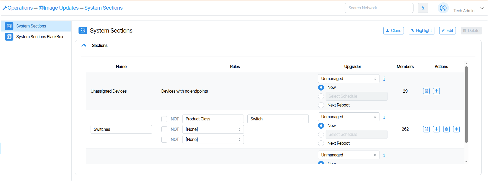   

The presented window is composed of rows and columns, with each row representing an Image Update Set and each column representing information specific to that Image Update Set. The **Members** field displays how many devices are in the Image Update Set. The columns titled **Name**, **Rules** and **Upgrader** are user defined values. The **Actions** column contains controls to create/delete new Image Update Sets as well as a button to open a Report listing devices that match the Image Update Set rules.

#### Name
**Name** is where you name your Image Update Set.

#### Rules

Devices are grouped into Image Update Sets by using conditional logic in the **Rules** column. A Rule contains a **Not** clause, a condition (named **Rule Type**), and a field containing values contingent on the condition (named **Rule Value**). The Rule value options change depending on the selected Rule type. All three fields are shown in the following image.

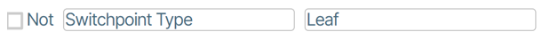

Each Image Update Set can have up to three Rules.

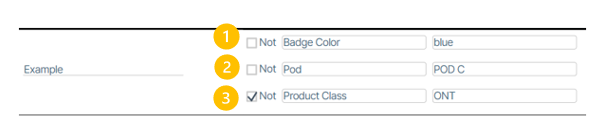

There are many conditions to choose from. Clicking the conditional field provides a scrollable list.

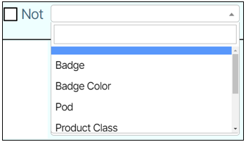

**Rule Example**

The example in the following image selects all devices assigned a **Badge Color** of **blue**.

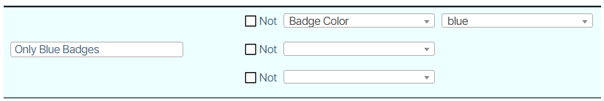

This more complex example selects all devices in the network with a blue **Badge Color** that are in **POD C** and are **Not** of the product class ONT.

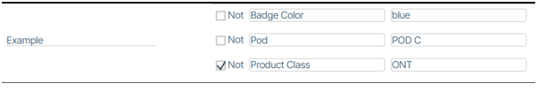

#### Order Matters

When writing Image Update Sets, it is important to understand that order matters. If a device is included in an Image Update Set, it cannot be included in subsequent Image Update Sets further down the page.

Any devices not explicitly assigned to an Image Update Set are assigned to  **All Others** on the bottom row.

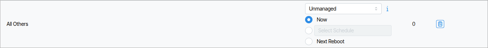

### Upgrader

The Upgrader column is where you select the software version package and schedule the reboot time. This action is applied to all devices that fall within the Image Update Set Rules.

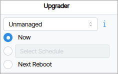

The first field specifies the software version, followed by three options for selecting the device's restart time.

**Now**

This performs the image transfer and reboots immediately.

**Month/Day/Year, Hour: Minute: Second AM/PM**

When you select this option, the image file is transferred and written to the standby partition of the device. The device then reboots at the scheduled time.

!!!Notice 
     Switch Devices have active and standby partitions. This allows you to load device image software during normal operation and reboot at a scheduled time.

**Next Reboot**

When you select this option, the image file is transferred and written to the standby partition of the device and updates on the next *manual* reboot.

### Members
**Members** shows the device count for the Image Update Set. Double-clicking area opens a Report listing all devices in the set.

<!-- ### Pie Charts

The last column of information, titled Pie Charts, consists of pie charts that present device states as visual graphs. 

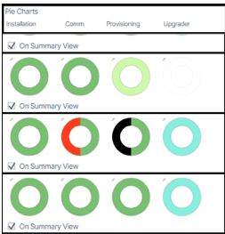

There are four metrics that are expressed:  **Installation**, **Comm**, **Provisioning** and **Upgrader**.
Individual pie charts can be hidden by unchecking the checkboxes at the top-left of the Image Updates tile.

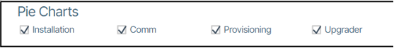 

-->

## How to Upgrade by Device
Each device can be upgraded individually independent of Image Update Set. To do so, zoom into the device **SW Version** tile.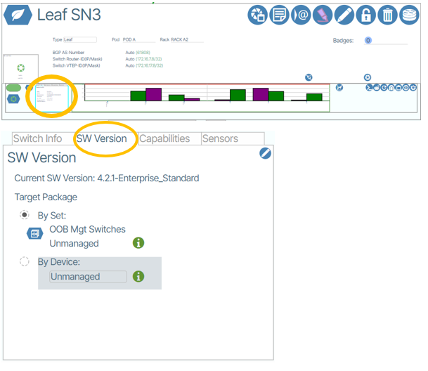{: class="pop"}

In the window that appears you have the choice to choose **Target Package** by **Set** and **By Device**. Select **By Device**. The drop-down menu lists the available upgrade packages. Choose the one you desire. Save the choice by clicking the save button.

!!!Warning 

    The moment you save, the device will reboot!

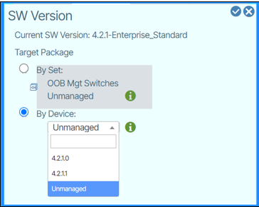

#### How to Enable/Disable Devices from Receiving Software Updates.

In Network View, the **Image Upgrades of all Devices Enable/Disable** button {: class="btn"} determines if a system will accept software updates.

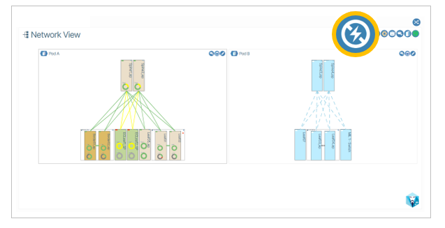
