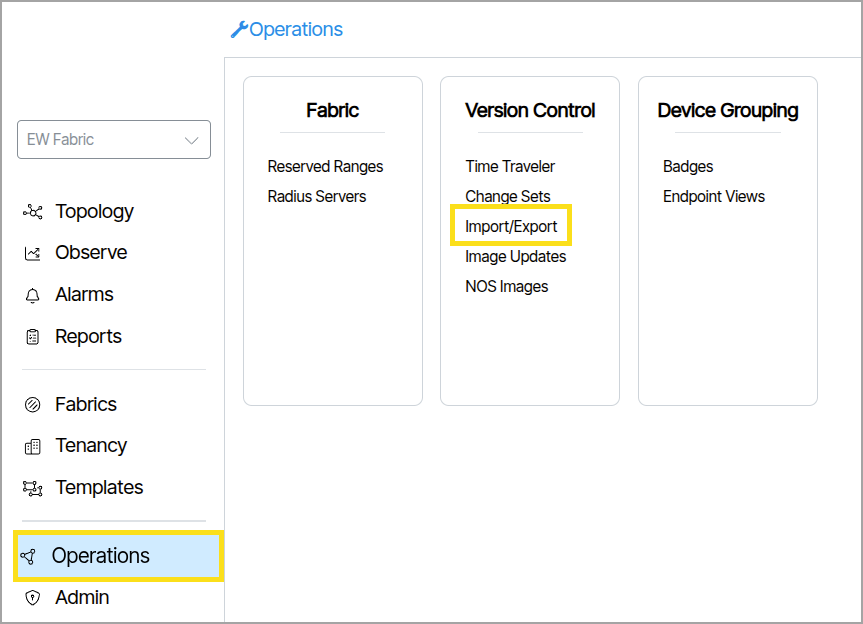
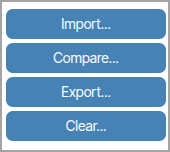
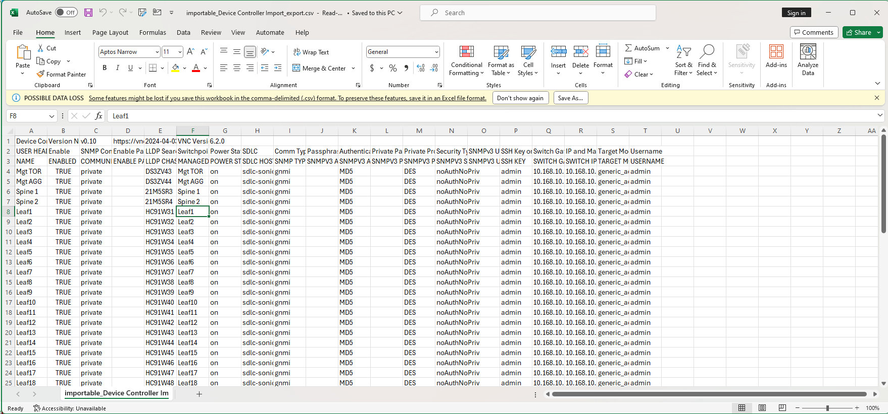
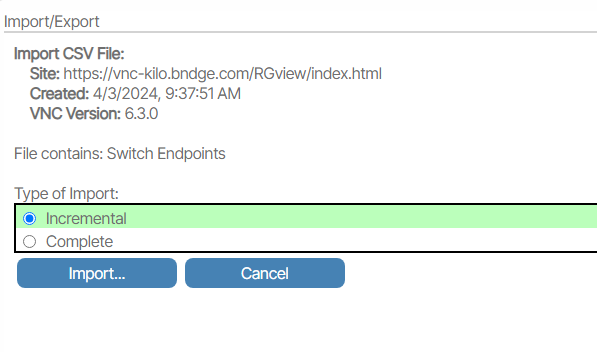
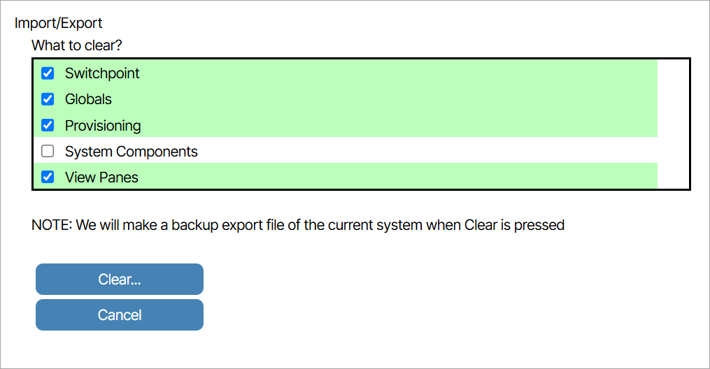

# Import/Export
The **Import/Export** feature allows users to import or restore all provisioning settings back into the system, export or save all system provisioning to a text file, and compare provisioning by viewing differences between the current system provisioning and a text file before importing.

!!! note "When to use CSV Import"
        
    CSV file imports can be used to create new systems from scratch. However, in most cases, it is easier to use the UI to create objects with fewer than 10 instances. The typical scenario where CSV imports are most efficient is when creating or modifying switch port provisioning or switch port labeling, especially when there are more than 64 ports per switch. For switch provisioning, it is recommended to first create examples of single port and LAG provisioning in the UI before exporting the files for updates.

To access the Import/Export feature go to **Operations** and select the text titled **Import/Export**.

**CSV Import Export Overview**

The Verity system supports multiple methods for editing data objects. Examples include editing directly on the network map and within provisioning object blocks. Verity also offers bulk edit modes—both on the map using controls within each switch and by modifying provisioning data through reports. However, in cases such as creating new networks or implementing large-scale changes to an existing infrastructure, using the CSV import/export functions can provide a more efficient approach to bulk editing. CSV files can be used to create new systems from scratch or to manage updates by exporting the data, editing it offline, and re-importing it.

Verity models provisioning as a collection of managed objects. This collection, combined with live network topology discovery, is used by the system to generate the provisioning for the managed physical devices.

Files for the managed objects include:

1.  Tenants
1.  Services
1.  Ethernet Port Profiles
1.  Ethernet Port Settings
1.  Endpoint Bundles
1.  Switchpoints (Endpoints)
1.  Device Controllers
1.  Gateways
1.  Gateway Profiles
1. LAGs
1. Route Maps
1. IP Prefix Lists
1. Route Map Clauses

The files are database- and system-independent, making them easy to share between systems. Additionally, the import process is designed to support importing in any order by creating temporary references until the related managed objects are imported from the appropriate files. Each row in the file represents an instance of an object, and the columns represent the various parameters associated with that object, as shown below.

Switch provisioning can be found in the “Endpoint Bundles” CSV file, while switch labels and port enable settings are in the “Switchpoint” CSV file.

Example CSV files can be provided by BE Networks upon request, or you can create your own by exporting the files.

**Complete vs. Incremental**

There are two types of CSV imports: Incremental and Complete. The Incremental import allows users to add only new items to the system, without affecting existing ones. In contrast, the Complete import assumes the file contains the full list of objects of a given type and deletes any existing objects of that type that are not included in the file. Incremental updates may include existing objects; if an object and all its parameters match an existing entry, it is ignored.

Using Incremental import is more common and generally safer, as it does not delete any objects from the system.

During the import process, the system performs basic validation of the content and then presents the user with a summary of the expected updates. These changes can be reviewed in detail before they are committed to the system.

Since it is generally good practice to save your current system state before performing any bulk updates, it is recommended to use the system’s [Time Traveler](time-traveler.md) feature to create a complete provisioning snapshot beforehand.

## Compare

**Compare** is used to evaluate the differences between the current provisioning and a file prepared for import. To perform a comparison, click the **Compare** button. This feature displays the differences between the current provisioned configuration and the configuration defined in the imported file.

Importing the file after comparison will overwrite all existing provisioning objects.

## Clear

**Clear** is used to remove devices and/or provisioning objects of various types from the system. When selected, all objects specified under the What to clear menu will be deleted. {: class="pop"}

## Parameter Names and Field Values

In some cases, the parameters and values used in the Verity UI *may not match* the column headers or values in the CSV file entries. Therefore, it is considered best practice to create one or two objects of the types you plan to import, then export the CSV files for those objects to use as a starting point for updates. The files can be renamed to any name, as long as they retain the CSV extension. Additionally, CSV file formats are specific to each Verity software release and should not be used directly between releases without first analyzing the format differences across versions.
