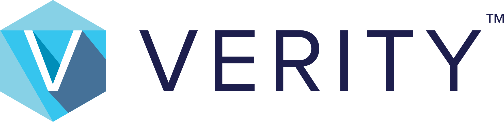

---
hide:
- toc
---

{: class="clean logo"style}

# Introduction
**BE Networks Verity** is a software platform for managing physical and logical network infrastructure.  Verity operates data center, campus, edge, and AI network topologies using open-source networking including SONiC and non-proprietary protocols.

---

## Features
### :fontawesome-solid-arrow-pointer:{.dark-blue}  Intent-Based Networking (IBN)
Through a declarative IBN model, Verity enables users to focus on delivering data center services using a simple intent-driven methodology. Verity eliminates the need to convert desired intent into a series of complex, manually entered CLI commands. Instead, the user’s intent is captured through a series of intuitive provisioning templates and prompts. Verity automatically maps these inputs into vendor-specific configuration commands that are pushed to the data center fabric with 100% accuracy.

### :fontawesome-solid-box:{.dark-blue} Zero-Touch Provisioning (ZTP)
Verity enables the ZTP installation of SONiC-based switch hardware with only the ONIE boot code installed for modern data center layer 2 and layer 3 fabrics and associated out-of-band switch management networks. Verity allows for the entire site to be pre-designed with no hardware present. A digital twin of the desired network is built within Verity, allowing administrators to design the network underlay according to their unique business requirements. Once the switches are unboxed, racked, powered, and cabled at the data center location, Verity provides the necessary DHCP services so the switches can locate their respective firmware files for automated remote downloading and updating to the newly provisioned hardware. As the ZTP process completes, the switches call into the Verity orchestrator to receive their pre-staged provisioning configurations for automatic underlay creation. The physical network fabric topology is then auto-discovered, reported, and displayed on the GUI site map. An entire data center can be brought online in minutes, not days.

### :material-brain:{.dark-blue} Authoritative Network Source of Truth (NSoT)
Verity acts as an authoritative data repository for all network configuration parameters and physical inventory for data center fabric and out-of-band management networks. It is impossible to achieve high levels of automation and security without this accurate, live view of the intended network state. Representative configuration data collected by the Verity orchestrator includes IP addresses, interface parameters, VLAN mapping, VXLAN configuration, and device locations. Verity inventories all neighboring device details such as hardware make/model, firmware versions, MAC addresses, etc. Additionally, Verity continuously audits the current operational network state against the intended state, with deviations being alerted and automatically remediated.

### :material-map-search:{.dark-blue} Live, Zoomable, and Navigable Fabric Map
The Verity UI provides granular network visibility with a live view of the current state of the data center fabric. With just a few clicks and scrolls of a mouse, operators can zoom in and out of networks, pods, and tenants down to the individual switchport level in seconds.

### :material-monitor-dashboard:{.dark-blue} Detailed Real-Time and Historical Actionable Analytics
Up to one year of historical network operational data is maintained in Verity’s system automatically. The last 30 days of history is graphically displayed within the Verity UI across varying time periods (30 min., 2 hrs., 12 hrs., 24 hrs. 7 days, and 30 days). Historical statistics and telemetry are available from every attached device, link, port, LAG, optic, switchpoint, and more. All data visible within the UI is easily accessible through Verity’s REST API for streamlined third-party monitoring integrations.

### :material-table:{.dark-blue} Comprehensive Reporting
Verity provides access to a vast number of customizable, filterable, sortable, and exportable reports. All key parameters relating to provisioning, devices, underlay/overlay, ports and more are easy to access and manipulate.

---

## Obtaining Verity
Verity can be obtained by contacting BE Networks Sales.

[Get Help](https://be-net.com/){ .md-button .md-button--primary }

---

## BE Networks
BE Networks, BeyondEdge, iPhotonix, and related subsidiaries operate under the BE Networks name.  As lifelong experts in network design and operations, BE aims to deliver complex network services with simple, easy to use software.