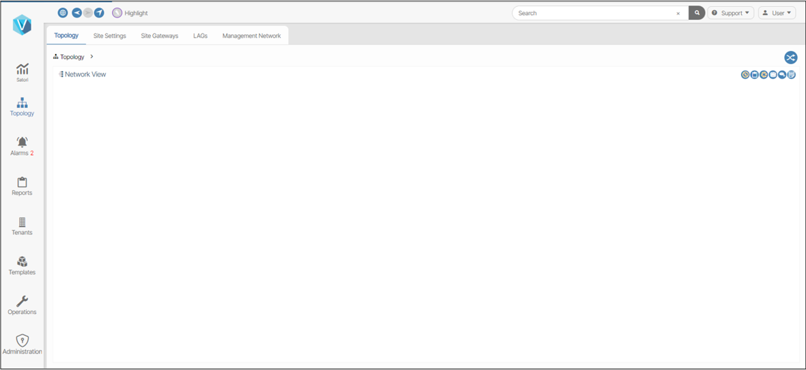
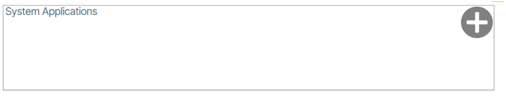
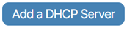

---
hide:
- toc
---
# ONIE and ZTP

!!! note "Requirements"

    The instructions in this document assume that you have installed the two Verity virtual machines required for use. It also assumes you have gone through the VM post installation process that includes the installation of license files and have created the management LAN subnet. Refer to the installation section for requisite procedure.

In this step, a DHCP server must be set up and the SONiC images as delivered by BE Networks are installed into Verity. 

Verity’s ZTP feature is a way to remotely set up switches without having to manually configure them on a hop-by-hop basis. The process consists of two steps: ONIE Boot process and ZTP Provisioning portion.

The ONIE process starts when a switch boots up from the factory without a SONiC image and it connects to a remote server to download the necessary software image. The actual ZTP process starts with a switch that has SONiC loaded and a default configuration. The verity system creates a series of files that are used to prepare the SONiC switch with a minimal configuration to communicate with the Device controllers within Verity. DHCP options on the Verity SDLC server tells the switches the location of the remote server (vNetC) where the required files are stored. The system supports ZTP for both the management and spine/leaf switches.

## Accessing the Verity UI
Open the Verity UI in your Chrome browser.  A new instance of the Verity user interface (UI) is presented to you. {: class="pop"}

## Configuring DHCP
There are two options available for configuring DHCP:

- Use your own DHCP server - skip to the section titled **Using Your Own DHCP Server**.
- Install the internal **DHCP Server Application** by running the **Add a DHCP Server**.

    !!! note "Management Subnet"
    
        The address space for the management subnet is used for the vNetC (if in same subnet), SDLC and other internal system components used to manage the devices in the system as well as the devices themselves. This subnet, which was defined during the initial VM installation process, needs a section of addresses reserved for the static assignments of the system components as well as the management interfaces of the devices in the system. The dynamically allocated range is used to support the switches through the ZTP process as well as the Device Controllers that are created to communicate with the switches if they are set in DHCP mode.

        If the managed devices are in a separate subnet, routed through external equipment (i.e. external to Verity), an external DHCP server is required in the subnet with the managed devices.

### **Option 1:** Using the Internal DHCP Server
1. Go to VNFs by double-clicking **Admin** icon and clicking the **VNFs** link. 
1. Navigate to the section titled **System Applications** located within the VNFs section of the Verity dashboard and click the create button({: class="btn"}). {: class="pop"}
1. Click the **Add DHCP Server** button. {: class="pop"}

    !!! note "DHCP Subnet Range"

        For the **DHCP Server**, setting the lease duration is required. The excluded address ranges are designated to reserve space for the static addresses assigned as described above. The addresses allocated for the Device Controllers and the switches during ZTP will come from within area between the excluded addresses. The subnet and this range should be sized accordingly based on how many devices are planned for the data center network. In this example, the first 100 addresses and the last 5 addresses of the management subnet have been excluded from the DHCP pool of addresses that can be allocated. {: class="pop"}

1. Check the box titled **Enable** and click the checkmark to save and start the internal DHCP service. {: class="pop"}

### **Option 2:** Using Your Own DHCP Server
1. It is not necessary to run the **Add a DHCP Server** installer as explained in the previous section, but please review the requirements described above for allocating IP address space. The following DHCP options are required which enables ONIE boot (Option 114) load and ZTP (Option 67).

    | Scope Setting | Value |
    | - | - |
    | **Option 67**| "http://**<vnetc-address or fqdn\>**/download/ztp/file/ztp.json" |
    | **Option 114** | "http://**<vnetc-address or fqdn\>**/download/onie/file/onie-installer" |

Note: If you are using secure (TLS) download option in the network, use "https" instead of "http"

## Load SONiC Image
You are now going to load SONiC Image to VNetC. Before performing this action, you must obtain an image package from BE Networks containing the desired switch image files. You cannot load files directly supplied by 3rd parties in this step.

1. Go to the **Operations** page.
1. Click **NOS Images** in the **Version Control**.
1. Use the Browse Files/Drag-Drop interface to upload the BE Networks pre-packaged OEM image file.
1. After upload is complete, click the **Deploy** ({: class="btn"}) button.

!!! success "Congratulations"

    You have completed the Verity server setup and are now ready to begin importing network devices.