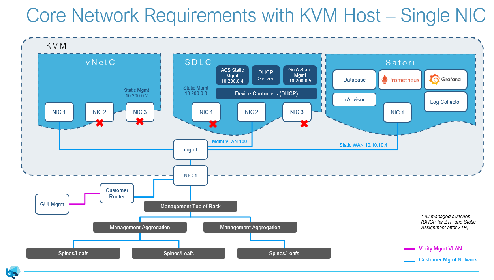
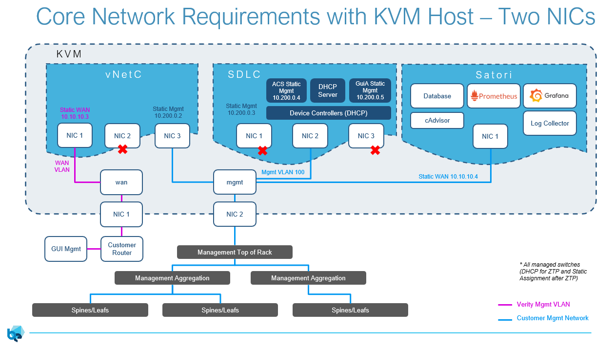
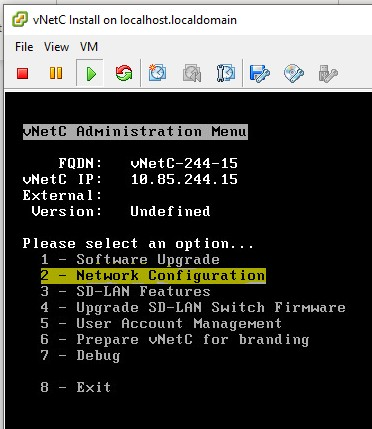
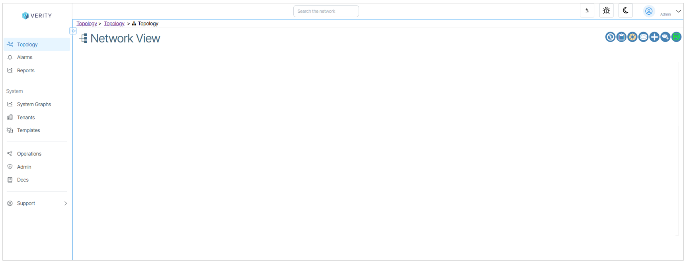
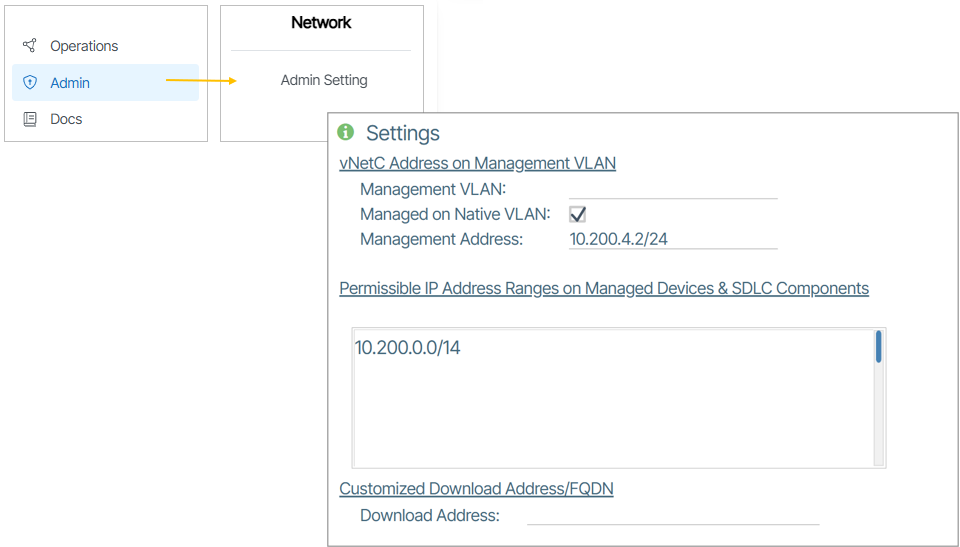
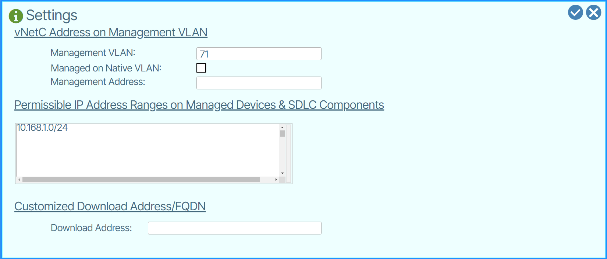
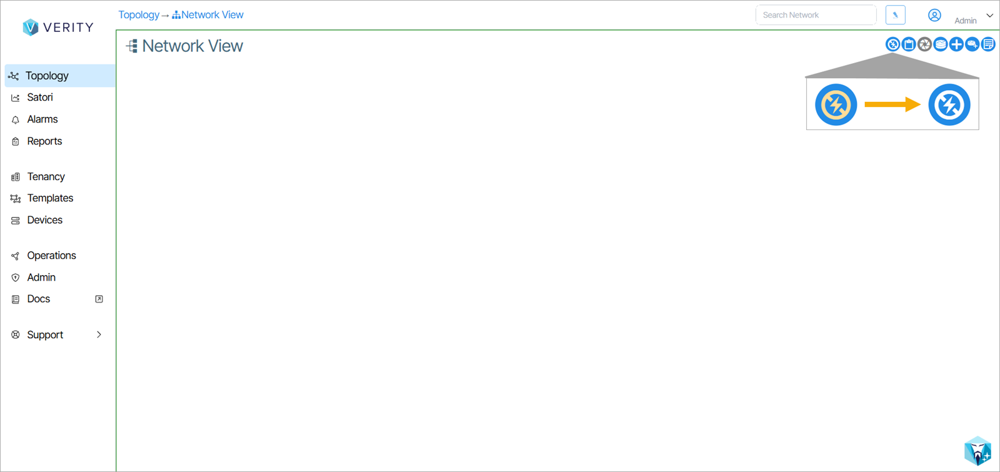
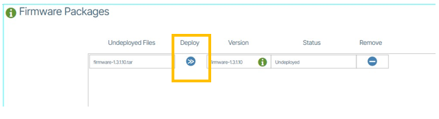
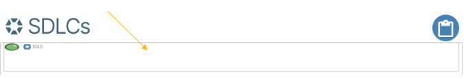

---
hide:
- toc
---
# KVM Installation

## Introduction
The Verity management and orchestration system is comprised of three functional components, all of which are instantiated as Virtual Machines (VMs). This document describes the installation and configuration of these VMs within a KVM environment.

## Prerequisites
- [Recommended Network Management Architecture](install-prerequisites.md)
- [KVM and Proxmox Specific Network Configuration](install-prerequisites.md#kvm-and-proxmox)
- [KVM & Proxmox Required Files](install-prerequisites.md#kvm-proxmox-required-files)


## Resource Calculator
[Use the Verity VM Resource Calculator to determine system resources.](downloads.md)

## Virtual Machine Overview
Verity’s three VM functional components:

| Virtual Machine  | Function   |
|-|-|
| **Virtual Network Commander (vNetC)** | Orchestration logic, GUI hosting, northbound RESTful API, and databases. |
| **Software Defined LAN Controller (SDLC)** | The SDLC VM is comprised of a series of containers that map one-to-one to the managed switch devices. Network discovery, device provisioning, and network assurance. The SDLC serves as the abstraction layer between the managed switch and the vNetC by translating the native management protocols into the vNetC’s NETCONF interface and Yang model. |
| **Satori** | The Satori VM is comprised of various containers that collect, process and display the network device details that are managed by Verity.|

## Topology Overview

Below is the basic VM and hardware topology for reference: 

{: class="clean"}

<!-- ## Recommended Network Management Architecture

Each system requires a management subnet that can support 5 system IP addresses as well as 3 IP addresses per managed switch. The breakdown is as follows:

| **IP address Allocations for Management Network** | **Component**                   | **Allocation**               |
|---------------------------------------------------|---------------------------------|------------------------------|
| Verity System components                          | vNETC LAN side, SDLC, ACS, GuiA, Satori | 5 Static Addresses   |
| Managed Switches                                  | Verity Switch Controller        | 1 Dynamic Address per switch |
| Managed Switches                                  | Switch in ZTP Process           | 1 Dynamic Address per switch |
| Managed Switches                                  | Switch Post ZTP Process         | 1 Static Address per switch  | -->

The orchestration platform (vNETC) is configured on the customer’s network with one static IP address to be accessed by users.

!!! warning "Public IP Addresses"

    The standard installation assumes private IP addresses are use by the Verity components and the managed switches. If that is not the case, refer to details in the section "Configure vNetC from the Console" below.


The following diagrams shows the recommended management network architectures. Variations are possible based on individual customer’s network needs. The VMs can have all of their interfaces on a single NIC coming from the server, or a secondary NIC can be used to separate the WAN connection to the vNETC from the Management network connecting to all of the switches.








<!-- # Prerequisites

1.  **vNetC**
    1.  Resolvable, fully qualified domain name
    1.  Static IP address, gateway, DNS servers
    1.  Valid Verity license
1.  **SDLC**
    1.  IP addressing per table above

        *NOTE: Must be routable to the vNetC*

1.  **Devcice Controllers (within SDLC)**
    1.  IP Addressing per table above.

        *NOTE: The diagram above shows that the controllers are bridged to NIC 2 of the SDLC. The IP MUST be on the same VLAN/subnet as the SDLC.*

1.  **Satori**
    1.  IP Addressing per table above.

        *NOTE: Must be routable to the vNetC*

1.  **KVM**
    1.  Compute resources meeting Verity requirements based on the number of switches being managed. See Resource documentation for computing CPU and memory needs.
    1.  Virtual Switch
        1.  The vNetC, SDLC and Satori should be on the same bridge or at minimum they must be routable.
1. **Routable or switched network between Verity components and managed switching devices**
    1. If using a router or firewall between Verity and the switches, the following ports must be allowed to pass.
        1. Port 8080 for gNMI
        1. Port 80 - HTTP
        1. Port  443 - HTTPS
        1. Port 22 - SSH
        1. Port 161 - SNMP

# Obtaining the vNetC and SDLC VM Images and Files

Obtain the following files from BE Networks:

| **Description**          | **Filename Example**         | **File Type** | **Notes** |
|-|-|-|-|
| **vNetC VM Image**           | vNetC-x_x_x_x.qcow2          | KVM qcow      | Resources including vCPU and memory should be adjusted based on resource needs documentation. Networking will need to be altered to the correct bridge names used in the server         |
| **vNetC “core” Upgrade**     | core-x_x_x_x- full.tar       | Tarball       | vNetC needs to be updated via UI SD-Admin immediately after configuration and boot                                                                                                     |
| **SDLC VM Image**            | SDLC-x_x_x_x.qcow2           | KVM qcow      | Resources including vCPU and memory should be adjusted based on resource needs documentation. Networking will need to be altered to the correct virtual switch names used in the server |
| **Firmware Upgrade Package** | firmware-x_x_x_x.tar         | Tarball       | SDLC should be upgraded via system upgrader immediately after configuration and boot                                                                                                    |
| **Satori VM Image**      | satori_x.x.x.qcow2| KVM qcow      | Resources including vCPU and memory should be adjusted based on resource needs documentation. Networking will need to be altered to the correct bridge names used in the server         |
| **Satori Upgrade Package** | satori_x.x.x.tar| Tarball       | Satori should be updated via UI AS-Admin immediately after configuration and boot |
| **License**                  | license.cms or sitexxxxx.tar | License file  | Is uploaded using UI                                                                                                                                                                   |
| **XML Parameters**           | vnetc.xml, SDLC.xml and satori.xml| xml           | Default files are provided and are edited during the installation process. There are 4 available vNETC xml files covering the use cases of single or multiple NICs along with High Availability options     | -->

# Creating the Virtual Machines

The following instructions explain how to create virtual machines for both the vNetC and SDLC.

1.  Copy vnetc, sdlc and satori qcow and xml files to host (root directory):

    1. vnetc.qcow2
    1. SDLC.qcow2
    1. satori.qcow2
    1. vnetc.xml
    1. SDLC.xml
    1. satori.xml

1.  Make sure you have the bridge name from host for VMs:
    `

        nmcli connection show
    `

1.  Edit xml files (vnetc.xml, SDLC.xml and satori.xml) to have bridge name on the correct interfaces, number of CPU, and number RAM needed for each VM. Example:

```
<memory unit="KiB">8388608</memory>
<currentMemory unit="KiB">8388608</currentMemory>
<vcpu placement="static">8</vcpu>
 
<interface type="bridge">
<source bridge="mgmt"/>
 
<interface type="bridge">
<source bridge="wan"/>
<model type="virtio"/>
```

1. Adjust xml file for Linux variants
    1. For Centos and Redhat

    `

        <devices>
        <emulator>/usr/libexec/qemu-kvm</emulator>

        <os>
        <type arch='x86_64' machine='pc-i440fx-rhel7.6.0'>hvm</type>  

    `

    2. For Ubuntu
    
    `

        <devices> 
        <emulator>/usr/bin/qemu-system-x86_64</emulator>

        <os>
        <type arch='x86_64' machine='pc-i440fx-jammy'>hvm</type>

    `

1.  Move qcow (vnetc, SDLC and satori) to /var/lib/libvirt/images directory
1.  Define VMs using the edited xml files:

    virsh define vnetc.xml

    (Domain 'vnetc' defined from vnetc.xml)

    virsh define SDLC.xml

    (Domain 'SDLC' defined from SDLC.xml)

    virsh define satori.xml

    (Domain 'satori' defined from satori.xml)

1.  Set VMs to autostart on boot:

    virsh autostart vnetc

    (Domain 'vnetc' marked as autostarted)

    virsh autostart SDLC

    (Domain 'SDLC' marked as autostarted)

    virsh autostart satori

    (Domain 'satori' marked as autostarted)

1. Start vnetc VM

    virsh start vnetc

    (Domain 'vnetc' started)

# Configure the vNetC (Console)

This step requires you to configure the vNetC with an IP address and Fully Qualified Domain Name (FQDN). To do so, you need to open the VM console: **virsh console vnetc**

The VM console appears. The vNetc initialization may take several minutes. While waiting you can press **Enter** and wait for login prompt.

1.  Login to the vNetC with username **admin** and password **vnc1234**. Enter a new password if prompted. If not prompted for the password, you can continue to use the default password or change it with the **passwd** command.
2.  In the Admin Menu, select **Network Configuration**. Press Enter. {: class="pop"}


3.  Select **FQDN (Fully Qualified Domain Name).** Press Enter and set to the desired **Fully Qualified Domain Name.** If the field is prepopulated, it is required that you replace the default text with your own FQDN.
4.  Verify that WAN IP DHCP is disabled. If WAN IP DHCP is enabled, disable it using the menu.
5.  Select **WAN Static IP Settings,** press enter.
    -   Enter: IPv4 Address and subnet in CIDR format (x.x.x.x/\#\#) where x.x.x.x is the IPv4 address and \#\# is the CIDR subnet mask prefix
    -   Enter: Default Route (Gateway)
    -   Enter: DNS Server 1
    -   Enter: DNS Server 2 (if required)
1.  Return to the network configuration menu.
2.  Save Settings

    Follow the prompt and the VM will reboot with the new settings configured.

!!! warning "Public IP Addresses"

    The standard installation assumes private IP addresses are use by the Verity components and the managed switches. If that is not the case, refer to the instructions below.

1. ssh back into the vNetC as the root user
1. copy the following string and paste into the command line

     ns_vnc_setup --features acs_tunnel=1


### Install the License (required) and Upgrade to the Latest vNetC Core Software

1.  Use Chrome Web Browser to access the vNetC IP address that was just configured.
1.  At the login prompt enter username **admin** and the administration password configured in the menu during installation. These are the credentials you entered in step 3 of **Configure the vNetC from the Console**. {: class="pop"}
1.  When the window appears, record the information on the **Licensing tied to** line. Provide this information to BE Networks to obtain your license file. {: class="pop"}
1.  After you obtain your license.cms file you are required to upload it to the application. In the License window select **data center** or **campus** (depending on your system). Use the drag and drop palette to upload the file or browse for the file. The license file may also be embedded in a \<filename\>.tar file and this can also be directly imported and the system will extract the license.cms file. {: class="pop"}
1.  After you upload the file make sure a success message is presented. {: class="pop"}
1.  Click the button that says **Complete**.
1.  After the **Verity** window has fully completed populating select the **Admin** tab.
1.  From the **Admin** option, under **Software Packages** click **vNetC Packages**.
1.  Using the **Browse Files** (or drag and drop) field, import the **vNetC Core Upgrade** file provided by BE Networks. {: class="pop"} {: class="pop"}
1. When the process is complete you are presented with a success message. {: class="pop"} {: class="pop"}
1. Click the **Deploy** button.
1. When prompted to continue, click Yes. The software updates. {: class="pop"}

!!! warning "Temporary Error Message"

    You may see an error titled **Fatal Error WebSocket Error: Connection lost -2** appear, this is normal. The browser may temporarily say that the site cannot be reached. When the process is done the landing page will render.


1.  If you see a migrations prompt click **Accept**. {: class="pop"}.
2.  If you see a tan prompt that says **GuiA not attached, no GuiA Switch**, clear the message by clicking it.
3.  The display should look like the following image: {: class="pop"}
4.  Press ```<ctrl> ]``` in the vNetc console window to return to the host server. Then, stop the vNetc VM by entering ```virsh shutdown vnetc```.


# Configure the SDLC (Console)

The SDLC must be configured with a Static IP address and the vNetC FQDN.
Start the SDLC VM by entering ```virsh start SDLC``` in the host console. Then, log in to the SDLC console by entering ```virsh console SDLC```.


<!-- 1.  Select the SDLC from the VMWARE ESXi interface and click the **Console** tab.
2.  Select **Open browser console**. {: class="pop"}
3.  The console appears. {: class="pop"} -->

!!! warning "DHCP Error Messages"

    During the following process DHCP errors may appear. These can be ignored.


1.  Press **Enter** to get the login prompt, enter username: **admin** and password: **admin**.
2.  At the command line interface (CLI) press **Enter** to see a list of options.
3.  Select **Admin** and press **Enter**.
4.  Type **Wizard** and press **Enter**.
!!! note
    If vNetC and SDLC (GuiA, ACS) are on different subnets, it is recommended to have three consecutive static IP addresses on the same subnet for GuiA, ACS and DHCP. However, if vNetC is on the same subnet as GuiA, ACS and DHCP, it is recommended to use four sequential IP addresses.
| Prompt | Answer |
|---|----|
| **Enter new hostname** | **SDLC**|
| **Enter MGMT IP or enter 'd' to use DHCP** | **Enter management IP** | 
| **Enter URL connection protocol (http, https)** | **http** | 
| **Enter default gateway IP/Prefix in CIDR format** | **Enter the default gateway IP address** |
| **Enter ACS IP or type 'none' to remove config** | **Enter IP** | 
| **Enter vNetC FQDN** or **IP** | **vNetC IP address** | 
| **Enter DNS server** | **Enter DNS server IP**| 
| **Enter Comma separated NTP server(s**) | **Enter vNetCs IP address** |
| **Advertise Site Management vlan** | **Enter n** |
| **Enter VnetC post SN** | **Enter N/A** |
| **Enter ACS url** | **Press Enter or Enter a different url** | 


8. Type **y** and press **Enter**
9. Reboot is required for any changes to take effect. In the console, type **reboot** and press **Enter**.
10. Exit the SLDC VM using ```<ctrl> ]```

---

# Configure Management Network

1. Power on the vNetc VM using this command:  ```virsh start vnetc```. 
1. Open the GUI and select **Admin** in the lower left. 
1. Under **Network** select **Admin Settings**. {: class="pop"}
1. Set up the **Management VLAN** used to access the Management network. This field is **required** even if your management switches are untagged connections. **Note: If untagged select “Managed on Native VLAN” checkbox**.
1. In **Permissible IP Address Ranges on Managed Devices** enter the relevant IP address range (IP address and Mask). {: class="pop"}

1. Click the checkbox icon ({: class="btn"}) to save your settings.
1. Go to the Topology navigation window. If a beige notification box appears in the lower right, click it to close it.
1. Wait until the process is finished. The application landing page resembles the image below when all processes have been completed. {: class="pop"}

# Update SDLC

1.  In **Topology** from **Network View** uncheck the box titled **Disable Upgrades**. {: class="pop"}
1.  Click the **Admin** tab. Under **Software Packages** click **Image Packages**.
1.  Select and place the SDLC Binary Firmware Upgrade firmware file on the **Drag & Drop** area or use the **Browse Files** button to select the file. {: class="pop"}
1.  When uploaded, you are prompted with a green success message. {: class="pop"}
1.  Deploy the upgrade by clicking the **Deploy** button. {: class="pop"}
1.  A validation message appears. Click **Yes**. {: class="pop"}
1.  Wait while the package is applied. {: class="pop"}
1. Click **Admin** and then click **VNFs**. {: class="pop"}
1. Double click the **SDLC** section. {: class="pop"}
1. Double click the box with the title of **SW Version**. {: class="pop"}
1. Set the **Target Package** field to the Firmware version. {: class="pop"}
1. Click the **Save** button. ({: class="btn"})
1. Click **Yes** to the validation message. {: class="pop"}
1. Let the process complete. {: class="pop"}
1. When the window appears the initial state of **System Applications** are offline. When the **System Applications** come online their LED icons render green. This may take up to 5 minutes. {: class="pop"}


# Site Certificate
In order to avoid having to accept the self signed certificate delivered with the system you will need to add a server.pem file to the system. This will need to be obtained from your internet domain administrator.

1.  Go to **Admin** and under **Certificates** click on **vNetC Server Certificate** box. {: class="pop"}
1.  Drag and drop the **server.pem** file. {: class="pop"}

The installation and updates of Verity components is now complete.


# [Create the Satori VM](install-vmware.md#install-satori-vm)

