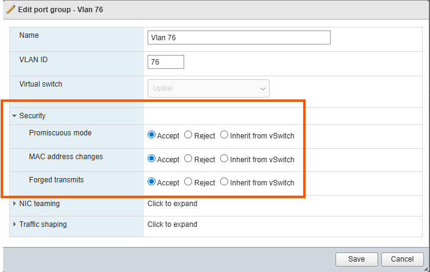

## Network Management Architecture

Each system requires a management subnet that can support 5 system IP addresses as well as 3 IP addresses per managed switch. The breakdown is as follows:

| **IP address Allocations for Management** | **Component**                               | **Allocation**               |
|-------------------------------------------|---------------------------------------------|------------------------------|
| Verity System components                  | vNETC LAN side, SDLC, ACS, GuiA, Satori     | 5 Static Addresses           |
| Managed Switches                          | Verity Switch Controller                    | 1 Dynamic Address per switch |
| Managed Switches                          | Switch in ZTP Process                       | 1 Dynamic Address per switch |
| Managed Switches                          | Switch post ZTP Process                     | 1 Static Address per switch  |

1.  **vNetC**
    1.  Resolvable, fully qualified domain name
    2.  Static IP address, gateway, DNS servers
    3.  Valid Verity license
2.  **SDLC**
    1.  IP addressing per table above. *This must be routable to the vNetC!*
3.  **Controllers (within SDLC)**
    1.  IP Addressing per table above. The diagram above shows that the controllers are bridged to NIC 2 of the SDLC. *The IP must be on the same VLAN/subnet as the SDLC!*
4.  **Satori**
    1.  IP addressing per table above. *This must be routable to the vNetC!*

5.  **Routable or switched network between Verity components and managed switching devices**
    1.  If using a router or firewall between Verity and the switches, the following ports must be allowed to pass.
        1.  Port 8080 for gNMI
        2.  Port 80 - HTTP  (not needed if using TLS option for file downloads)
        3.  Port 443 - HTTPS
        4.  Port 22 - SSH
        5.  Port 161 - SNMP
        6. Port 6343 - sFlow    

## Hypervisor Configuration (Required)

### VMware
VMware systems require this additional network configuration:

- **ESXi**
    1.  Compute resources meeting Verity requirements based on the number of switches being managed. See Resource documentation for computing CPU and memory needs.
    1.  Virtual Switch {: class="pop"}
        1.  The vNetC and SDLC should be on the same virtual switch in ESXi or at minimum they must be routable.
        1.  Your system requires **Promiscuous mode** to be set to **Accept**.
        1.  Your system requires **MAC address changes** to be set to **Accept**.
        1.  Your system requires **Forged transmits** to be set to **Accept**.

### KVM and Proxmox 
KVM and Proxmox systems require this additional network configuration:

 - **KVM**
    1.  Compute resources meeting Verity requirements based on the number of switches being managed. See Resource documentation for computing CPU and memory needs.
    1.  Virtual Switch
        1.  The vNetC, SDLC and Satori should be on the same bridge or at minimum they must be routable.

## Required Files
Obtain the following files from BE Networks:

### VMware Required Files

| **Description**                  | **Filename Example**        | **File Type** | **Notes**     |
|----------------------------------|-----------------------------|---------------|--------------------------|
| **vNetC VM Image**               | vNetC-x_x_x_x.ova           | VMware OVA    | Resources including vCPU and memory should be adjusted based on iVN resource needs documentation. Networking will need to be altered to the correct virtual switch names used in the server |
| **vNetC “core” Upgrade**         | core-x_x_x_x- full.tar      | tarball       | vNetC needs to be updated via GUI SD-Admin immediately after configuration and boot                                                                                                         |
| **SDLC VM Image**                | SDLC-x_x_x_x.ova            | VMware OVA    | Resources including vCPU and memory should be adjusted based on iVN resource needs documentation. Networking will need to be altered to the correct virtual switch names used in the server |
| **SDLC Binary Firmware Upgrade** | firmware-x_x_x_x.tar        | tarball       | SDLC should be upgraded via web page immediately after configuration and boot                                                                                                               |
| **Satori VM Image**          |       satori_x.x.x.ova | VMware OVA    | Resources including vCPU and memory should be adjusted based on iVN resource needs documentation. Networking will need to be altered to the correct virtual switch names used in the server |
| **Satori Software Upgrade**  |       satori_x.x.x.tar | tarball       | Satori needs to be updated via GUI SD-Admin immediately after configuration and boot                                                                                                     |
| **License**                      | license.cms or sitexxxxx.tar                 | License file  | Is uploaded using GUI            |
| **Firmware Upgrade Package**     | firmware-x_x_x_x.tar        | Binary        | SDLC should be upgraded via web page immediately after configuration and boot    |

### KVM & Proxmox Required Files

|**Description**|**Filename Example**|**File Type**|**Notes**|
|-|-|-|-|
|**vNetC VM Image**|vNetC-x_x_x_x.qcow2|KVM qcow|Resources including vCPU and memory should be adjusted based on resource needs documentation. Networking will need to be altered to the correct bridge names used in the server|
|**vNetC “core” Upgrade**|core-x_x_x_x- full.tar|Tarball|vNetC needs to be updated via UI SD-Admin immediately after configuration and boot|
|**SDLC VM Image**|SDLC-x_x_x_x.qcow2|KVM qcow|Resources including vCPU and memory should be adjusted based on resource needs documentation. Networking will need to be altered to the correct virtual switch names used in the server|
|**Firmware Upgrade Package**|firmware-x_x_x_x.tar|Tarball|SDLC should be upgraded via system upgrader immediately after configuration and boot|
|**Satori VM Image**| satori_x.x.x.qcow2| KVM qcow| Resources including vCPU and memory should be adjusted based on resource needs documentation. Networking will need to be altered to the correct bridge names used in the server|
|**Satori Upgrade Package**|satori_x.x.x.tar| Tarball| Satori should be updated via UI AS-Admin immediately after configuration and boot|
|**License**|license.cms or sitexxxxx.tar | License file| Uploaded using UI|
|**XML Parameters**| vnetc.xml, SDLC.xml and satori.xml| xml | Default files are provided and are edited during the installation process. There are 4 available vNETC xml files covering the use cases of single or multiple NICs along with High Availability options|