---
hide:
- toc

search:
  boost: 100
---


# Verity VM Installation (VMware 7.0.3)

## Introduction

The Verity management and orchestration system is comprised of three functional components, all of which are instantiated as Virtual Machines (VMs). This document describes the installation and configuration of these VMs within a VMWare ESXi server.

## Prerequisites
- [Recommended Network Management Architecture](install-prerequisites.md)
- [VMWare-Specific Network Configuration](install-prerequisites.md#vmware)
- [Required Files](install-prerequisites.md#vmware-required-files)

## Resource Calculator

[Use the Verity VM Resource Calculator to determine system resources.](downloads.md)

## Virtual Machine Overview

Verity’s three VM functional components:

| Virtual Machine | Function |
|-|-|
| **Virtual Network Commander (vNetC)** | Orchestration logic, GUI hosting, northbound RESTful API, and databases.|
| **Software Defined LAN Controller (SDLC)** | The SDLC VM is comprised of a series of containers that map one-to-one to the managed switch devices. Network discovery, device provisioning, and network assurance. The SDLC serves as the abstraction layer between the managed switch and the vNetC by translating the native management protocols into the vNetC’s NETCONF interface and Yang model. |
| **Satori** | The Satori VM is comprised of various containers that collect, process and display the network device details that are managed by Verity. |

### Virtual Machine Topology

Below is the basic VM and hardware topology for reference: 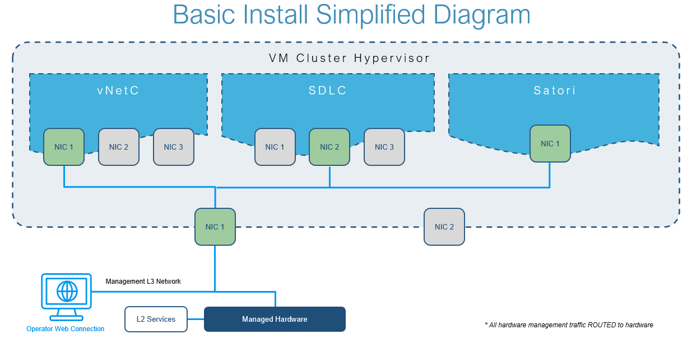{: class="clean"}


<!-- [**Gateway Profiles**](layer-3-templates.md#gateway-profiles) -->
<!-- [Recommended Network Management Architecture](install-prerequisites.md#recommended-network-management-architecture) -->

<!-- Each system requires a management subnet that can support 5 system IP addresses as well as 3 IP addresses per managed switch. The breakdown is as follows:

| **IP address Allocations for Management** | **Component**                               | **Allocation**               |
|-------------------------------------------|---------------------------------------------|------------------------------|
| Verity System components                  | vNETC LAN side, SDLC, ACS, GuiA, Satori     | 5 Static Addresses           |
| Managed Switches                          | Verity Switch Controller                    | 1 Dynamic Address per switch |
| Managed Switches                          | Switch in ZTP Process                       | 1 Dynamic Address per switch |
| Managed Switches                          | Switch post ZTP Process                     | 1 Static Address per switch  |

The orchestration platform (vNETC) is configured on the customer’s network with one static IP address to be accessed by users. -->

!!! warning "Public IP Addresses"

    The standard installation assumes private IP addresses are use by the Verity components and the managed switches. If that is not the case, refer to details in the section "Configure vNetC from the Console" below.


The following diagram shows the recommended management network architecture. Variations are possible based on individual customer’s network needs. 

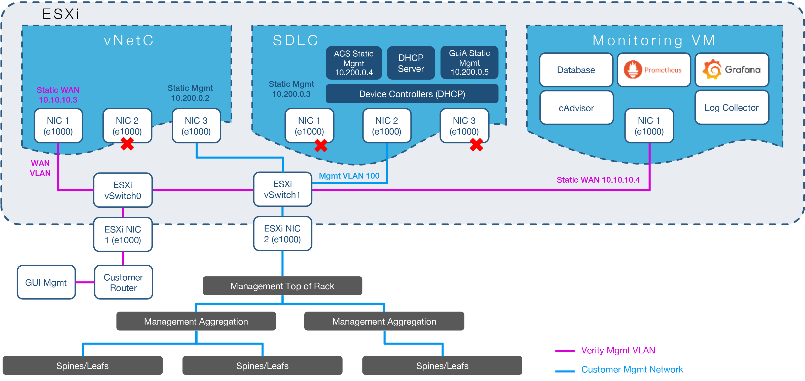{: class="clean"}

<!-- ## Prerequisites

1.  **vNetC**
    1.  Resolvable, fully qualified domain name
    2.  Static IP address, gateway, DNS servers
    3.  Valid Verity license
2.  **SDLC**
    1.  IP addressing per table above. *This must be routable to the vNetC!*
3.  **Controllers (within SDLC)**
    1.  IP Addressing per table above. The diagram above shows that the controllers are bridged to NIC 2 of the SDLC. *The IP must be on the same VLAN/subnet as the SDLC!*
4.  **Satori**
    1.  IP addressing per table above. *This must be routable to the vNetC!*
5.  **ESXi**
    1.  Compute resources meeting Verity requirements based on the number of switches being managed. See Resource documentation for computing CPU and memory needs.
    2.  Virtual Switch
        1.  The vNetC and SDLC should be on the same virtual switch in ESXi or at minimum they must be routable.
        2.  Your system requires **promiscuous mode** to be set to enabled.
6.  **Routable or switched network between Verity components and managed switching devices**
    1.  If using a router or firewall between Verity and the switches, the following ports must be allowed to pass.
        1.  Port 8080 for gNMI
        2.  Port 80 - HTTP
        3.  Port 443 - HTTPS
        4.  Port 22 - SSH
        5.  Port 161 - SNMP

### Obtaining the vNetC, SDLC and Satori VM Images and Files

Obtain the following files from BE Networks:

| **Description**                  | **Filename Example**        | **File Type** | **Notes**     |
|----------------------------------|-----------------------------|---------------|--------------------------|
| **vNetC VM Image**               | vNetC-x_x_x_x.ova           | VMware OVA    | Resources including vCPU and memory should be adjusted based on iVN resource needs documentation. Networking will need to be altered to the correct virtual switch names used in the server |
| **vNetC “core” Upgrade**         | core-x_x_x_x- full.tar      | tarball       | vNetC needs to be updated via GUI SD-Admin immediately after configuration and boot                                                                                                         |
| **SDLC VM Image**                | SDLC-x_x_x_x.ova            | VMware OVA    | Resources including vCPU and memory should be adjusted based on iVN resource needs documentation. Networking will need to be altered to the correct virtual switch names used in the server |
| **SDLC Binary Firmware Upgrade** | firmware-x_x_x_x.tar        | tarball       | SDLC should be upgraded via web page immediately after configuration and boot                                                                                                               |
| **Satori VM Image**          |       satori_x.x.x.ova | VMware OVA    | Resources including vCPU and memory should be adjusted based on iVN resource needs documentation. Networking will need to be altered to the correct virtual switch names used in the server |
| **Satori Software Upgrade**  |       satori_x.x.x.tar | tarball       | Satori needs to be updated via GUI SD-Admin immediately after configuration and boot                                                                                                     |
| **License**                      | license.cms or sitexxxxx.tar                 | License file  | Is uploaded using GUI            |
| **Firmware Upgrade Package**     | firmware-x_x_x_x.tar        | Binary        | SDLC should be upgraded via web page immediately after configuration and boot    | -->

## Install vNetC VM

1.  Go to **Virtual Machines**.
1.  Click **Create/Register VM**. 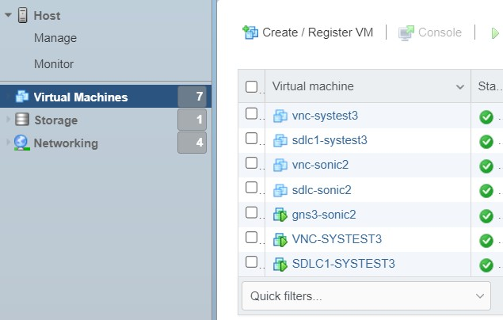{: class="pop"}
1.  In the window that appears select **Deploy a virtual machine from an OVF or OVA file**. 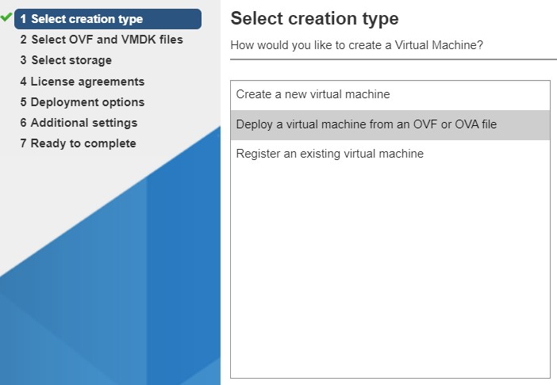{: class="pop"}
1.  Click Next.
1.  Enter a name for the VM and upload the vNetC VM Image OVA file via the prompt that says **Click to Select file or drag/drop**. 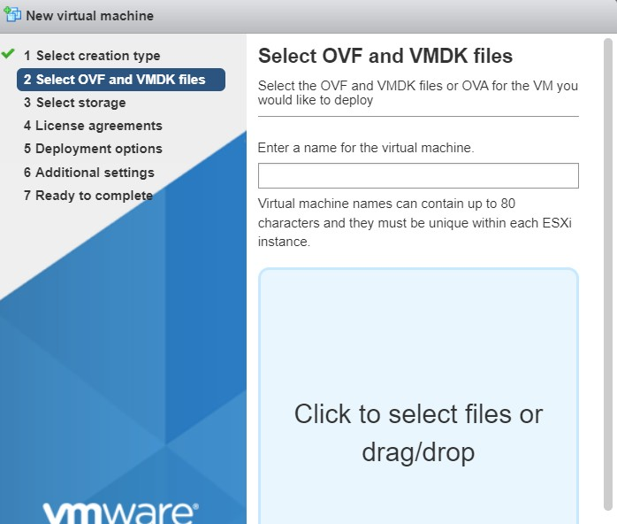{: class="pop"}
1.  Click Next.
1.  Select the desired data store options. Click **Next**. 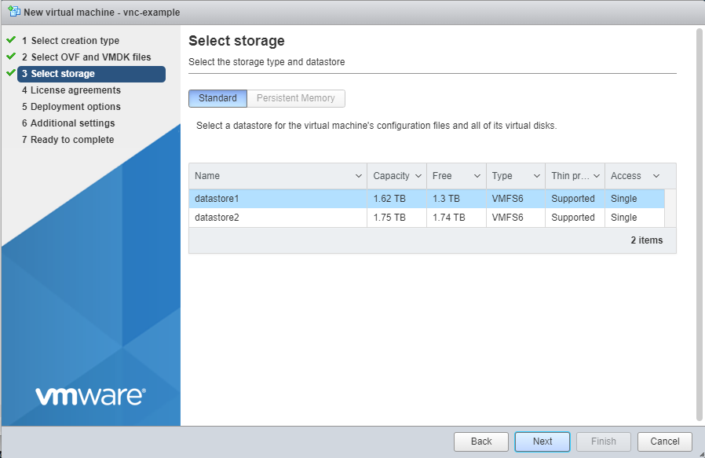{: class="pop"}
1.  Set the Deployment options and network mappings to the correct Port Group. {: class="pop"}. This Port Group must be set to promiscuous mode.
1.  Click **Next**.
1. Review the settings and if they are correct, click **Finish**. 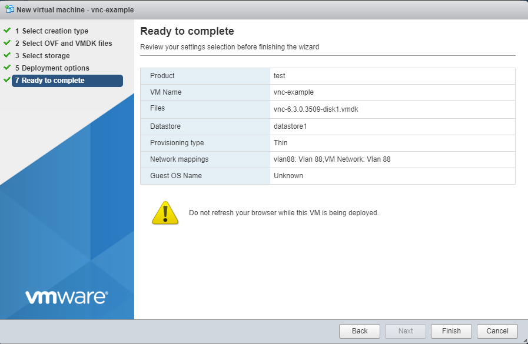{: class="pop"}
1. The VM creation process will start. When the process completes the progress bar in **Recent tasks** at the bottom of the screen will say **Completed Successfully**. 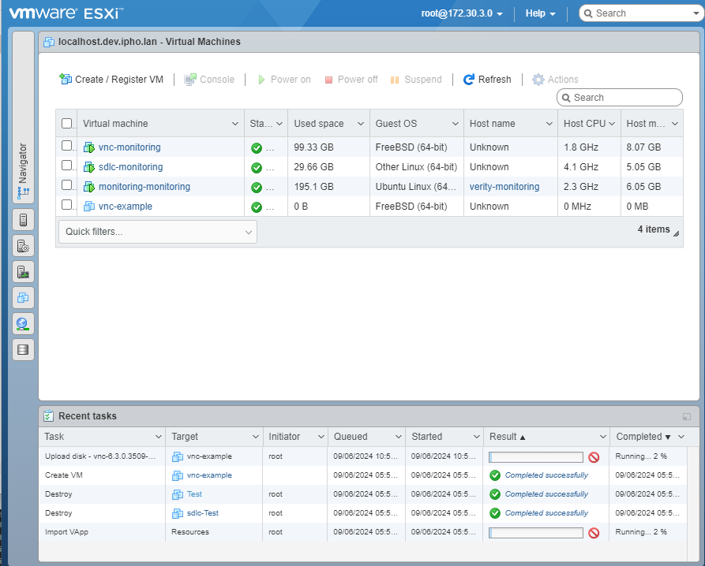{: class="pop"}

### Configure the vNetC from the Console

This step requires you to configure the vNetC with an IP address and Fully Qualified Domain Name (FQDN). To do so, you need to open the VM console.

1.  Select your VM under the **Virtual Machine** column and click **Console**/**Open browser console**. 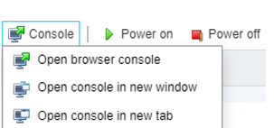{: class="pop"}
1.  The VM console appears. The vNetc initialization may take several minutes. While waiting you can press **Enter** and wait for login prompt. 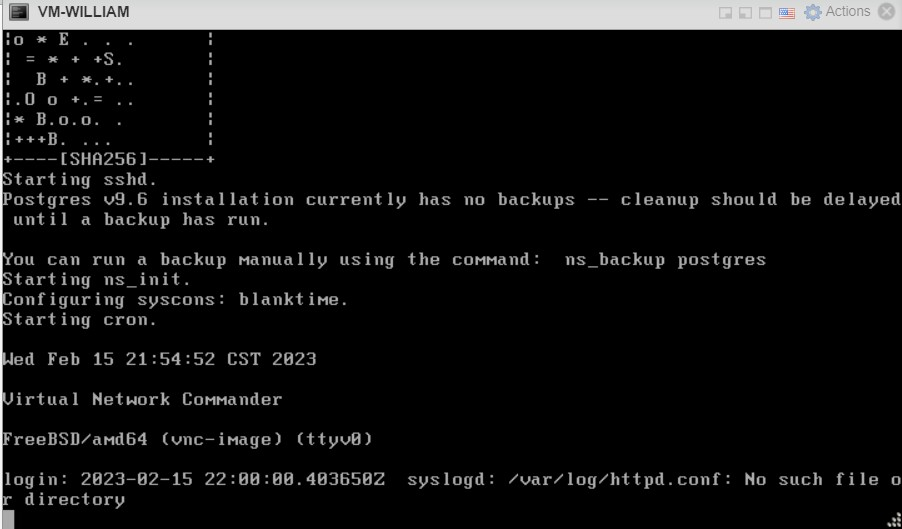{: class="pop"}
1.  Login to the vNetC with username **root** and password **vnc1234**.
1.  Enter a new password if prompted (new password = vnc1234). If not prompted for the password, you can continue to use the default password or change it with the **passwd** command.
1.  Run the administration application from the shell by typing **ns_admin** and pressing Enter. 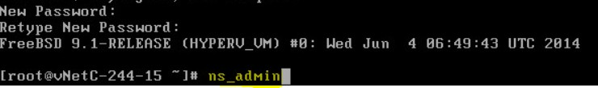{: class="pop"}
1.  You are prompted to enter a web user interface admin account password (ex. admin). Document the password you choose as it will be required for GUI authentication later in the process. It is very important that you remember the password!
1.  Press **Enter** when complete.

1.  In the Admin Menu, select **Network Configuration**. 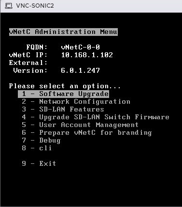{: class="pop"}
1.  Press **Enter**.
1. Select **FQDN (Fully Qualified Domain Name).** Press Enter and set to the desired **Fully Qualified Domain Name.** If the field is prepopulated, it is required that you replace the default text with your own FQDN.
1. Verify that WAN IP DHCP is disabled. If WAN IP DHCP is enabled, disable it using the menu.
1. Select **WAN Static IP Settings,** press enter.
1. Enter the following information:
    1.  IPv4 Address and subnet in CIDR format (x.x.x.x/\#)
    2.  Default Route (Gateway)
    3.  DNS Server 1 & DNS Server 2 (optional)
1. Return to the network configuration menu.
1. Save Settings.
1. Follow the prompt and the VM will reboot with the new settings configured.

!!! warning "Public IP Addresses"

    The standard installation assumes private IP addresses are use by the Verity components and the managed switches. If that is not the case, refer to the instructions below.

1. ssh back into the vNetC as the root user
1. copy the following string and paste into the command line

     ns_vnc_setup --features acs_tunnel=1


### Install the License (required) and Upgrade to the Latest vNetC Core Software

1.  Use Chrome Web Browser to access the vNetC IP address that was just configured.
2.  At the login prompt enter username **admin** and the administration password configured in the menu during installation. These are the credentials you entered in step 3 of **Configure the vNetC from the Console**. 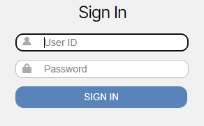{: class="pop"}
3.  When the window appears, record the information on the **Licensing tied to** line. Provide this information to BE Networks to obtain your license file. 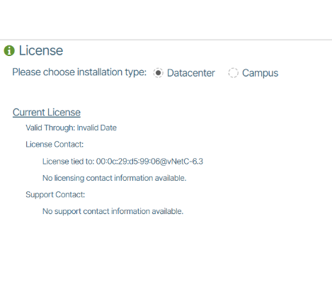{: class="pop"}
4.  After you obtain your license.cms file you are required to upload it to the application. In the License window select **data center** or **campus** (depending on your system). Use the drag and drop palette to upload the file or browse for the file. The license file may also be embedded in a \<filename\>.tar file and this can also be directly imported and the system will extract the license.cms file. {: class="pop"}
5.  After you upload the file make sure a success message is presented. {: class="pop"}
6.  Click the button that says **Yes** to confirm the restart.
7.  After the **Verity** window has fully completed populating select the **Administration** button (lower left).
8.  Select **Software Packages** tab (top of screen) and click **vNetC Packages**.
9.  Using the **Browse Files** (or drag and drop) field, import the **vNetC Core Upgrade** file provided by BE Networks. {: class="pop"} 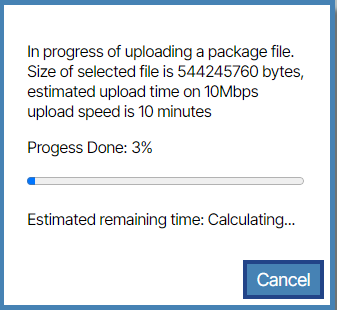{: class="pop"}
10. When the process is complete you are presented with a success message. {: class="pop"} 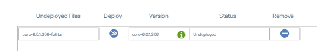{: class="pop"}
11. Click the **Deploy** button.
12. When prompted to continue, click Yes. The software updates. 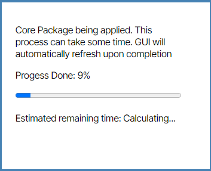{: class="pop"}

!!! warning "Temporary Error Message"

    You may see an error titled **Fatal Error WebSocket Error: Connection lost -2** appear, this is normal. The browser may temporarily say that the site cannot be reached. When the process is done the landing page will render.


1.  If you see a migrations prompt click **Accept**. 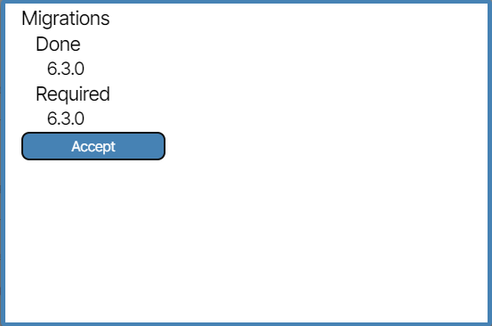{: class="pop"}.
2.  If you see a tan prompt that says **GuiA not attached, no GuiA Switch**, clear the message by clicking it.
3.  The display should look like the following image: 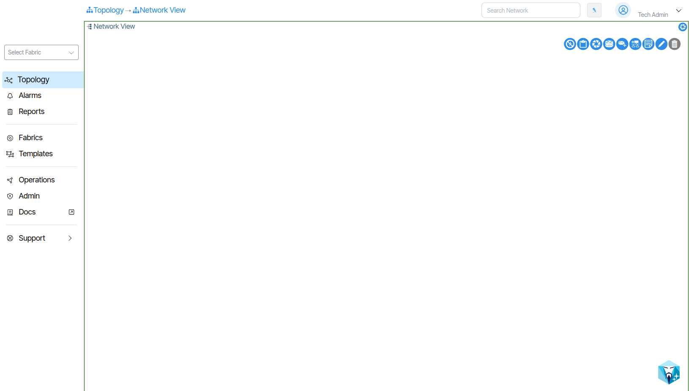{: class="pop"}
4.  Go back to the VNC Console in VMware and type `poweroff` in the CLI. This will cleanly shutdown the VNC. 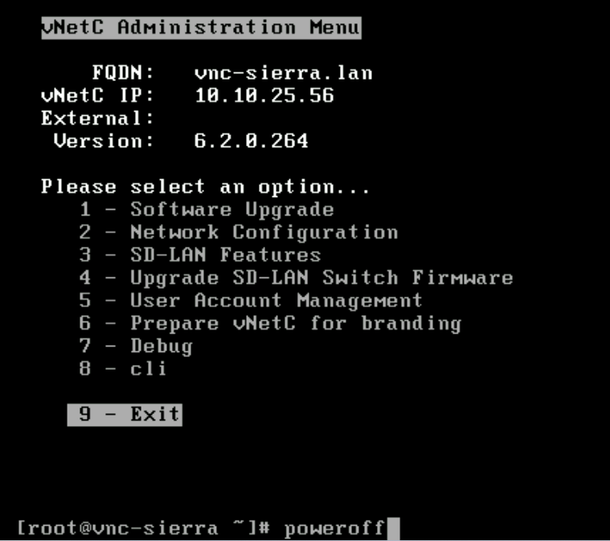{: class="pop"}

!!! success "Congratulations"
 
    You have now successfully installed the VNetC VM.


## Install SDLC VM

!!! warning "SDLC NIC Mapping when using vCenter"

    When deploying the SDLC with vCenter, the NIC to MAC mapping can be remapped, causing connectivity issues with the SDLC and vNetC. If using vCenter to deploy the OVA, check the NIC Mapping on the SDLC by logging in to the SDLC's console, and going to Administration -> Network -> NIC-Map and enter `show` to see mapping: 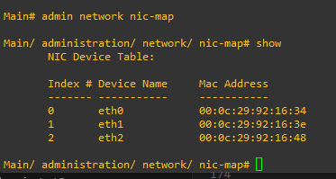{: class="pop"}
    Verify that the MAC Address for the NIC's in the Mapping match with what the MAC Addresses in VMWare say: 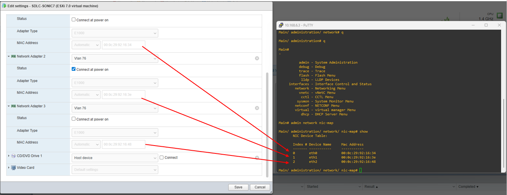{: class="pop"}
    If changes are required, use the `edit` command and select the Index number and map it to the correct MAC Address.

1.  Go to **Virtual Machines**. Click **Create/Register VM**. 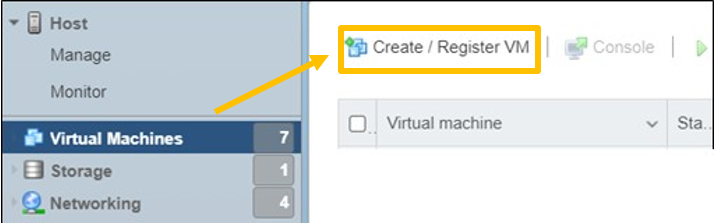{: class="pop"}
1.  In the window that appears select **Deploy a virtual machine from an OVF or OVA file**. 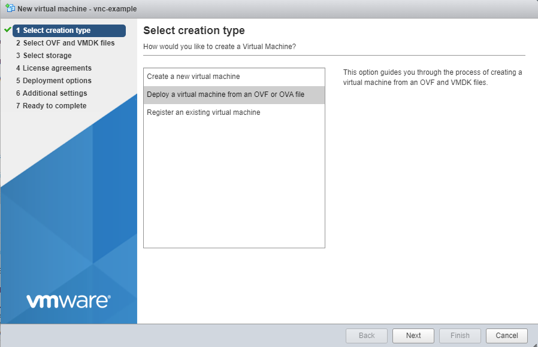{: class="pop"}
1.  Click Next.
1.  Enter a name for the VM and upload the SDLC VM Image OVA file via the prompt that says **Click to Select file or drag/drop**. Click **Next**. 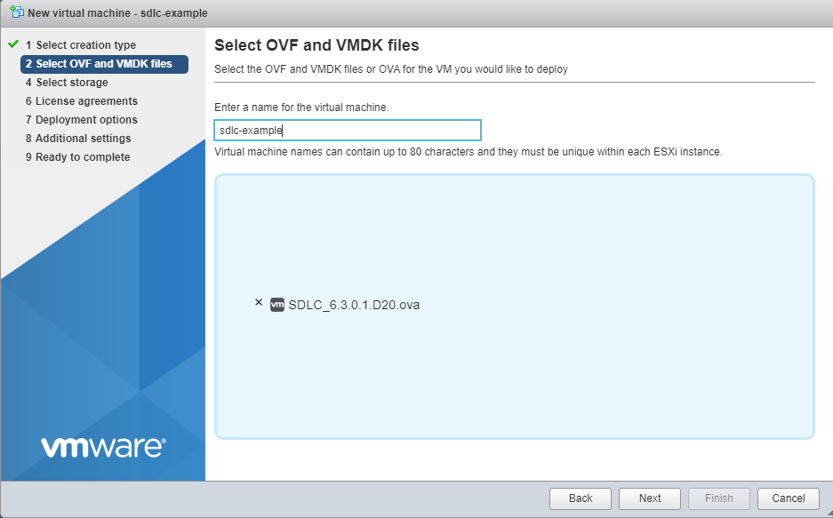{: class="pop"}
1.  Select the desired data store options. Click **Next**. {: class="pop"}
1.  Set the deployment options. Click **Next**. 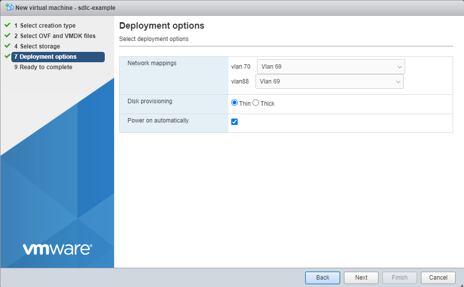{: class="pop"}
1.  Review the settings and if they are correct, click **Finish**. 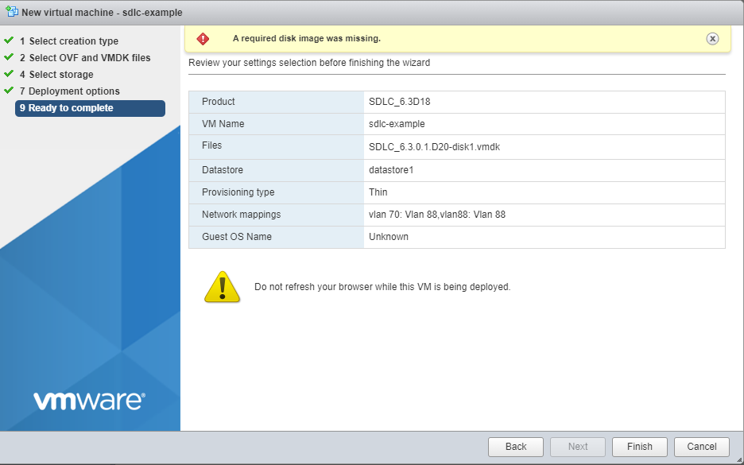{: class="pop"}
1.  The VM creation process will start. Wait until you see the message **Completed Successfully**. 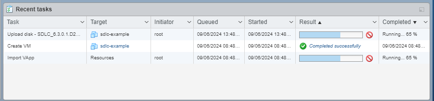{: class="pop"}

### Configure SDLC (Console)

The SDLC must be configured with a Static IP address and the vNetC FQDN.

1.  Select the SDLC from the VMWARE ESXi interface and click the **Console** tab.
1.  Select **Open browser console**. {: class="pop"}
1.  The console appears. 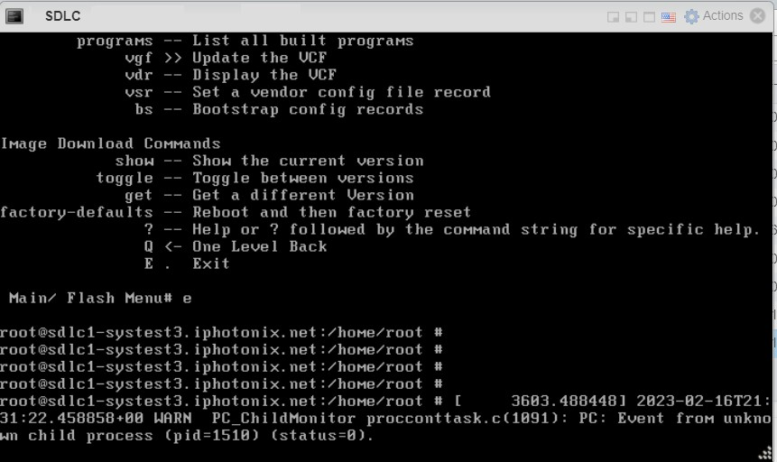{: class="pop"}

    !!! warning "DHCP Error Messages"

        During the following process DHCP errors may appear. These can be ignored.

1.  Press **Enter** to get the login prompt, enter username: **admin** and password: **admin**.
1.  At the command line interface (CLI) press **Enter** to see a list of options.
1.  Select **admin** and press **Enter**.
1.  Type **Wizard** and press **Enter**.

!!! note

    If vNetC and SDLC (GuiA, ACS) are on different subnets, it is recommended to have three consecutive static IP addresses on the same subnet for GuiA, ACS and DHCP. However, if vNetC is on the same subnet as GuiA, ACS and DHCP, it is recommended to use four sequential IP addresses.

| Prompt | Answer |
|---|----|
| **Enter new hostname** | **SDLC**|
| **Enter MGMT IP or enter 'd' to use DHCP** | **Enter management IP** | 
| **Enter URL connection protocol (http, https)** | **http** | 
| **Enter default gateway IP/Prefix in CIDR format** | **Enter the default gateway IP address** |
| **Enter ACS IP or type 'none' to remove config** | **Enter IP** | 
| **Enter vNetC FQDN** or **IP** | **vNetC IP address** | 
| **Enter DNS server** | **Enter DNS server IP**| 
| **Enter comma separated NTP server(s**) | **Enter vNetCs IP address** |
| **Advertise Site Management vlan** | **Enter n** |
| **Enter VnetC post SN** | **Enter N/A** |
| **Enter ACS url** | **Press Enter or Enter a different url** | 

1. Type **y** and press **Enter**
1. Reboot is required for any changes to take effect. In the console, type **reboot** and press **Enter**.

---


### Power On the vNetC

1.  In the VMware ESXi interface power on the vNetC. This takes a few minutes.
2.  Open the GUI and select select the **Admin Settings** option. 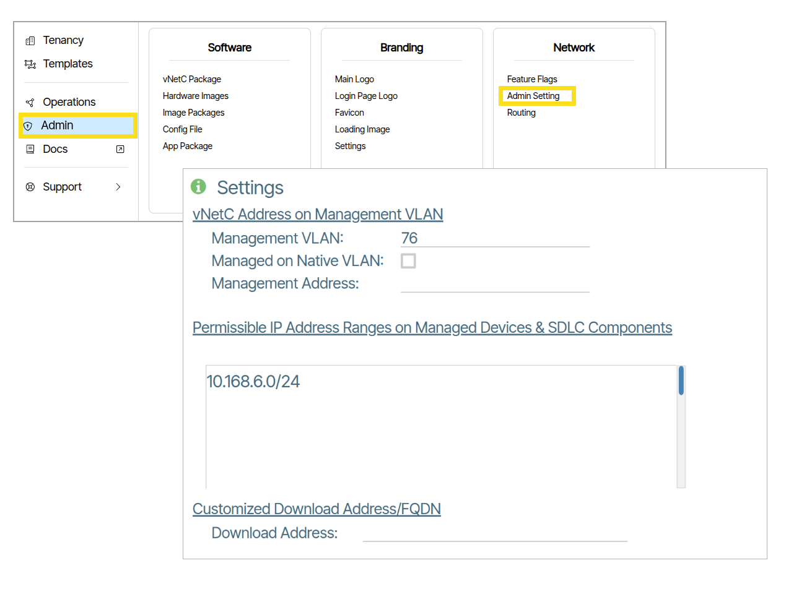{: class="pop"}
4.  Set up the **Management VLAN** used to access the Management network. This field is required even if your management switches are using untagged connections.
5.  For **Permissible IP Address Ranges on Managed Devices** enter the relevant IP address range (IP address and Mask).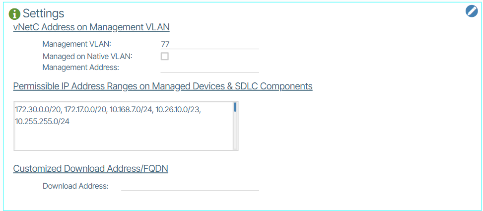{: class="pop"}

    !!! warning "Permissible IP Range Requirement"


         The range entered MUST include SDLC components.


1.  Click the **Save** button to save your settings. ({: class="btn"}).
2.  Wait until the process is finished. The application landing page resembles the image below when all processes have been completed. {: class="pop"}

### Update SDLC

1.  In **Topology/Topology** set the  **Upgrades** selection button to the  **Enable** setting 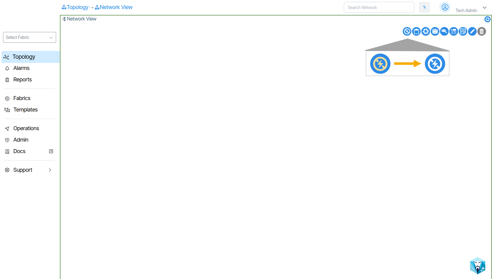{: class="pop"}.
2.  Click the **Admin** tab. Under the **Software Packages** column double-click **Image Packages**.
5.  Select and place the SDLC Binary Firmware Upgrade firmware file on the **Drag & Drop** area or use the **Browse Files** button to select the file. 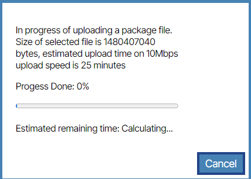{: class="pop"}
6.  When uploaded, you are prompted with a green success message. {: class="pop"}
7.  Deploy the upgrade by clicking the **Deploy** button. 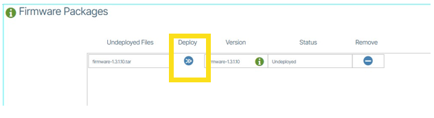{: class="pop"}
8.  A validation message appears. Click **Yes**. 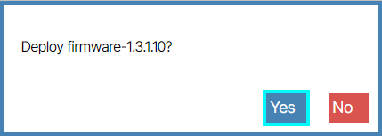{: class="pop"}
9.  Wait while the package is applied. 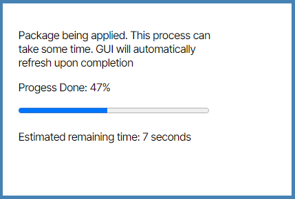{: class="pop"}
10. Click Admin and click **VNFs** . 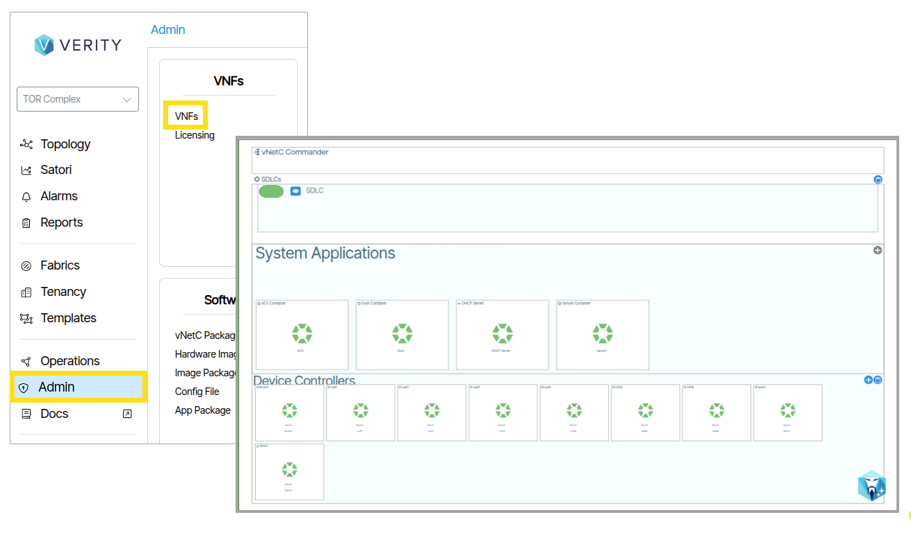{: class="pop"}
11. Double click the **SDLC** section. 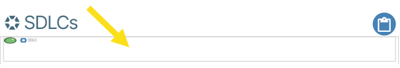{: class="pop"}
12. Double click the box with the title of **SW Version**. 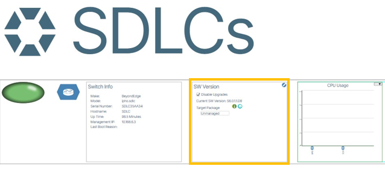{: class="pop"}
13. Set the **Target Package** field to the Firmware version 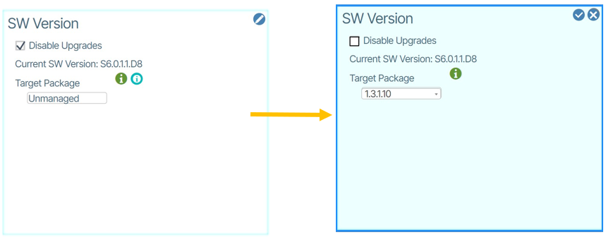{: class="pop"} .
14. Click the **Save** button ({: class="btn"}).
15. Click **Yes** to the validation message. 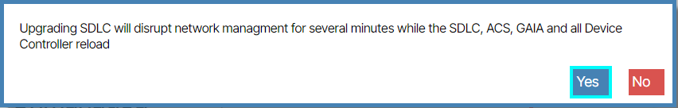{: class="pop"}
16. Let the process complete. 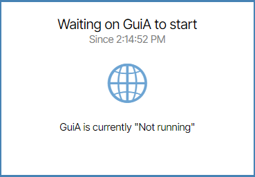{: class="pop"}
17. When the window appears the initial state of **System Applications** are offline. When the **System Applications** come online their LED icons render green. This may take up to 5 minutes. **Admin/VNFs** 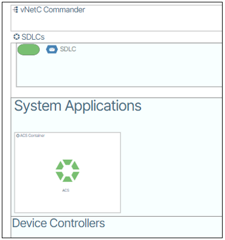{: class="pop"}

## Site Certificate

In order to avoid having to accept the self signed certificate delivered with the system you will need to add a server.pem file to the system. This will need to be obtained from your internet domain administrator.

1.  Go to **Admin**.
2.  Under Certificates click **vNetC Server Certificate**. 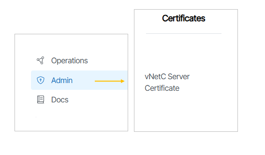{: class="pop"}
3.  Drag and drop the **server.pem** file. 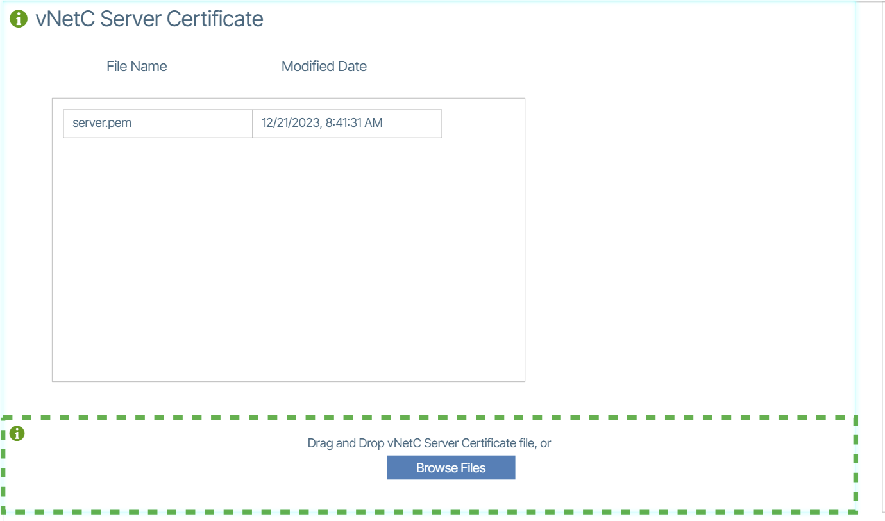{: class="pop"}

## Install Satori VM 

1.  Go to **Virtual Machines**.
2.  Click **Create/Register VM**. 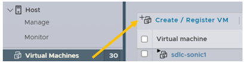{: class="pop"}
3.  In the window that appears select **Deploy a virtual machine from an OVF or OVA file**. 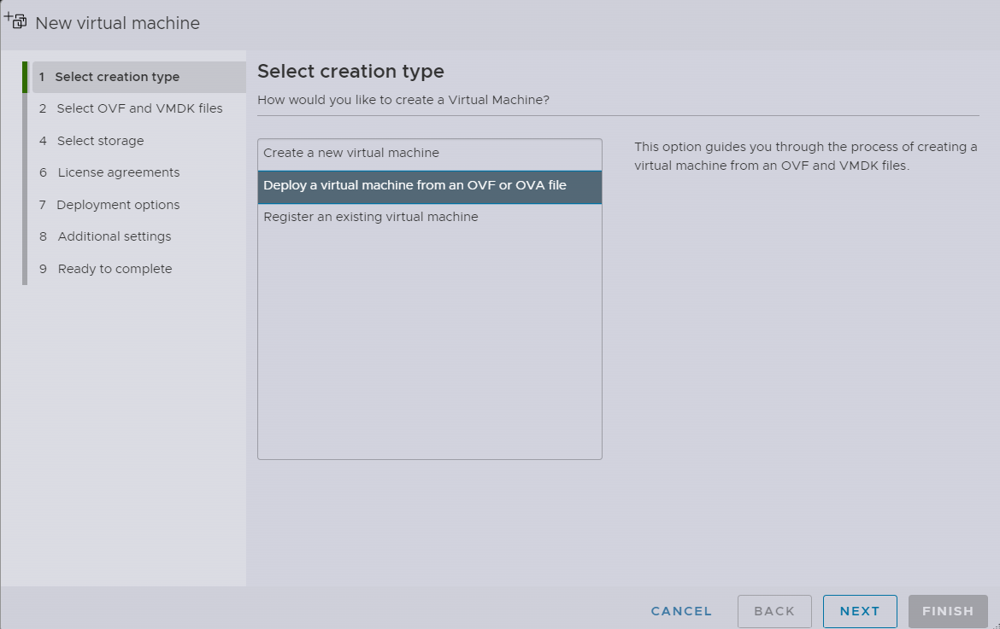{: class="pop"}
4.  Click **Next**.
5.  Enter a name for the VM and upload the Satori VM OVA file via the prompt that says **Click to Select file or drag/drop**. 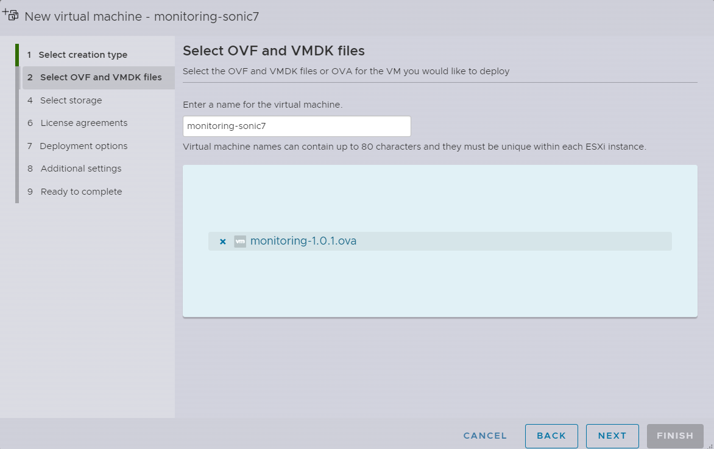{: class="pop"}
6.  Click Next.
7.  Select the desired data store options. 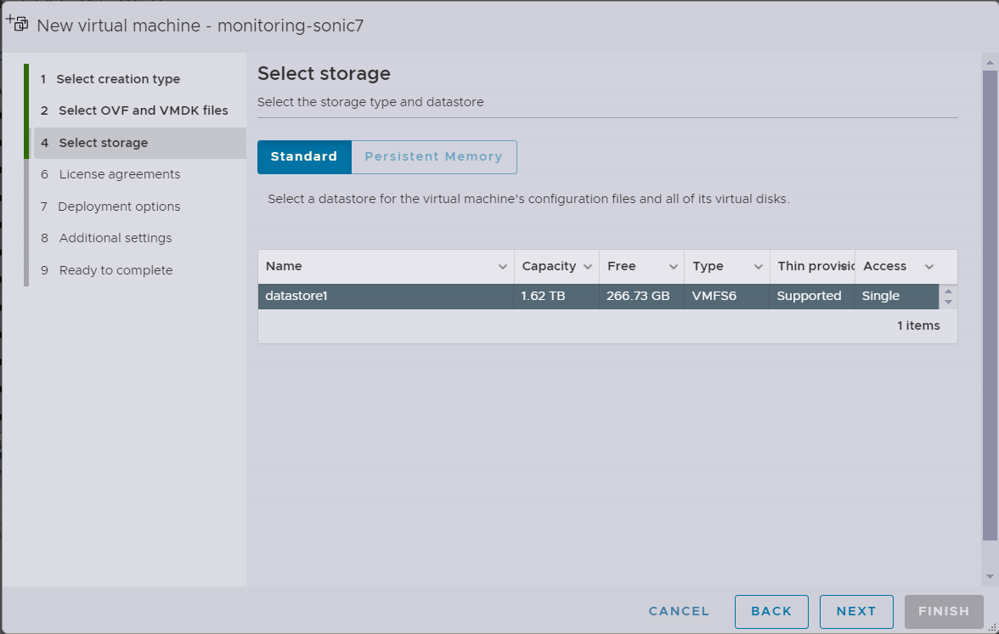{: class="pop"}
8.  Click **Next**.
9.  Set the Deployment options – Network mappings to the correct Port Group.
10. This Port Group must be set to **promiscuous mode**. 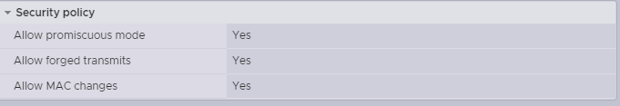{: class="pop"}
11. Click **Next**. 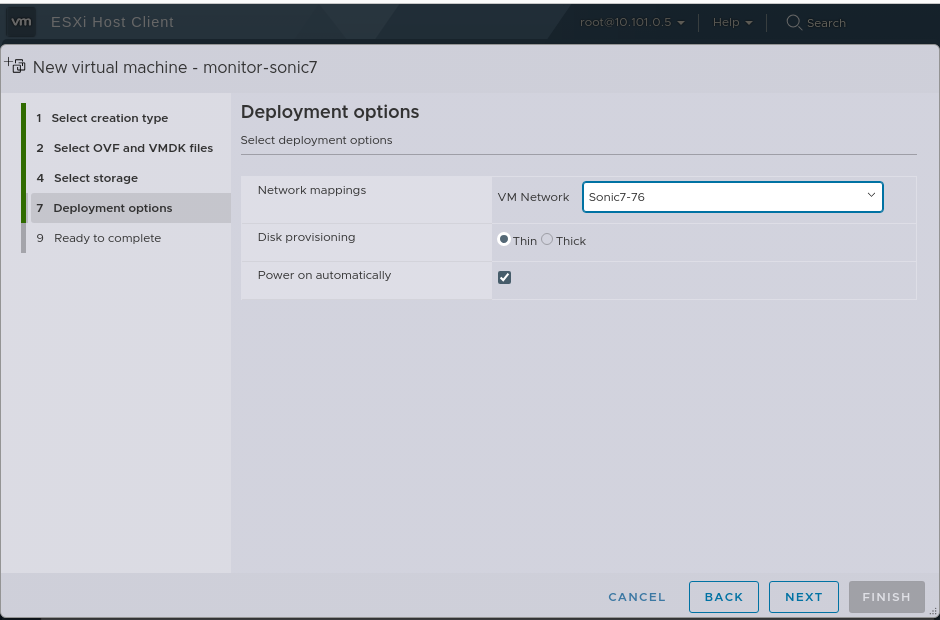{: class="pop"}
12. Review the settings and if they are correct. 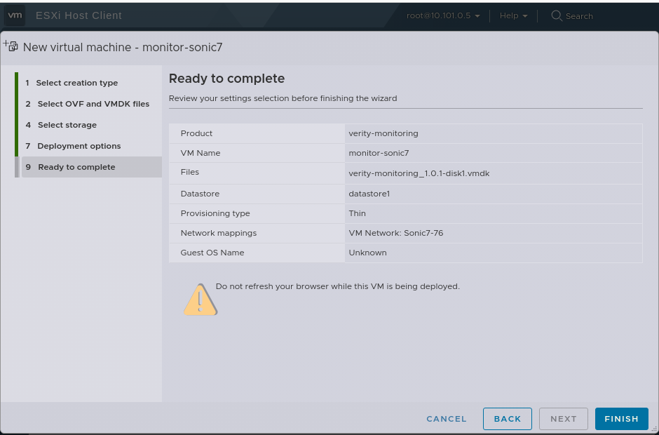{: class="pop"}
13. Click **Finish**.
14. The VM creation process will start. When the process completes the progress bar in **Recent tasks** at the bottom of the screen will say **Completed Successfully**. 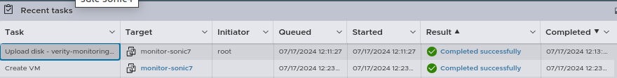{: class="pop"}

## Configure Satori VM (Console)

## Prerequisites
- **Operating System**: Ubuntu Linux (or compatible Linux distribution)
- **Shell**: Bash shell environment
- **Satori Admin Script**: `satori_admin.sh` 
- **Permissions**: Execute permissions on the script file
- **Network Configuration**: You must configure the settings at **Admin/Admin Setting** ({: class="pop"}) to allow access for the subnet where Satori will be installed.
- **Dependencies**: The following scripts must be present in the same directory:
  - `setup.sh` - System setup script
  - `troubleshooting.sh` - Troubleshooting utilities script

## Installation & Setup

This step requires you to configure Satori with an IP address, default gateway, and DNS servers. Then the script will ask for the Fully Qualified Domain Name (FQDN) of the VNetC so it knows how to connect the Satori dashboard. To do so, you need to open the VM console.

1.  Select your VM under the **Virtual Machine** column and click **Console**/**Open browser console**. 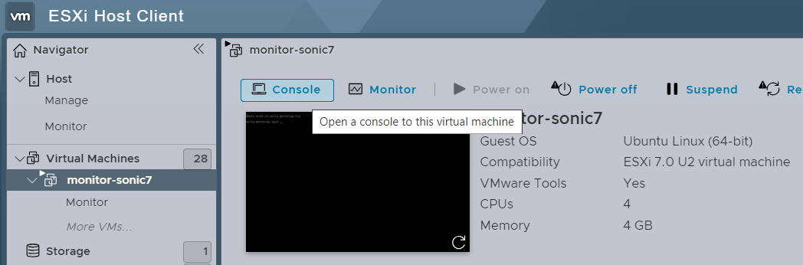{: class="pop"}
2.  The VM console appears. The Satori initialization may take several minutes. While waiting, you can press **Enter** and wait for login prompt. 
3.  Login to Satori with username **verity** and password **vnc1234**.
4.  Enter a new password. Remember this password.
5.  Run the setup application from the shell by typing **sudo ./satori_admin.sh** and pressing Enter. You will see the following interface: 

```
    ****************************************
    Welcome to the Satori Admin Menu 
    ****************************************

    Please choose an option:
    1) setup
    2) troubleshooting
    #? 
```
The two available options are **setup** and **troubleshooting**. 


## Satori Admin Menu

### Option 1: Setup
**Purpose**: Executes the system setup process

**When to Use**: 

  - Initial system configuration
  - Reinstalling or reconfiguring components
  - Setting up new environments


!!! Troubleshooting

     For further information about Troubleshooting, visit the [Troubleshooting section](troubleshooting.md).

### Select Setup
1. When prompted with `#?`, enter the number corresponding to your choice: **1** for `setup`.
2. Press `Enter` to confirm your selection


6.  When prompted, enter the following information:
    1.  IPv4 Address and subnet in CIDR format (x.x.x.x/\#)
    2.  Default Route (Gateway)
    3.  DNS Servers seperated by a comma
7.  Enter the hostname of the server    
8.  Enter the FQDN or IP address of the vNetC host. 
9.  Setup of Satori is complete. The display will show the current settings and provide a message on how to make changes in the future.
10.  Type **sudo reboot** to reboot the VM for all the settings to take effect. After the reboot, it takes about 3 minutes for the Docker containers to start up and to announce itself to the vNetC.
11.  When the Satori VM connects to the vNetC, in Verity, a Growl with the MAC Address of the Satori VM will appear. Once this does, use the refresh button on Chrome. 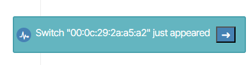{: class="pop"}
12.  There will be a new Satori menu option available. Also, the Satori Dashboard will be the new startup screen. 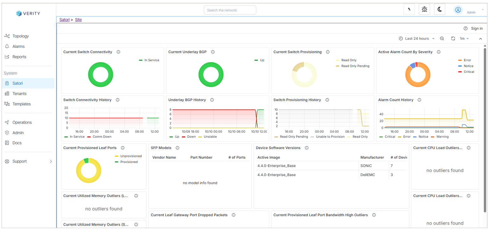{: class="pop"}

### Upgrade to the Latest Satori Software

!!! Warning

    After completing the previous installation steps, the user must install the latest software as outlined below. The installation process is not considered complete until this final step is finished.

1.  Upgrade the Satori software via the vNetC Web Administration.
2.  Use Chrome Web Browser to access the vNetC IP address that was just configured.
3.  At the login prompt enter username **admin** and the administration password configured in the menu during installation. These are the credentials you entered in step 3 of **Configure the vNetC from the Console**. {: class="pop"}
4.  From the **Admin** web page and under the **Software Packages** heading, click **App Packages**. 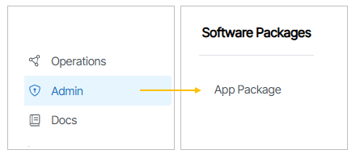{: class="pop"}
5.  Using the **Browse Files** (or drag and drop) field, import the **Satori Upgrade** file provided by BE Networks. {: class="pop"} 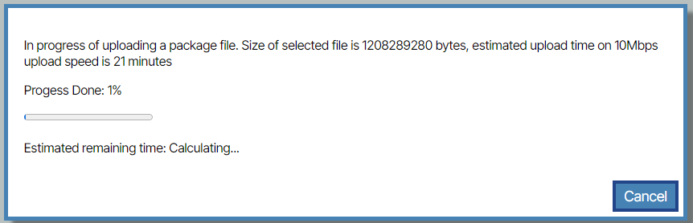{: class="pop"}
6.  When the process is complete you are presented with a success message. 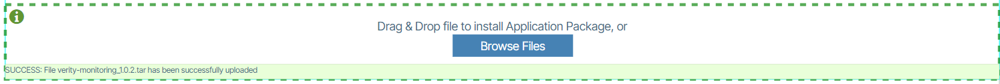{: class="pop"} 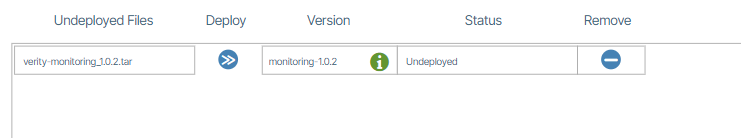{: class="pop"}
7.  Click the **Deploy** button.
8.  When prompted to continue, click Yes. The software updates. 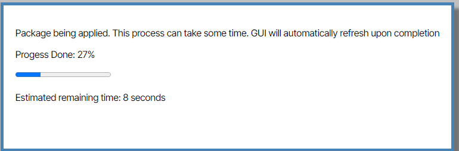{: class="pop"}

!!! note "Wait for System"

    It take about 5 minutes for the tarball to be uploaded to the Satori VM, and the changes to be applied and the new containers started up. If you SSH into the Satori VM, and go to the /be_install directory, you will see the tarball uploaded. If you run sudo docker ps you will see the uptime of the containers to be less than 5 minutes online letting you know that everything is updated. [Tell user how to view Satori version].

!!! success "Congratulations"

    Verity has been successfully installed.  Treat yourself to an iced coffee!


### Satori Advanced Options 


#### Overview

Customer needs Prometheus and AlertManager data forwarded to external sources with TLS security enabled. AlertManager requires alert duplication to a new receiver with added security. Prometheus exposes a built-in `/federate` endpoint for external scraping. A future enhancement to fetch certs from a vault is noted to eliminate manual cert rotation.

**Reference docs:**

- [http_config](https://prometheus.io/docs/alerting/latest/configuration/#http_config-shared)
- [tls_config](https://prometheus.io/docs/alerting/latest/configuration/#tls_config)
- [Federation](https://prometheus.io/docs/prometheus/latest/federation/)
- [TLS encryption guide](https://prometheus.io/docs/guides/tls-encryption/)

---

### Scenario 1 — AlertManager webhook receiver behind TLS

Edit `user-config.yml` (the ytt data values file). Two approaches depending on required control level.

#### Option A — `notification_receiver_integrations` (simplest)

Leverages built-in overlay logic. Auto-creates a receiver **and** a matching route for `job="alarm_manager_notification"` alerts, generating a receiver named `notification-webhook-0` with `continue: true`.

```yaml
# user-config.yml
notification_receiver_integrations:
  webhook_configs:
    - url: "https://customer-noc.example.com/alerts/webhook"
      send_resolved: true
      http_config:
        tls_config:
          ca_file: "/etc/alertmanager/certs/ca.pem"
          cert_file: "/etc/alertmanager/certs/client.pem"
          key_file: "/etc/alertmanager/certs/client-key.pem"
          insecure_skip_verify: false  # set true for self-signed certs (not recommended in prod)
```

#### Option B — `additional_receivers` + `additional_routes` (full control)

Use when custom matchers are needed or alerts beyond `alarm_manager_notification` must be routed.

```yaml
# user-config.yml
additional_receivers:
  - name: customer-tls-webhook
    webhook_configs:
      - url: "https://customer-noc.example.com/alerts/webhook"
        send_resolved: true
        http_config:
          tls_config:
            ca_file: "/etc/alertmanager/certs/ca.pem"
            cert_file: "/etc/alertmanager/certs/client.pem"
            key_file: "/etc/alertmanager/certs/client-key.pem"
            insecure_skip_verify: false
          # basic_auth:          # optional if webhook requires it
          #   username: "verity"
          #   password: "s3cret"

additional_routes:
  - matchers:
      - severity=~"critical|warning"
    receiver: customer-tls-webhook
    continue: true
```

#### Mount TLS certs into the AlertManager container

Add a volume bind in the Docker Compose override so cert files are accessible at the paths referenced above.

```yaml
# docker-compose override
alertmanager:
  volumes:
    - /path/to/customer/certs:/etc/alertmanager/certs:ro
```

#### Re-render and reload after editing

1. Render the final `alertmanager.yml` via ytt:
   ```bash
   ./utilities/render_alertmanager_config.sh
   ```
2. Reload AlertManager (or restart the container):
   ```bash
   curl -X POST http://localhost:9093/-/reload
   ```

---

### Scenario 2 — Customer scraping the Verity Prometheus federate endpoint

The customer adds this job to **their own** Prometheus config to pull selected time-series from the Verity Prometheus instance.

```yaml
# Customer's prometheus.yml
scrape_configs:
  - job_name: 'verity-federation'
    honor_labels: true
    metrics_path: '/federate'
    scrape_interval: 30s
    scrape_timeout: 25s
    params:
      'match[]':
        - '{job="telegraf"}'                        # all telegraf-collected switch metrics
        - '{__name__=~"ALERTS|ALERTS_FOR_STATE"}'   # alert-related metrics
        - '{__name__="ifHCInOctets"}'               # cherry-pick a specific metric
    static_configs:
      - targets:
          - '<verity-prometheus-host>:9090'
    # if Verity Prometheus is behind TLS or basic auth:
    # scheme: https
    # basic_auth:
    #   username: "federation_user"
    #   password: "s3cret"
    # tls_config:
    #   ca_file: "/etc/prometheus/certs/verity-ca.pem"
    #   insecure_skip_verify: false
```

#### Key points

- **`honor_labels: true`** — preserves original `job`, `instance`, etc. labels from Verity instead of overwriting them with the federation job's labels.
- **`match[]`** — scope to only the series needed. Pulling everything (`{__name__=~".+"}`) is expensive and defeats the purpose of federation.
- **`scrape_interval`** — 30s is a reasonable default; should not exceed Verity's own interval (currently 15s for telegraf, 5s for sflow-rt).
- **Firewall** — port `9090` on the Verity Prometheus host must be reachable from the customer's Prometheus. A reverse proxy or VPN tunnel may be needed if the instance is not externally exposed.


## Alert Manager
**Alert Manager** is a configurable tool that allows you to forward Verity *alarm* data to third-party messaging services such as email, PagerDuty, Microsoft Teams, and others.

The following diagram represents the relationship between Verity Alarm Manager, Alert Manager, and an arbitrary collection of connected messaging services.

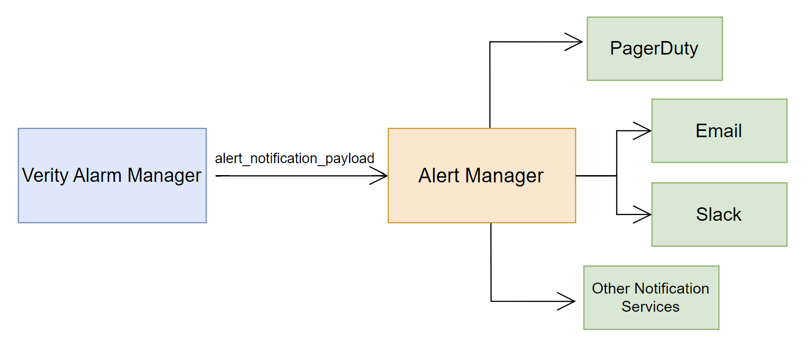


### Process

The process for editing AlertManager is:

1. Edit ```/be_monitoring/alertmanager/user-config.yml``` (email/receiver settings)
2. Run ```/be_monitoring/utilities/render_alertmanager_config.sh``` to apply

Example: Email notifications via SMTP

```
#@data/values
---
smtp:
  smarthost: "smtp.company.com:587"
  from_address: "verity-alerts@company.com"
  auth_username: "verity-alerts@company.com"
  auth_password: "s3cretP@ss"
  require_tls: true

notification_email:
  to: "noc-team@company.com"
  send_resolved: true

```

**Example: Adding a Slack integration**

```
notification_receiver_integrations:
  webhook_configs:
    - url: "https://my-ticketing-system.com/api/alert"
      send_resolved: true
```

**Example: Adding a fully custom receiver + route**

```
additional_receivers:
  - name: critical-pagerduty
    pagerduty_configs:
      - service_key: "abc123"
        send_resolved: true

additional_routes:
  - matchers:
      - severity="critical"
    receiver: critical-pagerduty
    continue: false

```

Applying changes

```
run /be_monitoring/utilities/render_alertmanager_config.sh
```

This:

1. Merges vendor config + user values + overlay via ```ytt```
2. Writes the final alertmanager.yml
3. Reloads Alertmanager via ```POST /-/reload```
4. Persists user configs to ```/be_install/archive/``` for upgrade survival


