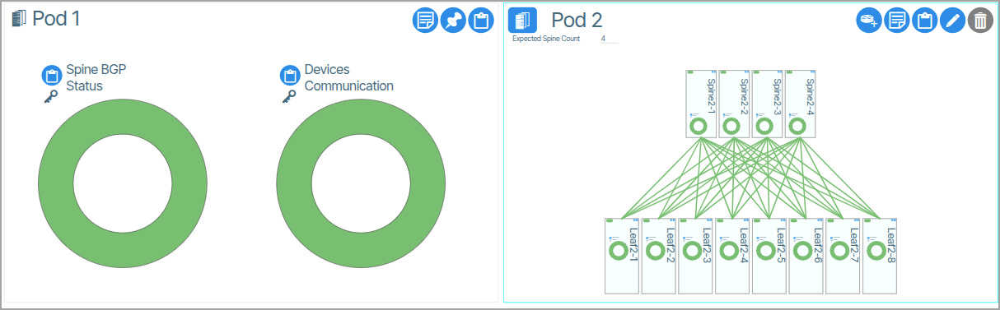
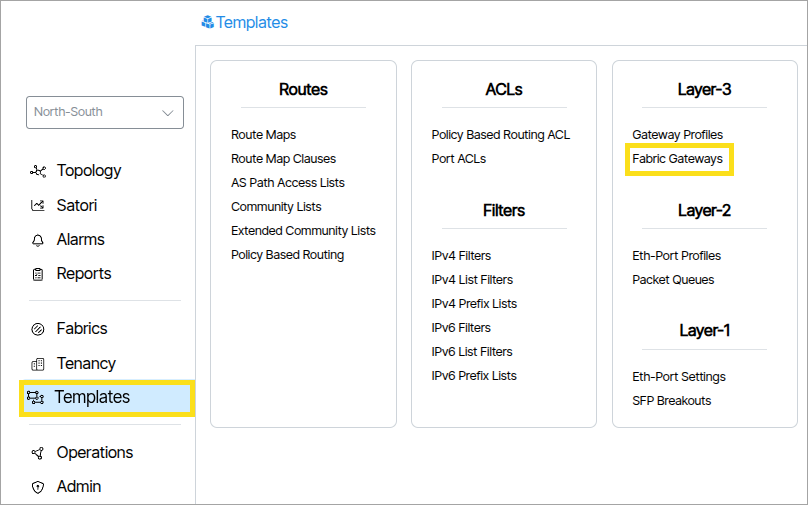
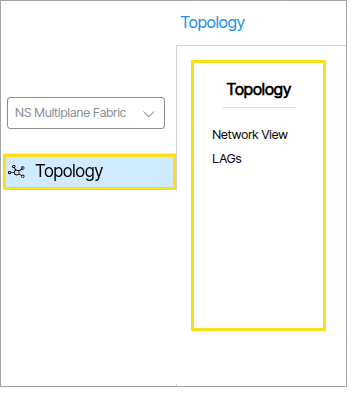
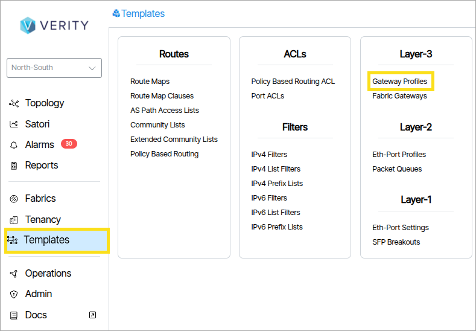
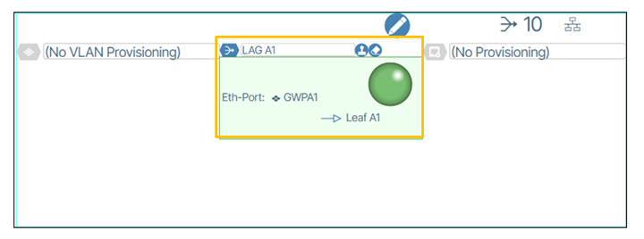
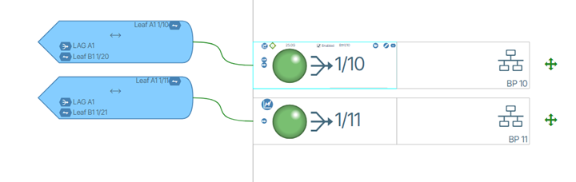

---
hide:
- toc
---
## Inter-POD Gateways

This feature enables underlay BGP connections between PODS in lieu of using the Super Spine layer. The typical use case is for multiple PODs ( {:class="pop"}) managed by a single instance of Verity system that are separate geographical sites.It is recommended that the Leaf switches used for the BGP connections between PODs are not members of an MCLAG pair. 

  
### Creating Site Gateways

The BGP connections are created using **Fabric Gateway** objects found in **Templates/Fabric Gateways**. {:class="pop"} 

A **Fabric Gateway** is required for each end of the BGP sessions planned between the sites. For high availability this requires four site gateways to be created. Each Gateway object requires the Neighbor AS number of the Leaf on the other side of the planned connection, and the IP address that is used on the Gateway Port Profile on the neighbor’s switch. Additionally, the option called “Fabric Interconnect” should be set. {:class="pop"}

### Creating Gateway Profiles

Go to **Templates/Gateway Profiles** to create the needed Gateway Profiles that are used to apply to either ports directly, or indirectly through LAG objects. {:class="pop"}   

Four profiles are required. Each profile references one of the Gateway objects and contains the IP address assigned to the interface that terminates the BGP session on the switch where it will be applied. This IP address communicates with the neighbor IP address specified in the Gateway object.

### Adding a Gateway Profile to a LAG

The Gateway profile can be assigned to a single port or to a LAG. In this example, LAGs are used.
Create an external LAG, set the BGP LAG option, select the Gateway profile {:class="pop"} and assign it to the switch port.
You set the connection in the port editing window under the center form field. {:class="pop"}
