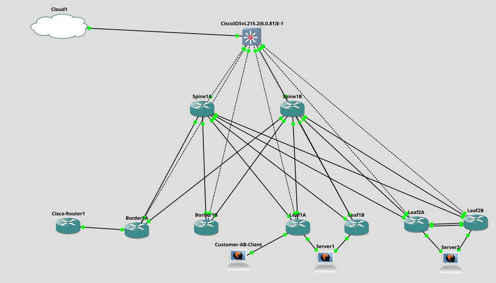

---
hide:
- toc
search:
  exclude: true
---

{width=10%}
# BE Labs
**Welcome to BE Labs, the online Verity evaluation environment!**

This guide will walk you through a quick introduction to Verity and the main components of the solution.

## Lab Diagram

## Requirements

To use this lab you must have the following:

| Item     | Source |
| --------  | ----     |
| **Google Chrome** | Google |
| **BE Labs URL** | BE Networks Solutions Team |
| **Verity Username** | BE Networks Solutions Team |
| **Verity Password** | BE Networks Solutions Team |

## Scenario 1 - Tenancy
In this scenario you will login to Verity, get comfortable with the navigation, and create a new **Tenant** in Verity, including Layer-2 **Services**, and finally a **Gateway**.

### Logging into Verity
1. Enter the **BE Labs URL** in your browser.
1. Enter the **Username** and **Password** provided to login.
1. Wait a moment for the items in the left sidebar to turn black, indicating that the components of the Verity GUI are ready for use.

### Create a Tenant
1. Click **Tenancy** on the left main menu.
1. Click **Tenants**
1. Click **Add** Button in the upper right corner.
1. Enter **"Customer-B"** for the name in the dialog box. Click **Create Tenant** button to create tenant

### Create new Services
1. Click **Tenancy**.
1. Click **Services**.
1. Click **Add** button.
1. Enter **"WWW-B"** as the Service Name in the dialog box. Click **Create Service** button to create the service.
1. Click the **Enable** switch to enable the service for use.
1. From the Tenant drop down menu, select the **Customer-B** tenant.
1. Under **Layer-2**, enter the **VLAN ID** of **3000**.
1. Click **Save** to save the settings for this VLAN.
1. Click **Add** button.
1. Enter **"Database-B"** as the Service Name in the dialog box. Click **Create Service** button to create the service.
1. Click the **Enable** switch to enable the service for use.
1. From the **Tenant** drop down menu, select tenant **Customer-B**.
1. Under **Layer-2** enter the **VLAN ID** of **3001**.
1. Click **Save** to save the settings for this VLAN.
1. Click **Add** button.
1. Enter **"GPUs-B"** as the Service Name in the dialog box. Click **Create Service** button to create the service.
1. Click the **Enable** switch to enable the service for use.
1. From the **Tenant** drop down menu, select the tenant **Customer-B**.
1. Under **Layer-2**, enter the **VLAN ID** of **3002**.
3. Click **Save** to save the settings for this VLAN.

### Create a new Gateway
1. Click **Tenancy**
2. Click **Gateways**
3. Click **+Add** Button
4. Enter **"Cisco-Router"** for the name of the Gateway in the dialog box. Click **Create Gateway** button to create the Gateway.
5. Click the **Enable** switch to enable the service for use.
6. From the Tenant drop down menu, select the **Customer-A** as the Tenant that will manage this Gateway.
7. Select the Gateway mode, Select **Static BGP**
8. Under BGP, enter the Neighbor ASN of **200**. 
    * Enter the Nightbor IP Address. This is **10.2.215.1**.
9. Click Save to save the settings for this Gateway.

## Scenario 2 - Provision Ports

This Demonstration will show how to apply the Tenants, Services and Gateways to a profile, and apply the profiles to ports.

### Creating an Eth-Port Profile (L2 Services template).
1. Click **Templates**
2. Under Layer-2, click **Eth-Port Profiles**
3. Click **+Add** button
4. Name the Eth-Port Profile **"Database Server"** in the dialog box. Click the **Create Eth-Port Profile** button to create the profile.
5. Click the **Enable** switch to enable the profile for use.
6. Under Services, from the **Service** Pull-down menu, select **Database-B** service.
    * Check **Enabled** to enable the service
    * From the **External VLAN** pull-down menu, select **From Service**.
7. Under Services, from the **Service** Pull-down menu, select **Database-A** service.
    * Check **Enabled** to enable the service
    * From the External VLAN pull-down menu, select **From Service**.
8. Click **Save** to save the settings for this Eth-Port Profile.
9. Click **+Add** button
10. Name the Eth-Port Profile **"GPU Server"** in the dialog box. Click the **Create Eth-Port Profile** button to create the profile.
11. Click the **Enable** switch to enable the profile for use.
12. Under Services, from the **Service** Pull-down menu, select **GPUs-A** service.
    * Check **Enabled** to enable the service
    * From the **External VLAN** pull-down menu, select **From Service**.
13. Under Services, from the **Service** Pull-down menu, select **GPUs-B** service.
    * Check **Enabled** to enable the service
    * From the External VLAN pull-down menu, select **From Service**.
14. Click **Save** to save the settings for this Eth-Port Profile.
15. Click **+Add** button
16. Name the Eth-Port Profile **"WWW Server"** in the dialog box. Click the **Create Eth-Port Profile** button to create the profile.
17. Click the **Enable** switch to enable the profile for use.
18. Under Services, from the **Service** Pull-down menu, select **WWW-A** service.
    * Check **Enabled** to enable the service
    * From the **External VLAN** pull-down menu, select **From Service**.
19. Under Services, from the **Service** Pull-down menu, select **WWW-B** service.
    * Check **Enabled** to enable the service
    * From the External VLAN pull-down menu, select **From Service**.
20. Click **Save** to save the settings for this Eth-Port Profile.

### Creating a Gateway Profile (L3 Services template).
1. Click **Templates**
2. Under Layer-3, click **Gateway Profiles**
3. Click **+Add** button
4. Name the Gateway Profile **"GW-AS200"** in the dialog box. Click the **Create Gateway Profile** button to create the profile.
5. Click the **Enable** switch to enable the profile for use.
6. Under External Gateways, from the **External Gateway** Pull-down menu, select **Cisco-Router** gateway.
    * Check **Enabled** to enable the gateway
    * From the **Source IP/Mask** text field, enter **"10.2.215.2/24"**
7. Click **Save** to save the settings for this Gateway Profile.

### Creating an External LAG
1. Click **Topology**
2. Click **Topology** again to get the Topology Menu.
3. Click **LAGs**
4. Double click **External LAGs** Box
5. Click the **+** Button to create a new Port Channel Configuration
6. Name the LAG **"Server1 LAG"** and click **Save**
7. Click **Edit** to edit the settings for the LAG.
8. Check **Enable** to enable the Port Channel for use.
9. Under the **Provisioning** Pull-down menu, select **Database Server**
10. Click **Save**
11. Click the **Network External LAGs** Breadcrumb link on the top of the browser pane.
12. Click the **+** Button to create a new Port Channel Configuration
13. Name the LAG **"Server2 LAG"** and click **Save**
14. Click **Edit** to edit the settings for the LAG.
15. Check **Enable** to enable the Port Channel for use.
16. Under the **Provisioning** Pull-down menu, select **WWW Server**
17. Click **Save**

### Assigning the External LAG to an interface port.
1. Click **Topology**
2. Click **Network View**
2. Double-click **Leaf1A** to zoom in and see interface details of Leaf1A.
3. Double-click the gray **Port Provisioning Box** next to port **1/5**, **BP 5**
4. Click the **Edit** button
    * From the **(No Provisioning)** Pull-down menu, scroll to the bottom to **LAG** and select **Server1 LAG**
	* Click **Save** button to assign the LAG
	   * A dialog box will pop up, click **Yes** button to continue.
5. Click **Network View** Breadcrumb link on the top of the browser pane. 
6. Double-click **Leaf1B** to zoom in and see interface details of Leaf1B.
7. Double-click the gray **Port Provisioning Box** next to port **1/5**, **BP 5**
8. Click the **Edit** button
    * From the **(No Provisioning)** Pull-down menu, scroll to the bottom to **LAG** and select **Server1 LAG**
	* Click **Save** button to assign the LAG
	   * A dialog box will pop up, click **Yes** button to continue.
9. Click Yes button to confirm and apply the settings to the switch.
10. The switches will change color to Green letting the user know that the system is provisioing the changes to the devices. Once complete, the devices will return to their normal "white" color.
11. Click **Network View** Breadcrumb link on the top of the browser pane. 
12. Double-click **Leaf2A** to zoom in and see interface details of Leaf2A.
13. Double-click the gray **Port Provisioning Box** next to port **1/5**, **BP 5**
14. Click the **Edit** button
     * From the **(No Provisioning)** Pull-down menu, scroll to the bottom to **LAG** and select **Server2 LAG**
	 * Click **Save** button to assign the LAG
	    * A dialog box will pop up, click **Yes** button to continue.
15. Click Yes button to confirm and apply the settings to the switch.
16. The switches will change color to Green letting the user know that the system is provisioing the changes to the devices. Once complete, the devices will return to their normal "white" color.
17. Click **Network View** Breadcrumb link on the top of the browser pane. 
18. Double-click **Leaf2B** to zoom in and see interface details of Leaf2B.
19. Double-click the gray **Port Provisioning Box** next to port **1/5**, **BP 5**
20. Click the **Edit** button
     * From the **(No Provisioning)** Pull-down menu, scroll to the bottom to **LAG** and select **Server2 LAG**
	 * Click **Save** button to assign the LAG
	    * A dialog box will pop up, click **Yes** button to continue.
21. Click Yes button to confirm and apply the settings to the switch.
22. The switches will change color to Green letting the user know that the system is provisioing the changes to the devices. Once complete, the devices will return to their normal "white" color.
23. Click **Topology**
24. Click **LAGs**
25. Double-click **External LAGs** to see the LAG status of the newly assigned and configured LAGs.
     * Double-click **Server1 LAG**
	 * Note that this LAG is configured automatically as an **ESI Mulithome** and that the links are green and online and passing traffic normally.
26. Click the **Network External LAGs** Breadcrumb link at the top of the pane to zoom back to the External LAGs view.
27. Double-click **Server2 LAG**
     * Note this is a normal Port Channel configuration since the underlying Leaf switches are a MCLAG pair and does not support ESI Multihoming. 
	 * Also note that the links are green and online and passing traffic normally.

### Assigning the Gateway Profile to a Border Gateway
1. Click **Topology**
2. Click **Network View**
3. Double-click **Border1A** to zoom in and see interface details of Border1A.
4. Double-click the gray **Port Provisioning Box** next to port **1/5**, **BP 5**
5. Click the **Edit** button
    * From the **(No Gateway Profile)** Pull-down menu, scroll to the bottom and select **GW-AS200**
	* Click **Save** button to assign the Gateway Profile
	   * A dialog box will pop up, click **Yes** button to continue.
6. The switch will turn green showing that it is provisioning the switch. It will show a hex box with a red line saying *Unmanaged Gateway Detected*. The red line connecting to it will turn Green when the BGP Session between the routers is active and passing neighbor and network information.
7. Click **Reports**
8. Under **Layer-3** Menu, select **External BGP Connections**
9. This report will show the neighbor information and under **BGP Status** it will be Green and say *ESTABLISHED*.
10. Click **Reports** to go back to the Reports Menu.
11. Under **Layer-3** Menu, select **Tenant Route Tables**
12. Under the **Route** column, click the **Switch Filter to Use Wildcard Input** button.
     * In the text box that appears, enter **"10.200.*"**
	 * Note that under the **Origin** Column it has the Cisco Routers IP address and the Gateway profile under **Origin Location**. This shows that the advertised routes from the Cisco Router and network are forwarding into the Routing Tables of the switches.

## Scenario 3 - Time Traveler

This demonstration is to show how to use the Time Traveler feature in Verity to create a snapshot of the current intended network configuration, compare the snapshot to the previous snapshot, and how to restore a time traveler snapshot.

### Create a new Time Traveler Snapshot
1. Click **Operations**
2. Under **Version Control**, click **Time Traveler**
3. Click the **"+"** Button in the top left corner of the Time Traveler pane to create a new Time Traveler Snapshot.
4. Give the backup a name like **Backup of System**. The Name must be unique.
    * *(Optional)* Add a note to the backup so other users know what it is for.
    * Click the **Save** icon to save the snapshot
5. The Time Traveler backup will be at the top of the list of backups.

### Compare the Time Travler backup with the previous backup
1. Click the **Compare to previous backup** button
2. In the Backup Compare Options, verify all items are checked.
3. Click the **Compare** button
4. You are presented with a simple report detailing the differences between the backups, including Services, tenants, gateways, provisioned ports, templates, profiles and configuration changes that have happened between the backups. 
5. Click **View Details** button 
    * This is the detailed report that allows users to click and drill in to the specific changes to get finer details of the backup differences.
6. Click the **Cancel** button to close the report and return to the Time Traveler Dashboard

### Restore a Time Traveler snapshot
1. Click the **Restore Network Time Traveler Backup** button.
2. In the **Backup Import Options**, verify all options are selected.
3. Click the **Import...** button
    * A dialog box appears warning the user that importing Switches, can re-provision LAG configurations, which can lead to instability. Click **Yes** to proceed.
4. A report of what will be restored and the changes will be displayed
    * *(Optional)* You can click **View Details** button to see all the specific details of what will be restored.
5. Click the **Begin Import** button to start the recovery process.
6. Verity automatically puts the system into **World Read-only** mode when doing a recovery so that users can verify and validate any changes to the devices before implementing the changes. If everything looks correct, remove the **World Read-only** option by performing the following:
    1. Click **Topology**
    2. Click **Network View**
    3. Ensure you are at the root level view of the Network View but clicking the **Network View** Link in the Topology Breadcrumb.
    4. Click the **Read-only** button in the upper right corner.
    5. Confirm you want to take the system out of read only and click **Yes**.
7. The system will be placed in to normal Read/Write mode and provision the devices as they are intended from the Time Traveler Backup.

## Scenario 4 - Viewing Configs
This demonstration will show how to view a specific switches Running-Configuration in Verity.
1. Click on **Topology**
2. Click on **Network View**
3. Double Click the switch you want to see the running-configuration on.
4. Double Click the top box of the switch to zoom in to the **Switch Details** view.
5. Click the **Click to see current switch configuration** Button in the upper right corner.
6. In the Configuration window, from the **Type:** Pull-down menu, select **Target Running**
    * This shows the current target-running configuration on the switch.
7. When finished reviewing, click the **Close** button in the upper right corner to close the configuration pane.

## Scenario 5 - Observability

This demonstration will show how to navigate to Satori, and how to move between the different dashboards (Site, switch and Port views)

### Navigating to Satori and the Main Site View
1. Click **Satori**
2. Click **Site**
    * This is the overall site view of Satori. This view provides users with a zoomed out view of all the metric and telemetry information collected at the Site level. Dashboards in this view consist of:
      * Summary:
	     * Switch Connectivity
	     * Underlay BGP Status
	     * Switch Provisioning Status
	     * Active Alarm counts by severity
	     * Provisioned Leaf Ports
	     * Provisioned Leaf Port Bandwidth High Usage
	     * Leaf Gateway Port Dropped Packets
	     * CPU Load Outliers by Spine
	     * CPU Load Outliers by Leaf
	     * Utilized Memory Outliers by Leaf
	     * Utilized Memory Outliers by Spine
	  * Hardware:
	     * Device Software Versions used 
	     * SFP Models used and counts
	  * sFlow:
	     * Top Talkers by source
	     * Top Talkers by destination
	     * Conversation Traffic over time
	     * Underlay Conversations
	   
### Navigating to the Switch View in Satori
1. Click **Satori**
2. Select **Switch**
3. From the **Switch** Drop-down menu, select which switch you want to view.
    * This is the Switch specific view in Satori. This view provides users with switch specific details based on which switch the user selects. It consists of the following dashboards:
      * Summary:
	     * Device Details
	     * An image of the switch
	     * CPU Usage
	     * Available Memory
	     * Active Alarms
	     * Sensor Temperatures
	     * Component Status like fans and PSU's
	     * Gateway Port Dropped Packets
	     * Total provisioned ports on the switch
	     * SFP models used by the switch
	  * Port Statistics:
	     * Shows only the current provisioned ports and their stats.
	  * Port Errors:
	     * Show errors on current provisioned ports
	  * Port Packets/Second
	     * Shows the current packets/second on the provisioned ports
	  * TCAM Resource Usage:
	     * IPv4 Resource Usage
	     * IPv6 Resource Usage
	     * Nexthop Resource Usage
	     * FDB Usage
	     * Source NAT Usage
	     * Destination NAT Usage
	     * ACL Egress/Ingress per LAG usage
	     * ACL Egress/Ingress per Port usage
	     * ACL Egress/Ingress RIF Usage
	     * ACL Egress/Ingress usage by the switch
	     * ACL Egress/Ingress usage by VLAN
	  * sFlow:
	     * Top Talkers by source
	     * Top Talkers by destination
	     * Ingress flows
	     * Egress flows
	     * VxLAN Tunnel Traffic
	     * VNI-Specific flows
	     * Frame-type Breakdowns
	     * Application Protocol Distribution
	   
### Navigating to the Port View in Satori
1. Click **Satori**
2. Click **Port**
3. From the **Switch** Drop-down menu, select which switch you want to view their ports
3. From the **Port** Drop-down menu, select which port on the switch you want to view statistics for
    * This is the port specific view for the selected switch in Satori. It consists of the following dashboards:
      * Summary:
	     * Details of the Port 
	     * Current Traffic details of the port
	     * Packets/Second report
	  * Multicast, Errors and Discards:
	     * Multicast Packets/Second
	     * Errors/Second
	     * Discards/Second
	  * Optics Power and Temperatures
	     * Optic Power
	     * Optic Temperature
	     * Optic Temperature Rate
	  * Optics Temperature
	  * sFlow:
	     * Top Talkers by Source
	     * Top Talkers by Destination
	     * VNI-Specific Flows
	     * Ingress Flows
	     * Application Protocol Distribution
	     * Frame Type Breakdown
	   
	   