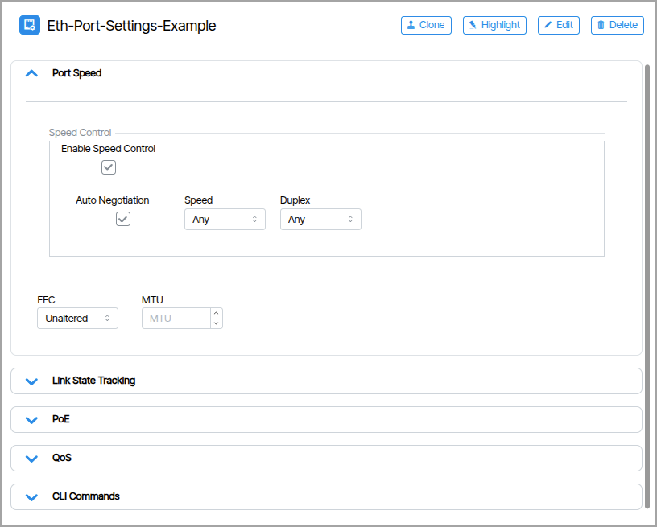
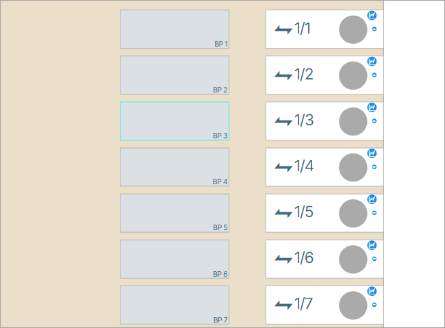
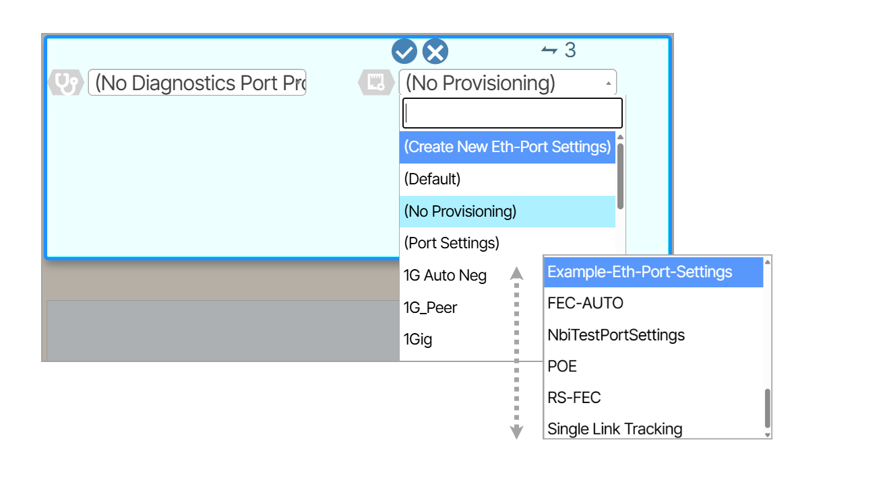
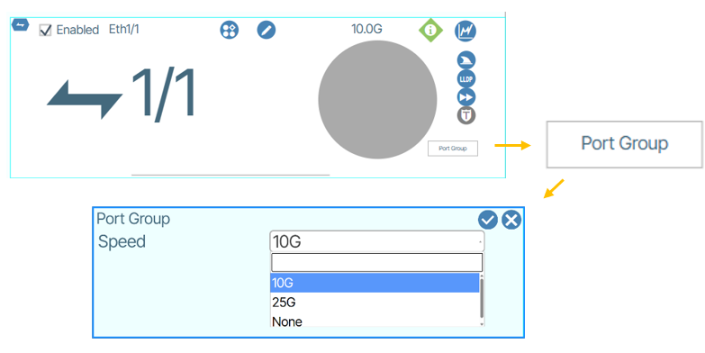
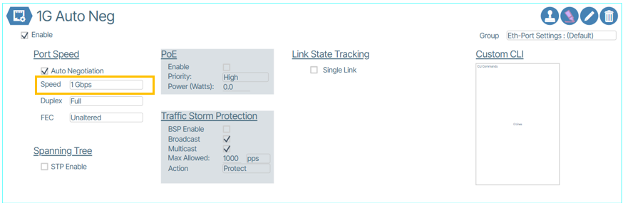
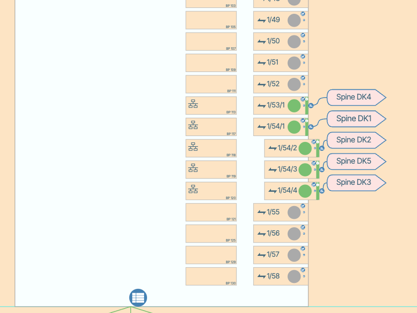
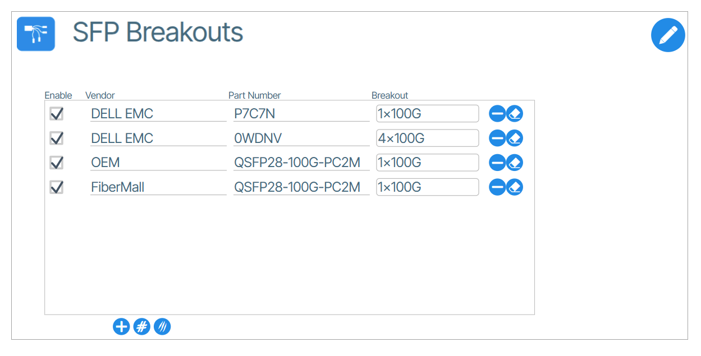
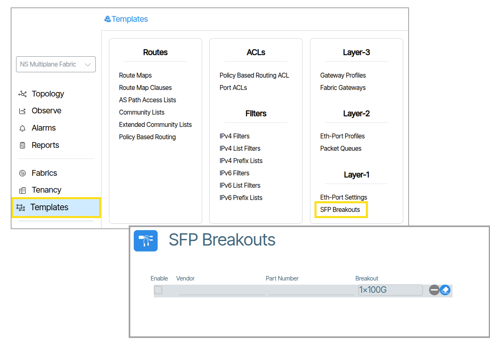
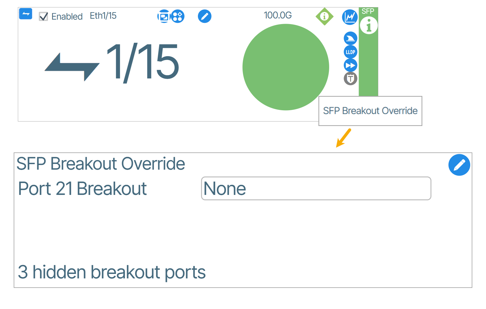

# Layer-1

## Eth-Port Settings

**Eth-Port Settings** let the operator to define settings specific to a port related to Layer-1 and Layer-2 features such as port speed, speed/duplex negotiation, and Power-over-Ethernet (PoE).

The following figure shows the detail within an Ethernet Port Settings dialog box:

### Create an Eth-Port Setting
--8<-- "how-to-create-templates.md"
<!-- 1. Navigate to the Eth-Port Settings tile by clicking **Templates** and from the **Templates** tab double-click **Eth-Port-Settings**.
1. Create an Eth-Port Setting instance by clicking the **Add** button ({:class="btn"}).
1. In the prompt that appears, enter a name for the **Eth-Port Setting**.
1. Apply desired settings.
1. Enable the settings by clicking the **Enable** checkbox. -->

### Apply an Eth-Port Setting
1. Choose the port to apply the Eth-Port Setting on ({: class="pop"}).
1. Open the port editing window and assign the Eth-Port Setting in the right most dropdown menu ({: class="pop"}).

<!-- PORT GROUPS WERE REMOVED --I COMMENTED THEM OUT>

<!-- ## Port Groups

Port groups provide a way to manage multiple ports collectively based on their underlying hardware constraints. On certain networking switches ports are organized into groups that must maintain uniform speeds—either 10G or 25G across all ports in the group. To change the speed of any port in the group, you must reconfigure the entire group using the command ` port-group 2 speed 10000 `, which would set all ports in group 2 to 10G operation.

### How to Set the Port Group Speed From Verity
To set the port group speed from Verity you use the **Port Group Speed** settings of your selected group from the Topology window.
The Port Group Speed settings are only visible on the first port of each port group. If ports 1-4 belong to the same group, the field appears only on port 1.

The available values are:

* 10G
* 25G
* None

### How to Configure Port Group Members to Operate Below a Speed of 10G

1. Set the Port Group Speed to 10G.  {: class="pop"}
1. Configure the individual port speed to below 10G in the Eth-Port-Settings assigned to the port. {: class="pop"}

 -->

## Breakouts

### Breakout Port

A **breakout port**  refers to a high-density network port that can be split or "broken out" into multiple lower-speed connections using specialized cables or modules ({:class="pop"}).

### SFP Breakouts

{ width="500" }

**SFP** stands for Small Form-factor Pluggable. These are compact, hot-pluggable network transceivers used for both telecommunications and data communications applications.

An **SFP Breakout** refers to using a breakout cable or adapter to split a single high-speed  port into multiple lower-speed SFP connections.

In Verity, the **SFP Breakouts** feature ({:class="pop"}) allows users to configure how SFP (Small Form-factor Pluggable) modules function within a switch. This feature can automatically detect the breakout configuration in two ways:

1. **Automatic detection**: The software reads the SFP module's specifications after it's inserted into the switch

2. **Manual configuration**: Users can define the behavior based on the module's vendor and part number

Users can configure SFP breakout behavior through the interface using either:

- **Global settings**: Apply the same configuration across all ports
- **Individual port settings**: Customize behavior for specific ports

!!!warning 
    Breakout settings are constrained by the switch's capabilities. If the physical limitations of the switch are exceeded, an error is displayed, and the device turns red. Hovering over the device will show the following error message: 
    
    **Attempting to add [*number of breakouts*] to pipeline [*pipeline index*] with [*available space*] available**.

    - **number of breakouts** is the count of attempted breakout additions.
    - **pipeline Index** indicates the specific pipeline number or identifier.
    - **available space** is the remaining breakouts that can be added to the pipeline.

### Globally
If your intent is to set SFP device behaviors globally, throughout your system, you set this information in the Global / SFP Breakouts list. Here, you list devices by vendor and part number, and you set the behavior for each device under the field labeled *breakout*. Some SFP breakout cables identify themsleves with the same part number on each end which can result in misconfiguration based on using system wide defaults. In these cases, the user should set the behavior in the global section for the broken out side of the breakout cable, and use the port specific override method for the "1x" side of the cable. 

#### Port Specific Override
If your intent is to set an SFP device behavior on a specific port and override existing behavior, you can do so with the SFP Breakout Override form. Setting SFP devices in this way overrides existing automatic behaviors as well as the behaviors dictated in the Global Breakout settings. The drop down list in the UI is provided after the switching device has been discovered and is under management of Verity. The switch is interrogated by Verity and then The UI provides a specific drop down list based on the SFP and port it is plugged into. This precludes the ability to pre-provision port specific breakout. 

It should be noted that there are limitations to the combinations and locations of multiple SFPs and the vendor's hardware specifications should be referred to in these cases. There are cases where the request from the Verity system to the switch can fail based on these limitation, and is indicated as such in the system displaying a "red fill" on the device after trying to set the port specific breakout.

