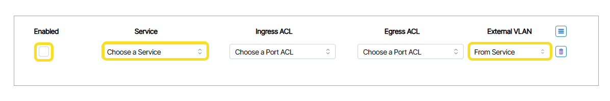
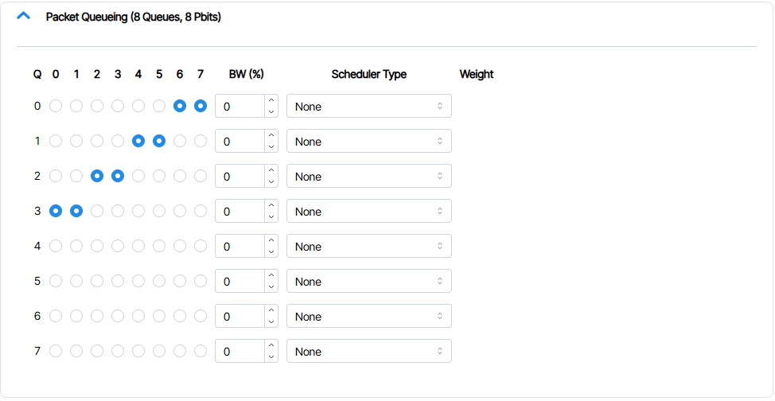

---

title: "Ethernet Port Profiles (Eth-Port Profiles)"
description: "How to create Services and VLANS"
tags: [Service, VLAN]
search:
  boost: 2           # ← Lower than main overview
parent: Advanced Configuration

hide:
- toc
---

# Layer-2

##  Eth-Port Profiles 
An **Eth-Port Profile** (Ethernet Port Profile) is a reusable configuration template that packages multiple services for deployment on a port. This feature simplifies port provisioning by allowing operators to group related Layer-2 VLAN services commonly required by servers and apply them as a single unit.

## Creating an Eth-Port Profile
1. Navigate to the Eth-Port Profiles section by double-clicking **Templates** and clicking **Eth-Port Profiles**. 
1. Create a new Eth-Port Profile object by clicking the **Add** button.
1. In the prompt that appears, name the Eth-Port Profile and assign it a group.
1. Check the **Enable** box.

### Assigning Services to an Eth-Port Profile
1. From within Templates open the Eth-Port Profile tile. Select the desired Eth-Port-Profile and set the **Service** and **External VLAN** fields. 
1. Enable your selection(s) by clicking the **Enabled** checkbox.

<!-- https://docs.be-net.com/6.5/ethernet-profiles/ -->

## Packet Queues

This Template lets you set the priority for packets depending on bandwidth.

Here you set the priority for p-bits and set the bandwidth (BW) for each queue as a percentage. The percentage is the maximum average percentage of the port output bandwidth that packets in that queue will be allowed to consume. The value cannot exceed 100 and a value of 0 means no limit is set.

