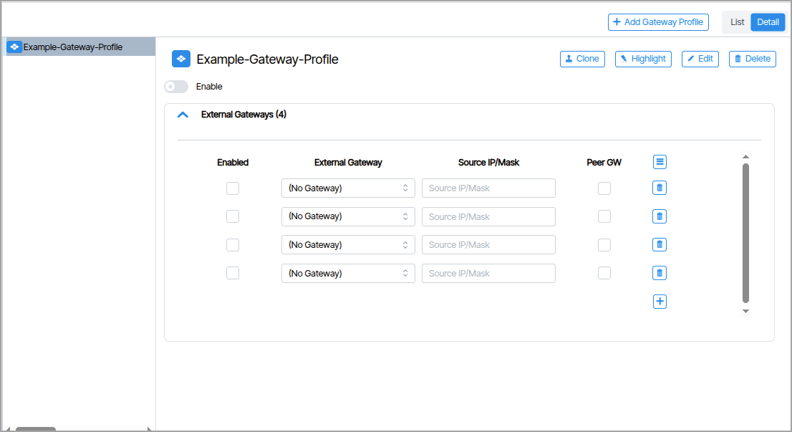
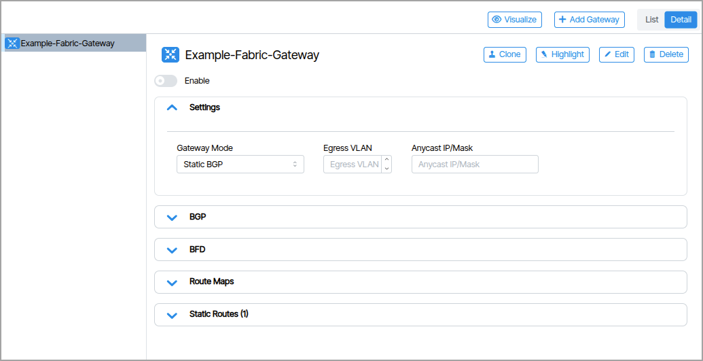

# Layer-3

## Gateway Profiles

A BGP Gateway Profile is a packaging of one or more BGP Tenant Gateways that are served by this port.

## Fabric Gateways

A Fabric Gateway is a configuration object that contains settings for traffic between a local site (like a branch office, campus, or data center) and external networks.

# Related Information

[**Gateways**](gateways.md)

[**Inter-Site Routing**](inter-site-routing.md)

