---

title: "Link Aggregation"
description: "How to create LAGS"
tags: [Fabric, LAG, MLAG, ESI, Multihoming]
search:
boost: 2          
parent: Advanced Configuration

hide:
- toc
---
# Link Aggregation (LAGs)
Link aggregation is a popular method for grouping multiple ethernet connections into a single logical link.  Traffic across this link is automatically load balanced across the grouped (bonded) links. LAGs can extend from single leaf switches or can be configured across a pair of leaf switches. When a leaf pair is created and LAGs are assigned to ports on each switch, the LAG is considered an "MLAG". MLAG, or Multi-chassis Link Aggregation, is a networking technology that aggregates multiple physical ports across two or more switches into a single logical link, thereby providing increased bandwidth, redundancy, and resilience. This allows servers and other network devices to connect to different switches and appear as if they are connected to a single switch, improving network performance and fault tolerance.

!!! note "Automation"

    The interconnect between Leaf Pairs (Fabric Crosslink LAG shown in diagram below) is automatically recognized and configured by Verity. This section explains how to create external LAG connections to the workload.

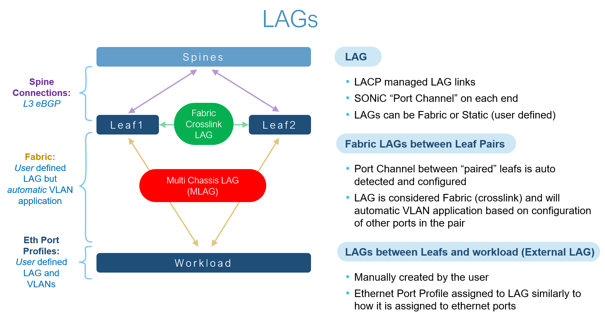

# Link Aggregation Process

Although there are several ways of completing the process, an easy to understand method requires these steps:

1. Identify the composition of the LAG, including the leaf pairs and ports you intend to use in its configuration. (Assuming you are implementing MLAG)
1. Create the external LAG object, name it, and assign it to the port(s).
1. Select the Tenant services and create an Eth Port profile and assign it to the external LAG.

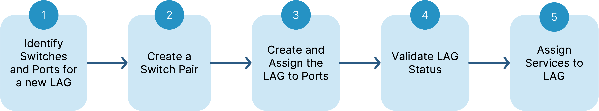

The following example below shows how to create an external LAG relationship between two leaf ports. These actions can be used to establish different LAG configurations depending on your needs, such as aggregating multiple ports on a single leaf switch to boost endpoint bandwidth.

## How to Create a Switch Pair From Fabrics

* From the **Main Navigation Menu** select **Fabrics**.

* Determine the target devices. If the target devices do not yet exist, create them before creating a switch pair.

* Select the containing network Fabric.
* In the upper right of the page, click **Manage Pairs**.

* Enter a name in the **Name** field, then select your devices under the **Switchpoint** fields.

* Make physical connection. The ports must be configured identically and operate at the same speed.

When complete, the Fabrics tree displays the devices as a related pair with the Switch Pair icon.

## How to Create a LAG From Fabrics

* From the **Main Navigation Menu** select **Fabrics**.
* Expand your Fabric, and go to LAGs
* Click External, and then click Add LAG button
* Give it a Name and Click Add LAG
* Select your new LAG
* Update/Verify the settings, set an Eth-Port Profile for the LAG
* Save the Settings.
* Apply the LAG to the interfaces on the Leaf switch you want to use this LAG.

## Create and Assign the LAG to Ports
1. Select a port on your chosen device (we call this Leaf-1) and zoom in on it. Open its parameters by clicking the space to the left of the dividing line. 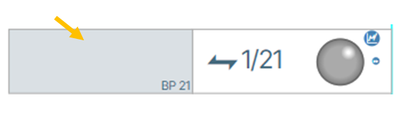{: class="pop"}
1. Click the **Edit** ({: class="btn"})  button. On the left drop-down menu, select **Create New LAG**. 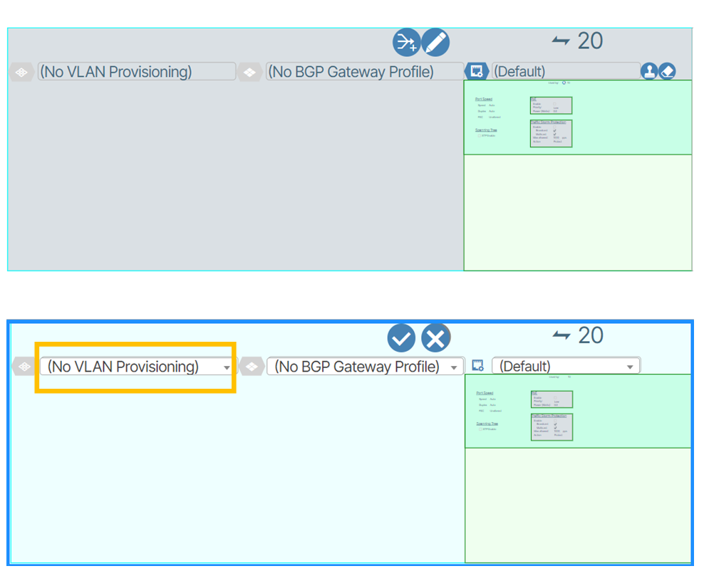{: class="pop"} 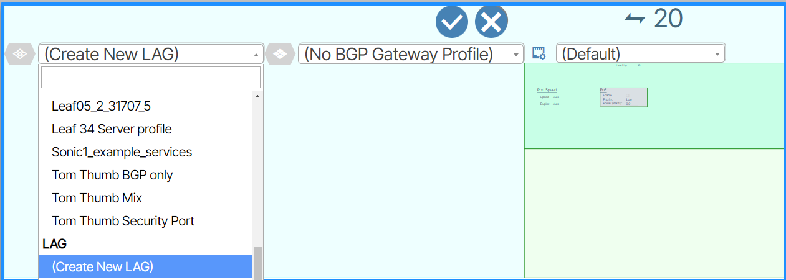{: class="pop"}
1. Click the **Save** button ({: class="btn"}) to save your work. 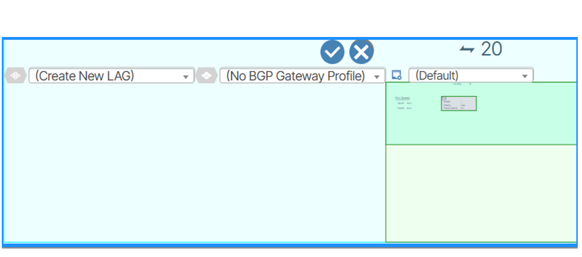{: class="pop"}
1. Click the lAGs object button ({: class="btn"})  to jump to the LAG parameters. {: class="pop"}
1. Click the **Edit** button ({: class="btn"}) and change the name of the LAG to meaningfully distinguish it.
Click the **Enable** box and then click the **Save** button ({: class="btn"}) to save your changes. 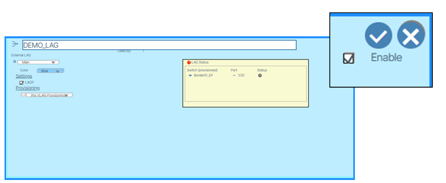{: class="pop"}

## Assign LAG to Second Switch Port

 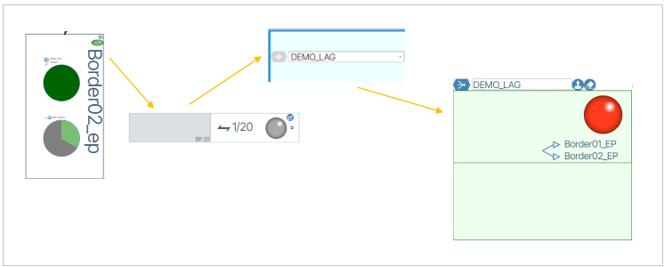

1. On the second chosen switch in the pair (we call this Leaf-2) select the desired port (such as port-2) and open the Provision Port settings. Enable editing by clicking the editing button.
1. In the first form field set the name of the LAG you previously created.
1. Click the **Save** button to save your work.
1. Select the desired options and set the desired values to those options.

## Validate LAG Status Display
1. As the system creates the channel groups and communicates over LACP, there will be a delay in the system for up to 5 minutes, after which the status display will turn green {: class="pop"} .
1. If you encounter problems and the icon remains red or yellow, hovering over the status icon provides more information 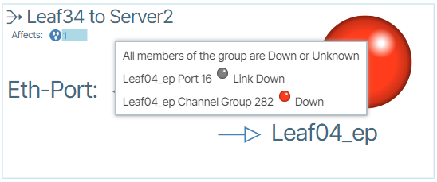{: class="pop"} .

## Assign Services to the LAG via Provisioning Settings
There are multiple ways to assign Services to LAGs.  The primary method is via the LAGs **Provisioning** settings. As previously shown, you can navigate to LAG settings via a switch port by clicking the port and then clicking the LAGs object button. It is also possible to view **External LAGs** parameters from **Network View** via the process demonstrated here:

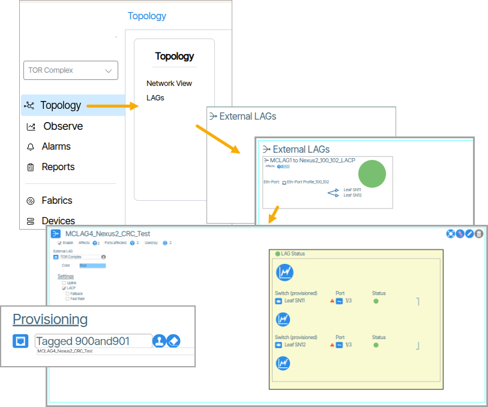

## Settings  

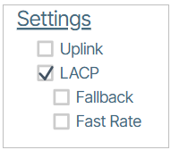

- Uplink
- LACP
    - Fallback
    - Fast Rate

In the **Provisioning** drop-down menu, assign an **Eth Port Profile**. As mentioned earlier, an **Eth Port Profile** is a collection of **Services** 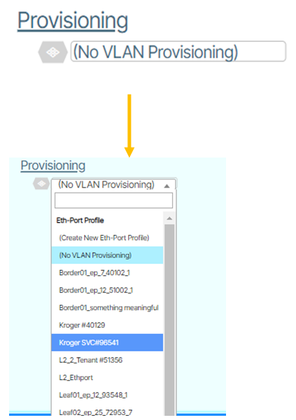{: class="pop"} . 

### Assign Services to the LAG via “Add LAG” Button
1. Zoom into the settings of a port you want to assign the LAG to 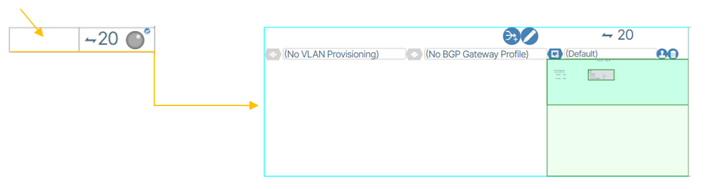{: class="pop"} .
1. Click the **Add LAG** button (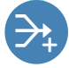{: class="btn"}) 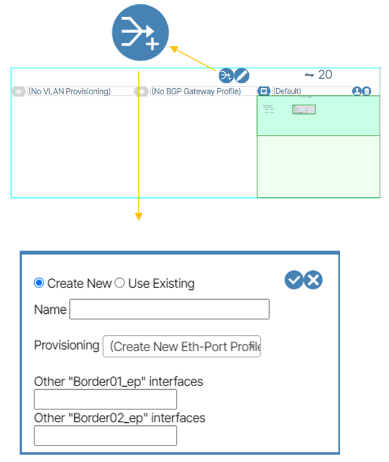{: class="pop"} .
1. Fill out the form with the following LAG settings:

| Setting | Description |
| ------- | ----------- |
| **Create New / Use Existing** | Determines if you are creating a LAG or using an existing LAG. If you choose **Use Existing,** the form field presents you with a list of existing LAGs to choose from. |
| **Name** | Sets the name of the LAG. | 
| **Provisioning** | The Eth Port Profile (the service(s)) you assign to the LAG. |
| **Other 1** | The port number(s) (separated by commas if more than one) of the listed switch to assign the LAG to. |
| **Other 2** | The port number(s) (separated by commas if more than one) of the listed switch to assign the LAG to. |

### Provision Channel Group Endpoints and Set Physical Connections
The next step is to provision channel endpoints. This step is outside the scope of these instructions. The last step in the process is to physically connect the devices.

# ESI Multihoming
A **ESI Multihoming** is a networking technology that allows multiple switches (typically leaf switches in a data center network) to form a single logical link aggregation group (LAG). Its configuration closely resembles that of a switch-pair MLAG, with the key distinction being the inclusion of up to *four* switches, significantly enhancing network redundancy and scalability. The number of ports that can be assigned a Multihoming ESI group is indeterminate. The number of switch devices is limited to four.

!!! note "ESI vs MLAG"

    In Verity, LAGS assigned to two or more *non-paired* Leaf Switches use ESI Multihoming protocol instead of proprietary MLAG implementations.  Multihoming is a feature that is automatically enabled, requiring no setup from the customer.

If a LAG is using ESI Multihoming, it will display text that says **Multihoming**.

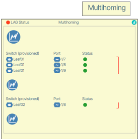

## Relationship to Leaf Pairs

The multihoming feature is implicitly disabled on all leaf switches configured as leaf-pairs. Any leaf with multihoming in use cannot be made part of a leaf pair until the multihoming configuration is removed. This prevents any conflict between the MLAG functionality on leaf pairs and the multihoming functionality.

### Conflict Resolution

When attempting to pair a Multihoming switch, a conflict arises, and an error message is displayed that gives you the choice to disconnect the Multihoming connection(s).