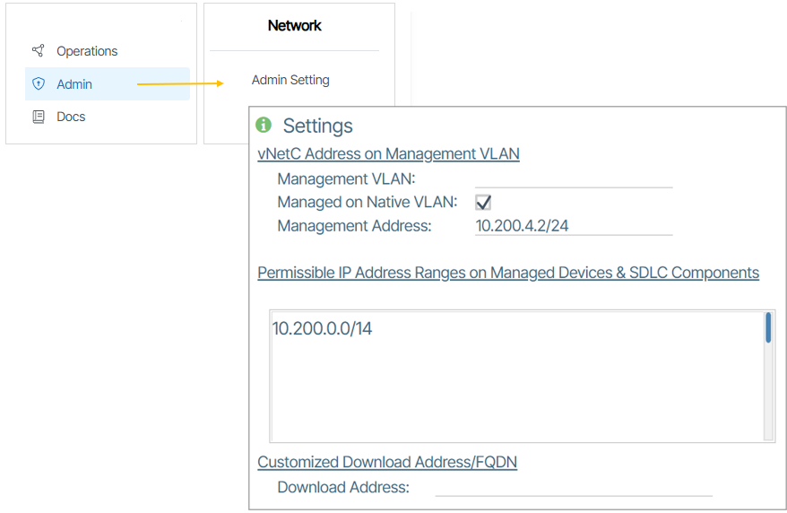
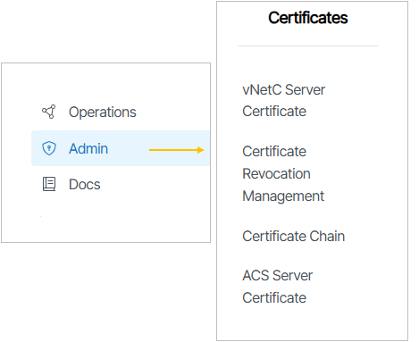
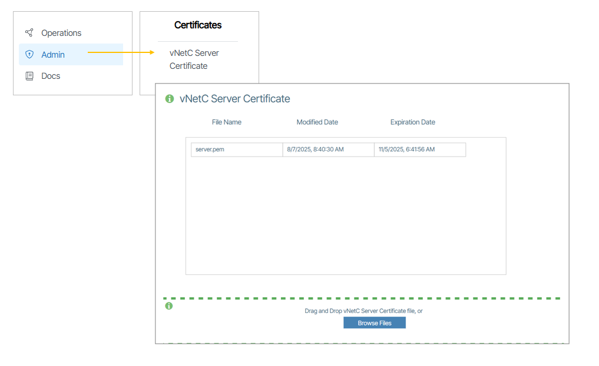
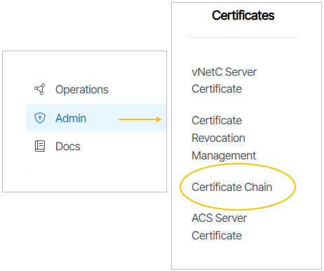
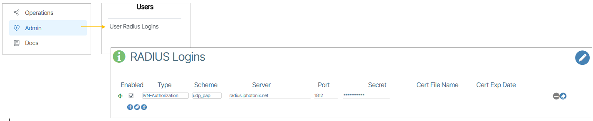
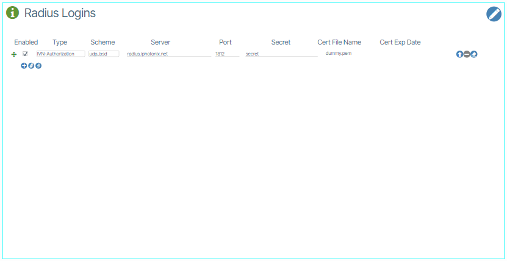
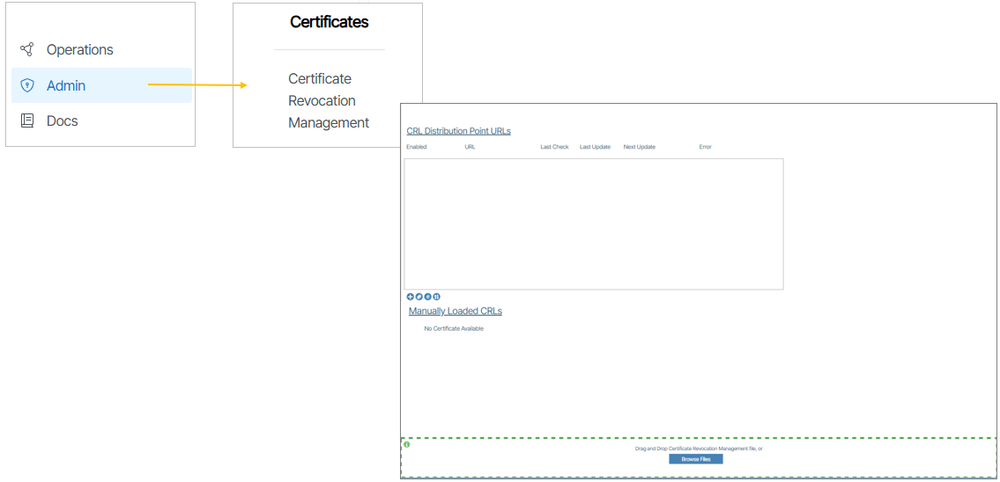
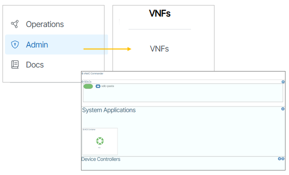
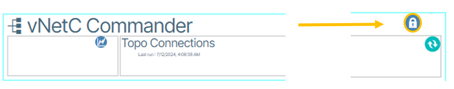
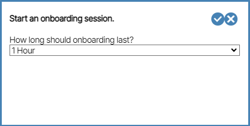

---
hide:
- toc
---
# Security Lockdown Overview

## Overview
This document provides instructions to prepare virtual machines and devices within the Verity platform for operations in highly secure environments. Standards are defined by the Defense Information Systems Agency (DISA). The process involves securing all the components to ensure they are trusted on the network, prevent any possible tampering within the components and that all communications between components use highly secured encryption technologies. All physical devices and the SDLC application are processed independently in the first steps and **should remain disconnected from the system** when the last step, the vNETC orchestration platform is processed and locked down.

# Security Lockdown for the vNetC Orchestration Platform
The next step in the process requires the vNetC virtual machine to be installed under VMware.

During the installation you install the following certificates:
- Web Certificate
- Radius Client Certificate
- Certificate Authority Chains

**Information**

Locked-down vNETCs provide FIPS-140-2 conforming encryption on all networking connections traversing virtual machine and hardware boundaries. All participating devices must provide mutual authentication.

There are other considerations to meet the FIPS-140-2 standard, including the use of the VMware ESXi hypervisor on specific certified hardware. This document assumes that the system is being configured according to the document: **BEVN Installation for VMWare ESXi**.

## BEVN Installation for VMWare ESXi
Read VMWare document up to and not including step 7. Instructions here are to be elaborated on and this is placeholder text.

## Set Download Address to vNetC FQDN
In secure lock-down, manually locked-down devices must use FQDN to access the vNetC for downloads. Using an IP address is not possible due to TLS certificate requirements.

Go to **Admin** and click the **Admin Settings** option. Set the customized **Download Address** to the vNetC FQDN. 

## Certificate Management
 
vNetC Certificate files are installed from SD-ADMIN via the Certificate Management collection of certificate panels {: class="pop"}.

!!!Information
    For more information see [Certificates](admin.md/#certificates)  

### vNetC Web-Server Certificates
The vNetC requires a web server certificate. This certificate provides TLS validation ensuring secure communication when web browsers and devices contact the vNetC. The certificate must fit one of two criteria.

1. The certificate contains the private key, has FQDN set as the common-name, and a certificate authority chain.
1. The certificate is uploaded to the **vNetC Server Certificate** panel at **Admin/Certificates**. {: class="pop"}

### Certificate Authority Chains
The vNetC must be loaded with certificate authority chains composed of intermediate and root certificates. For systems in secure lockdown, all **Certificate Chains** are used to validate client certificates (such as CAC) and device client certificates. All such certificate chains should be uploaded to **Admin/Certificate Chain** panel as shown here {: class="pop"}.. Multiple files can be uploaded and are used when validating all TLS client connections (users or devices) 

### RADIUS Client Certificate
The Radius client certificate authenticates the vNetC with the RADIUS authentication server(s). The RADIUS authentication server is configured under **Admin/User Radius Logins** panel as shown in the following diagram {: class="pop"}.

The vNetC must have a client certificate file containing the private key and a certificate signed by an authority recognized by the RADIUS server. The certificate is required for systems in secure lockdown, and until it is loaded, only the emergency admin user will have access to the system. For other systems, the certificate is used if provided.

The RADIUS client certificate is uploaded to the **Admin/User Radius Logins** tile {: class="pop"} .

### Revocation List
The **Admin/Certificates/Certificate Revocation Management** contains a list of "X509 CRL" entries that revoke client certificates that are no longer valid for use by web browsers or devices {: class="pop"}.

## vNetC Secure Lockdown Mode
Once the system is configured with the required certificates you perform the following actions:

1. Login as Root user with root password.
1. Run the following command: **ns_admin**
1. Select **SD-LAN Features**
1. Enable **Security Lockdown**.
1. Save, exit and reboot.
1. When the vNetC becomes accessible, you are required to provide a PIN for CAC based authentication before being able to access the login page. Complete the PIN submission action.
1. If you are then able to access the login page and login in, the vNetC is secure and can be made accessible from the production network.

**When in Lockdown Mode**

- A client certificate from an approved authority is required.
- The emergency username is always "admin”, and its password is set during system installation.
- If no RADIUS servers are enabled, or none can be reached, only the emergency user will have access.
- If **any** RADIUS servers are accessible, the emergency user will not have access **unless** the RADIUS server gives authorization.
- All other users must be authorized via the RADIUS server(s).
- The three-login failure limit leads to a 15 min cooling-off period.

## Auto-Onboarding (Onboarding Mode)
Verity now has a new feature named **Onboarding Mode**.

In locked-down systems, devices within the appropriate IP address range will not be recognized as managed devices and will not attempt to connect to the vNetC. However, in systems that are not locked-down, the system will recognize such devices as managed devices. In a locked-down system, enabling **Onboarding Mode** creates an exception, temporarily allowing devices with the appropriate settings and IP ranges to be recognized by the system.

!!! Note

    * Device onboarding mode allows "haproxy" on the vNetC and ACS to accept requests from devices without a client certificate.
    * Devices with valid certificates (already locked-down) will not be affected.
    * Devices with invalid certificates will be rejected, and the only way to recover them is through a hard factory reset while device onboarding mode is enabled.
    * There is no current way to know that a device has been rejected or why, as this is managed by "haproxy". This information might be found in /var/log/haproxy.log.
    * Devices without a certificate will be allowed to connect, and vNetC will handle the process of delivering a device-specific client certificate and signing certificate for vNetC and ACS, then place the device in lock-down mode.

When Onboarding Mode is enabled, each device to be onboarded should be power-cycled to ensure it collects its startup configuration from the vNetC.  When the system is not in Onboarding Mode, access to the startup configuration is blocked until a device has all the appropriate certificates.

### Enable Onboarding Mode

To use **Onboarding Mode,** click  **Admin**  and select  **VNFs**.

Zoom into the **vNetC Commander** tile and scroll all the way to the right until you see the **Lock** icon {: class="btn"}.

To enable **Onboarding Mode**, click the Lock icon and place it in the *unlocked* state {: class="btn"}.

A dialog box appears asking how long the onboarding should last. What you choose determines how long the **Onboarding Mode** is enabled for.

### Terminating Onboarding Mode

If you click the unlock ({: class="btn"}) icon prior to the **onboarding session** expiration, you are provided with a message asking if you want to preemptively end the session.

## Manual Onboarding

To use certificates from an external certificate authority you must manually onboard each device. [Detailed instructions are available here.](manual-onboarding.md)

## Campus Lockdown
### Add ACS Certificate (addendum)

This is needed when using ONTs FQDN in ACS url.

1. Go to **Admin/Certificates/ACS Server Certificate**
1. Click on **ACS Server Certificate** box.
1. Drag and drop the **server.pem** file.
