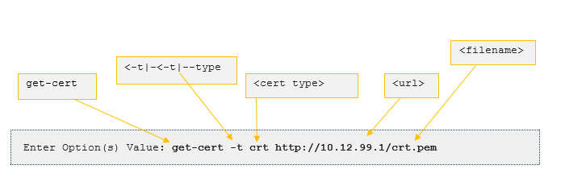
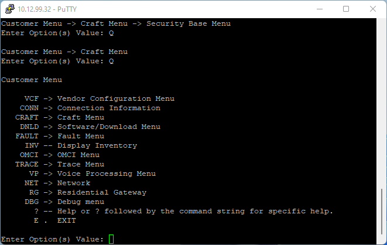
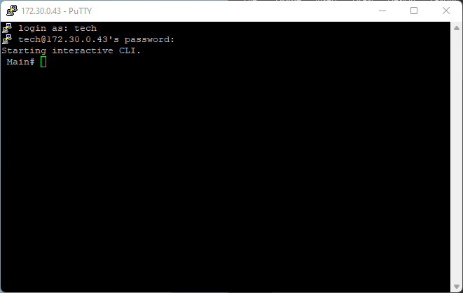

---
hide:
- toc
---

# Manual Onboarding 
## Before You Begin
- The security lockdown process for Verity components requires all equipment used in the process are located on the same network subnet as the file server containing any files needed for the lockdown process. For switch and ONT devices, that server must reside on the PC/host that is physically connected to the device.
- The user must provide [SSL Certificates](admin.md/#certificates)   that are installed during the lock down process. Certificates are contained in a file format called PEM (defined in RFC 1422), which can contain either just the public certificate (e.g., CA certificate files in /etc./SSL/certs) or a full certificate chain with the private key, public key, and root certificates.
-  **Certificate files may have different names depending upon the entity generating them**. Also, in the case of many switches and ONT devices, the files usually have serialized names so they can be tracked. For the purposes of this document the following names and descriptions are used:

1. **crt.pem** – file used by devices and the SDLC to validate the orchestration platform certificate
1. **client.pem** – file used by devices and the SDLC to identify themselves
1. **client-cert.pem** – file used by the SDLC/ACS to validate clients. Sometimes referred to as the certificate-chain file
1. **server.pem** - used by the vNETC and ACS to identify themselves to the managed devices/SDLC. This is the “web server key and certificate” file
1.  **DoD root certificate chain files** - multiple files loaded via drag/drop to "Root Certificate Chains"
1. **External Authentication Client Certificate** - loaded via drag/drop (use for client connection to the RADIUS server
1. **Certificate Revocation List** - single CRL file loaded via drag/drop
    -   The following SW loads are required to support Security Lockdown
        -   Core – 6.3.0275
        -   Firmware Package 1.6.1.57

!!! warning "Device Requirements"

    The devices (switches and ONTs) MUST BE IN A CLEAN FACTORY RESET CONDITION before starting the process or connecting to any system. If they are connected to a system before starting the process, once they contain a valid load, the user should factory reset the device appropriately.

!!! note "Certificate Names"

    Certificate names are used throughout this document; however, as mentioned, the certificate names you work with may not be the same as the examples provided.


### SSH
To configure any device for lockdown, SSH must be used to access the device command line interface. The setup process assumes the user has requisite knowledge of SSH.

### What File Transfer Protocol and Software Do I Need for Certificates?
Installing [certificates](admin.md/#certificates)   can be done with HTTP or TFTP and examples are provided for both HTTP and TFTP. It is the user’s responsibility to choose and manage their file transfer server application.

### Command Line Writing Convention
Users are prompted to input commands throughout the procedure. The commands are shown as bold text. The following example prompts the user to use the command line interface and apply the commands **admin** and **security**.

**Main/** **admin/security**

The result is the command line directory is changed to **Security Base Menu**. Text in a grey background represents the content displayed on the command line window.

```
Customer Menu

ACS Security Menu Commands

keys -\> SSH keys get, del & show Menu
cert -\> SSL certificate get, del & show Menu
host -\> Host ip/name add, del & show Menu
? -- Help or ? followed by the command string for specific help.
Q \<- One Level Back
E . Exit

Main/ administration/ Security Base Menu/
```
### Device Command Line QuickStart
This section of the documentation provides an overview of the device command line software interface, which consists of menus and commands.

In the example below, the command to the left of each -\ > symbol navigates to the menu that is to the right of each -\> symbol.

```
Customer Menu

VCF -\> Vendor Configuration Menu
CONN -\> Connection Information
CRAFT -\> Craft Menu
DNLD -\> Software/Download Menu
```

Menu symbols may have different forms such as:

**-\ >**

**\ >\ >**

**--**

**.**

In the following example, the command **CRAFT** is associated with the **Craft Menu**. To navigate to the **Craft Menu**, type **CRAFT** and press Enter.

```
Customer Menu

VCF -\> Vendor Configuration Menu
CONN -\> Connection Information
CRAFT -\> Craft Menu
DNLD -\> Software/Download Menu
FAULT -\> Fault Menu
INV -- Display Inventory
OMCI -\> OMCI Menu
TRACE -\> Trace Menu
VP -\> Voice Processing Menu
NET -\> Network
RG -\> Residential Gateway
DBG -\> Debug menu

? -- Help or ? followed by the command string for specific help.

E . EXIT

Enter Option(s) Value: CRAFT
```
!!! tip "Basic Navigation"

    To navigate to a previous menu, you use the **Q** command.


Some windows prompt you with \< \> icons. These icons convey that user defined inputs are to be submitted. User defined inputs are called parameters. The following code prompts you to type a URL of your choosing.

```
<url\>
```

In the following example the **get-cert** command requires between 1 to 3 parameters. The parameters include a certificate type, URL, and a file name. The certificate type is prefaced by the **-t** or **–type** command. {: class="pop"}

```
Enter Option(s) Value: get-cert

Command requires from 1 to 3 parameters

Usage:

get-cert \<-t\|--type\> \<cert type\> \<url\>

Usage:

\-t, --type \<crt\|client\> - Certificate type (required)

\<url\> - In the form "http://10.12.99.1/\<...\>/\<filename\>


```

```
get-cert \<-t\|--type\> \<cert type\> \<url\>

```


## Security lockdown for ONT Device
The security lockdown process for an ONT device is summarized in four steps:

1. Log into the device using SSH

1. Install certificates

1. Lock down the device

1. Repeat this for all ONT devices that are connecting to the locked down system.

### Connecting to the Device

#### Hardware Setup
Connect an ethernet cable from a PC to ethernet port \#1 on the ONT.

### Using SSH to Access the Device Interface

#### Network Configuration
The ONT has a backdoor IP address of 10.12.99.32. The PC must be in the same subnet, such as 10.12.99.30. The IP address of the PC's Ethernet Network Interface Card (NIC) must be set to 10.12.99.30.

#### Authentication
SSH must be used to access and configure the device. It is assumed that the user has the requisite knowledge to use SSH.

1. **SSH**: 10.12.99.32
1. **Login**: tech
1. **Password**: \<enter default tech password\>
1. Upon successful authentication the interface window will be displayed, and the **Craft Menu** is available. {: class="pop"}

### About SSL Certificates

#### ONT Requires Two SSL Certificates
The ONT requires *two* certificates - **crt.pem** and **client.pem** - to be present. The **crt.pem** is used to validate the server certificate of the ACS. The **client.pem** is the certificate sent by the ONT to authenticate the ONT when it is talking to the ACS and vNETC.

### Certificates Have Unique Names
The certificates you install on your system will have unique names. For this document, they are referred to as **crt.pem** and **client.pem.**

## Installing the ONT CRT Certificate
To begin, navigate to the SSL certificate Base Menu

**Customer Menu/CRAFT/SEC**

```
Customer Menu -\> Craft Menu -\> Security Base Menu -\> SSL certificate Base Menu
```

The **SSL certificate Base Menu** provides an option to add, delete, list, and display SSL certificates content.

1. Select **cert**.
1. Select **get-cert -t \<cert type\> \<url\>**.
1. The window that appears prompts you for the certificate type, the URL and file name.
1. Submit the command. The result of your entry is formatted like the following examples depending on the transfer protocol you use:

**HTTP**

```
get-cert -t crt <http://10.12.99.30/crt.pem>
```

**TFTP**

```
get-cert -t crt tftp://10.12.99.30/crt.pem
```

#### Verify SSL Certificate Download
1. Use the **show-cert -t crt** command to verify that the SSL Certificate process completed properly.
1. The certificate contents are presented.

## Installing the ONT Client Certificate
1. Navigate to the SSL certificate Base Menu **Customer Menu/CRAFT/SEC**
1. The **SSL certificate Base Menu** provides an option to add, delete, list, and display SSL certificates content.
1. Select **cert**.
1. Select **get-cert -t \<cert type\> \<url\>**.
1. The window prompts you for the certificate type, the URL and file name.

```
Enter Option(s) Value: get-cert

Command requires from 1 to 3 parameters

Usage:

get-cert \<-t\|--type\> \<cert type\> \<url\>

Usage:

\-t, --type \<crt\|client\> - Certificate type (required)

\<url\> - In the form "http://10.12.99.32/\<...\>/\<filename\>
```

Submit the command. The result of your entry is formatted like the following examples depending on the transfer protocol you use.

**HTTP**

```
get-cert -t client <http://10.12.99.30/client.pem>
```

**TFTP**
```
get-cert -t client tftp://10.12.99.30/client.pem
```

#### Verify SSL Certificate Download
1. Use the **show-cert -t client** command to verify that the SSL Certificate process completed properly.
1. The certificate contents are presented.

## Lock-Down Mode
Setting the device into **Lock-Down Mode** is the last step in the configuration.

#### Locking Down
1. Navigate to the **Security Base Menu**.
1. Select **lock** (Type **q** and press **Enter** to go back one level).

#### Reboot
This is the last step in preparation to place the ONT in lockdown mode. 
1. Navigate to the **Craft Menu** (type **q** and press **Enter** to go back one level).
1. Type **r** and press **Enter**.

#### Verify Lockdown
1. Use SSH to authenticate into the device.
1. If you are unable to authenticate the lockdown is successful.

# Security Lockdown for Switches

The lockdown process for a Switch device can be summarized in four steps:
1. Log into the device using SSH
1. Install certificates
1. Lock down device
1. Repeat this section for all switching devices that are connecting to the locked down system.

!!! note "Before You Begin"

    If the switch is going to be installed as a “Top of Rack” (TOR) and the uplink connection does not support using LLDP for automatic TOR and Uplink detection, please refer to the switch documentation to manually set up the TOR before proceeding.


## Securing the Device

### Use SSH to Access the Device Interface

#### Network Configuration
The switch has a backdoor IP address of 10.12.99.32. The PC must be in the same subnet, such as 10.12.99.30. The IP address of the PC's NIC must be set to 10.12.99.30.

#### Authentication
SSH must be used to access and configure the device. It is assumed that the user has the requisite knowledge to use SSH.

1. **SSH**: 10.12.99.32
1. **Login**: tech
1. **Password**: \<enter default tech password\>
1. Upon successful authentication the interface window is displayed with the prompt **Main\#**. {: class="pop"}

### About SSL Certificates

#### Switch Requires Two SSL Certificates

The switch requires *two* certificates - **crt.pem** and **client.pem** - to be present. The **crt.pem** is used to validate the server certificate of the vNETC. The **client.pem** is the certificate sent by the Switch to authenticate the Switch when it is talking to the vNETC.

### What File Transfer Protocol Do I Need for Certificates?
Installing certificates  can be done with either HTTP or TFTP.

## Installing the CRT Certificate
1. Navigate to the SSL certificate Base Menu **admin/security/cert**.
1. The **SSL certificate Base Menu** provides an option to add, delete, list, and display SSL certificates content.
1. Select **cert**.
1. **get-cert -t crt \<url/filename\>**
1. The window that appears prompts you for the certificate type, the URL, and the file name.
1. Submit the command. 
1. The result of your entry is formatted like the following examples depending on the transfer protocol you use:

**HTTP**

```
get-cert -t crt <http://10.12.99.30/crt.pem>
```

**TFTP**

```
get-cert -t crt tftp://10.12.99.30/crt.pem
```

#### Verify SSL Certificate Download
1. Use the **show-cert --type crt** command to verify that the SSL Certificate process completed properly.
1. The certificate contents are presented.

## Installing the Client Certificate
1. Navigate to the SSL certificate Base Menu **Main/admin/security/cert**.
1. The **SSL certificate Base Menu** provides an option to add, delete, list, and display SSL certificates content.
1. Select **cert**.
1. Select **get-cert -t client \<tftp://10.12.99.32/2S846000025.pem\>**.
1. The window that appears prompts you for the certificate type, the URL, and the file name.
```
Enter Option(s) Value: get-cert

Command requires from 1 to 3 parameters

Usage:

get-cert \<-t\|--type\> \<cert type\> \<url\>

Usage:

\-t, --type \<crt\|client\> - Certificate type (required)

\<url\> - In the form "http://10.12.99.32/\<...\>/\<filename\>
```
1. Submit the command. The result of your entry is formatted like the following examples depending on the transfer protocol you use.

**HTTP**

```
get-cert -t client <http://10.12.99.30/client.pem>

```
**TFTP**

```
get-cert -t client tftp://10.12.99.30/client.pem
```

#### Verify SSL Certificate Download
1. Use the **show-cert --type client** command to verify that the SSL Certificate process completed properly.
1. The certificate contents are presented.

## Lock-Down Mode
Enter q to go back a level in the menu to set the device into **Lock-Down** mode.

#### Locking Down
1. Navigate to **Main/admin/security**
1. Select **lock**.

#### Reboot
This is the last step in preparation to place the Switch in lockdown mode. Enter q to go back a level

1. Navigate to the **Main Menu**.
1. Type **reboot** and press **Enter**.

#### Verify Lockdown
Use SSH to attempt to access the device. If you are unable to login using the same credentials the lockdown is successful.

# Security Lockdown for SDLC/ACS Virtual Machine Applications
The configuration process can be summarized in four steps.

1. Log into the SDLC application using SSH. The user’s PC and file server containing certificates (may be the same machine) must have access to the management VLAN that the SDLC is connected to.

1. Install certificates for the SDLC and ACS application in the SDLC

1. Lock down the SDLC application

1. After the vNETC is locked down and the SDLC is subsequently connected, the user will create the ACS application and it inherits the certificates and lockdown status from the SDLC. There is no explicit process for the ACS during this step of the procedure.

## Securing the SDLC Application

### Use SSH to Access the Device Interface
SSH must be used to access and configure the device. It is assumed that the user has the requisite knowledge to use SSH.

**Login**: tech

**Password**: \<enter tech default password\>

Upon successful authentication the interface window is displayed with the prompt **Main\#**.{: class="pop"}

### Install SSL Certificates

#### SDLC Requires Two SSL Certificates - **crt.pem** and **client.pem** - to be present.

## Installing the CRT Certificate
To begin, navigate to the SSL certificate Base Menu.

**/ Main / admin / security / cert**

```
Main/ administration/ Security Base Menu/ SSL certificate Base Menu\#
```

The **SSL certificate Base Menu** provides an option to add, delete, list, and display SSL certificates content.

Select **cert.**

Select **get-cert -I br4094 -t crt \<url/filename\>**.

```
get-cert -- Get certificate file from specified URL
del-cert -- Delete certificate from persistent memory
list-certs -- List certificates from persistent memory
show-cert -- Show certificate from persistent memory
? -- Help or ? followed by the command string for specific help.
Q \<- One Level Back
E . Exit
```

The window that appears prompts you for the certificate type, the URL, and the file name.

```
Enter Option(s) Value: get-cert

Command requires from 1 to 3 parameters

Usage:

get-cert \<-t\|--type\> \<cert type\> \<url\>

Usage:

\-t, --type \<crt\|client\> - Certificate type (required)

\<url\> - In the form "http://10.12.99.1/\<...\>/\<filename\>
```

#### 
Submit the command. The result of your entry is formatted like the following examples depending on the transfer protocol you use.

**HTTP**

```
get-cert -i br4094 -t crt <http://10.12.99.30/crt.pem>
```

**TFTP**

```
get-cert -i br4094 -t crt tftp://10.12.99.30/crt.pem
```

#### Verify SSL Certificate Download
1. Use the **show-cert -t crt** command to verify that the SSL Certificate process completed properly.
1. The certificate contents are presented.

## Installing the Client Certificate
To begin, navigate to the SSL certificate Base Menu.

**/ Main / admin / security / cert**

```
/ Main / administration / Security Base Menu / SSL certificate Base Menu \#
```

The **SSL certificate Base Menu** provides an option to add, delete, list, and display SSL certificates content.

Select **cert.**

Select **get-cert -i br4094 -t client \<url/filename\>**.


```
get-cert -- Get certificate file from specified URL
del-cert -- Delete certificate from persistent memory
list-certs -- List certificates from persistent memory
show-cert -- Show certificate from persistent memory
? -- Help or ? followed by the command string for specific help.
Q \<- One Level Back
E . Exit
```

The window that appears prompts you for the certificate type, the URL, and the file name.

```
Enter Option(s) Value: get-cert

Command requires from 1 to 3 parameters

Usage:

get-cert \<-t\> \<cert type\> \<url\>

Usage:

\-t, -type \<crt\|client\> - Certificate type (required)

\<url\> - In the form "http://10.12.99.1/\<...\>/\<filename\>
```


Submit the command. The result of your entry is formatted like the following examples depending on the transfer protocol you use.

**HTTP**

```
get-cert -i br4094 -t client <http://10.12.99.30/client.pem>
```

**TFTP**

```
get-cert -t client tftp://10.12.99.30/client.pem
```

#### Verify SSL Certificate Download

1. Use the **show-cert -type client** command to verify that the SSL Certificate process completed properly.
1. The certificate contents are presented.

## Securing the ACS Application

!!! note "Certificate Inheritance"

    The ACS inherits the certificates from the SDLC when the ACS is created.**

### Install SSL Certificates
The ACS requires four certificates: a **server.pem** and **client-crt.pem** for ONT communication, as well as a **client.pem** and **crt.pem** for vNETC communication.

## Installing the CRT Certificate for ONT Communication
1. To begin, navigate to the ACS SSL certificate Base Menu.
1. Enter **q** to return to Security Menu

**acs/cert**

```
/ Main / administration / Security Base Menu / ACS Security Menu / SSL certificate Base Menu \#
```

1. The **SSL certificate Base Menu** provides an option to add, delete, list, and display SSL certificates content.

1. Select **get-cert -i br4094 -t crt \<url/filename\>**.

```
get-cert -- Get certificate file from specified URL
del-cert -- Delete certificate from persistent memory
list-certs -- List certificates from persistent memory
show-cert -- Show certificate from persistent memory
? -- Help or ? followed by the command string for specific help.
Q \<- One Level Back
E . Exit
```

The window that appears prompts you for the certificate type, the URL, and the file name.

```
Command requires from 1 to 3 parameters

Usage:

get-cert \<-t\> \<cert type\> \<url\>

Usage:

\-t, --type \<crt\|client\> - Certificate type (required)

\<url\> - In the form "http://10.12.99.1/\<...\>/\<filename\>
```

Submit the command. The result of your entry is formatted like the following example.

```
**get-cert -i br4094 -t client-crt http://10.101.1.4/download/ca-devices.pem**
```

#### Verify SSL Certificate Download
1. Use the **show-cert -t client-crt** command to verify that the SSL Certificate process completed properly.
1. The certificate contents are presented.


## Installing the Client Certificate for ONT Communication

```
Main/ administration/ Security Base Menu/ ACS Security Menu/ SSL certificate Base Menu\#
```

1. The **SSL certificate Base Menu** provides an option to add, delete, list, and display SSL certificates content.
1. Select **get-cert -t server \<url/filename\>**.
1. The window that appears prompts you for the certificate type, the URL, and the file name.

```
Command requires from 1 to 3 parameters

Usage:

get-cert \<-t\> \<cert type\> \<url\>

Usage:

\-t, --type \<crt\|client\> - Certificate type (required)

\<url\> - In the form "http://10.12.99.1/\<...\>/\<filename\>
```

Submit the command. The result of your entry is formatted like the following example.

```
**get-cert -i br4094 -t server http://10.101.1.4/download/server.pem**
```

#### Verify SSL Certificate Download
1. Use the **show-cert -t server** command to verify that the SSL Certificate process completed properly.
1. The certificate contents are presented.

## Lock-Down Mode
Setting the device into **Lock-Down** mode is the last step in the configuration:

1. Navigate to **Main/ administration/ Security Base Menu\#** or enter **q** twice to return to Main Security Menu
1. Select **lock**.

#### Reboot
This is the last step in preparation to place the SDLC in lockdown mode. After this step, the SDLC should be rebooted for the lockdown to be in effect.

#### Verify Lockdown
Use SSH to authenticate into the SDLC. If you are unable to authenticate the lockdown is successful.

!!! warning "SDLC Power State"
    
    POWER DOWN THE SDLC application until the vNETC lockdown is completed.
