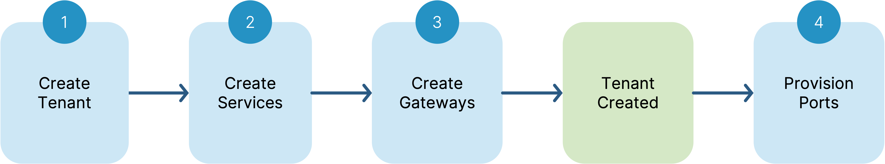
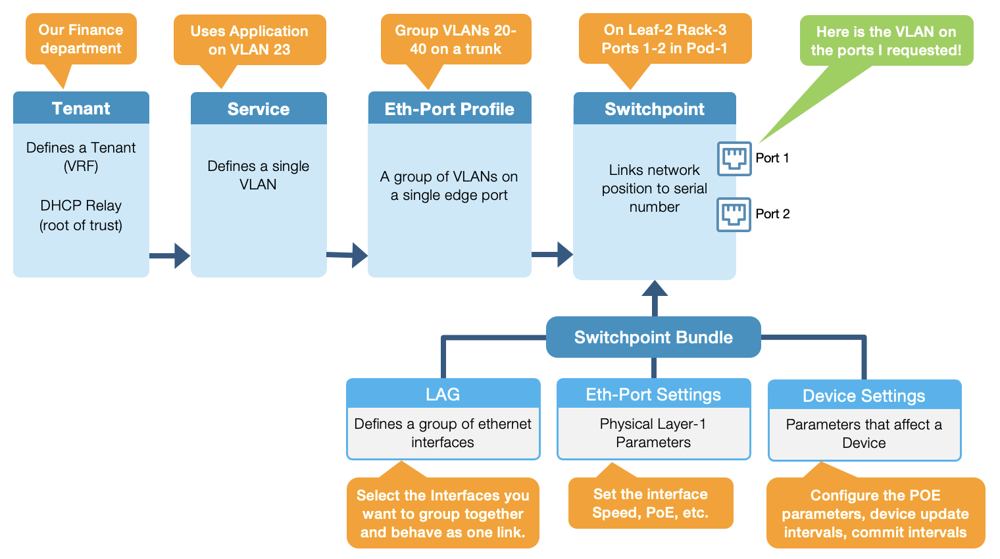
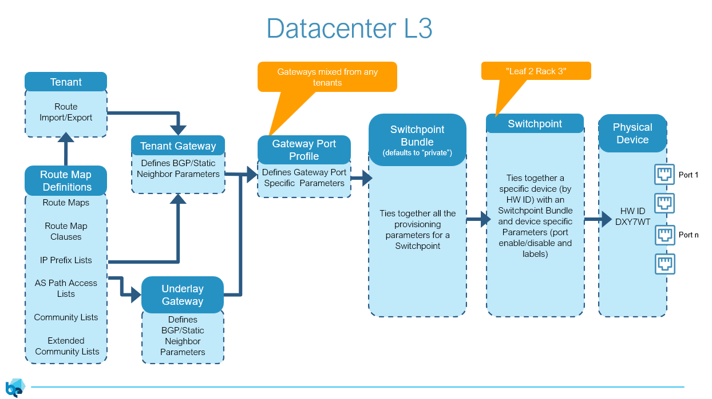
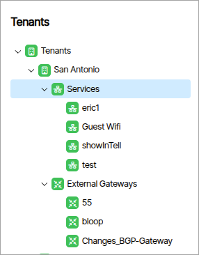
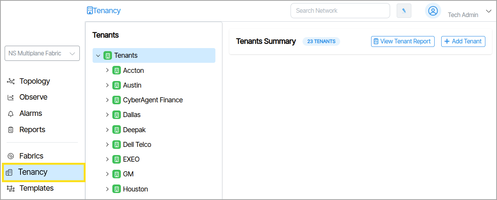
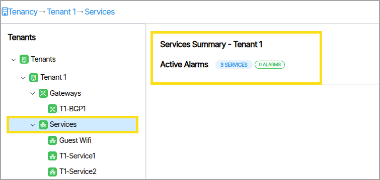

---
hide:
- toc
---

# Multitenancy Overview

## Multitenant Fabric Design
Verity provides turnkey data center networking using the popular Leaf-Spine Clos Fabric design.  Multiple fabrics can be managed by a single Verity instance.  Fabrics can be 3-Stage, 5-Stage or Collapsed Core designs.  These networks are all built and operated with Layer-2 ethernet switches and Layer-3 EBGP logical routers.

## Layer-2 Isolation
Tenants in a Verity system are isolated at Layer-2 with a number of different features and protocols.  For bare metal and virtual machine isolation, 802.1q VLANs isolate broadcast domains and create subnetworks on individual switches.  This isolation can be extended into a hypervisor host with 802.1q trunks.  VLANs can be connected across the Layer-3 routed domain via VXLAN encapsulation and EVPN route advertisements.  VLANs are not connected to L3 routers by default, the operator must enable L3 forwarding, DHCP relay, and an anycast gateway which serves as the default gateway for routing purposes.

## Layer-3 Isolation
Multiple Layer-2 networks are connected via EBGP virtual routers, and these routers can be isolated from each other using Virtual Routing and Forwarding (VRFs).  VRFs are equivalent to a Tenant in a Verity system.  Each VRF has its own IP address space, supporting overlapping address ranges.  VRFs/Tenants support separate gateways permitting egress from the topology on dedicated or shared L2/L3 interfaces.

## Provisioning Workflow

  Network provisioning in a Verity system roughly follows this flow.  In reality, creating Tenants and Gateways is typically infrequent and once the initial configurations and templates are in place, the operator will most likely be using the Services and Ports objects.

## Layer-2 Provisioning Process (Detailed)
{: class="clean"}

## Layer-3 Provisioning Process (Detailed)
{: class="clean"}

# Tenancy Objects

Network tenancy is controlled through the use of the following objects:

- [Tenants](tenants.md)
- [Services](services.md)
- [Gateways](gateways.md)

Tenants, Services, and Gateways are displayed in a collapsible tree view. Each Tenant groups its associated Services and Gateways as child nodes beneath it, and each Service and Gateway parent node contains its own child nodes.  {:class="pop"}.

## Tenant Tree View Icon Color

Icons display as either green (enabled) or grey (disabled).

## Gateway and Service Parent Node Information
Selecting the parent nodes of Gateways or Services displays additional group information that includes the item count and number of active alarms.

### Configuration.

Clicking a Tenant, Service or Gateway reveals the configuration parameters for the selected object.