---
hide:
- toc
---
# UI Navigation

## Verity Workspace
The **Verity Workspace** is the *single pane of glass* through which you can configure the underlay and overlay networks, and apply these settings to network leaf ports. While the platform offers advanced capabilities, this portion of the documentation covers the essential navigation features to help you move efficiently through the user interface.

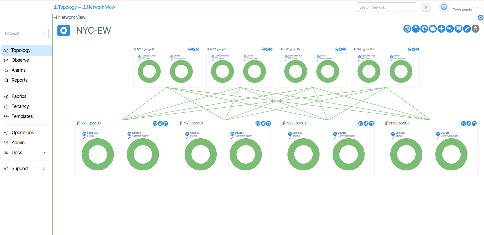 

## Main Navigation Bar
The **Main Navigation Bar** provides quick access to the different work areas in Verity.

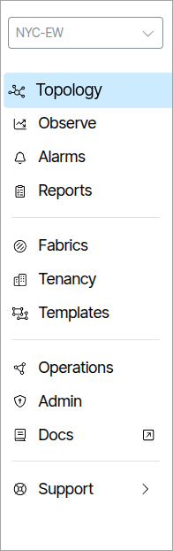 

Double-clicking any item in the **Main Navigation Bar** reveals more options presented as categorized tiles. In the image below, the **Reports** navigation option is double-clicked, revealing a collection of new menu items.

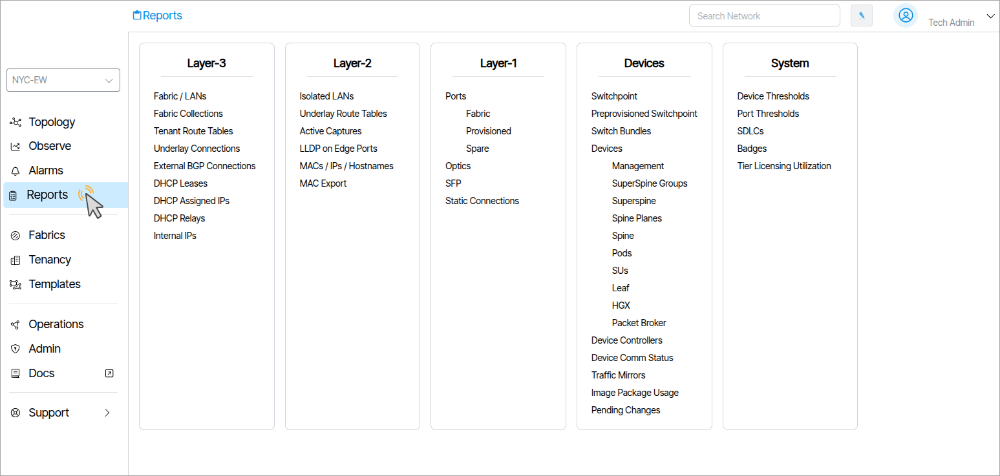 

## Fabric Search

A **Fabric** is an isolated, self-contained arrangement of network interconnections that form a topology. This includes the switches, links, and logical structure.

Multiple fabrics are administrable from the Verity interface.

**Fabric Search** allows users to choose the Fabric to work with. When a Fabric is selected, the Verity interface updates to reflect the state and configuration of the Fabric throughout the entire application. For example, selecting a Fabric and immediately navigating to Network View displays the chosen Fabric's topology. Selecting Network View after choosing a different Fabric renders the topology specific to that selection.

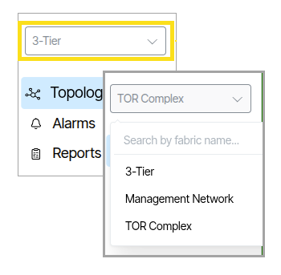

## Topology

The **Topology** menu provides visualizations of the network fabric and tools for managing physical connectivity. See [Topology Overview](topology-overview.md) for the full list of tools available.

### Network View
**Network View** provides an interactive, zoomable visualization of your network topology. Use pan and zoom controls to navigate and explore devices and connections.

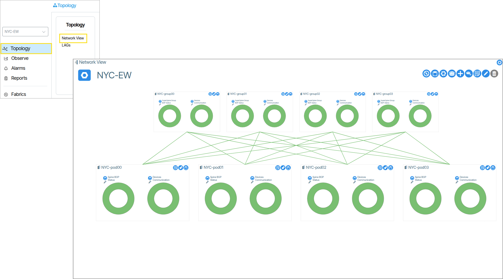

### Network Representation
The devices are described in a [Spine Plane Configuration](spine-plane.md)

- PODs are composed of Spine and Leaf switches
- Spine Planes are composed of Superspines
- One Spine per POD connects upward to all Superspines in its assigned Spine Plane
- Multiple PODs can connect to the same Spine Plane, enabling inter-POD communication

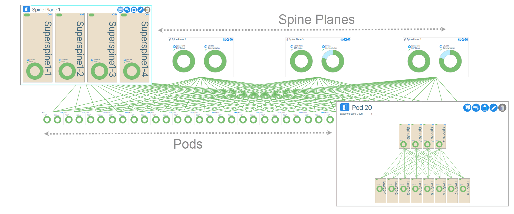

#### Leaf Pairs
Leaf Pairs are represented by a border encapsulating the paired switches.

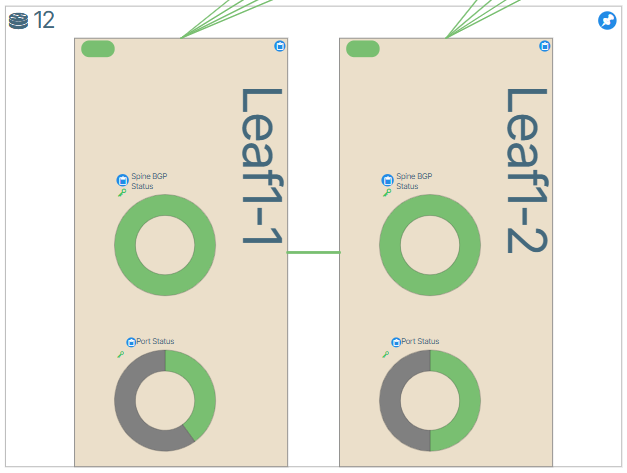

When zoomed in, the fabric connection is represented by the following image.

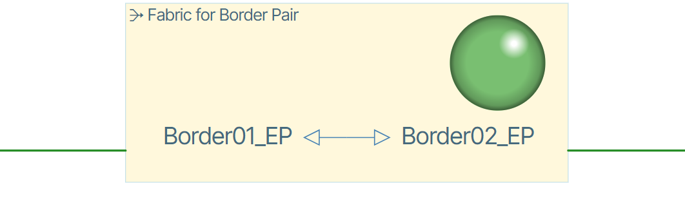

#### Color Connections
The state of devices is depicted by colored connection lines. The available state is depicted by a green color icon, while the down state is denoted by red, provisioning by gold and unstable by yellow. 

<!-- **Toggle Color Connections of Leafs**
When in Topology/Topology you can toggle the visibility of connection lines by clicking the line visibility toggle button.

 -->

## Buttons
There are two types of [buttons in the Verity UI, **Regular** buttons and **Hex** buttons](icon-reference.md/#verity-ui-icon-reference).

### Regular Buttons
Regular buttons are scattered throughout the application and are used to perform different actions. If a button is not a Hex button it is a regular button. To perform an action with a regular button you left click it. There are many more regular buttons than those shown in the example below. A more detailed description of buttons is presented in the [Verity UI Icon Reference](icon-reference.md). 
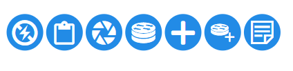

### Object Icon Buttons
Object Icon buttons represent tangible objects such as switches or other devices and respond to both right and left click mouse button actions.

Right-clicking an Object icon button provides additional options that apply to the object.

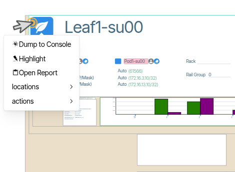

Depending on the virtual object, clicking a hex button forces one of two events to occur. 

1. The click forces the window view to center on the Hex button container. 
2. The click forces a window "jump" to the respective **Provisioning** section of the application. In the example below, clicking the object icon button named **Leaf 01 1/1** performs a jump to the corresponding device port in the configuration.

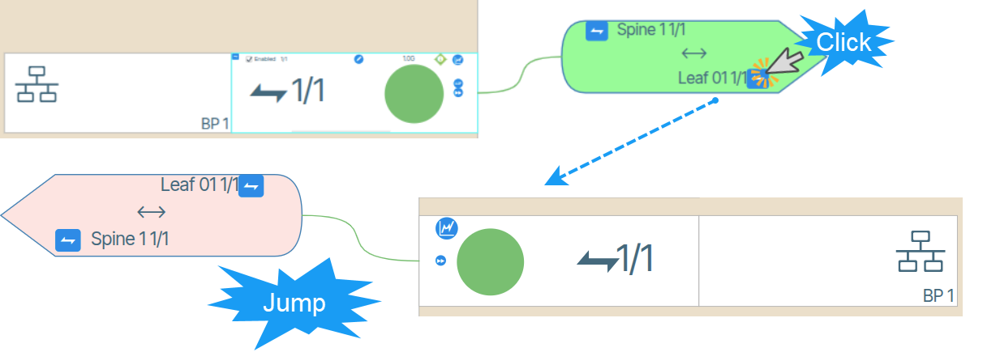

#### Navigation Depth Tracker
On the top left of the screen, there is a navigation depth tracker. This gives users a visual navigation path with clickable items used to return to earlier pages. An example is shown in the image below.

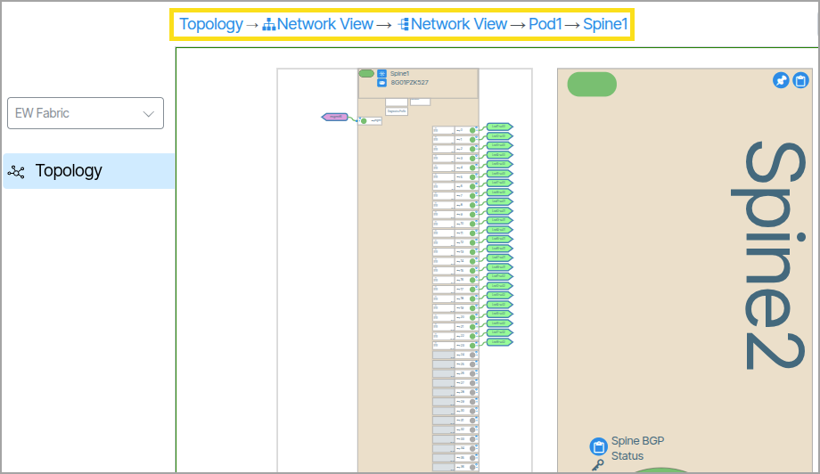

### Badges
Badges are used to group devices visually.

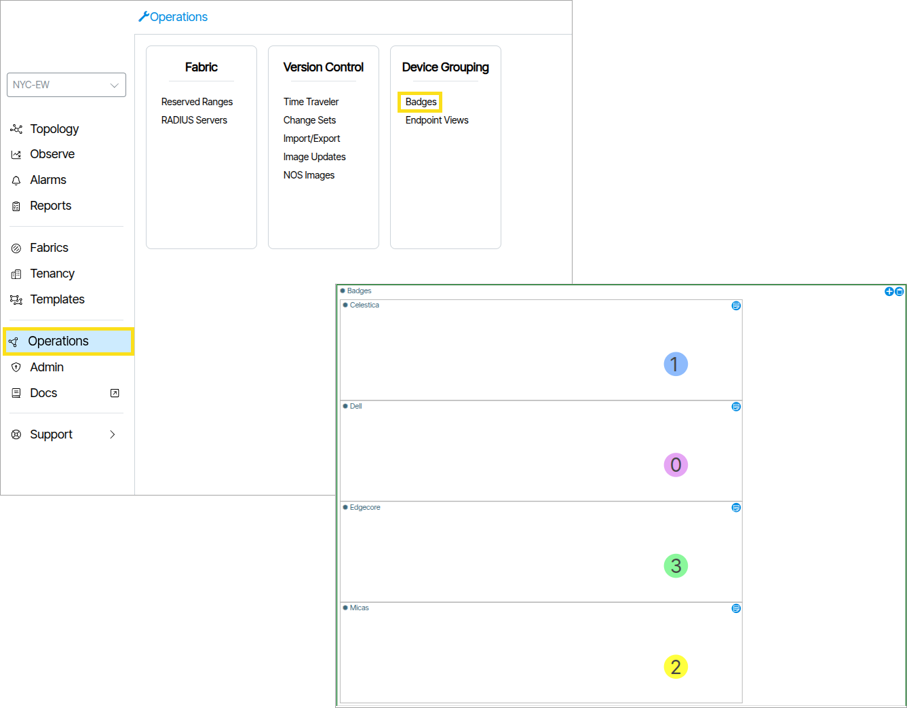

### Search Network
**Search Network** is used to search objects in the UI.

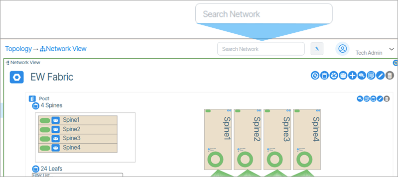

### Growl History
Growls are errors that occur between the client browser and the Verity orchestration platform. Holding the mouse over the growl gives the user more detail about the error. The Growl history is available at **Alarms/Growl History**.

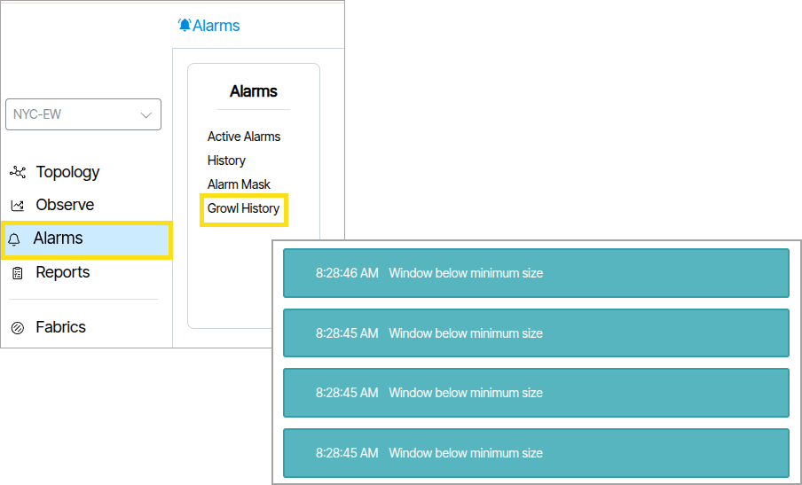

### Active Alarms

Active Alarms are notifications that inform the administrator about changes to the network state. These notifications are displayed via the **Active Alarms** tab.

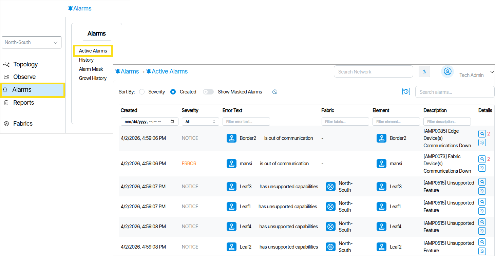

### Highlighter

Highlighter {: class="btn"}
is a tool used for tracing an object's data control flow across the UI. When you use the highlight tool, a purple hue is applied to the selected object and propagates to dependent objects in its control flow.

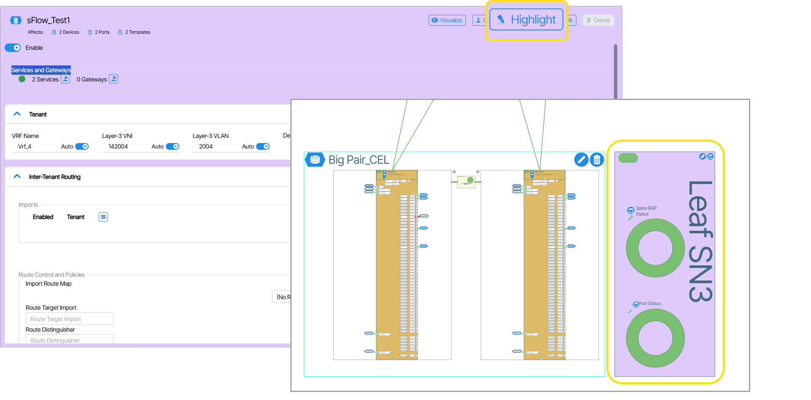

<!-- ## Groups

Provisioning Objects can be organized into collections called **Groups**. Groups do not affect the behavior of Provisioning Objects and are used only for aesthetic and organizational purposes.

### How to Create Groups

Open the tile of an object that you want to include in a group. In the example below, a Service tile is used.

The upper right corner of the window contains a field named Group.

Double-click the field to edit it. Click **Create New Group**.

Click the checkmark button.

A window appears prompting you to name your Group.

Type and submit a name by clicking the checkbox button. The Service is automatically placed in the Group. Any Groups you create are available in the Group drop down menu. As an example, the following image contains 2 custom Groups, one named Accounting East and the other named Accounting West.

The parent tile window renders a new tile for each Group.

****

### Creating Groups from Reports

Groups can be created via the Reports window. To do this you need to first navigate to the Reports window of the object(s) you want to group.

Here, Actions are used to create Groups. To create a Group using Actions, click **Actions**, click **Set Group**, name the Group**,** click **Accept Changes.**

!!!Note 
    **Action** menus differ between objects. Depending on your selection, the **Set Group** option may appear differently (e.g., "Set Bundle") or not at all.

The changes are made and visible in the Group column.

 -->

<!-- 
### Default Objects
Windows throughout the application that are used to edit device parameters have a default object. This object is displayed in light-green and is editable.

 -->