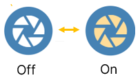
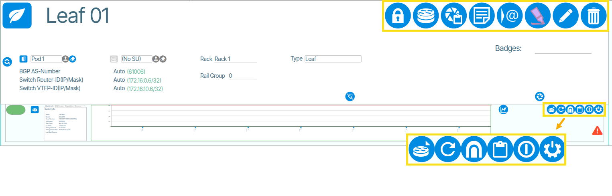
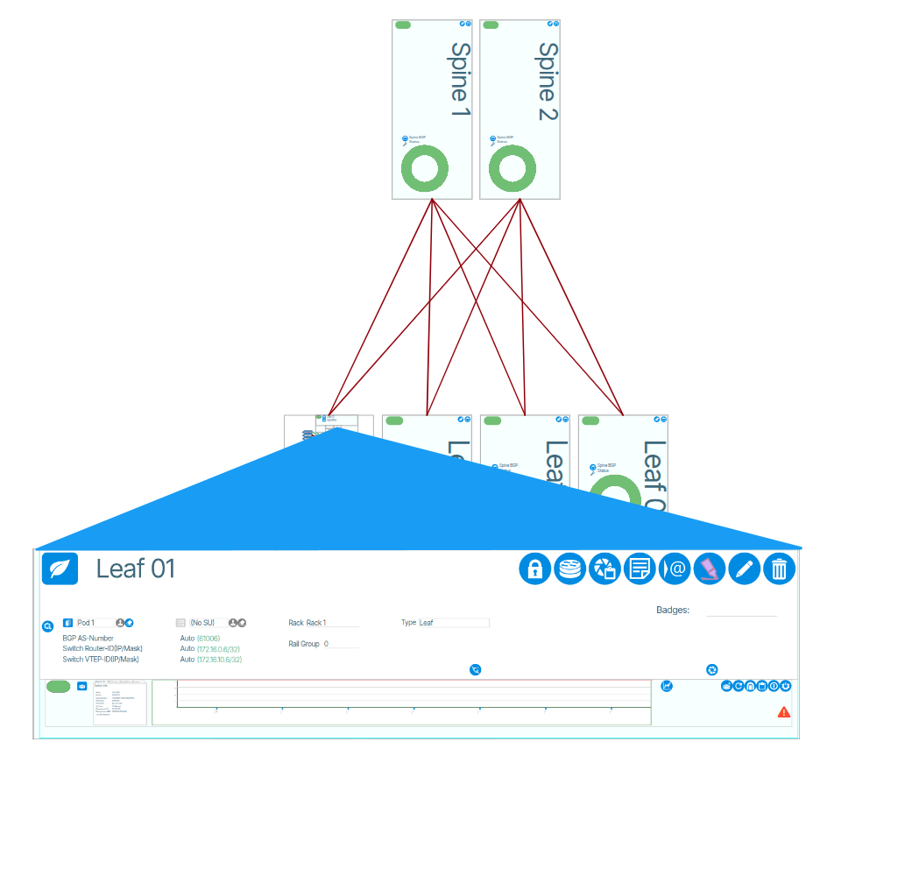
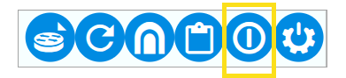
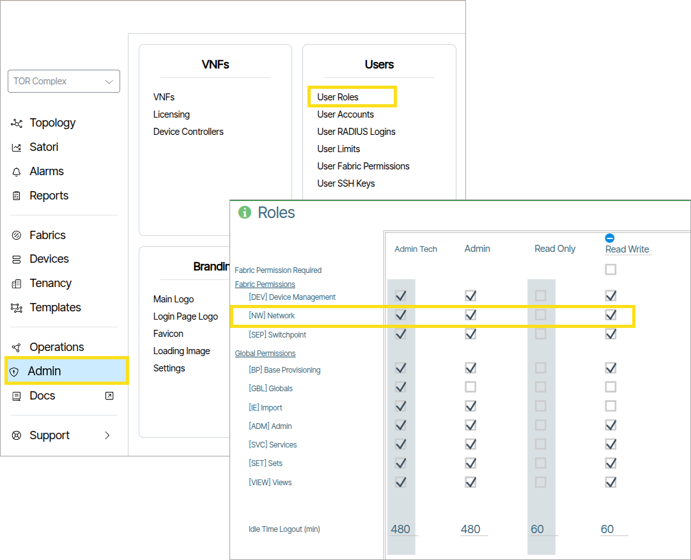
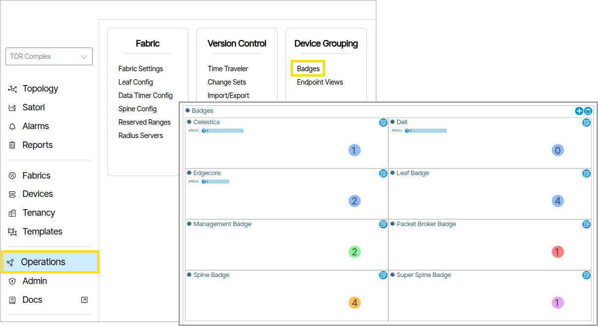
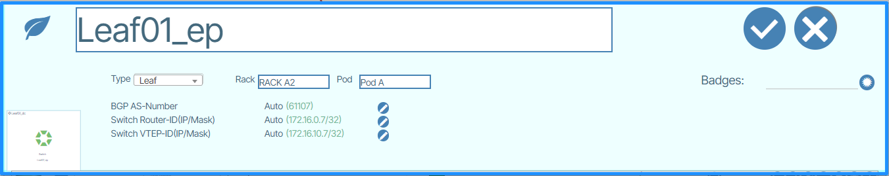
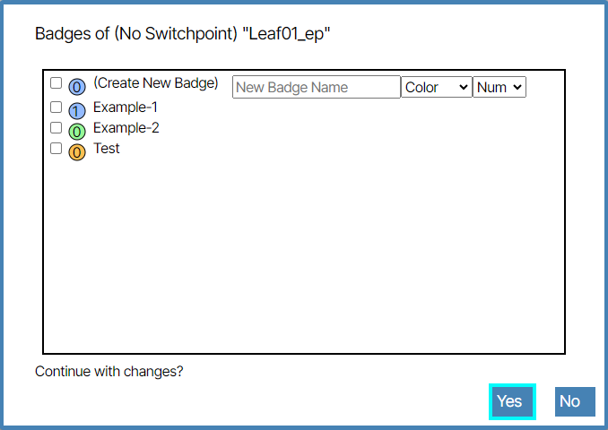

---
hide:
- toc
---
# Network Operations
There are a number of common operations that operators may perform on their network.

## Network Read-Only Mode

1. Click **Topology** and navigate to the **Network View**, click the **Read-Only** icon to "on" ({: class="btn"}) 

!!! Note 

    The read-only mode can be applied to the world and per switch. All levels are honored simultaneously and are displayed on each switch.

    World wide read only is automatically set during a CORE upgrade of the vNETC. It is recommended, but not required, to be set for firmware and other major system updates to allow the user to see what unexpected changes may be caused by those actions.

## Switch Replacement

The new device should be in ONIE mode.

1. Remove the old device from service ({:class="pop"}).
1. Delete the old device ({:class="pop"}).
1. In the option box, make sure "Preserve Switchpoint" and "Disable Controller" are selected ({:class="pop"}).
1. In the Preprovisioned Switchpoint, replace the Device ID field with the new Serial Number or Service Tag ({:class="pop"}).
1. Go the disabled controller, and update the Service Tag field with the new device Serial Number or Service Tag ({:class="pop"}).
1. Re-enable the controller

Refer to the ZTP sections for the ZTP process for the switch role (ie Leaf, Spine or Management). The new switch shhould go through ONIE and ZTP process and start communicating with the Device Controller.

## Add New Site Note
1. Click Topology and navigate to **Network View**.
1. Click the **Note**  ({: class="btn"}) icon.
1. Enter the text of the new site note.
1. In the same popup, click the **Save** icon.

# Device Operations
Inspecting devices and performing operations on them is accomplished in the Switchpoint object in the Topology view.

## Using Device Operations
Zoom to a device by double clicking on it in the topology map ({: class="pop"}).

### How to Reboot a Switch
From **Topology**, zoom into the network operations section (top lower right) of the device and click the reboot button.

### Device Locks

Locking a device restricts users without **[NW] Network** privileges from editing it.({: class="pop"}) 

### To Lock a Device:

1. Click **Topology**
1. Zoom in to the top of the device {: class="pop"} . 
1. Click the lock icon ({: class="btn"}) .

### Device Operational Tools
| Icon      | Name | Function |
| --------  | ---- | ----     |
| {: class="btn-large"}| Show the current switch configuration| Show current switch configuration |   
| {: class="btn-large"}| MAC Address Search | Search for a MAC address on this device |   
| {: class="btn-large"} | System Log | View the system log |
| {: class="btn-large"}| Highlighter | Highlight the device on the topology map |
| {: class="btn-large"}| Edit | Edit the device settings |
| | Lock | [Locks the device](#device-locks)
| {: class="btn-large"} | Delete | Delete object |
| {: class="btn-large"} | Manage Switch Pairs | Add Switch Pairs |
| {: class="btn-large"} | Opens Ping/Traceroute Dialog| Open Ping/Traceroute Dialog|
| {: class="btn-large"} | Capture Snapshot | Capture a snapshot of this device for troubleshooting - press once to start capturing and then again when capture is complete (icon turns dark green)|
| {: class="btn-large"} | Rescan | Trigger a full rescan by the ACS of this device. |
| {: class="btn-large"} | Open Tunnel | Open a remote access tunnel |
| {: class="btn-large"} | Report | Open report |
| {: class="btn-large"} | Reboot Device | Reboots Device  |
| {: class="btn-large"} | Out of Service | Mark device out of service. |

## Badges
Badges are used to group devices visually. Badges are assigned a name, a color and a number.
To create a new badge or view all badges go to  **Operations/Badges**.

### Create and Assign Badge to Device 

1. Click **Topology**. 
1. Enable focus of a selected device.
1. Click the **Edit** icon.
1. Click set badges icon ({: class="btn"})  {: class="pop"} .
1. Enable the check-box next to the phrase **Create New Badge** {: class="pop"} .
1. Set a **Name**, **Color** and **Num** for the badge.
1. Click **Yes** to create the badge.