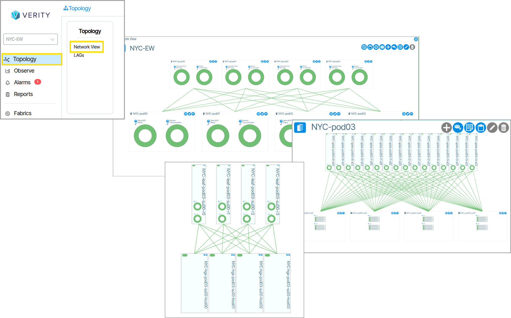

# Network View
The Network View window resides inside **Topology** and displays virtual devices and connections that represent hardware devices in the physical network configuration. The **Network View** is designed to behave like Google Maps in that it uses a zoomable user interface. Panning and zooming allows for the viewing of sections in more detail. The more you zoom in, the more context is shown. Zooming in and out is performed by mouse wheel scrolling or double clicking to focus on a section. 

**Pan** - Hold-click on any point of the map and move the mouse. Keyboard arrow keys also support panning.
**Zoom** - Double-click on an object to go to a defined view.  You can also drag and scroll the page to navigate. 

