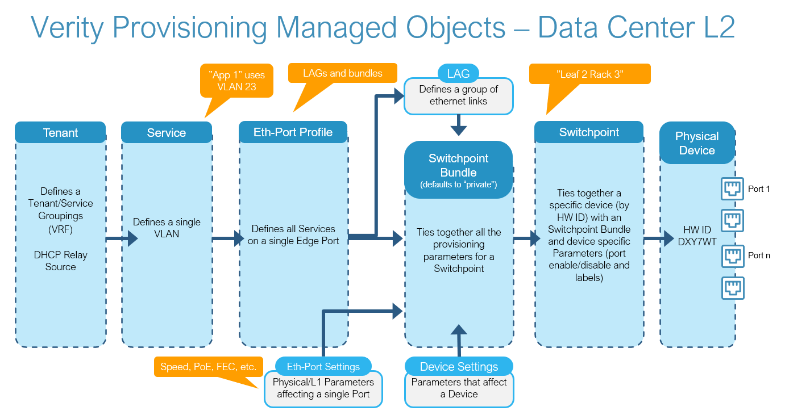
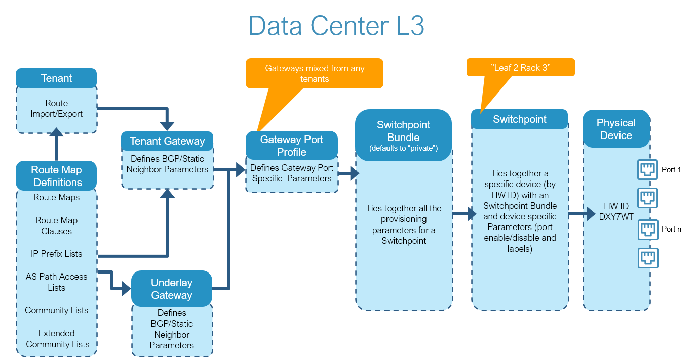

---
hide:
- toc
---

# Verity Managed Objects

| Term | Description |
| -----| ----------- |
| **Tenant** | A network isolation service implemented as a separate routing domain (VRFs).  Tenants contain services and gateways. |
| **Service** | A layer 2 VLAN assigned to various ports of leaf switches and interconnected via the underlay. |
| **Ethernet Port Profile** | Collection of services to be assigned to Ethernet ports or LAGs  |
| **Ethernet Port Settings** | Parameters associated with the physical layer of an Ethernet port |
| **LAG** | Link Aggregation Group - collection of Ethernet Ports behaving as a single Ethernet interface |
| **Bundle** | Collection of the various templates assigned to a Switchpoint |
| **Switchpoint** | The abstraction of a managed device within the Verity platform. The database object is responsible for linking switch provisioning to its corresponding physical switch. |
| **Device Settings** | Device specific settings |
| **Route Map Definitions** | Defintions of rules associated with route manipulations |
| **Tenant Gateway** | Template for defining the external connection to a Tenant via BGP or static routes |
| **Underlay Gateway** | Template for defining a BGP external connection to the Underlay fabric |
| **Gateway Port Profile** | Template for assigning Gateways to Ethernet ports |

