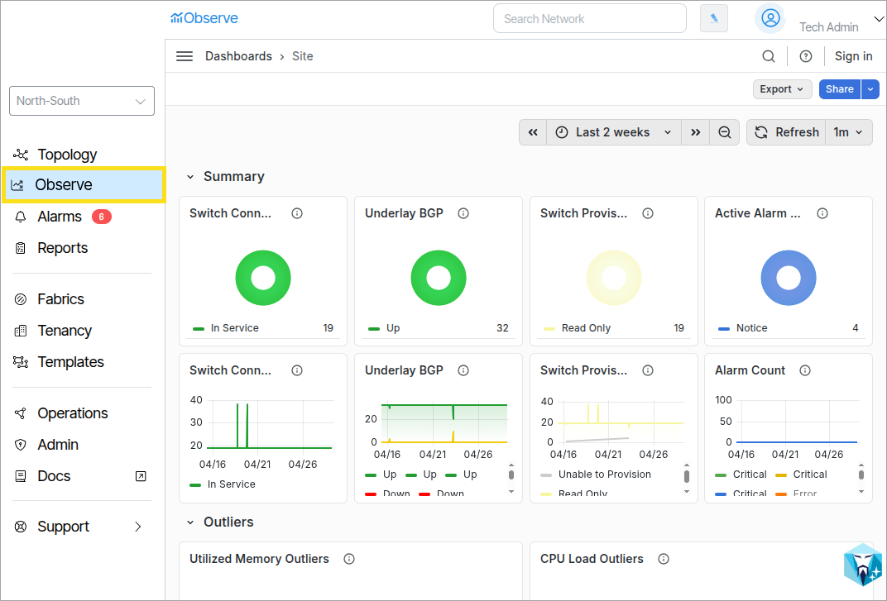

---

title: "Observe Overview"
description: "Observe"
tags: [Observe, Monitoring]
search:
boost: 2          
parent: Observe
hide:
- toc
---
# Observe

!!! Installation

     For installation instructions go here: [Satori Installation Instructions](install-vmware.md#install-satori-vm)
     For instructions on how to update to the latest Satori software go here: [Upgrade to the Latest Satori Software](install-vmware.md#upgrade-to-the-latest-satori-software).Satori Observability Functionality is all accessible in the Observe menu option.

**Observe** is a collection of networking monitoring tools used to track system-wide information, such as service port activity, virtual machine performance statistics, provisioning information, and more. 

To access Observe, click the **Observe** option on the Main Navigation Bar.

### Observe Dashboard Types

|Dashboard|Function|
|-|-|
|**Site**|The Site dashboard presents high-level statistical information for all devices in the network, such as the percentage of in-service devices and general connectivity data. |
|**Pod**|The Pod dashboard presents data specific to each pod. You can select the desired pod using the Pod dropdown menu.|
|**Tenant**|The Tenant dashboard presents data specific to each tenant. You can select the desired tenant by using the Tenant drop down menu. |
|**Switch**|The Switch dashboard presents data specific to each individual switch. You can select the desired switch by using the Switch and Port Type dropdown menus. |
|**Port**|The Port dashboard presents data specific to each individual port. You can select the desired port by using the Port drop down menu. |
|**Verity**|The Verity dashboard presents statistical and graphical data for the high-level system components that make up the system. These components include the VnetC, SDLC, and Monitoring virtual machines, as well as the ACS and GuiA, which are containers within the SDLC.|

