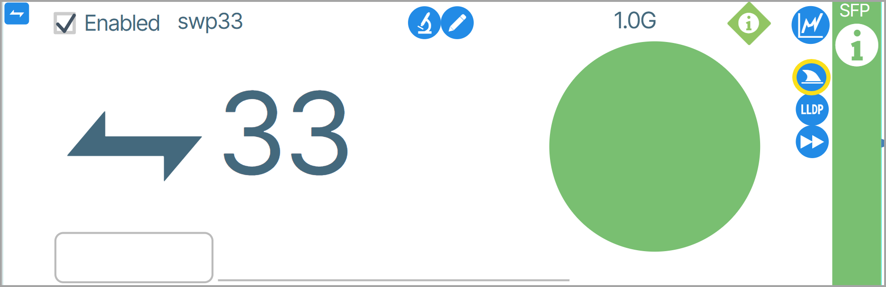
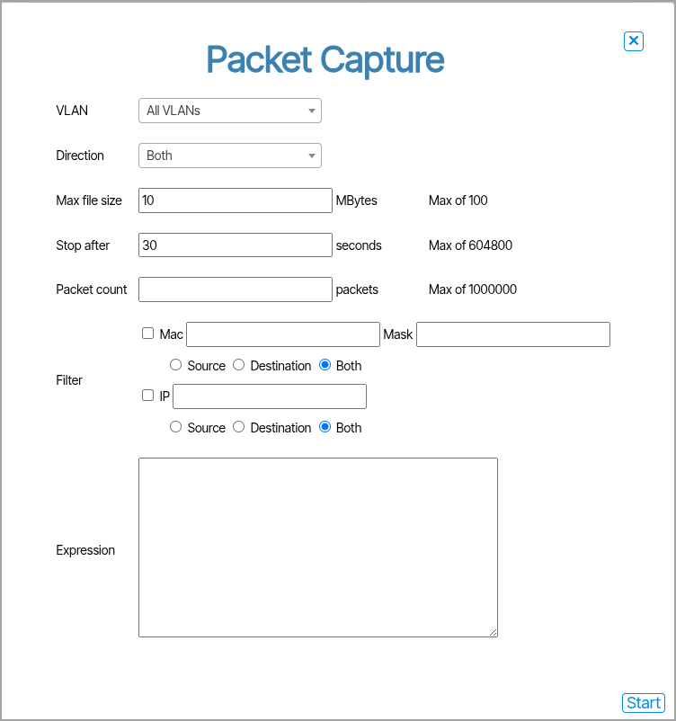

---
hide:
- toc
---

### Packet Capture

!!! note "Packet Capture is only available on select hardware"

This feature lets you capture network packet information and save the data to a file. 

To start a packet capture, click the shark fin icon ({: class="btn"}).

The **Packet Capture** window appears. Enter the parameters for the data you want to capture and click **Start.**

When data capturing is complete, a *pcap* file containing the information will be downloaded to your computer.