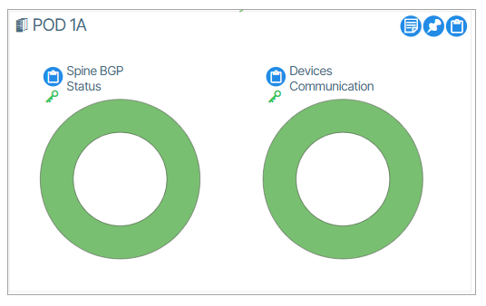
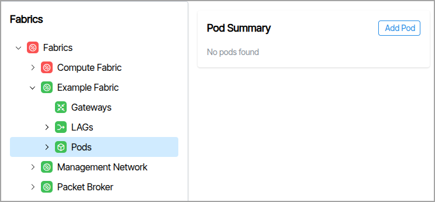
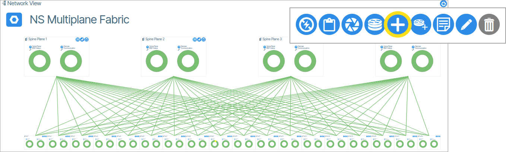
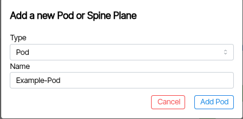
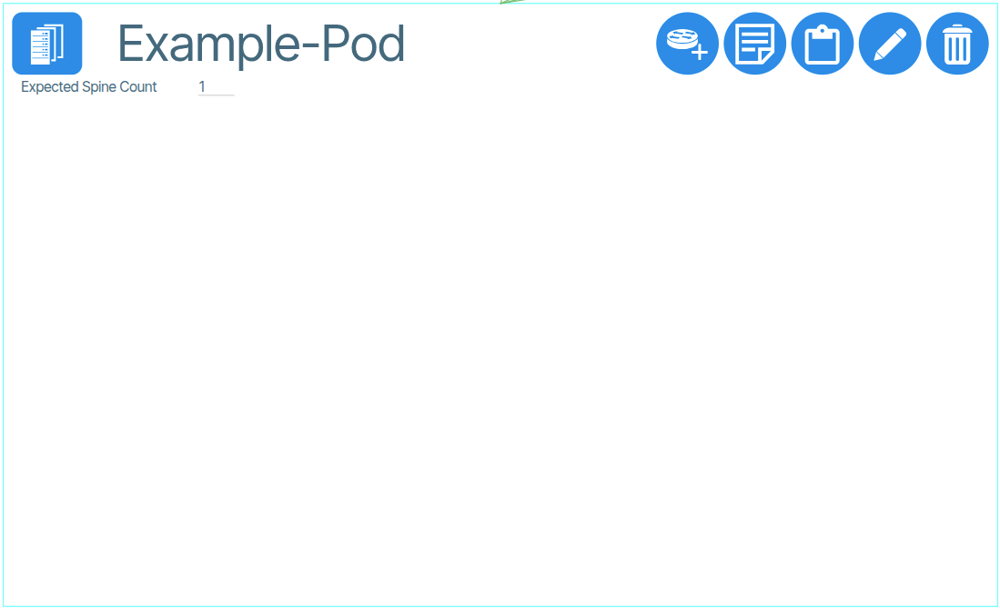
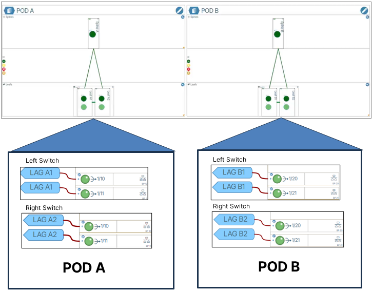
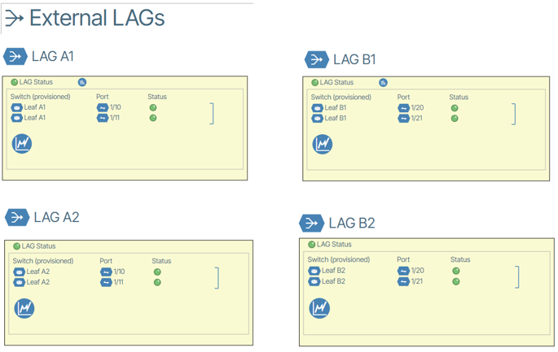
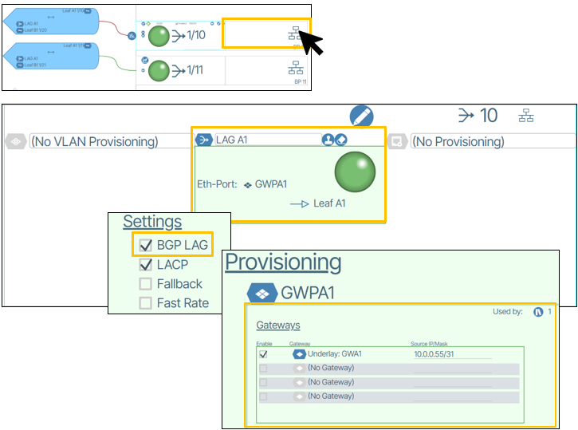
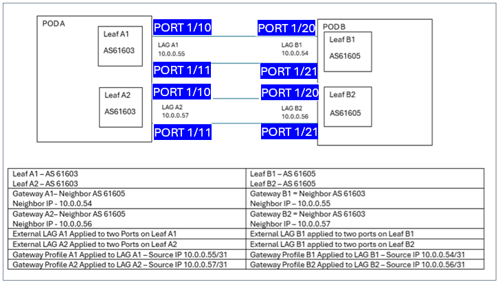

# PODs

In a spine-leaf architecture a POD is a grouping of leaf and spine switches. This allows for added capacity by deploying additional PODs without redesigning the entire network.

## POD Reports

The **Reports** window provides a Report of all PODS via **Reports &rarr; PODs** 

## How to Create a POD

* From the Main Navigation Menu select **Fabrics** choose your Fabric.
* Select the Pods icon.
* In the upper right corner of the page, click **Add Pod**.
* Type a name and click **Add Pod**.

<!-- ## How to Create a POD (from Topology)
1. Double-click **Topology** and click **Network View**.
1. In the upper right of the **Network View**, click the **Add a New Pod** button. {:class="pop"}
1. In the pop up window that appears, type a name for the Pod and click **Add New Pod**.  {:class="pop"}
1. The Pod will be empty. {:class="pop"}
1. Add Devices -->

## Inter-Pod Gateways

This feature enables network gateway communication between device pairs in two *separate* PODS.

To use this feature, the PODS must *not* be connected by a Super Spine.

The image below shows a basic system containing two independent PODS with each containing a device pair. The PODS are devoid of a Super Spine connecting them. It is assumed that the requisite physical connections are made (an example would be a Leaf Pair in each POD, with each leaf connected by two wires, totaling four wires and involving eight ports).

### Create Gateway Profiles

Go to [**Templates / Gateway Profiles** to create the needed Gateway Profiles. ](layer-3-templates.md/#gateway-profiles)

### Adding a Gateway Profile to a LAG

Adding a gateway profile to a LAG is needed to create the connection. You set the connection in the port editing window under the *center* form field. Here you enable the BGP LAG checkbox and chosen Gateway. The diagram below shows these settings for a *single* port.

### Object Configuration Description

The chart below presents an *example* configuration that includes 2 PODS, 4 switches and 8 switch ports. Object names, IP addresses and Autonomous System numbers will differ for your configuration.

Port numbers are presented in a blue background and are specific to the example above.

